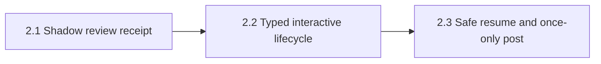

# Agent-native PR review runtime — Shape

## Problem

The captain wants kc-pr-flow to use tokens more efficiently, behave more consistently across LLM families, and produce more stable PR review results. Today review state lives mainly in prose and transient model context, so reruns reconstruct evidence, partial lane failures can resemble clean coverage, and finding, severity, or action sets can drift.

The repository already has exact-head checks, explicit coverage language, deterministic cross-model reduction, JSONL precedent, and daemon usage telemetry. It does not have a versioned review-run schema, replayable lane lifecycle, exact-head receipt, or posting receipt. The pitch turns those prose conventions into a small local runtime without replacing reviewer judgment.

## Captain Articulation Trail

1. **Desired outcome** — captain: “我的目標是，讓 PR toolkit 更 agent-native 以便 token 使用更有效率，跨 llm 表現更好，PR review 結果更穩定。”
2. **Delivery shape** — captain: “我想讓你切三個 PR分三個階段，讓整個 toolkit 更 agent-native，更有效率，更穩定。”
3. **Runtime direction** — captain confirmed Bash + `jq` + JSONL, machine-local XDG state, exact-head rehydration, and no full diff/prompt/raw-output persistence.
4. **Failure policy** — captain confirmed retry-first; unresolved required coverage forbids APPROVE and defaults to an explicit COMMENT gap.
5. **Posting authority** — captain confirmed interactive human authorization and daemon posting only under explicit preauthorization plus typed/head/idempotency gates.

## Captain Bet (gate approval 2026-07-22)

> 我的目標是，讓 PR toolkit 更 agent-native 以便 token 使用更有效率，跨 llm 表現更好，PR review 結果更穩定

## Acceptance Outcome

On one exact PR head, an interactive reviewer can inspect a coverage-explicit receipt, avoid unnecessary context reconstruction through typed state, resume safely, and never duplicate a GitHub review mutation; incomplete required coverage can never yield APPROVE.

## Outcome Card

### Will get

- **W1 — Inspectable baseline:** one unchanged interactive review emits a validate/show-able exact-head receipt and benchmark baseline.
- **W2 — Typed interactive review:** coverage, verdict, and confirmation derive from typed state with a safe legacy fallback.
- **W3 — Safe recovery:** an interrupted exact-head review resumes and posts an approved payload at most once.

### Won't get

- Reviewer-intelligence or wholesale prompt rewrites.
- A server, database, dashboard, MCP service, or universal provider schema.
- Persistence of full diffs, prompts, or raw model output.
- Auto-merge, migration of `kc-pr-review-resolve`, or redesign of Ship-Flow.

### Why this scope

The three PR boundaries follow user-observable outcomes rather than technical layers: trustworthy observation, typed interactive behavior, then recoverable side effects. The linear order keeps every default change and remote mutation behind evidence from the prior stage.

## Scope

### In

- A Bash 3.2-compatible and `jq`-based local runtime under `${KC_PR_FLOW_STATE_DIR:-${XDG_STATE_HOME:-$HOME/.local/state}/kc-pr-flow}`.
- Versioned append-only JSONL as authority, with rebuildable derived state.
- Exact repo/PR/base/head/config identity, lane terminal states, coverage, normalized findings, evidence pointers, hashes, and typed usage provenance.
- A representative sanitized fixed-head corpus and deterministic scorer for paired fresh-context benchmark runs.
- Capability-based required coverage, explicit incomplete-coverage behavior, exact-head rehydration, interactive authorization, safe rollback, retry, and at-most-once posting.

### Out

- Full raw provider-output retention or a shared remote runtime.
- Cross-head identity reuse that presents stale evidence as current.
- Daemon APPROVE in v1; any daemon integration remains default-deny and explicitly preauthorized.

## Delivery DAG



<!-- section:pm-skill-receipts -->
```yaml
pm_skill_receipts:
  stage: ship-shape
  mode: mode-a
  appetite: medium-batch
  compose_guard: passed
  receipts:
    - phase: intake-problem
      delegate: problem-framing-canvas
      required: true
      status: unavailable
      evidence: null
      fallback: inline
      rationale: The delegate is not installed; captain articulation and repository evidence supplied the inline problem frame.
    - phase: scope-decompose
      delegate: opportunity-solution-tree
      required: true
      status: unavailable
      evidence: null
      fallback: inline
      rationale: The delegate is not installed; the three sequential user outcomes supplied the inline opportunity tree.
    - phase: assumption-extract
      delegate: pol-probe-advisor
      required: true
      status: unavailable
      evidence: null
      fallback: inline
      rationale: The delegate is not installed; the fixed-head benchmark hypothesis supplied the critical assumption.
    - phase: acceptance-outcome
      delegate: press-release
      required: true
      status: unavailable
      evidence: null
      fallback: inline
      rationale: The delegate is not installed; the captain-facing exact-head review outcome supplied the inline acceptance statement.
```
<!-- /section:pm-skill-receipts -->

## Appetite

Medium batch: 10 working days; 8 planned days with 20% headroom.

### Appetite Fit

| Child | Estimate | Headroom rule |
|---|---:|---|
| 2.1 Shadow review receipt | 3 days | Within 3-day child cap |
| 2.2 Typed interactive lifecycle | 3 days | Within 3-day child cap |
| 2.3 Safe resume and once-only post | 2 days | Within 3-day child cap |
| **Total** | **8 days** | **80% of 10-day budget** |

## Children and Evidence Gates

| Entity / PR | Vertical slice | Depends on | Evidence gate |
|---|---|---|---|
| `2.1-shadow-review-receipt` | One unchanged interactive review emits a validate/show-able exact-head receipt and benchmark baseline. | — | Must-fix recall preserved; all required lanes terminal; exact-head evidence rehydrates; usage is `reported`, `estimated`, or `unavailable`; GitHub event/body/comments are unchanged. |
| `2.2-typed-interactive-lifecycle` | Interactive review derives coverage, verdict, and confirmation from typed state with safe legacy fallback. | `shadow-review-receipt` | Recall non-inferior before stability claims; comparable within-provider reported usage shows median token reduction of at least 20%, or interrupted resume costs at most 60% of a full rerun; required gaps never yield APPROVE. |
| `2.3-safe-resume-once-only-post` | An interrupted exact-head review resumes and posts an approved payload at most once. | `typed-interactive-lifecycle` | Head or payload changes invalidate authorization; ambiguous retries reconcile remote receipts before mutation; the same idempotency key produces no second GitHub review. |

## Assumptions

### A1 — Critical

- **Claim:** Material review variance comes partly from implicit lifecycle and repeated context reconstruction, not model ability alone.
- **Confidence at shape:** 70/100.
- **Verified by:** `design-contract` — paired fresh-context fixed-head benchmarks across model families.
- **Failure consequence:** PR2 must not make typed state the default if recall, stability, or measured efficiency evidence does not support it.

### A2 — Important

- **Claim:** Bash 3.2 plus `jq` can provide durable receipts and replay without a service or database.
- **Confidence at shape:** 85/100.
- **Verified by:** existing deterministic shell reducers, JSONL persistence patterns, and daemon usage telemetry in kc-pr-flow.

### A3 — Important

- **Claim:** Normalized findings and verifiable evidence pointers are sufficient durable state without retaining full diffs, prompts, or raw model output.
- **Confidence at shape:** 75/100.
- **Verified by:** design contract plus exact-blob hash rehydration tests.

## Pre-mortem

- **Category:** `wrong-dcs`
- **Projection:** Token and stability gains may conceal lower must-fix recall unless recall gates run first.
- **Mitigation:** Recall non-inferiority is evaluated before efficiency or run-to-run stability can authorize PR2.

## Rabbit Holes

None. Necessary benchmark, schema, recovery, and documentation work belongs to the three children. GitHub issues are reserved for future external or cross-repository ownership.

## Deletes

| Rejected alternative | Reason |
|---|---|
| Rewrite reviewer intelligence and prompts first | Cannot provide durable resume, coverage accounting, or posting idempotency. |
| Make typed lifecycle default in PR1 | Baseline and recall evidence do not exist yet. |
| Build a server, database, dashboard, or MCP runtime | Exceeds the appetite; a local Bash + `jq` runtime is sufficient and easier to roll back. |

### Architecture Impact
<!-- section:architecture-impact -->

- **Target section:** `decisions`
- **Before:** Root `ARCHITECTURE.md` is absent; review lifecycle and posting authority are documented only across plugin prose and shell scripts.
- **After:** Create the canonical context/decision record for JSONL authority, provider boundaries, exact-head invalidation, coverage eligibility, and posting authority.
- **Rationale:** The pitch changes durable state, data flow, and side-effect ownership; those decisions must survive individual skill rewrites.

<!-- /section:architecture-impact -->

### Product Impact
<!-- section:product-impact -->

- **Target section:** `capabilities`
- **Before:** Root `PRODUCT.md` is absent; the user-visible review capability has no repository-level success statement.
- **After:** Create a concise capability and success-measures section for efficient, cross-model-stable, recoverable PR review.
- **Rationale:** The outcome is user-visible even though the implementation is plugin-local.

<!-- /section:product-impact -->

### README Impact
<!-- section:readme-impact -->

- **Target section:** kc-pr-flow review workflow documentation.
- **Before:** Existing documentation describes transient orchestration and current daemon behavior.
- **After:** Document state location, validate/show/resume entry points, usage provenance, exact-head behavior, confirmation/preauthorization rules, and rollback.
- **Entry critical:** `true`

<!-- /section:readme-impact -->

### Hand-off to Design

- `ui_surfaces`: `[]`
- `open_design_questions`: `[]`
- `open_contract_decisions`:
  - Run identity, successor-run semantics, state retention, and garbage collection.
  - Candidate versus merged finding identity and verifiable evidence-pointer fields.
  - Usage provenance and provider capability envelopes.
  - Capability-based required-lane matrix and typed manual fallback.
  - Authorization hash, idempotency marker, remote receipt authority, and ambiguous-timeout reconciliation.
  - Unknown schema version handling and forward-compatibility rules.
- `pm_framing_output`: inline fallback recorded in PM skill receipts.

Because contract choices remain open, `contract_decision_required: true`; design must resolve them before plan and may not silently choose a protocol.

## Domain Classification Report

- `matched`: `schema`
- `coverage`: `generalist-only`
- `registry_status`: `knowledge_module_missing`
- `missing_path`: `plugins/ship-flow/references/domain-knowledge/schema.md`
- `captain_choice`: `generalist-marker` on 2026-07-22
- `routing_effect`: proceed through full contract design, but do not claim schema-specialist grounding.

## Shape Report

- Fresh-context repository research and reverse-recovery audit completed against `origin/main@4b8dc32cfb2de1258afefb490bf5941687bb42bd`.
- Independent cross-review verdict: `PROCEED`; one non-blocking warning requires plan to define stability mathematics and accept only comparable within-provider `reported` usage for the 20% token gate.
- Existing deterministic baseline: cross-model `62/0`, diagram contract `43/0`, validator `34/0`.
- Adopter domain routing files are absent and discovery returned no registered match; this visible gap is handled through the explicit contract-design trigger above.
