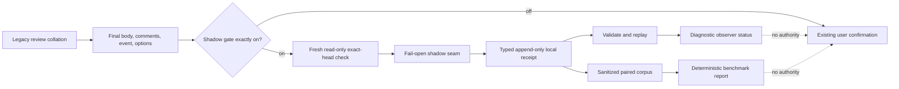

# Architecture Contracts

This document records durable architecture decisions for repository capabilities. It is written for contributors implementing or reviewing changes that cross lifecycle, provider, persistence, or remote-mutation boundaries.

## kc-pr-flow: Agent-native review runtime

### Context

The legacy review flow coordinates model lanes and GitHub posting through procedural instructions. The target runtime adds a local typed state layer that agents can validate, replay, inspect, and resume without giving that layer behavioral authority before evidence gates pass.

The state root is configurable and defaults to the platform state directory under `kc-pr-flow`. The runtime remains local Bash plus `jq`, with a Python 3.8+ helper for fail-closed safe I/O, duplicate-key detection, jq-safe integers, and real UTC calendar validation. No network service or database is required.

### Decision record

| ID | Decision |
|---|---|
| D1 | A stable exact-head review key groups unique runs. Compatible interruption resumes the same run; reruns and head or configuration changes create typed successors. |
| D2 | Versioned append-only JSONL events are authoritative for typed run records. The v1 envelope and payloads are closed; same-major extension is limited to typed hash-only metadata with no replay authority. Replayed projections are caches. The legacy flow retains verdict, confirmation, and posting authority until the typed interactive stage ships. |
| D3 | Provider observations remain candidates. Merged findings use exact-head, source-location, evidence-hash, category, and constrained-claim identity. Durable evidence stores typed pointers and hashes, not excerpts. |
| D4 | Core lifecycle contracts are provider-neutral. Adapters cannot own lifecycle, verdict, authorization, or posting. Usage provenance is reported, estimated, or unavailable; missing values remain null. |
| D5 | Requiredness is capability-based. Every required capability needs typed terminal evidence. Remaining gaps forbid approval but cannot dilute confirmed blockers. |
| D6 | Authorization binds repository, PR, exact head, effective event, policy, and payload hash. Pending intent is durable before mutation, and deterministic remote identity is reconciled before retry. |
| D7 | Unsupported majors, unknown event types, missing required fields, and hash failures are excluded from accepted state. Rejected append input creates metadata-only quarantine containing reason, input hash, byte count, and timestamp, never the rejected bytes. Invalid state cannot reduce, resume, authorize, mutate, migrate, or be garbage-collected automatically. |

### Authority boundaries

| Concern | Authority |
|---|---|
| Typed run history | Valid append-only events |
| Rebuilt receipt and CLI display | Replay projection; never an independent source of truth |
| Verdict and confirmation in the shadow increment | Legacy interactive review flow |
| Required coverage after typed interactive activation | Capability terminal states plus explicit fallback evidence |
| Remote mutation | GitHub review identity, reconciled to a deterministic local intent |
| Provider-specific invocation | Adapter only; it cannot mutate core lifecycle state directly |

### Shadow increment components and data flow

The production gate is evaluated once after final legacy collation and before confirmation. With the gate off, control goes directly to existing confirmation with no runtime call and no shadow head check. With the gate on, a caller-owned fresh head check and one closed `ShadowObservation/v1` (`kc-pr-flow.shadow-observation/v1`) input reach the collector. The collector snapshots and validates that serialization once, creates a fresh exact-head `run.started`, builds and preflight-replays the remaining complete lane/candidate/synthesis/terminal lifecycle, appends those remaining events, and invokes the read-only observer once. Only complete replay with all six frozen-behavior hashes reports `observed`; every incomplete or failed path becomes a typed diagnostic-only `not_observed` result. A post-start failure may leave an incomplete diagnostic run, but it never becomes observed or authoritative; recovery belongs to increment 2.3.

Accepted state is fail-closed and uses owned reservations, private rebuild plus atomic rename, immutable run identity, contiguous sequence, and content-addressed metadata-only quarantine. Python 3.8+ safe I/O opens a no-follow regular-file descriptor, proves stable file identity around a bounded descriptor read, and publishes a private mode-0600 snapshot before every runtime consumer parses file input. Missing Python or `O_NOFOLLOW`, unsafe types, path races, concurrent mutation, oversize input, invalid JSON members, unsafe integers, or impossible UTC dates fail before accepted-state mutation. The shadow integration is fail-open because it cannot alter the frozen legacy body, comments, options, event, confirmation, or posting payload.

### Run and event identity

The review key hashes full repository identity, PR number, base SHA, head SHA, and effective configuration hash. Each fresh execution receives a unique run ID. Event IDs are deterministic over run, sequence, type, and canonical payload hash; appending the same event ID is a no-op.

Breaking event semantics require a new schema major. Within v1 the only optional top-level addition is a closed `extensions` array of namespace, key, value SHA-256, and byte count. Extensions participate in record integrity but never replay or review authority. Rejected bytes are deliberately unavailable; quarantine exposes only bounded metadata.

### Finding and evidence identity

Each provider lane emits candidate observations. The collator may merge candidates only when their constrained merge key agrees. Uncertain matches stay separate so cross-model disagreement remains visible.

Evidence pointers identify a review key, base and head, source kind, exact repository object, relative location, side, locator, and content hash. `LEFT` binds to the base object; `RIGHT` and `FILE` bind to the reviewed head. Candidate, merge, and finding identities include the evidence content hash. Rehydration must verify that hash before the evidence can support a finding or authorization decision.

### Coverage and failure policy

Capabilities, not provider names, define required coverage. A required transient failure receives one retry and then a typed manual fallback opportunity. If required coverage remains incomplete, the run has an explicit comment ceiling and is not approval-eligible. Confirmed blockers may still produce a request for changes.

Optional provider failures remain recorded evidence and do not independently block completion.

### Authorization and posting

Authorization is exact-head and exact-payload. The runtime persists a restrictive pending payload and deterministic idempotency key before GitHub mutation. A timeout or ambiguous connection result must be reconciled against the remote marker or review identity before any retry.

The daemon is default-deny. It requires explicit preauthorization plus current typed state, exact-head, coverage, and idempotency gates. It cannot issue an approval in the initial runtime.

### Retention and recovery

Terminal receipts are retained for 30 days. Failed pending payloads are retained for 24 hours. Active or remotely uncertain runs are never garbage-collected. Garbage collection is dry-run by default and requires an explicit apply action.

These are target-runtime rules, not shadow capabilities. Increment 2.3 owns crash-safe lock recovery and PID-reuse handling, predecessor-lineage verification, append/compaction performance, resume, retention/garbage collection, once-only posting, remote reconciliation, and daemon mutation. The shadow runtime must fail closed or remain diagnostic rather than approximate those behaviors.

### Increment boundaries

- Shadow receipt: closed `ShadowObservation/v1`, D1-D4 and D7 schemas, fail-closed safe ingestion, complete replay, evidence rehydration, and authority-bound baseline collection. No behavioral authority.
- Typed interactive lifecycle: D5 enforcement, typed collator authority, exact-head rehydration, and a legacy fallback switch.
- Safe resume and once-only post: remaining D1 retention behavior and D6 authorization, pending payload, remote reconciliation, and guarded daemon integration.

Every increment must be independently reversible. Rollback must retain evidence required to reconcile an uncertain remote mutation.
