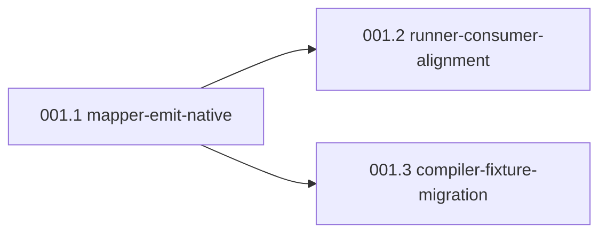

# e2e-pipeline selector grammar alignment (mapper ↔ agent-browser runtime) — Spec

## Problem

The e2e-mapper agent emits Playwright-style selector strings (role=tab[name=...], >> nth=N, text=, has-text()), but e2e-test-runner shells out to agent-browser CLI which uses Chrome/Chromium via CDP and only parses CSS / @eN snapshot refs / its find role|text|testid|label semantic-locator subcommand. Mappings produced by /e2e-map therefore pass /e2e-test only via the runner's eval-based DOM fallback — silent false positives. Compiled deterministic scripts via e2e-compile.js lack that fallback and would fail systemically once the eval crutch is removed. The compiler's selectorToA11yPattern() partially mitigates, but the mapper-to-runner contract was never formalized.

## Acceptance Outcome

After /e2e-map over a Recce-style app, every selector in the resulting mapping is one the agent-browser CLI parses without eval fallback — verified by running each selector through agent-browser is visible / wait / click directly and getting non-zero/visible/found responses. Compiled scripts via e2e-compile execute the same flows end-to-end without the _poll_visible eval fallback being the only thing keeping them green. Captain observes runner-reported eval-fallback hit count = 0 on a fresh /e2e-map → /e2e-test run.

## Appetite

medium-batch

## Children

- 001.1-mapper-emit-native
- 001.2-runner-consumer-alignment
- 001.3-compiler-fixture-migration

## Assumptions

- **A1 (critical, 75%)** — agent-browser CLI `is visible` / `wait` / `click` accept native CSS attribute selectors (`[role="tab"][aria-label="Lineage"]`) AND its `find role <r>` semantic-locator subcommand, but do NOT parse Playwright `role=tab[name="..."]` form.
  - *Verified by:* `agent-browser get count '[role="tab"]'` returns 3 (issue body); `agent-browser get count 'role=tab[name="Lineage"]'` returns 0 (issue body); `references/commands.md:122-129` documents only `find role/text/testid/label`.
- **A2 (important, 80%)** — Compiler's `selectorToA11yPattern` (`compiler/codegen.js:73-110`) is already the de-facto Playwright→a11y translation layer and can be promoted to canonical without rewriting from scratch.
  - *Verified by:* `grep -n selectorToA11yPattern e2e-pipeline/compiler/codegen.js` shows existing parser for `role=X[name=...]`, `role=X[name=/.../ ]`, `role=X >> nth=N`, bare `role=X`, `css=` forms.
- **A3 (nice-to-know, 60%)** — ui-verify's `text=` strip-regex (`skills/ui-verify/bin/run.js:208,218`) is an adapter for a UX-checking flow distinct from main E2E flows; can be migrated separately as a rabbit-hole.
  - *Verified by:* read `skills/ui-verify/SKILL.md:80,142` for context; cross-check whether `bin/run.js text=` handling is invoked from outside ui-verify.

## Pre-mortem

**Category:** wrong-dcs
**One-liner:** Children pass verify but eval-fallback removal in 001.2 reveals 30+ existing flows that quietly relied on it; mitigate by baseline-counting fallback hits before merge.

## Rabbit Holes

- `ui-verify-text-strip-audit` — Audit ui-verify `text=` strip-regex; preserve, migrate, or unify with main pipeline.
- `agent-browser-selector-grammar-doc` — Pull canonical out-of-tree agent-browser CLI selector grammar into `references/agent-browser-selector-grammar.md`.
- `compiled-vs-llm-divergence-baseline` — Add divergence reporter; baseline eval-fallback hit count per flow BEFORE 001.2 ships.

## Deletes (rejected alternatives)

- **Switch runtime from agent-browser to Playwright wholesale** (issue option 2) — loses agent-browser's CDP-only lightweight model (~50MB vs Playwright ~300MB); breaks existing CI compile path; abandons 50+ documented agent-browser invocations across 8 agents. High cost, low marginal value over option 1+3 hybrid.
- **Pure runtime translation layer with mapper still emitting Playwright forms** (issue option 3 standalone) — leaves source-of-truth (e2e-mapper Selector Priority) emitting forms the runtime can't natively parse; translation hides the contract violation rather than fixing it.
- **Document the mismatch as intentional and accept eval-fallback as canonical** — silent false-positive risk persists; compiled-script divergence remains; defeats the purpose of having a deterministic compiled CI path.

## DAG

## Captain Bet (gate approval 2026-05-04)

當這個 pitch ship 後，captain 在 1 週內觀察到兩件事同時成立：

1. **(A 的訊號)** 在 Recce app 上跑一次 `/e2e-map` → `/e2e-test`，runner 報告的 eval-fallback hit count = 0。
2. **(C 的對沖)** 001.2 移除 eval fallback 的 commit 之後，現有 e2e flow 跑出來的 fail，每一筆都能歸類為「mapper/runner 之前漏抓的真實 selector mismatch」——0 筆是「eval fallback 原本支撐的合法 use case 被誤殺」。

如果 (1) 不成立，這個 pitch 對 **「agent-browser 原生 CSS + `find role` 子命令足以取代 Playwright 形式」** 是錯的（A1 假設崩盤）。

如果 (2) 不成立（出現 ≥1 筆合法 use case 被誤殺），這個 pitch 對 **「eval fallback 純粹是 crutch、沒有 load-bearing 用途」** 是錯的——pre-mortem 裡的 *wrong-dcs* 失敗模式應驗。

**Retro 時點：** ship + 2 週。回答 YES / NO / PARTIAL。

<!-- section:hand_off_to_plan -->
### Hand-off to Plan

- design-skipped: false (retrofitted 2026-05-04 — see `design.md`)
- canonical_selector_form: `[role="<r>"][aria-label="<v>"]` (Candidate 2 — course-corrected 2026-05-05 from Cand 1 after PR #8 Copilot review; see design.md `## Course Correction`)
- canonical_selector_form_history:
  - 2026-05-04: Candidate 1 (`find role <r> --name "<v>"`) — wrong; subcommand chain not selector
  - 2026-05-05: Candidate 2 (`[role="<r>"][aria-label="<v>"]`) — current canonical
- breaks: ban `role=X[name=...]`, `>> nth=N`, bare `text=`, `has-text(`
- repeated_elements_form: `:nth-of-type(N)` CSS pseudo (NOT `>> nth=N`)
- compiler_translation: extend `selectorToA11yPattern` with `[role="<r>"][aria-label="<v>"]` parse branch (snapshot-literal `<role> "<name>"` output to match grep -F format)
- ui_surfaces: []
- framework_detected: n/a
- open_design_questions: []
- routing_gap_filed: `docs/ship-flow/todos/ship-flow-non-ui-design-routing-gap.md`
<!-- /section:hand_off_to_plan -->
