# Commission skeleton — plan-flow and ship-flow (draft, 2026-09-03)

Status legend: ✅ run in a POC and held · ⚠ run and returned `change` (contract rewritten) · ❌ not yet run. Commission is blocked while any ❌ sits on a gate or on the seam between the two workflows.

```mermaid
flowchart LR
    subgraph PF["kc-plan-flow — entity: one Project (or Initiative)"]
        S0["observe<br/>pain inventory from Issues, debriefs, defects ✅"]
        S1["frame<br/>problem-statement, unverified until S2 ❌"]
        S2["dialectic<br/>office-hours Q1-Q5 + Phase 3/4, Ask UI<br/>six-field Seam 1, may STOP ⚠"]
        S25["market-signal<br/>audience self/team/market, score ❌"]
        S3["hypothesize<br/>epic-hypothesis if/then + falsifier ❌"]
        S4["cut<br/>user-story-splitting, MS = journey, blockedBy DAG ❌"]
        S5["lint + receipt<br/>9 rules, kc-plan-receipt/v1 ✅"]
        G1{{"Captain gate<br/>kc-plan-approval/v1: go / discover / stop"}}
        S0 --> S1 --> S2 --> S25 --> S3 --> S4 --> S5 --> G1
        S2 -.->|"no specific human / no demand"| D["discovery assignment<br/>no Project, no receipt"]
    end
    G1 -->|"receipt + approval"| SF
    subgraph SF["kc-ship-flow — entity: one batch (one receipt)"]
        T1["dispatch<br/>intent commit → check → create → read-back → adopt ⚠<br/>lower layer verified before upper ✅(rule) ❌(enforced)"]
        T2["verify<br/>pin SHA · without-it verbatim (isolated ❌) · surface-map ✅ · contract test · review ✅ · e2e-cli ✅"]
        T3["deliver<br/>Captain approves exact SHA → pr-merge unit ✅<br/>native stack link ✅"]
        T4["handoff<br/>package UAT doc ✅ · Slack ping ❌"]
        G2{{"Captain UAT + merge"}}
        T5["close<br/>merge guard ✅ · close receipt → plan ❌"]
        T1 --> T2 --> T3 --> T4 --> G2 --> T5
        T2 -.->|"code-fixable, ≤2 rounds"| T1
    end
    T5 -.->|"close receipt"| S0
    DF["kc-dev-flow inside each worker<br/>shape → build → verify, Evidence block ✅"]
    T1 --> DF --> T2
```

## Stage table — plan-flow

| stage | gate | loads | mods | evidence |
|---|---|---|---|---|
| observe | none | station-0 reader (Linear GraphQL, SD debriefs, ship-defects) | none | DEV-89 pain-inventory.md ✅ |
| frame | none | pm-skills `problem-statement` when installed, else kernel fallback (3 questions) | fallback text in `references/dialectic.md` | DEV-89 run A/B ❌ |
| dialectic | none, but may terminate the entity with `discover` | office-hours posture (borrowed, MIT); Ask UI with mined options; Phase 3 premises; Phase 4 two alternatives | none | DEV-89 station 2 ⚠ (Q3 all-four must refuse) |
| market-signal | none | `market-seeker` agent, web search v1; audience threshold from receipt | none | POC 3 ❌ |
| hypothesize | none | pm-skills `epic-hypothesis` or fallback | none | DEV-89 ❌ |
| cut | none | pm-skills `user-story-splitting` or fallback; linear-admission.py per Issue | none | DEV-89 ❌ |
| lint + receipt | **Captain gate** | plan-lint (9 rules) → receipt v1 + rationale file | none | DEV-67 ✅ (8 rules), schema B ✅ |

## Stage table — ship-flow

| stage | gate | loads | mods | evidence |
|---|---|---|---|---|
| dispatch | none | receipt + approval (validate-receipt.py); holder.sh, intent.sh, fenced-dispatch.sh; carrier branch; token ack | none | DEV-84 ⚠ (round 2 pending) |
| verify | none | worker Evidence block; without-it.sh (isolation ❌); surface-map-check.py; contract test; Codex/kc-pr-review; e2e-cli.sh | none | DEV-67 ✅, DEV-78 ✅ |
| deliver | **Captain gate: exact SHA** | pr-merge canonical unit; `gh stack link` for dependent layers | pr-merge (vendored) | DEV-67 ✅ (#347-349), DEV-78 ✅ (#357) |
| handoff | none | uat-doc.py; Slack (❌) | none | DEV-67 ✅ (uat.md) |
| close | **Captain gate: UAT + merge** | pr-merge idle hook, merge guard; close receipt → plan | pr-merge | DEV-62/67/78/79 ✅; close receipt ❌ |

## Seam contracts

| seam | artifact | owner | status |
|---|---|---|---|
| plan → ship | `kc-plan-receipt/v1` + `kc-plan-approval/v1` (approval decision must be `go`) | plan-flow writes, ship-flow validates | schema ✅, real instance ❌ |
| ship → worker | dispatch text = work item + Issue body from receipt + token; no bootstrap line; carrier branch | ship-flow | ✅ (5 dispatches) |
| worker → ship | Evidence block: DISPATCH_TOKEN, CANDIDATE_SHA, SURFACE lines with without-it pairs | dev-flow build contract | ✅ (DEV-78 enforces SURFACE) |
| ship → plan | close receipt: per-Issue outcome, defects returned, minutes, cost | ship-flow | ❌ |

## Holder topology

plan-flow runs where `LINEAR_API_KEY` lives (the Captain's machine). ship-flow may run on any always-on host holding a Conductor token and gh credentials plus a clone of the state branch as the fenced holder (`_holder.json`, `_intents/`). Handover is a human command (`holder.sh handover`); unattended failover needs a lease and is out of scope.

## What blocks commission today

1. DEV-84 round 2 (lock trap, host-safe stale rule, TOCTOU) — ship dispatch.
2. DEV-89 runs A/B/C — plan frame/hypothesize/cut, and the refusal falsifier.
3. without-it isolation (temp HOME, no agent, no network) — ship verify.
4. close receipt (ship → plan) — the loop's return path; nothing has produced one.
5. Slack handoff — optional for commission, listed.
