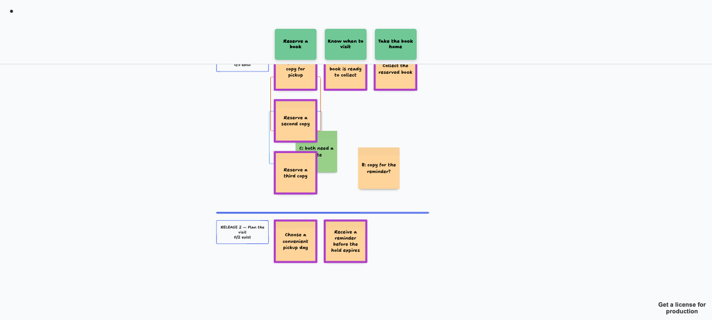
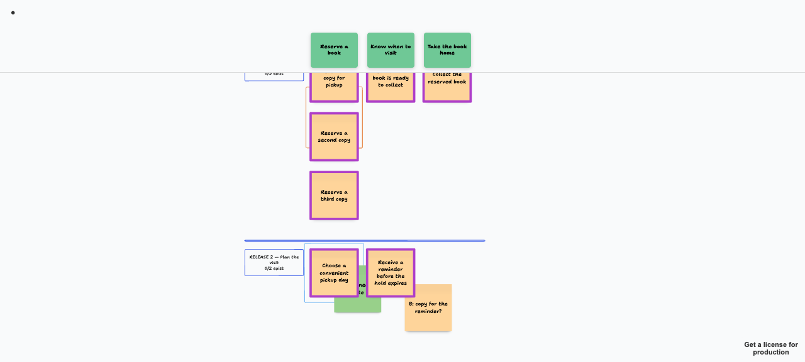

# Preview: a re-render that carries hand-drawn annotations (disposable)

Disposable. Nothing here is repository code; delete the directory with the task. Content is the packaged
fictional book-pickup journey only. Two rooms are drawn from it, three stories are added to release 1, and
the rooms are re-rendered: `today` with the current renderer, `carried` with the proposed rule
(`anchor.mjs`, a prototype of `carryAnnotations`).

 

Left (`today.png`): the frame and both stickies stay at their old coordinates, beside release 1 cards that
are not the cards they marked. Right (`carried.png`): they sit on the same cards, which moved down 500.
The orange frame that spans a card that stayed and a card that moved is left in place and listed.

## Run it (operable, own ports, throwaway rooms)

```bash
KJM=<a kc-journey-map checkout with node_modules>        # npm ci there, or reuse an installed copy
ROOMS=$(mktemp -d)
cd "$KJM"
JOURNEY_API_PORT=5871 JOURNEY_ROOMS_DIR=$ROOMS JOURNEY_ASSETS_DIR=$ROOMS/a JOURNEY_SAVE_DIR=$ROOMS/s \
  npx tsx ./server/canvas-server.ts &  SERVER=$!
JOURNEY_API_PORT=5871 JOURNEY_CANVAS_PORT=3871 npx vite dev &  CANVAS=$!
KJM=$KJM JOURNEY_API_PORT=5871 node <this dir>/build-preview.mjs
# open http://localhost:3871/?room=today  and  ?room=carried ; drag any annotation, it is a live tldraw canvas
kill $SERVER $CANVAS        # by the PIDs you captured; never pkill by pattern
```

Readout from the live editor (`window.editor.getShape(id).y`), run 2026-10-07:

| shape | today | carried | the card it overlapped |
| --- | --- | --- | --- |
| frame around a card | 926 | 1426 | 952 -> 1452 |
| sticky over a card corner | 1100 | 1600 | moved +500 |
| sticky across two cards | 1020 | 1520 | both moved +500 |
| frame across a stayed and a moved card | 760 | 760 | listed `cards-disagree` |
| sticky touching no card | 400 | 400 | none |

Other probes in this directory:

- `probe-today.mjs` (`KJM=...`): today's `renderToRoom` against a stub room; the annotations do not move.
- `probe-snapshots.mjs` (`KJM=...`, `SNAPSHOT_DIR=<the three recorded room snapshots>`): the rule against the
  recorded incident; prints counts and, locally, ids. The snapshots carry personal names and images and must
  not be copied into the repository.
