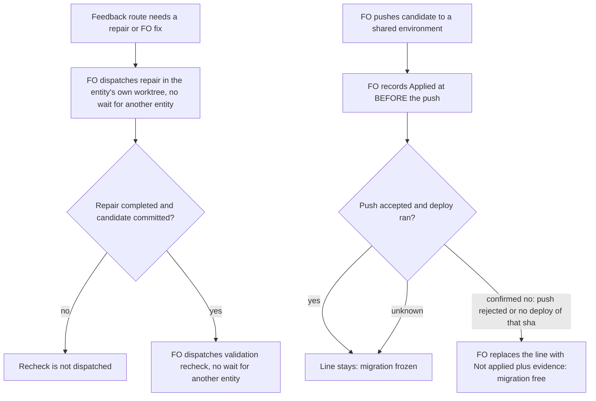

Two wording defects in kc-dev-flow-2 0.10.0 `references/sd/workflow.md`, found by an external review of an adopter's workflow sync (qnow PR #1248, 2026-09-30).

## Scope

Captain 2026-09-30: 「同意」 to the FO's proposal: fix both in the package, release 0.10.1, then re-sync the two adopter workflow READMEs (kc-claude-plugins #542, qnow #1248, both held).
Evidence (origin/main c3b3d5ad, `references/sd/workflow.md`):
- P1, `## Stages` lane paragraph: "A feedback-reflow repair, the validation recheck of that repair, and an FO fix authorized under Review-finding disposition step 3 are dispatched at once in the entity's own worktree". Read as "concurrently", a validator can inspect a pre-repair or partly written checkout and pass bytes the repair then changes. Intended meaning (review-cadence design): none of them waits for another entity's worker; the recheck is dispatched after the repair has completed and committed its candidate.
- P2, `## Number guards` Applied bullet: "Before any push of a candidate to a persistent shared environment ... FO records `Applied at:`". If the push is rejected or the deploy never runs, nothing was applied but the migration is frozen, and a renumber then needs a Captain-authorized branch reset. Direction: keep recording before the push (a record forgotten after a successful push is the undetected case), and let FO remove that one `Applied at:` line when the push or deploy is confirmed not to have run, stating the evidence.
Non-goals: any Spacedock change; any change to `number_guards.py` beyond what the wording requires; other sections.

## Acceptance criteria

**AC-1** The `## Stages` lane paragraph no longer lists the validation recheck among what is "dispatched at once"; it says the recheck of a repair or fix is dispatched only after that repair or fix has completed and committed its candidate. Evidence: `test_sd_dispatch.py` asserts the new sentence is present and the 0.10.0 clause "the validation recheck of that repair, and an FO fix" is absent; falsifier: the same check run on a fixture holding the 0.10.0 paragraph reports both gaps.

**AC-2** The lane still does not make a repair, an FO fix or their recheck wait for another entity's worker in the same stage. Evidence: the two existing `LANE_RULE` phrases stay asserted and the existing feedback-reflow build while another entity holds the only `implementation` slot still passes; falsifier: deleting the "they do not wait" clause from a fixture fails the phrase check.

**AC-3** The `## Number guards` Applied bullet keeps "Before any push ... FO records `Applied at:`" and adds: when the push is rejected or the deploy is confirmed not to have run for that commit, FO replaces that one line with `Not applied: <environment> <sha> - <evidence>` and the migration is no longer frozen; without that confirmation the line stays. Evidence: `test_sd_dispatch.py` asserts those phrases; falsifier: a fixture holding the 0.10.0 bullet reports the gap.

**AC-4** `number_guards.py check` treats a `Not applied:` line as no record: an edit to a migration that a `Not applied:` line names passes (exit 0), and the same edit with an `Applied at:` line fails R2 (exit 1). Evidence: one new test in `test_number_guards.py` beside the existing recorded/unrecorded test; falsifier: loosening the `Applied at:` pattern in `number_guards.py` to match `Not applied:` makes it fail. `number_guards.py` itself is unchanged.

**AC-5** ADR 0004's Decision states the corrected lane rule and its Consequences carry one dated amendment line; ADR 0002 is unchanged. Evidence: `python3 <package>/scripts/adr_lint.py docs/adr` exits 0 and validation reads back the 0004 sentence against the `workflow.md` sentence (not mechanically enforced; stated as a limit).

**AC-6** Scope holds: the candidate touches only `kc-dev-flow-2/references/sd/workflow.md`, `kc-dev-flow-2/scripts/test_sd_dispatch.py`, `kc-dev-flow-2/scripts/test_number_guards.py` and `docs/adr/0004-*.md`; no Spacedock change and no other `workflow.md` section. Evidence: `git diff --stat <base> <candidate>` at validation; `comment_ratio.py` exits 0.

## FO alignment

Needed at ideation: exact replacement wording for both passages; whether `test_sd_dispatch.py`'s asserted lane phrase changes with it; what evidence a confirmed failed push must carry before the `Applied at:` line is removed, and whether `number_guards.py` needs any change.
Result: the FO delegates these questions to ideation, which decides each with its source and returns any ruling that needs the Captain.
Surfaces: none
Visible change: none

## Design

### What this changes, in plain words

Two sentences in the workflow template told FO something other than what was meant. A validator could be started at the same moment as the repair it checks, and a failed push could freeze a migration that never reached a database. The fix is two rewritten passages, two test assertions and one ADR sentence. No new tool, no new state.

### Chain check (origin/main `c3b3d5ad`, read 2026-10-01)

- Spacedock 0.27.2 has no slot check on a reflow dispatch and no migration concept (ADR 0002 and 0004 Context); nothing upstream to reuse.
- `number_guards.py` already ignores an absent record: its pattern is line-anchored (`^Applied at:`), and `test_number_guards.py` already shows recorded commit exit 1, unrecorded exit 0. The P2 fix needs no code. Ran `python3 scripts/test_number_guards.py`: 17 tests OK. Ran `test_sd_dispatch.py` on Spacedock 0.27.2: all PASS lines, so the baseline is green.
- Both suites already run in CI (`.github/workflows/kc-dev-flow-2-tests.yml`); no CI cost is added.

### PRFAQ

Press line: FO reads one rule per hazard. A recheck starts after the repair it checks has committed, and a push that did not happen does not lock a migration.

- Q: Why not dispatch the recheck at once? A: The validator reads the worktree; a half-written repair passes, then changes. Codex reproduced this on qnow #1248 (P1).
- Q: Why keep recording before the push? A: A record forgotten after a successful push is the undetected case (ADR 0002 Consequences); a record kept after a failed push is the recoverable one.
- Q: Why replace the line instead of deleting it? A: A silent deletion leaves no evidence that the thaw was earned. `Not applied: <environment> <sha> - <evidence>` is free text `number_guards.py` does not read; the Captain's direction was to remove the line "stating the evidence".
- Q: What if FO cannot confirm the push did not run? A: The `Applied at:` line stays and Renumber holds for the Captain as today.

### Flow



### Exact replacement text

`references/sd/workflow.md`, `## Stages`, replacing from "A feedback-reflow repair," to "in the same stage." (the rest of the paragraph, "A repair that outgrows what its assignment names returns to FO as a scope change.", is unchanged):

> A feedback-reflow repair and an FO fix authorized under Review-finding disposition step 3 are dispatched at once in the entity's own worktree, after the existing overlap check against running worktrees; they do not wait for another entity's worker in the same stage. The validation recheck of that repair or fix does not wait for another entity's worker either, but it is dispatched only after the repair or fix has completed and committed its candidate, so the validator reads the bytes that will be delivered.

`## Number guards`, the `- **Applied.**` bullet, replacing the whole bullet:

> - **Applied.** Before any push of a candidate to a persistent shared environment (a non-production database branch), FO records `Applied at: <environment> <sha>` for the commit being pushed. A migration in that commit is then frozen for the task: edit, delete and renumber fail `check`. When the push is rejected or the deploy is confirmed not to have run for that commit (the push's non-zero output, or the environment's own deploy record showing no deploy of it), FO replaces that one line with `Not applied: <environment> <sha> - <evidence>` and the migration is no longer frozen. Without that confirmation the line stays and Renumber holds for the Captain. Git cannot see what a database applied, so an unrecorded deploy is not detected.

The line-wrapping of the existing file is kept; tests normalise whitespace.

### Where each rule lives

| Rule | Home | Enforced by |
| --- | --- | --- |
| Recheck after the repair commits | `workflow.md` `## Stages` | FO prose; phrase asserted in `test_sd_dispatch.py` |
| Record `Applied at:` before push; replace on confirmed no-run | `workflow.md` `## Number guards` | FO prose; phrases asserted; effect of the replaced line by `test_number_guards.py` |
| A `Not applied:` line thaws the migration | `number_guards.py` (existing pattern) | one new test |
| Corrected rule in the decision record | ADR 0004 | `adr_lint.py` format only |

### Test and script decisions

- `test_sd_dispatch.py`: the asserted phrase "are dispatched at once in the entity's own worktree" still occurs in the new text, and "`concurrency` limits only what `status --next` proposes" is untouched, so neither existing phrase must change. But neither catches the defect. The implementation adds to `LANE_RULE` the phrase "is dispatched only after the repair or fix has completed and committed its candidate", adds a forbidden phrase "the validation recheck of that repair, and an FO fix", and adds Applied-bullet phrases ("replaces that one line with `Not applied:", "Without that confirmation the line stays"). Falsifier: one helper returns the missing and forbidden phrases; it is run on the real template (empty result) and on a fixture with the 0.10.0 paragraph and bullet (non-empty), in the style of the existing `trimmed` fixture. It asserts wording, not behaviour; the behaviour is FO's and this is the strongest check available for prose.
- `number_guards.py`: no change. The regex is anchored on `Applied at:` so `Not applied: ...` is not matched.
- `test_number_guards.py`: one test, "a `Not applied:` line in place of the record leaves the edit unfrozen".

### ADR

- ADR 0004 (Decision restates the lane rule, "its validation recheck ... dispatched at once"): edit that sentence in place to the corrected rule and add one line to Consequences: "Amended <landing date>: the validation recheck is dispatched after the repair completes and commits, not at once with it (`workflow.md` Stages)." Per the retained-documents rule, an affected claim is updated with the approved change. The Captain's quoted words in 0004 are untouched.
- ADR 0002: none. Its Decision says what `check` refuses, not when the record is written; "a deploy nobody recorded" stays true. No number to reserve, no new ADR.

### Failure modes

- FO removes the line on a guess: the wording requires stated evidence and otherwise leaves the line; not mechanically enforced (prose), reopen if a wrongly thawed migration reaches a checksum failure.
- A push partly ran: "unknown" keeps the line, the Captain-authorized reset path applies.
- Rewording drifts from the adopters' synced README copies: the adopter re-sync (kc-claude-plugins #542, qnow #1248, held) happens after release; not part of this task.

### Profile and release notes

Pilot stays: wording and a test only, no new obligation. Commit type `fix(kc-dev-flow-2): ...`; release-please proposes the version (a fix gives a patch release); no hand bump.

### Needs the Captain

Nothing. One point for FO awareness, not a decision: replacing the line with `Not applied: ...` rather than deleting it is a small addition to the Captain's 「同意」 wording ("remove that one line ... stating the evidence"); it is the evidence's home. Say if you would rather have a plain deletion.

### Captain acceptance script (after delivery; `$PKG` is a checkout of the merged code)

```
cd $PKG/kc-dev-flow-2
sed -n '/^## Stages/,/^FO resolves/p' references/sd/workflow.md   # read: the recheck is dispatched only after the repair commits; nothing waits for another entity
sed -n '/\*\*Applied\.\*\*/,/\*\*Check\.\*\*/p' references/sd/workflow.md   # read: record before push; replace with Not applied plus evidence only when confirmed
python3 scripts/test_number_guards.py                              # expect OK; includes the Not-applied test
SPACEDOCK_BIN=$(command -v spacedock) python3 scripts/test_sd_dispatch.py --sd-plugin-root <activated spacedock root>   # expect PASS lines
python3 scripts/adr_lint.py ../docs/adr                            # expect 6 ADR file(s) checked, exit 0
```
Falsifier by hand: in a scratch copy, put the 0.10.0 sentence back (`git show c3b3d5ad:kc-dev-flow-2/references/sd/workflow.md`) and rerun `test_sd_dispatch.py`; it must fail naming the missing lane phrase.

### Cost

No new CI job or runtime; the two suites already run per kc-dev-flow-2 PR. Not measured beyond a local baseline run.

## Stage Report: ideation

- DONE: Exact replacement text for the `## Stages` lane paragraph (repair and FO fix dispatch at once; recheck after the repair completes and commits)
  `## Design` § Exact replacement text; the recheck no longer sits in the "at once" list and does not wait for another entity's worker either.
- DONE: Exact replacement text for the `## Number guards` Applied bullet (record before push; FO replaces that one line with `Not applied: <env> <sha> - <evidence>` when the push or deploy is confirmed not to have run)
  `## Design` § Exact replacement text; without confirmation the line stays and Renumber holds for the Captain.
- DONE: Whether `test_sd_dispatch.py`'s asserted phrases change and whether `number_guards.py` needs any change
  Existing `LANE_RULE` phrases still occur but do not catch the defect, so phrases are added (plus one forbidden phrase); `number_guards.py` unchanged, its `^Applied at:` pattern ignores `Not applied:`; baseline `test_number_guards.py` 17 OK and `test_sd_dispatch.py` PASS on Spacedock 0.27.2 at c3b3d5ad.
- DONE: AC-1 lane paragraph says the recheck follows the repair's commit
  Plan: phrase asserted in `test_sd_dispatch.py`, falsifier a fixture with the 0.10.0 paragraph; not yet run, nothing implemented.
- DONE: AC-2 the lane still waits for no other entity's worker
  Existing `LANE_RULE` phrases plus the existing reflow build while another entity holds the only implementation slot (passed at baseline today); falsifier by deleting the clause in a fixture is planned.
- DONE: AC-3 Applied bullet keeps record-before-push and adds the confirmed-no-run replacement
  Plan: phrases asserted with a 0.10.0-bullet fixture as falsifier; not yet run.
- DONE: AC-4 `number_guards.py check` treats `Not applied:` as no record
  Plan: one new test in `test_number_guards.py` beside the recorded/unrecorded test (existing recorded-exit-1 / unrecorded-exit-0 passes today); mutation: loosen the pattern.
- DONE: AC-5 ADR 0004 corrected and amended once; ADR 0002 unchanged
  Decision in `## Design` § ADR; `adr_lint.py docs/adr` exits 0 today (6 files); read-back of 0004 against workflow.md is not mechanically enforced.
- DONE: AC-6 scope holds to four files, no Spacedock or other-section change
  Plan: `git diff --stat` at validation and `comment_ratio.py`; not yet verified.
- DONE: ADR need, and the Captain-run minimal acceptance script
  `## Design` § ADR (amend 0004 in place, none for 0002, no number reserved) and § Captain acceptance script (five commands plus a by-hand falsifier); `design_surfaces.py check` exits 0 ("design surfaces presentable").

### Summary

Two wording fixes, four files, no new mechanism. Only detail beyond the Captain's 「同意」 is that the replaced line becomes `Not applied: ... - <evidence>` rather than a silent deletion; FO may ask the Captain, otherwise a plain deletion is a one-line change. Nothing else needs a Captain ruling; nothing was implemented or committed to the repository.

## Stage Report: implementation

- DONE: Implement the approved design touching only kc-dev-flow-2/** and docs/adr/0004-*.md
  Candidate `10658a7f1f530c8618a699d34db78139dfe26476` on `spacedock-ensign/reflow-order` (base c3b3d5ad); `git diff --stat` shows 4 files: `workflow.md`, `test_sd_dispatch.py`, `test_number_guards.py`, ADR 0004 (AC-6).
- DONE: AC-1 lane paragraph says the recheck is dispatched only after the repair or fix commits
  `lane_gaps()` in `test_sd_dispatch.py` returns `([], [])` on the real template; on the real 0.10.0 file (`git show c3b3d5ad:...`) it returns the missing after-commit, `Not applied:` and `Without that confirmation` phrases plus the forbidden "the validation recheck of that repair, and an FO fix".
- DONE: AC-2 the lane still waits for no other entity's worker
  The existing `concurrency` and "at once in the entity's own worktree" phrases stay asserted and the reflow build with the slot held still passes; deleting "do not wait for another entity's worker in the same stage" makes `lane_gaps` report exactly that phrase.
- DONE: AC-3 Applied bullet keeps record-before-push and adds the confirmed-no-run replacement
  `workflow.md` `**Applied.**` bullet now carries the `Not applied: <environment> <sha> - <evidence>` replacement and "Without that confirmation the line stays"; a fixture holding the 0.10.0 lane and bullet reports 3 missing phrases and 1 forbidden phrase in `test_sd_dispatch.py` (asserted).
- DONE: AC-4 `number_guards.py check` treats `Not applied:` as no record
  New `test_a_not_applied_line_in_place_of_the_record_leaves_the_edit_unfrozen`: `Not applied:` lines (with and without evidence) exit 0, the `Applied at:` line exits 1 with `FAIL R2`; mutation `^(?:Applied at|Not applied):` in `number_guards.py` fails this test alone (18 tests, 1 failure), restored after; `number_guards.py` unchanged.
- DONE: AC-5 ADR 0004 corrected and amended once; ADR 0002 unchanged
  Decision sentence rewritten and one `Amended 2026-10-01:` line added to Consequences (the Captain's quoted words untouched); `adr_lint.py docs/adr --require 0004` exits 0 (6 files). Read-back against `workflow.md` is by hand only, not enforced. The amendment carries the implementation date, not the landing date; FO may change it at merge.
- DONE: AC-6 scope holds to the four files and comment_ratio passes
  `comment_ratio.py c3b3d5ad HEAD` (candidate's own script) exit 0: 29 code lines, 0 comment lines, 0.0%.
- DONE: CI suite list green
  Ran lint-skills, test_lint_skills, test_design_surfaces, test_adr_doc_checks, test_poc_readme, test_comment_ratio, test_number_guards (18 OK), test_learning all exit 0; `test_sd_dispatch.py --sd-plugin-root` on Spacedock 0.27.2 prints all PASS lines.
- DONE: `doc_impact.py` reported for base c3b3d5ad and the candidate
  README.md: unaffected: it only lists the `test_number_guards.py` and `test_sd_dispatch.py` invocations, not the lane or Applied wording. references/sd/adoption.md: unaffected: it only names `test_sd_dispatch.py --sd-plugin-root`. No other document mentions the recheck or `Applied at:` except ADR 0002 (unaffected: it says what `check` refuses, not when the record is written).
- DONE: Captain-run minimal acceptance script rewritten against the shipped text
  Below; commands run from the candidate and their output matched.

### Captain acceptance script (`$PKG` is a checkout of the merged code)

    cd $PKG/kc-dev-flow-2
    grep -n "dispatched only after the repair or fix has completed and committed" references/sd/workflow.md   # 1 hit, Stages
    grep -n "the validation recheck of that repair, and an FO fix" references/sd/workflow.md                   # no hit
    grep -n "replaces" references/sd/workflow.md                                                               # Applied bullet: Not applied: <environment> <sha> - <evidence>
    python3 scripts/test_number_guards.py                                                                      # 18 tests OK, includes the Not-applied test
    SPACEDOCK_BIN=$(command -v spacedock) python3 scripts/test_sd_dispatch.py --sd-plugin-root <activated spacedock root>   # PASS lines, incl. lane and Applied wording
    python3 scripts/adr_lint.py ../docs/adr                                                                    # 6 ADR file(s) checked, exit 0
    git show c3b3d5ad:kc-dev-flow-2/references/sd/workflow.md > /tmp/old.md   # falsifier: the check on the 0.10.0 file reports gaps
    python3 -c "import sys; sys.path.insert(0,'scripts'); import test_sd_dispatch as t; print(t.lane_gaps(open('/tmp/old.md').read()))"   # 3 missing, 1 forbidden

### Summary

Two wording fixes, one rule test and one ADR amendment landed as a single `fix(kc-dev-flow-2)` commit; no version edit, `number_guards.py` unchanged. The wording checks assert phrases, not FO behaviour; the recheck ordering and the `Not applied:` confirmation stay FO prose. Nothing needs a Captain ruling beyond the design's noted `Not applied:` replacement.

## Stage Report: validation

- DONE: Reproduce the kc-dev-flow-2 CI suite list on a `git archive` copy of 10658a7f
  lint-skills, test_lint_skills, test_design_surfaces, test_adr_doc_checks, test_poc_readme, test_comment_ratio, test_number_guards (18 OK), test_learning all exit 0; `test_sd_dispatch.py --sd-plugin-root` (Spacedock v0.27.2 at 4d158a48, binary 0.27.2) exits 0 with 6 PASS lines.
- DONE: `lane_gaps()` on the real 0.10.0 `workflow.md` and on the candidate
  Candidate returns `([], [])`; base c3b3d5ad and the installed 0.10.0 both return 3 missing phrases (after-commit, `replaces that one line with Not applied`, `Without that confirmation`) and the forbidden "the validation recheck of that repair, and an FO fix", so the check detects the known defect.
- DONE: `Not applied:` number_guards test and its mutation
  The new test passes; changing the pattern in a scratch copy to `^(?:Applied at|Not applied):` fails only that test (`FAIL R2 ... applied at uat`, 18 run, 1 failure), so it catches the loosened pattern; `number_guards.py` is unchanged in the candidate.
- DONE: The diff touches exactly the four planned files (AC-6)
  `git diff --name-only c3b3d5ad 10658a7f` lists `docs/adr/0004-*.md`, `workflow.md`, `test_number_guards.py`, `test_sd_dispatch.py`; no version, manifest or Spacedock file; worktree `git status --short` is empty.
- DONE: Both rewritten passages read against the Codex findings on qnow #1248
  P1 closed: the recheck "is dispatched only after the repair or fix has completed and committed its candidate" and the validation-stage line 201 already defers to that lane; P2 closed by the second option Codex named (permit removing the pre-push marker on a confirmed failed push), with evidence required and the line kept when unconfirmed.
- DONE: ADR 0004 Decision and amendment line; `adr_lint`
  Decision sentence carries the corrected lane rule, one `Amended 2026-10-01:` line added to Consequences, the Captain's quoted words are untouched in the diff, ADR 0002 unchanged; `adr_lint.py docs/adr --require 0004` exits 0 (6 files); read-back of 0004 against `workflow.md` is by hand only.
- DONE: Candidate's own `comment_ratio.py` from c3b3d5ad, and every added comment read
  Script is byte-identical to the base copy; exit 0, 29 code lines, 0 comment lines, 0.0%; the diff adds no comment.
- DONE: Minimal necessity and goal sufficiency at this candidate
  Each change maps to an AC (two passages, `LANE_RULE` phrases plus the 0.10.0 fixture as falsifier, one rule test, one ADR sentence); no other retained text still says the recheck runs at once (grep of `references`, `skills`, `docs/adr`); `doc_impact.py` lists README.md and adoption.md, both recorded `unaffected` by implementation and confirmed (they only name the two test scripts).
- DONE: Captain acceptance script run as written
  Steps 1-6 of the implementation report's script run on the candidate worktree: 1 hit, no hit, `replaces` at the Applied bullet, 18 OK, 6 PASS, adr_lint 6 files exit 0, falsifier prints 3 missing and 1 forbidden.

### Captain acceptance script (`$PKG` is a checkout of the merged code)

    cd $PKG/kc-dev-flow-2
    sed -n '/^`concurrency` limits only/,/^FO resolves/p' references/sd/workflow.md   # read: the recheck is dispatched only after the repair or fix commits; nothing waits for another entity
    sed -n '/\*\*Applied\.\*\*/,/\*\*Check\.\*\*/p' references/sd/workflow.md          # read: record before push; replace with Not applied plus evidence only when confirmed
    python3 scripts/test_number_guards.py                                                # 18 tests OK, includes the Not-applied test
    SPACEDOCK_BIN=$(command -v spacedock) python3 scripts/test_sd_dispatch.py --sd-plugin-root <Spacedock v0.27.2 plugin root>   # 6 PASS lines, incl. lane and Applied wording
    python3 scripts/adr_lint.py ../docs/adr                                              # 6 ADR file(s) checked, exit 0
    git show c3b3d5ad:kc-dev-flow-2/references/sd/workflow.md > /tmp/old.md; python3 -c "import sys; sys.path.insert(0,'scripts'); import test_sd_dispatch as t; print(t.lane_gaps(open('/tmp/old.md').read()))"   # falsifier: 3 missing, 1 forbidden

Does not cover: FO behaviour (the recheck order and the `Not applied:` confirmation are prose FO applies; the tests assert wording only), the adopter README re-sync (kc-claude-plugins #542, qnow #1248), release 0.10.1, or any run against a real Netlify database branch.

### Summary

PASSED for candidate 10658a7f1f530c8618a699d34db78139dfe26476. Both wording defects are fixed as designed, the suite is green on Spacedock 0.27.2, the mutation and the 0.10.0 fixture each turn the new checks red, scope is the four files, and no repair finding, added comment or number-guards section applies. Limits: wording is proved present, not obeyed; the ADR amendment date is the implementation date (2026-10-01) and FO may change it at merge; `Not applied:` evidence is free text that no tool reads.
