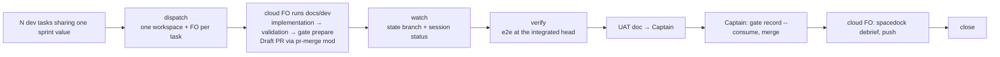

# kc-ship-flow as a cloud wrapper over kc-dev-flow — design

Status: Captain-approved design input for the `ship-cloud-wrapper` sprint tasks; lives on the state branch, not in the code tree (Captain, 2026-09-10).
`docs/ship/README.md` and `kc-ship-flow/references/kernel.md`.

## Ruling

Captain, 2026-09-10 (verbatim intent, translated): ship must be a wrapper over dev flow and
must not re-implement anything dev flow already has. Its purpose is to bundle several planned
dev tasks, send them to Conductor cloud, watch the cloud first-officer workers until they
finish, verify the result, and hand the Captain a UAT. If Conductor cloud cannot run, ship
cannot be used. Everything unrelated to that is removed.

Decisions taken in the same conversation:

- **A**: each cloud worker is a Spacedock first officer running the adopter's `docs/dev`
  workflow for one task, not an ensign running one stage (「Ａ，我可以證明可以跑通」).
- One release = N stories = N dev tasks = N Conductor workspaces = N cloud FOs.
- The batch key is dev flow's existing `sprint` field; ship calls it a release in its own
  vocabulary and renames nothing in kc-dev-flow (「同意」, after MIGRATION.md's "SD field names
  are fixed on purpose" and CHANGELOG's retired `release` state were shown).
- Cloud workers write their own `spacedock debrief` after their PR merges, because a cloud
  session cannot collect its own transcript any other way.
- Build it through dev flow's POC profile first, harden afterwards (「用 dev flow 走 poc
  profile，快速打通，再回來補強」).
- Cloud and local Claude accounts are separate pools; spreading work across them is a goal.

## What ship is, in one picture



The unit of work is a **batch**: the set of `docs/dev` tasks whose `sprint` equals one value.
Ship adds no per-task state of its own beyond the workspace and session ids it created.

**Adopters keep their `docs/ship` root.** A batch is still one commissioned entity on the
adopter's ship state branch; what changes is its key and its stages. The entity's slug is the
`sprint` value it wraps, and its body holds only per-batch state: the fence records, the
questions asked and answered, the e2e result, the UAT document path, the close receipt. An
adopter's existing batch entities that do not map to a `sprint` value are re-keyed or archived
by that adopter's Captain; nothing in this design deletes them.

**Any station that writes to a state branch derives the remote and branch from the checkout's
own upstream and refuses when none is configured** (`intent.sh`'s `%(upstream:remotename)` /
`%(upstream:strip=3)` derivation from #399, merged 2026-09-09). The claim fence and `watch.sh`
inherit this; the hardcode it replaced would have pushed ship state onto the dev branch, and an
adopter observed the refusal doing its job on 2026-09-10.

## Discriminator for every keep/delete question

Anything dev flow or Spacedock already does **per task** leaves ship. Ship keeps only what
exists **per batch** or only exists **because the worker is in the cloud**.

## Stages

Ship's commissioned workflow shrinks to five stages:

| Stage | What happens | Enforcing script |
|---|---|---|
| `dispatched` | one `conductor workspace create` per task, message = FO boot for that task | `dispatch.sh` |
| `watching` | poll until every task is at `validation` with a gate prepared, or an exit condition | `watch.sh` |
| `verified` | e2e at the integrated head | existing `e2e-gate.py` + `e2e-cli.sh` |
| `uat` (gate) | UAT doc handed to the Captain | `uat-doc.py` (slimmed) |
| `closed` | all debriefs pushed, close receipt written | `close.py` |

There is no `accepted`, `reviewed`, or `merged` stage. Acceptance is dev flow's validation gate;
review is `kc-pr-review` inside the cloud FO's own validation stage; merge is the Captain's and
is recorded on the task by Spacedock's `pr-merge` mod.

### dispatched

For each task in the batch:

```
conductor workspace create --project-id <resolved> --branch <trunk> \
  --agent claude --model <from task or batch default> --effort <…> \
  --name "<sprint>/<task-slug>" --message-file <boot.md> --json
```

`boot.md` carries three instructions and nothing else:

1. Boot as the `docs/dev` first officer for exactly one entity (`spacedock claude`, then
   `spacedock state init` if the split-root checkout is absent).
2. Run that entity through its route to the `validation` gate and `spacedock gate prepare` it;
   deliver the Draft PR through the `pr-merge` mod as the Local Profile already requires.
3. Stop at the gate. Do not merge. Push every state change to the state branch.

Preconditions the station refuses on: `conductor auth whoami` fails; the workspace project id
cannot be resolved from the repo remote; a task in the set has no `sprint-readiness: ready`.

The claim fence stays: `workspace create` has no idempotency token (verified against
`conductor --help` at CLI 0.85.0, 2026-09-10; `session create --session-id` and
`message create --message-id` do), and an orphan workspace has already bitten. The fence records
`<sprint>/<task-slug> → workspace id, session id, message sha256` on the state branch before the
create call and reconciles by name if the record and Conductor disagree.

Quota: one Conductor-connected account serves all cloud workers. The batch records the model per
task; a quota banner in any transcript is a watch exit, not a redispatch.

### watching

Primary signal is the state branch, not the transcript: `spacedock status --workflow-dir
docs/dev --where sprint=<value>` shows each task's stage, and a prepared gate shows in the
entity's `gates` records. Secondary signal is `conductor --json session status <id>`
(`idle` = the worker has stopped for now).

Exit conditions per task, checked in this order when the session is `idle`:

1. gate prepared at `validation` → done for this stage.
2. transcript tail contains the usage-limit banner → `quota`; keep the workspace, resend the go
   message after the reset window.
3. transcript tail ends in a question → `question`; route per the answering principle below.
4. otherwise → `stopped`; read the tail, record the reason, Captain decides.

Transcripts are read only through `conductor sql` on `session_transcripts_view` (the CLI's
`session message` JSON carries unescaped control characters that break `jq`; measured
2026-09-10). Rate limit is 180 requests/min per key; poll each session at most every 30 s.

### Answering principle for cloud-worker questions

Ship does not invent an authority. The `docs/dev` Local Profile table already assigns one:

1. The answer is in the task body, the Local Profile, or `kernel.md` → the ship FO answers,
   quoting the sentence.
2. The question falls under "Scope, profile, irreversibility, merge/release — Captain" → ask
   the Captain, with the ship FO's recommendation attached.
3. Cross-task interaction (two tasks touch one file; task B stacks on task A's branch) → answer
   from the Local Profile's delivery-branch-base policy (dependency-aware); anything the policy
   does not cover goes to the Captain.

Every answer sent to a worker is appended to the batch record with the question it answered.

### verified

Ship's only own check: `e2e-gate.py --root <integrated checkout> --flows <flows dir>` at the
**integrated head**. Which head that is comes from one Local Profile row per adopter:

| Row value | Meaning |
|---|---|
| `preview` | an ephemeral merge of every batch branch onto trunk, built by ship |
| `trunk` | trunk after the Captain merged |
| `staging` | the adopter's staging deployment after merge (qnow) |

This row is the only place UAT-before-merge versus UAT-after-merge is decided; ship has no
opinion of its own.

### uat (gate)

`uat-doc.py` reads the batch record and the dev entities and writes one document: tasks, PR
links, gate status, e2e result, open questions and their answers. The Captain, in one sitting:
`spacedock gate record <slug> --decision approve --actor person:captain --consume` per task,
UAT, merge. The ship FO never merges.

### closed

After the Captain's merges are observed on the tasks (`pr: pr-merge:N`), the ship FO sends each
cloud worker one message:

> Your PR #N merged at <sha>. Run `spacedock debrief` for your session, commit it path-scoped
> under `_debriefs/` on the state branch, and push.

Debrief runs after merge, not after acceptance, because the debrief skill resolves the Shipped
section from `merge: <slug> done (PASSED) via PR #N` commits that do not exist before the merge.
Each worker pushes its own file (`_debriefs/<date>-<seq>-claude-<model>.md`); path-scoped
commits from several writers are the split-root design, not a hazard. If a worker's push
rejects, it fetches and retries once; a second rejection is recorded as `debrief-failed` and the
ship FO does not write the debrief for it.

`close.py` writes the close receipt when every task shows a merged PR and a pushed debrief, or
the Captain records `captain_stopped` for the rest. Receipt fields: schema id, sprint value,
per task {slug, workspace id, session id, PR, merged sha, debrief path or failure}, e2e result,
questions asked and answered, residuals. Nothing else.

## What leaves kc-ship-flow

| Removed | Why it is per-task or not cloud-specific |
|---|---|
| `accept-evidence.sh`, `without-it.sh`, evidence-block schema | dev flow's validation gate (`fresh: true`) is the acceptance |
| `open-pr.sh` | the `pr-merge` mod opens the Draft PR with the template body |
| `disposition.py`, `ci-covers.sh` | `kc-pr-review` runs inside the cloud FO's validation stage |
| `merge-station.sh` | the Captain merges; `pr-merge` records it |
| `dev-debrief.py`, `ship-debrief.py` | `spacedock debrief`, run by each worker |
| `fenced-dispatch.sh` local-subagent path, `intent.sh`/`holder.sh` beyond the claim fence | cloud only |
| `notify.sh` | the UAT doc path is returned in chat; nothing has bitten without a channel post |
| per-station `pin.py`, `contract-test.py` cases for the above, their fixtures | no station, no pin |
| `worker-transcript.sh` as a station | folded into `watch.sh` as the sql read |

Kept: `e2e-gate.py`, `e2e-cli.sh`, `uat-doc.py` (slimmed), the claim fence, the close receipt
schema (slimmed), `local-profile-check.py` (checks the new rows).

## Contracts

- Input: `docs/dev` entities on the adopter's state branch, selected by `sprint`. No plan
  receipt is read. plan-flow's responsibility ends when `linear-admission.py` creates the task.
- Output: `kc-ship-close-receipt/v2` (slimmed as above). v1 fixtures are deleted with their
  stations.
- Host: the Conductor CLI is the contract; the Conductor MCP is optional. **The plugin pins the
  CLI it was written against** in `kc-ship-flow/pins/conductor-cli.txt`: the `conductor --version`
  line followed by the full `conductor --help` text. Every station that calls `conductor` first
  compares the installed version to the pin. Equal → proceed as the skill says. Different → print
  `diff` of the pinned help against the live `conductor --help`, exit 5
  `conductor cli changed: read the diff, then re-pin`, and do nothing else; the FO reads the diff,
  adjusts the skill if a used flag moved, and re-pins in the same PR. (Captain, 2026-09-10; three
  of the six traps recorded on 2026-09-03 had already disappeared by 0.85.0 without anything
  telling the skill.)

## Open items for the Captain

- **Close receipt reader.** Today no script outside kc-ship-flow reads the close receipt
  (plan-lint reads the plan receipt; e2e-gate reads it only to find the milestone). If no
  reader appears by the end of the POC, the receipt is a removal candidate.
- **`uat-doc.py` today reads `plan-receipt.json`/`plan-approval.json`.** Under this design
  those files do not exist; the POC either slims it or replaces it with a template.
- **Cloud image contents.** The runbook says the image preinstalls `kc-dev-flow` and
  `spacedock`; the boot message assumes it. First batch measures it.
- **17 dead fixtures pinning real SHAs** (from batch 2) — most fall with their stations; the
  rest stay listed as without-it unanswered.

## POC path

Three `docs/dev` tasks under `sprint: ship-cloud-wrapper`, POC profile, standalone
Captain-approved briefs with no Linear read or write (Captain, 2026-09-10: 「這一段不要去管
linear」):

1. `ship-cloud-dispatch-and-watch` — `dispatch.sh`, `watch.sh`, README re-commission. Built
   locally through dev flow because nothing can dispatch it yet.
2. `ship-remove-duplicated-stations` — the removal PR.
3. `ship-verify-uat-close` — `uat-doc.py` rewrite, `close.py`, close receipt v2.

Tasks 2 and 3 are the first real batch the new ship dispatches: ship's second batch is ship
itself. Success = both reach prepared gates with Draft PRs opened by cloud first officers, and
the sprint closes with worker-written debriefs. (`journey-map-poc` was considered and rejected
as the first batch: its three tasks are already mid-flight in another session.)

## Consequences already visible

- Captain's ruling on spacedock-dev/subspace-relay#191 ("one claim per task, dispatch dev
  entities via ensign") is superseded by A; the relay adopter session must be told.
- PRs #402 (`open-pr.sh`), #404 (skill script paths), #405 (`accept-evidence.sh`) fix stations
  this design removes; default is not to merge them and to close batch `0a557023cc36` as
  `captain_stopped` with this spec as the reason.
- Linear: one ticket for the POC batch, one for the removal PR, one for the relay notice.
