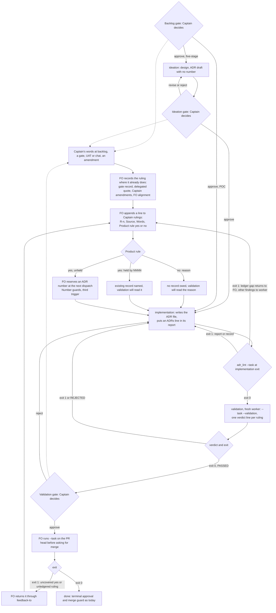

`references/sd/workflow.md` § Decision records requires an ADR for a ruling "settled at a gate, in a worker report, or mid-stage feedback" that later work must respect, and validation runs `adr_lint.py docs/adr --require <numbers>` only for the numbers the implementation report names. A ruling stated when the task is created (in FO alignment, before backlog) is not named by the trigger, and a report that names no ADR gives validation nothing to check, so a missing record passes silently.

## Scope

Relayed by the peer session dhaka-32 on 2026-10-07, quoting the Captain's approval to file it upstream 「要，交給上游修」 (not yet confirmed by the Captain in this session). Case: subspace-web dev2-poc task `subspace-tab-icon` (state branch spacedock-state/dev2-poc): the Captain's request 「目前 web 的 fav icon 是 spacedock 的，但我想要改成 spacedock-design 內的 subspace icon 請你排進去做」 (2026-10-05) reversed an earlier product choice (2026-09-24); both gates were approved and subspace-web#101 shipped with no ADR; the ADR was written afterwards as subspace-web#103.
Direction relayed as the Captain's (shape is the worker's to design): the implementation report states which ADRs it added, or `none` with a reason, and an absent statement fails validation; the FO alignment section marks whether the Captain's words set a product rule. Accepted cost (relayed): one more required line per task, POC included.
Non-goals: back-filling ADRs in adopters; changing the ADR template.

## Acceptance criteria

Package tests are `python3 -m unittest discover -s kc-dev-flow-2/scripts` from the repository root (CI runs `test_adr_doc_checks.py` and `test_poc_readme.py` as named steps in `.github/workflows/kc-dev-flow-2-tests.yml`; no CI change). `<fixture>` means synthetic task text inside `kc-dev-flow-2/scripts/test_adr_doc_checks.py`: gate records in the real key shape (`gates.records[].attempts[].resolution` with `by`, `decision`, `reason`, optional `conn.quote` and `conn.source`; optional `withdrawal.reason`), values invented, no adopter file or word copied. Base observed 2026-10-07 at package 0.10.4 (repository HEAD `ca368cee`, `python3 -m unittest discover -s kc-dev-flow-2/scripts`: 123 tests OK): `adr_lint.py <adr-dir>` exits 0 on an empty directory and on valid records, and `adr_lint.py <adr-dir> --task <file>` exits 2 (unrecognized argument). So every new test below fails at base and passes at the candidate.

**AC-1** Every enumerated Captain ruling is cited by a ledger entry, on both routes. The enumerated set is: a resolution with `by: person:captain`; any resolution carrying `conn.quote` (`spacedock gate record --actor agent:first-officer` requires one); a withdrawal whose reason names the Captain; each `## Captain amendments` entry; each `「…」` quote inside `## FO alignment`. `adr_lint.py <adr-dir> --task <fixture>` exits 1 with `<key> is not cited by any ruling entry` (key = the attempt id, `amendment N`, or `fo-alignment`) for a member no `## Captain rulings` entry cites, and with `no '## Captain rulings' section` when the set is non-empty and the section is absent. One entry may cite several members.
Verified by: one test per member kind (five), each run on a five-stage-shaped `<fixture>` and a POC-shaped one (`profile: poc`, no ideation attempts), asserting the message; falsified by deleting that kind from the enumerator, which makes its test pass silently on the unledgered member. Limit: Captain words kept only in prose outside these places (`## Scope` lines, stage reports, chat that never reached the task) are not found; that is the audit's own limit and stays FO judgement.

**AC-2** An entry is well formed: `- R<n> Source: <keys>. Words: 「<his words>」 Product rule: yes: <the rule>`, with `Proposal: 「<the proposal he approved, as the task records it>」` after `Words:` when his words only approve an FO proposal (「核准」, 「准」, 「照建議」), since the rule then lives in the proposal and not in his words or `Product rule: yes: held by <NNNN>` or `Product rule: no: <why it governs only this task>`. Exit 1 with `R<n>: <reason>` for a duplicate or missing id, no `Source:`, `Words:` with no `「…」`, an approval-only `Words:` (a bare 「核准」, 「准」, 「照建議」, 「ok」) on a `yes` entry with no `Proposal:`, a mark that is neither `yes` nor `no`, empty text, and `held by NNNN` naming a number with no record or a Legacy record.
Verified by: one test per message; falsified by deleting that branch. Limit: whether a mark is true is FO judgement; nothing parses meaning. The line is a visible claim for validation to dispute.

**AC-3** The report states its ADRs: at least one `## Stage Report: implementation` section (any cycle) carries, in its Summary outside the checklist bullets, `ADRs: <four-digit numbers>` or `ADRs: none: <reason>`. Numbers are unioned across implementation reports, so a repair cycle states only what it added. Exit 1 with `states no 'ADRs:' line`, `ADR <n> does not exist or is a legacy record`, or `needs a reason`.
Verified by: tests on `<fixture>` asserting each message; falsified by deleting the branch. Observed at base: none of these is checked (exit 0 or 2 above).

**AC-4** Every `yes` entry is covered: it is `held by NNNN` (AC-2), or a record among the unioned `ADRs:` numbers has, in its `## Decision` section, one `「…」` segment of the entry's `Proposal:` when it has one and of its `Words:` otherwise (whitespace-normalised). A bare approval word never satisfies containment. Otherwise exit 1 with `R<n> is 'Product rule: yes' but no record named by 'ADRs:' quotes its words`.
Verified by: three tests: a named record that quotes the words passes; a named record that exists but quotes other words fails, and so does one that quotes only the entry's 「核准」 when the entry carries a `Proposal:`; `ADRs: none: trivial` fails. Falsified by deleting the quote-containment branch, after which the second test passes. Limit: proves a named record quotes the words, not that it states the rule; that stays validation's read (AC-5).

**AC-5** `adr_lint.py <adr-dir> --task <task> --validation` also requires the latest `## Stage Report: validation` to carry, in its Summary, one line per ledger entry: `R<n>: agree: <what you read>` or `R<n>: disagree: <what>`. Exit 1 with `R<n> has no validation verdict`, `R<n>: validation disagrees: <text>`, or an empty text.
Verified by: three tests asserting the messages; falsified by deleting the branch. Limit: the script cannot tell an honest `agree` from a rubber stamp. The line is what forces each `no` mark and each `held by` to be read, which is where the audit's validation accepted `No ADR added; product-behavior decision for this task`.

**AC-6** Replays of the audit's four cases pass the check only when covered, each as `<fixture>` tests on a synthetic shape of the case. At base each fixture's own ADR directory and report give exit 0 for the procedure workflow.md prescribes today (`adr_lint.py <adr-dir> --require <numbers the report names>`; no `--require` where it names none) and exit 2 for `--task`.
(a) Later resolution carries `conn.quote` after valid ADRs (the booking-list shape): ADR dir holds `0021` and `0022`, the report says `ADRs: 0021, 0022`, entries cover the earlier gates; the last validation resolution is by `agent:first-officer` with a `conn.quote` and no entry. Exit 1 `<attempt id> is not cited by any ruling entry`; add an entry marked `yes` whose words no record quotes: exit 1 AC-4 message; put the words in `0022`'s Decision: exit 0. Falsifier: drop `conn.quote` from the enumerator and the first step passes.
(b) Same shape on a one-record task (the onboarding-script shape): `ADRs: 0023`, a later `conn.quote` ruling, entry marked `yes`, `0023` quotes only the earlier ruling: exit 1 AC-4 message; `held by 0023` instead: exit 0 (the script accepts it; validation must dispute it, AC-5).
(c) Ruling in a gate `reason` (the owner-signin shape): five-stage; an ideation resolution `by: person:captain` whose reason is a bare 「核准」 followed by the approved proposal in parentheses, so the entry is `Words: 「核准」 Proposal: 「<the parenthesised rule>」`; report `ADRs: none: product-behavior decision for this task`; entry marked `yes`: exit 1 AC-4 message, and still exit 1 when a record elsewhere in the directory quotes a 「核准」 but not the proposal; a `yes` entry with `Words: 「核准」` and no `Proposal:` exits 1 under AC-2. The same entry marked `no: task-local` exits 0 under `--task`; under `--task --validation` it exits 1 until `R<n>` verdict lines exist.
(d) POC route (the subspace-tab-icon shape): origin words inside `## FO alignment` and a Captain amendment after implementation, no ledger: exit 1 for `fo-alignment` and for `amendment 1`; ledger present, `yes`, `ADRs: none: trivial`: AC-4 message; a record quoting the words and `ADRs: 0006`: exit 0.
Verified by: those tests asserting the specific message each (not only the exit code). Limit: synthetic shapes whose key structure was read from four adopters' state branches on 2026-10-07, not their bytes; a ruling the FO marks `no` wrongly passes the script in all four.

**AC-7** The check runs at three points, the same three as `number_guards.py check`: implementation exit, validation (with `--validation`), and on the PR head before FO asks for merge. A `yes` recorded at the last gate has no worker stage after it; the PR-head run exits 1 on it and FO returns it to implementation through `feedback-to`.
Verified by: a test on `<fixture>` where the last validation resolution carries an unledgered `conn.quote` after a passed validation report: plain `--task` exits 1; and reading the three run points in `references/sd/workflow.md` at the candidate. Limit: the PR-head step is FO procedure; `spacedock merge guard` does not run this script, so a skipped step is not stopped (a hard stop would be a change upstream in spacedock).

**AC-8** `references/sd/workflow.md` carries the rules in § Decision records only (the ledger and its grammar, FO duty to append an entry at every Captain ruling it records, the `ADRs:` line, the three run points with the `--task` command replacing the `--require <numbers>` sentence, the validation verdict lines) plus one sentence in § Number guards' applicability line: an unheld `yes` entry is a third trigger, and FO reserves at the dispatch after the entry was recorded. `### backlog` and every ideation-only text are unchanged.
Verified by: `python3 kc-dev-flow-2/scripts/test_poc_readme.py` including a new assertion that `poc_readme.derive(SOURCE)` contains each of those phrases inside the `Decision records` and `Number guards` sections and that both `implementation` and `validation` list them in `context-sections`; `python3 kc-dev-flow-2/scripts/poc_readme.py check <poc-readme> <derived>` on a fresh derivation exits 0. Falsified by moving a phrase under `### ideation`, after which the derivation drops it.

**AC-9** Existing behavior is unchanged: the whole `unittest discover` run still passes (123 tests at base plus the new ones), and `adr_lint.py <dir> --require N` without `--task` prints and exits as before.
Verified by: the full run at the candidate; `test_legacy_is_skipped_but_cannot_satisfy_a_required_record` still passes.

**AC-10** `references/sd/adoption.md` states the order that does not break an adopter: update the package first, then re-sync the workflow README (a README that names `--task` before the script has it exits 2), and FO writes the ledger of each task open at sync before that task's next dispatch, one batched entry for its past bare approvals.
Verified by: reading the sentence at the candidate. Limit: prose; no script tests the order.

## FO alignment

Release review: not needed: package process defect, no journey story.
Needed at ideation: no Captain alignment before ideation; ideation checks the change against the POC derivation (poc_readme.py) and every adopter-synced surface, and returns any change to what a POC task owes.
Surfaces: none
Visible change: none
Product ruling: yes: 「要，交給上游修」 (relayed by dhaka-32, confirmed by the Captain 2026-10-07 「核准 adr-required-statement，以 Pilot 進入設計」)

## Design

Profile Pilot: one bounded change to a package script and the workflow text adopters re-sync, real seams exercised by test, no new production obligation.

Cycle 2 (Captain 2026-10-07 「退回設計」 after the four-repo audit): cycle 1 put one `Product ruling:` line in FO alignment at backlog. The audit found 3 of the 4 recent misses were rulings made after backlog (qnow owner-signin 09-25, owner-booking-list 09-27/29, shop-onboarding-script 09-29), so a backlog-only line catches 1 of 4. Kept from cycle 1: the `ADRs:` statement line, `adr_lint.py --task`, the number-guard trigger, the PRFAQ's POC treatment, the adoption ordering. Replaced: the FO-alignment line becomes a ledger of every Captain ruling, and validation checks every `ADRs: none` against that ledger.

### PRFAQ

**Press release.** From the next kc-dev-flow-2 release, a task cannot reach `done` carrying a Captain ruling nobody judged. Wherever the Captain's words enter a task (a gate decision, a delegated approval's quote, an amendment, the opening alignment), the FO appends one line to the task's `## Captain rulings` ledger saying whether it sets a rule for the product, `yes` or `no`. The implementation report says which decision records it added, or `none` with a reason. One command, run at implementation exit, at validation and on the PR head before merge, fails when a recorded ruling has no ledger line, when a `yes` is not backed by a record quoting his words (or an existing record the FO names), or when the report says nothing. Validation reads the same list and gives each ruling a verdict line, so a worker's `none: <reason>` is judged against every ruling and not against the worker's own opinion.

**FAQ**

- *Why did the cases slip through?* Three of four were rulings made after backlog, recorded in a gate reason, a delegated approval's quote or the body, while nothing asked anyone to judge them. The worker's own statement decided whether any check ran, and one worker wrote `No ADR added; product-behavior decision for this task` and validation accepted it (audit, owner-signin).
- *What does a POC owe?* The same ledger and the same `ADRs:` line. POC skips ideation only; § Decision records and § Number guards are outside `### ideation`, so `poc_readme.py derive` carries them unchanged.
- *What does the script decide, and what does validation?* The script decides what it can read without judgement; the rest is a person's, made visible.
- *What is not stopped?* A ruling the FO marks `no` that is really a rule; a `held by NNNN` or a quoted record that does not state the ruling; Captain words that never reach the task file (chat the FO does not write down); a skipped PR-head run (the merge guard does not run this script). Each is judgement or procedure; the ledger gives the validator and the gate reader a visible claim to disagree with.
- *Cost per task, from the audit's counts, not estimated.* Audit table (a), 2026-10-07: 300 non-bare Captain rulings and 143 product rules over 82 tasks in four repos, so 3.7 rulings and 1.7 product rules per task (qnow alone: 204 over 52 tasks, 3.9 and 1.9; the audit's own classification is plus or minus 5 to 10%). Per task that is about 3.7 ledger lines plus one batched line for bare approvals, one `ADRs:` line, and one validation verdict line per ledger entry. A scratch scan of the 30 task files archived on qnow's `spacedock-state/dev2` (2026-10-07; resolution, quote or Captain-named withdrawal in the frontmatter, regex over the `gates:` block) found 135 such Captain-made gate records, 4.5 per task, which is the upper bound on ledger lines when each stands alone. The command runs three times instead of once-when-numbers-named. No model call and no CI job is added. The ADR obligation itself is not new: the audit counts about 4 of about 29 delivered tasks since 09-25 with a product ruling and no ADR, so about 0.14 ADRs per task are newly forced. Open tasks at sync cost one backfill each; the audit counts 20 in flight in qnow.

### Existing-code capability check

Boundary: the path from a Captain ruling to the terminal gate in `kc-dev-flow-2` 0.10.4; this repository's worktree matches the installed copy.
- Completeness: § Decision records plus `adr_lint.py` work for a ruling a worker names (format and `--require` are unit-tested in `test_adr_doc_checks.py`; wiring is prose run by the validation worker). Nothing reads the task file or the gate records, so a ruling nobody names is not found.
- Need: a falsifier exists in four recorded cases (audit, 2026-10-07): three mid-flight misses and subspace-tab-icon (merged with no ADR; ADR written two days later).
- Searches, repository HEAD `ca368cee`: (1) `grep -i adr` across the package's skills, references and scripts; (2) `grep -rn -E 'Captain rulings|Ruling check|Product rule'` over `kc-dev-flow-2` and `docs/dev2/README.md`: no hits; (3) `grep -E 'gate-attempt|resolution:|conn'` over package scripts: none read gate records. Sibling: `number_guards.py` already enforces that an added ADR number was reserved and runs at the three points reused here. Unknowns: adopter READMEs beyond this repository's, subspace-web's and the four audited state branches.
- Gate-record shape read read-only on 2026-10-07 from the state branches of qnow and subspace-web: each attempt has `resolution` (`by`, `decision`, `reason`, and for a delegated decision `conn.quote` and `conn.source`) and, when withdrawn, `withdrawal.reason`; `spacedock gate record --help` confirms `--conn-quote` is required for an `agent:first-officer` decision. The three mid-flight misses sit exactly in these fields: owner-signin's 09-25 ruling in an ideation resolution's `reason`; owner-booking-list's 「第 1 條維持現狀」 and shop-onboarding-script's 「先拒絕」 in a validation resolution's `conn.quote` after the ADR-bearing report; subspace-tab-icon's words in `## FO alignment` and a Captain amendment. No `## Scope` line is needed to find any of the four.
- Conclusion: extend `adr_lint.py` (the ADR authority validation already runs) with `--task` and `--validation`, reading the frontmatter with line regexes as every package script does (no script imports `yaml`; adding it would be an undeclared dependency). Not `design_surfaces.py`: it exits 1 on a POC `ui` task for an unrelated reason and would bury the ADR failure.

### Mechanism

- **Ledger, in the task body.** `## Captain rulings`, one line per entry, grammar in AC-2. The FO appends it at the moment it records a ruling, committing it like a Captain amendment (a body section it already appends in the state checkout). It is not written into a gate reason: `gate record --reason` cannot be amended, and a task open at sync could not be backfilled. Bare approvals cannot be told from rulings by a script, so every Captain-made resolution needs a citing entry; one `no: approval only` line may cite many of them.
- **Enumerated set (script), AC-1:** Captain-made or delegated resolutions, Captain-named withdrawals, amendments, quotes in FO alignment. **FO judgement (nothing finds it):** words kept elsewhere or never written down; the FO writes them as `chat <date>` or `acceptance <date>` entries when it records them.
- **Script versus judgment:**

| Question | Decided by |
| --- | --- |
| every enumerated ruling has an entry; entries well formed; `held by` record exists and is not Legacy | script (AC-1, AC-2) |
| the report states `ADRs:`; named records exist | script (AC-3) |
| every unheld `yes` is quoted by a record the report names | script (AC-4) |
| each `no` is truly task-local; each `held by` and each quoted record states the ruling; a `yes` the FO marked `no` | validation, one verdict line per ruling from the script's list (AC-5) |
| rulings never written into the task | nobody (limit) |

- **Run points (AC-7):** implementation exit, validation, PR head before merge. A ledger finding at a worker stage is a hold back to FO (the worker cannot write the ledger); FO appends and the worker reruns.
- **Number guards:** add "or its ledger holds a `yes` entry that is not `held by` a record" to the applicability line; FO reserves at the next implementation dispatch after the entry is recorded. One number per kind per task stays; a task needing more returns to FO as today.

### Surfaces touched

| Surface | Reaches adopters by | Change |
| --- | --- | --- |
| `kc-dev-flow-2/scripts/adr_lint.py`, `test_adr_doc_checks.py`, `test_poc_readme.py` | the package release | `--task`, `--validation`; tests; one POC-derivation assertion |
| `kc-dev-flow-2/references/sd/workflow.md` (§ Decision records, § Number guards) | each adopter's five-stage workflow README, per-adopter three-way merge | the rules in AC-8 |
| each adopter's POC workflow README, derived from `workflow.md` | the same re-sync, then `poc_readme.py check` | no text beyond the above |
| `kc-dev-flow-2/references/sd/adoption.md` | the package release | the ordering and backfill sentence (AC-10) |
| skills, task template, stage frontmatter | n/a | unchanged: both worker stages already inline § Decision records and § Number guards |

Known adopter copies: this repository's `docs/dev2/README.md`, subspace-web's `docs/dev2/README.md` and `docs/dev2-poc/README.md`; the qnow, subspace-relay and subspace-v0 workflow READMEs by the audit, not enumerated further.

### ADR this task lands (draft, no number)

Ruling: every Captain ruling the FO records carries a `Product rule: yes|no` ledger line; a `yes` must be backed by a named record quoting his words or an existing record the FO names; the implementation report states its ADRs or `none` with a reason; validation gives each ruling a verdict; the check runs at implementation exit, validation and the PR head. Short title: `captain-rulings-ledger`. Words: the Captain's gate approval of this design, copied by the implementation worker from the resolution. Options considered: statement line only with no FO mark (rejected: nothing links his words to the ADR demand); the FO mark at backlog only (cycle 1, rejected: catches 1 of the audit's 4 misses); a mark written into the gate `reason` (rejected: immutable once recorded, no backfill); words-containment replaced by cited-number existence (rejected: `ADRs: 0023` for an unrelated ruling would pass). This task is the first dogfood: FO records its own ledger (the opening 「要，交給上游修」 and the revise 「退回設計」 as R1 and R2).

### Non-goals

Back-filling ADRs in adopters; changing the ADR template; syncing any adopter README in this PR; fixing `design_surfaces.py check` on POC `ui` tasks; a merge-guard hook in spacedock; judging whether a cited record states the ruling by script; finding Captain words that never reach the task.

## Unresolved decisions for the Captain

1. Ledger entries for bare approvals. A script cannot tell 「准」 from a ruling, so every Captain-made gate resolution needs a citing entry (batching allowed): about 3.7 ledger lines per task from the audit's ruling count, up to 4.5 if each gate stands alone (scratch scan), against the one extra line you accepted. Recommend: accept; the alternative is exempting resolutions whose reason is under a few words, which a shape rule would miss.
2. Strictness of `yes`. Under `Product rule: yes` the report cannot say `ADRs: none` unless the entry is `held by` an existing record, and a named record must quote your words. Stricter than the relayed 「none with a reason」; without it `ADRs: 0023` for an unrelated ruling passes. Recommend: accept.
3. A `yes` at the final gate blocks `done`. It costs one repair round and a fresh validation, and the PR-head step is FO procedure, not a merge-guard stop. Recommend: accept now; ask spacedock for a guard hook only if a skipped step ever bites.
4. Adopter sync, unchanged from cycle 1: one separate sync PR per adopter after release, package first, none in this PR; each adopter's open tasks need an FO backfill (qnow had 20 in flight). Recommend: as stated.

Resolved: cycle 1's item 4 (confirming the peer relay 「要，交給上游修」) is closed by the backlog gate resolution 「核准 adr-required-statement，以 Pilot 進入設計」.

## Stage Report: ideation

- DONE: Design definition (PRFAQ with Mermaid) for the relayed direction: the implementation report states the ADRs it added or none with a reason, an absent statement fails validation, and FO alignment marks whether the Captain's words set a product rule; covering the five-stage and the derived POC route
  `## Design`: PRFAQ, one Mermaid flowchart (both routes, the FO line, reserve, the check at implementation exit and validation, the feedback loop, the stops), existing-code check with two searches, mechanism, surfaces table. POC owes two new lines and no ideation; `poc_readme.py derive` removes only the ideation stage and section, so the rule text reaches the POC README unchanged.
- DONE: Acceptance criteria with reproducible Verified-by clauses, including a check that fails today on a report naming no ADR and a replay of the subspace-tab-icon case as a fixture (no adopter files copied)
  `## Acceptance criteria` AC-1..AC-7. Observed today at package 0.10.4: `adr_lint.py <empty-adr-dir>` exit 0 and `adr_lint.py <dir> --task t.md` exit 2. AC-4 replays the case's shape as synthetic fixtures on both routes. `design_surfaces.py check` on this task: exit 0, "design surfaces presentable".
- DONE: Unresolved decisions for the Captain, one per line with a recommendation, including every adopter-synced surface the change touches and the per-task cost
  `## Unresolved decisions for the Captain` items 1-4; surfaces in `### Surfaces touched`; cost is two lines and one extra command run per task, counted not measured.
- DONE: AC-1 (FO marks `Product ruling:`; absent line fails)
  Not yet verified: design only; the test and message are named in the clause. Current evidence: no `Product ruling:` string exists anywhere in the package or this repository's `kc-dev-flow`, `kc-dev-flow-2`, `docs` (grep, 2026-10-07).
- DONE: AC-2 (absent `ADRs:` fails; named number must exist; `none` needs a reason)
  Baseline observed: today's command exits 0 on an empty directory and exits 2 on `--task`. Not yet verified: the new tests.
- DONE: AC-3 (`yes` with `none` fails unless it cites an existing non-Legacy ADR)
  Not yet verified: design only. Depends on decision 1.
- DONE: AC-4 (replay of the case on POC and five-stage routes)
  Not yet verified. The case file was read read-only from `origin/spacedock-state/dev2-poc` (`subspace-tab-icon.md`); its report names no ADR, its FO alignment carries no ruling mark, and its own `design_surfaces.py check` fails for an unrelated reason, so the fixture asserts messages.
- DONE: AC-5 (workflow text in three places; POC derivation carries it)
  Not yet verified. Current evidence: § Decision records sits outside `### ideation`, and `poc_readme.py` removes only the ideation stage and section, read in `derive`.
- DONE: AC-6 (existing behavior unchanged)
  Not yet verified: tests are not run on a candidate; none exists.
- DONE: AC-7 (adoption ordering sentence)
  Not yet verified: prose to be written at implementation.

### Summary

The design extends `adr_lint.py` with `--task`, adds an FO `Product ruling:` line at backlog and a worker `ADRs:` line in the implementation report, and adds `Product ruling: yes` as a third Number guards trigger so a POC (no design) still gets an ADR number reserved. The one choice beyond the relayed words is that `yes` plus `none` fails unless an existing record is cited; without it the replayed case would pass with `none: trivial`. Unrelated, not touched: `design_surfaces.py check` exits 1 on any POC task whose Surfaces include `ui`, which buried the signal in the case's validation. This task itself should be marked `Product ruling: yes` by FO, so it dogfoods its own rule.

## Stage Report: ideation (cycle 2)

- DONE: Revised design covering mid-flight rulings: the FO records "product rule: yes/no" at every Captain ruling it records (gate reasons, Captain amendments, acceptance and chat rulings it writes into the task), not only in FO alignment, on both the five-stage and POC routes
  `## Design` replaces the FO-alignment line with a `## Captain rulings` ledger (AC-1, AC-2); the script finds Captain resolutions, `conn.quote`, Captain-named withdrawals, amendments and FO-alignment quotes; acceptance and chat rulings are FO judgement, written as `chat`/`acceptance` entries, and the script cannot find ones the FO never wrote (stated limit). POC carries it unchanged: § Decision records sits outside `### ideation`.
- DONE: Validation checks each "ADRs: none: <reason>" against every Captain ruling recorded in the task (a judgment step with a script-assisted list of rulings), with the audit's three mid-flight misses and the subspace-tab-icon case replayed as fixtures that fail today
  AC-4 and AC-5: script covers each `yes`, validation gives one verdict line per ruling. AC-6 (a) to (d) replays the four cases as synthetic shapes; the key structure was read from the qnow and subspace-web state branches. Base observed 2026-10-07: `adr_lint.py <dir>` exit 0, `--task` exit 2, full suite 123 OK, so each new test fails at base. Not yet verified: the tests do not exist; a `no` marked wrongly passes the script (AC-6 limit).
- DONE: Acceptance criteria and remaining Captain decisions updated, with the per-task cost restated from the audit's numbers, not estimated
  AC-1..AC-10 rewritten; four decisions listed, cycle 1's item 4 closed by the backlog resolution. Cost from the audit's table (300 rulings and 143 product rules over 82 tasks: 3.7 and 1.7 per task), plus one scratch scan (135 Captain-made gate records over 30 qnow tasks: 4.5 per task, not kept in the repo).

### Summary

The design now enumerates the Captain's words from the gate records the workflow already writes instead of trusting the worker or a single backlog line, which covers all four audited cases without reading `## Scope`. The one choice beyond the Captain's words is that a `yes` must be quoted by a named record or point to an existing one, and that the check also runs on the PR head so a ruling at the last gate cannot reach `done` unread. `design_surfaces.py check` on this task exits 0. This task's own `## FO alignment` still carries cycle 1's `Product ruling: yes:` line (FO-owned, left untouched); it is the grammar this cycle replaces, so FO should migrate it to `## Captain rulings` (R1 the opening 「要，交給上游修」, R2 the revise 「退回設計」) when it dogfoods. Unchanged and unrelated: `design_surfaces.py check` still exits 1 on a POC `ui` task.
