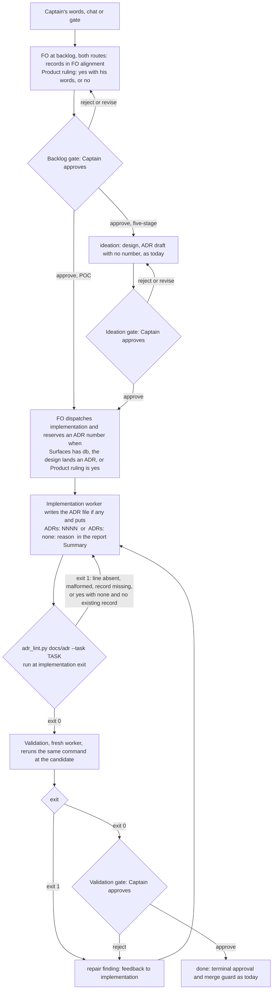

`references/sd/workflow.md` § Decision records requires an ADR for a ruling "settled at a gate, in a worker report, or mid-stage feedback" that later work must respect, and validation runs `adr_lint.py docs/adr --require <numbers>` only for the numbers the implementation report names. A ruling stated when the task is created (in FO alignment, before backlog) is not named by the trigger, and a report that names no ADR gives validation nothing to check, so a missing record passes silently.

## Scope

Relayed by the peer session dhaka-32 on 2026-10-07, quoting the Captain's approval to file it upstream 「要，交給上游修」 (not yet confirmed by the Captain in this session). Case: subspace-web dev2-poc task `subspace-tab-icon` (state branch spacedock-state/dev2-poc): the Captain's request 「目前 web 的 fav icon 是 spacedock 的，但我想要改成 spacedock-design 內的 subspace icon 請你排進去做」 (2026-10-05) reversed an earlier product choice (2026-09-24); both gates were approved and subspace-web#101 shipped with no ADR; the ADR was written afterwards as subspace-web#103.
Direction relayed as the Captain's (shape is the worker's to design): the implementation report states which ADRs it added, or `none` with a reason, and an absent statement fails validation; the FO alignment section marks whether the Captain's words set a product rule. Accepted cost (relayed): one more required line per task, POC included.
Non-goals: back-filling ADRs in adopters; changing the ADR template.

## Acceptance criteria

Package tests are `python3 -m unittest discover -s kc-dev-flow-2/scripts` from the repository root (`<fixture>` below means the synthetic task text inside `kc-dev-flow-2/scripts/test_adr_doc_checks.py`; no adopter file is copied).

**AC-1** The FO records `Product ruling: yes: 「<the Captain's words>」` or `Product ruling: no` in `## FO alignment` on both routes, and a task with no such line fails the check.
Verified by: the test that runs `adr_lint.py <adr-dir> --task <fixture>` on a `<fixture>` with the line removed and asserts exit 1 and the message `no 'Product ruling:' line`; falsified by deleting that branch of the check. Limit: the line's truth (whether his words really set a rule) is FO judgement, nothing parses meaning.

**AC-2** An implementation report with no `ADRs:` line fails validation; `ADRs: <four-digit numbers>` or `ADRs: none: <reason>` passes the statement check, and a named number with no record in the ADR directory, or `none` with no reason, fails.
Verified by: tests on `<fixture>` asserting, by message, `states no 'ADRs:' line`, `does not exist` and `needs a reason`. Baseline that fails today: `python3 <package>/scripts/adr_lint.py <empty-adr-dir>` exits 0 and `--task` exits 2 (unrecognized argument), observed 2026-10-07 at package 0.10.4; the new test fails at the base commit and passes at the candidate.

**AC-3** Under `Product ruling: yes`, `ADRs: none` fails unless its reason cites an ADR number that exists in the ADR directory and is not a Legacy record.
Verified by: a test asserting exit 1 and `Product ruling: yes` in the message for `none: trivial change`, and exit 0 for `none: held by 0003` with a valid `0003` record present; falsified by deleting the cross-check. Limit: the check proves the cited record exists, not that it holds this ruling; that stays the validator's read.

**AC-4** The replay of the case passes through the check on both routes: a POC-shaped `<fixture>` (frontmatter `profile: poc`, no ideation section, `Surfaces: ui`, FO alignment carrying words that reverse an earlier choice, a Captain amendment, an implementation report with no ADR line) and a five-stage-shaped one (ideation report added) each fail with the AC-2 message, fail with the AC-3 message once `ADRs: none: trivial` is added, and pass once a valid record and `ADRs: <number>` are present.
Verified by: those six cases in `test_adr_doc_checks.py`, each asserting the specific message and not only the exit code, since the case's own file also fails `design_surfaces.py check` for an unrelated reason (a POC `ui` task has no `UI proposal:`). Limit: a synthetic shape, not the adopter's bytes.

**AC-5** `references/sd/workflow.md` states the three rules where workers already read them and no other place: the `Product ruling:` line in the backlog FO-alignment record, the `ADRs:` line and the `--task` command in § Decision records (replacing the `--require <numbers>` sentence), and `Product ruling: yes` as a third trigger in § Number guards' applicability line. New text says nothing about the ideation stage outside the `### ideation` section.
Verified by: `python3 -m unittest kc-dev-flow-2/scripts/test_poc_readme.py` passes, including a new assertion that the derived POC README carries all three rules in the sections the POC implementation and validation stages inline; `python3 kc-dev-flow-2/scripts/poc_readme.py check <poc-readme> <derived>` on a fresh derivation exits 0.

**AC-6** Existing behavior is unchanged: every existing test in `test_adr_doc_checks.py`, `test_poc_readme.py` and `test_design_surfaces.py` passes, and `adr_lint.py <dir> --require N` without `--task` behaves as before.
Verified by: the full `unittest discover` run at the candidate; the existing `test_legacy_is_skipped_but_cannot_satisfy_a_required_record` still passes.

**AC-7** `references/sd/adoption.md` tells an adopter the order that does not break it: update the package first (the script), then re-sync the workflow README (the rule text); the README text before the script exits 2 on `--task`.
Verified by: reading the sentence at the candidate; limit: prose, no script tests the order.

## FO alignment

Release review: not needed: package process defect, no journey story.
Needed at ideation: no Captain alignment before ideation; ideation checks the change against the POC derivation (poc_readme.py) and every adopter-synced surface, and returns any change to what a POC task owes.
Surfaces: none
Visible change: none
Product ruling: yes: 「要，交給上游修」 (relayed by dhaka-32, confirmed by the Captain 2026-10-07 「核准 adr-required-statement，以 Pilot 進入設計」)

## Design

Profile Pilot: one bounded change to a package script and the workflow text adopters re-sync, real seams exercised by test, no new production obligation.

### PRFAQ

**Press release.** From the next kc-dev-flow-2 release, a task cannot reach its terminal gate with a product ruling and no record of it. The FO marks, at backlog, whether the Captain's words set a rule for the product. The implementation report must say which decision records it added or changed, or `none` with a reason. One command, run at implementation exit and again by validation, fails when the report says nothing, or when the Captain's words set a rule and the report says `none` with no existing record behind it.

**FAQ**

- *Why did the case slip through?* The Captain's words arrived at backlog, before any gate, so § Decision records ("settled at a gate, in a worker report, or mid-stage feedback") never fired. The worker then named no ADR, so validation had no number to pass to `--require` and `adr_lint.py` had nothing to check. Both halves are measured: the only check today is `adr_lint.py <dir> [--require N...]`, which exits 0 on an empty directory, and nothing reads the task file.
- *What does a POC owe now?* Two lines: the FO's `Product ruling:` and the worker's `ADRs:`. A POC owes nothing else new and still skips ideation. The POC README is derived by `poc_readme.py derive`, which removes only the ideation stage and section, so the rule text reaches POC unchanged; the POC trigger is the FO line, because there is no design to draft an ADR in.
- *What if the ruling is already recorded?* `ADRs: none: held by 0003` passes when `0003` exists and is not Legacy. A bare `none: trivial` under `yes` fails; that is the exact shape of the case.
- *What is not stopped?* A `no` the FO should have written as `yes`; a worker who cites an existing record that does not hold the ruling. Both are judgement the validator and gate reader still make; the line gives them a visible claim to disagree with.
- *Cost per task, counted not measured in tokens:* one FO line, one report line, and `adr_lint.py --task` run twice (it ran only when ADR numbers were named). No model call is added. A `yes` task also takes an ADR number reservation and an ADR file, which a ruling already owed.

### Existing-code capability check

Boundary: the path from the Captain's words at backlog to the validation gate, in `kc-dev-flow-2` at 0.10.4 (this repository's worktree matches the installed copy: `adr_lint.py` and `references/sd/workflow.md` byte-identical).
- Completeness: § Decision records plus `adr_lint.py` work end to end for a ruling a worker names (format and `--require` unit-tested in `test_adr_doc_checks.py`; wiring is prose run by the validation worker). Nothing reads the task file, so a ruling nobody names is not found.
- Need: a falsifier exists, the replayed case (subspace-web dev2-poc `subspace-tab-icon`: ruling at backlog 2026-10-05, two gates approved, merged as #101 with no ADR, ADR written afterwards as #103).
- Searches: (1) `grep -i adr` across the package's skills, references and scripts; (2) `grep -i -e 'product ruling' -e 'ADRs:' -e adr_lint` across this repository's `kc-dev-flow`, `kc-dev-flow-2` and `docs`, and `docs/dev2-poc/README.md` of the subspace-web checkout. Both found only § Decision records, `adr_lint.py`, `number_guards.py` (it already enforces that an added ADR number was reserved, R4) and their tests; no existing statement requirement. Unknowns: adopter READMEs other than this repository's and subspace-web's, and any manual consumer.
- Conclusion: repair by extending `adr_lint.py` (the ADR authority validation already runs) with `--task`. Not a new script, and not folded into `design_surfaces.py`: that checker already exits 1 on a POC `ui` task for an unrelated reason (no `UI proposal:`), which would bury the ADR failure.

### Mechanism

- FO line (backlog, next to `Surfaces:`): `Product ruling: yes: 「<his words, verbatim>」` or `Product ruling: no`. "Sets a product rule" reuses § Decision records' own definition ("a rule about the product, a constraint, or a direction later work must respect"), a reversal of an earlier choice included. FO changes it to `yes` when a later ruling sets one.
- Worker line (implementation report Summary, outside the checklist bullets): `ADRs: 0004, 0005` or `ADRs: none: <reason>`. The latest implementation report that has the line is the statement, so a repair cycle need not restate it.
- Command: `python3 <package>/scripts/adr_lint.py docs/adr --task <task file>`, in addition to the format lint it already does. It takes the named numbers as `--require`. Exit 1 names the missing `Product ruling:` line, a missing implementation report, a missing or malformed `ADRs:` line, a missing record, `none` without reason, and `yes` with `none` that cites no existing non-Legacy record.
- Number guards: add "or its FO alignment records `Product ruling: yes`" to the applicability line, so the FO reserves an ADR number for a POC, which has no design to land one. Existing `number_guards.py check` R4 then covers an unreserved ADR; it only runs when the task has a `## Number guards` section, which is why this trigger is needed.

### Surfaces touched

| Surface | Reaches adopters by | Change |
| --- | --- | --- |
| `kc-dev-flow-2/scripts/adr_lint.py`, `test_adr_doc_checks.py`, `test_poc_readme.py` | the package release | `--task`; tests; one POC-derivation assertion |
| `kc-dev-flow-2/references/sd/workflow.md` (§ backlog, § Decision records, § Number guards) | each adopter's five-stage workflow README, per-adopter three-way merge | three rules |
| each adopter's POC workflow README, derived from `workflow.md` | the same re-sync, then `poc_readme.py check` | no new text beyond the above |
| `kc-dev-flow-2/references/sd/adoption.md` | the package release | one ordering sentence |
| skills (`implementation`, `validation`, `ideation`), task template, stage frontmatter | n/a | unchanged: both worker stages already inline § Decision records and § Number guards |

Known adopter copies: this repository's `docs/dev2/README.md`, subspace-web's `docs/dev2/README.md` and `docs/dev2-poc/README.md`; others not enumerated.

### ADR this task lands (draft, no number)

Ruling: an implementation report states the ADRs it added or changed, or `none` with a reason; an absent statement fails validation; a Captain ruling recorded at backlog cannot be reported as `none` without an existing record behind it. Short title: `adr-statement-required`. Words: the Captain's gate approval of this design, copied by the implementation worker from the resolution. Options considered: the relayed direction; statement only with no FO mark (rejected: nothing then links the Captain's words to the ADR demand); the FO mark only (rejected: a worker naming nothing still passes). This task is the first dogfood: FO should record `Product ruling: yes` for it and reserve the number at implementation dispatch.

### Non-goals

Back-filling ADRs in adopters; changing the ADR template; syncing any adopter README in this PR; fixing `design_surfaces.py check` on POC `ui` tasks (observed at the replayed case's validation report, separate task); judging whether a cited ADR holds the ruling.

## Unresolved decisions for the Captain

1. Under `Product ruling: yes`, may the report say `ADRs: none`? Recommend: only when its reason cites an existing ADR number that holds the ruling, otherwise exit 1. This is stricter than the relayed 「none with a reason」, and without it the replayed case passes with `none: trivial`.
2. Per-task cost: the relayed acceptance was one more required line; the direction needs two (the FO line and the report line), plus one extra command run. Recommend: accept two lines.
3. Adopter-synced surfaces: the three-rule text reaches each adopter only by workflow-README re-sync (this repository, subspace-web five-stage and POC, others unknown) after the package release. Recommend: one separate sync PR per adopter after release, package first; none in this PR.
4. The peer relay 「要，交給上游修」 is unconfirmed in this session. Recommend: treat approving this ideation gate as that confirmation.

## Stage Report: ideation

- DONE: Design definition (PRFAQ with Mermaid) for the relayed direction: the implementation report states the ADRs it added or none with a reason, an absent statement fails validation, and FO alignment marks whether the Captain's words set a product rule; covering the five-stage and the derived POC route
  `## Design`: PRFAQ, one Mermaid flowchart (both routes, the FO line, reserve, the check at implementation exit and validation, the feedback loop, the stops), existing-code check with two searches, mechanism, surfaces table. POC owes two new lines and no ideation; `poc_readme.py derive` removes only the ideation stage and section, so the rule text reaches the POC README unchanged.
- DONE: Acceptance criteria with reproducible Verified-by clauses, including a check that fails today on a report naming no ADR and a replay of the subspace-tab-icon case as a fixture (no adopter files copied)
  `## Acceptance criteria` AC-1..AC-7. Observed today at package 0.10.4: `adr_lint.py <empty-adr-dir>` exit 0 and `adr_lint.py <dir> --task t.md` exit 2. AC-4 replays the case's shape as synthetic fixtures on both routes. `design_surfaces.py check` on this task: exit 0, "design surfaces presentable".
- DONE: Unresolved decisions for the Captain, one per line with a recommendation, including every adopter-synced surface the change touches and the per-task cost
  `## Unresolved decisions for the Captain` items 1-4; surfaces in `### Surfaces touched`; cost is two lines and one extra command run per task, counted not measured.
- DONE: AC-1 (FO marks `Product ruling:`; absent line fails)
  Not yet verified: design only; the test and message are named in the clause. Current evidence: no `Product ruling:` string exists anywhere in the package or this repository's `kc-dev-flow`, `kc-dev-flow-2`, `docs` (grep, 2026-10-07).
- DONE: AC-2 (absent `ADRs:` fails; named number must exist; `none` needs a reason)
  Baseline observed: today's command exits 0 on an empty directory and exits 2 on `--task`. Not yet verified: the new tests.
- DONE: AC-3 (`yes` with `none` fails unless it cites an existing non-Legacy ADR)
  Not yet verified: design only. Depends on decision 1.
- DONE: AC-4 (replay of the case on POC and five-stage routes)
  Not yet verified. The case file was read read-only from `origin/spacedock-state/dev2-poc` (`subspace-tab-icon.md`); its report names no ADR, its FO alignment carries no ruling mark, and its own `design_surfaces.py check` fails for an unrelated reason, so the fixture asserts messages.
- DONE: AC-5 (workflow text in three places; POC derivation carries it)
  Not yet verified. Current evidence: § Decision records sits outside `### ideation`, and `poc_readme.py` removes only the ideation stage and section, read in `derive`.
- DONE: AC-6 (existing behavior unchanged)
  Not yet verified: tests are not run on a candidate; none exists.
- DONE: AC-7 (adoption ordering sentence)
  Not yet verified: prose to be written at implementation.

### Summary

The design extends `adr_lint.py` with `--task`, adds an FO `Product ruling:` line at backlog and a worker `ADRs:` line in the implementation report, and adds `Product ruling: yes` as a third Number guards trigger so a POC (no design) still gets an ADR number reserved. The one choice beyond the relayed words is that `yes` plus `none` fails unless an existing record is cited; without it the replayed case would pass with `none: trivial`. Unrelated, not touched: `design_surfaces.py check` exits 1 on any POC task whose Surfaces include `ui`, which buried the signal in the case's validation. This task itself should be marked `Product ruling: yes` by FO, so it dogfoods its own rule.
