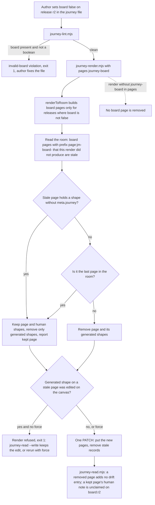

kc-journey-map renders a board page for every release and re-renders recreate or keep pages the map no longer wants; issue #541.

## Scope

Captain 2026-09-30: 「做board: false 可以」, choosing a per-release `board: false` field over a semantic `shipped: true`, after asking (via the relay journey session) 「那 r1, r1.5 是否就是已經在 main 上…我這為這兩片似乎不需要有 release board」 and 「選 1，轉給 colombo-ae 做」. This task covers issue #541.
Evidence (origin/main d3c79ba5, 2026-09-30): `journeyBoardPages` in `kc-journey-map/lib/render.mjs` maps every release to `buildJourneyBoard`, and nothing in `lib/` reads a board opt-out; on an adopter journey two shipped releases (6 of 7 stories `exists`) keep boards that repeat the story map; a board page deleted by hand is recreated by the next `--pages journey-board` render, and a page for a release removed from the YAML survives re-renders.
Non-goals: a semantic `shipped` field; deriving the opt-out from story statuses (one shipped release keeps an `unverified` story the evidence lint cannot count); the release version field (#531).

## Acceptance criteria

**AC-1**: A release with `board: false` gets no journey-board page and keeps its band on the story map.
Verified by: `render.test.mjs` builds the fixture with `board: false` on r2. `buildAllPages(model, null, ['journey-board'])` has a page record for r1 only, and `buildAllPages(model, null, ['story-map'])` deep-equals the same call on the model without the field. Falsifier: filter releases in `storymap.mjs` too, and the second assertion fails. Current evidence: not yet verified (no code yet); the seam was read at origin/main `fffe58e8`, where `journeyBoardPages` in `kc-journey-map/lib/render.mjs` maps every release and nothing reads `board`.

**AC-2**: A `board` value on a release that is present and not a boolean is a lint violation `invalid-board` naming the release; `true`, `false` and absent are clean, and `journey-lint.mjs` exits 1 on the violation.
Verified by: `lint.test.mjs` cases `board: 'false'`, `board: 0`, `board: null` each yield one violation; `true`, `false` and absent yield none. Falsifier: drop the check from `lintJourney` and the first case yields nothing. One CLI run of `node lib/journey-lint.mjs` on a `board: 'false'` file asserts exit 1 and the detail text. Current evidence: not yet verified.

**AC-3**: When every release opts out, no board page is drawn (the whole-journey board is not used as a fallback); with no `releases:` key the whole-journey board is drawn as today.
Verified by: `render.test.mjs`, two cases on `buildAllPages(..., ['journey-board'])`: all releases `board: false` gives zero page records; `releases` deleted gives the single `page:jm-board-all` page. Falsifier: fall back to `buildJourneyBoard(model)` when the filtered list is empty, and the first case fails. Current evidence: not yet verified.

**AC-4**: A `--pages journey-board` (or `story-map,journey-board`) render removes, in one PATCH, every existing `page:jm-board-*` page the render does not produce, with its generated shapes and bindings: a release that opts out, a release removed from the YAML, and the whole-journey page once releases exist.
Verified by: `canvas-smoke.sh` (already a step of `.github/workflows/kc-journey-map-tests.yml`) renders the example with story-map and journey-board, renders again from a copy with `board: false` on r2, then reads the room: no `page:jm-board-r2`, no shape whose `parentId` is it, `page:jm-board-r1` shape ids unchanged. `render.test.mjs` covers the pure selection (`staleBoardPageIds`) for the three cases. Falsifier: skip the stale-page step and the room still holds `page:jm-board-r2` (the reproduction below). Current evidence: the defect is reproduced (see "Stale-page reproduction"); the fix is not yet verified.

**AC-5**: A stale board page that holds any shape without `meta.journey` (human-drawn) is kept with those shapes; only its generated shapes and bindings are removed, even with `--force`; the CLI prints the kept page id and the count of human shapes. A page with no human shape is removed. Pages that are not `page:jm-board-*` (story map, function map, a page a person made) are never removed, and a render that does not select `journey-board` removes no board page.
Verified by: `render.test.mjs` with a current-room record set holding a stale board page plus an untagged note: the page id is not in the removal list, the untagged note is not, the tagged shapes are, and the result reports the page as kept; the same set with `page:jm-funcmap` and a person-made `page:xyz` shows both untouched; `buildAllPages` for `['story-map']` gives an empty stale-board list. Falsifier: treat every shape on a stale page as generated and the untagged note lands in the removal list. Smoke adds one hand-made note to a stale board page before the second render and asserts it and its page survive. Current evidence: not yet verified.

**AC-6**: A generated shape on a stale board page that a person edited on the canvas still stops the render (existing refusal), and `--force` overwrites it as today.
Verified by: `render.test.mjs` on `handEditedIds` fed the new removal list: an edited card on a stale page is listed. Falsifier: build the removal list after the edit check and the card is not listed. Current evidence: the existing refusal is tested for pages in the render (`handEditedIds` cases in `render.test.mjs`); stale pages not yet.

**AC-7**: Read-back on a room whose board page was removed reports nothing for that page, and on a room where the page was kept it reports the human note as `unclaimed` with page `board:<releaseId>`; `read.mjs` is not changed.
Verified by: `read.test.mjs` adds two cases on `diffAgainstModel`: shapes of a room without the r2 board give empty `questionsDeleted`, `answersDeleted`, `missing` for a model whose r2 story has a question; a room with only a human note on `page:jm-board-r2` gives one `unclaimed` entry with that page name. Current evidence: observed 2026-09-30 in a `/tmp` canvas room on unmodified code with the page removed by hand: `journey-read.mjs` printed no drift; with a human sticky left on the page it printed one `unclaimed` entry, `page: "board:r2"`. This proves the read side only, not the new removal.

**AC-8**: The render never removes the last page left in the room.
Verified by: `render.test.mjs`: a current-room record set whose only page is a stale board page yields no page id in the removal list. Falsifier: drop the guard and the page id is listed. Limit: what a tldraw sync room does with zero pages was not tested, so the guard is a precaution, not a proven need.

**AC-9**: Setting or changing `board` on a release does not fail `journey-handoff.mjs`'s "existing release changed beyond selected goal" check; changing any other field still does.
Verified by: `journey-handoff.test.mjs`: a baseline and a model that differ only by `board: false` on a non-selected release pass; a model that differs by `name` on that release still fails with the existing message. Falsifier: leave `board` out of the stripped keys and the first case fails. Current evidence: the `same(before, after)` comparison was read, not run.

**AC-10**: The field is documented where its readers look, and the decision is recorded: the lint table in `README.md`, the releases fields and the "Render is a reconcile" paragraph in `skills/kc-journey-map/references/canvas.md`, and ADR 0007 in `docs/adr/`.
Verified by: `python3 <package>/scripts/adr_lint.py docs/adr --require 0007` exits 0; `python3 <package>/scripts/doc_impact.py <base> <candidate>` lists each document and the report marks it `updated` or `unaffected: <reason>`; `number_guards.py check` exits 0 for the ADR number. Current evidence: ADR number reserved 2026-09-30 (`number_guards.py reserve --kind adr` printed `ADR: 0007`); nothing written yet.

## FO alignment

Needed at ideation: where `board: false` is read and validated (a non-boolean value), that the release keeps its story-map row, how a re-render removes an existing board page for a release that opts out or no longer exists without touching human-drawn content, and what the canvas read-back does with a removed page.
Result: the FO delegates these questions to ideation, which decides each with its source and returns any ruling that needs the Captain.
Surfaces: none
Visible change: none

## Design

### What this changes, in plain words

A release can say `board: false` in the journey file. The renderer then draws no board page for it, the story map still shows the release, and the next journey-board render also cleans up board pages that no longer belong: the one for an opted-out release, one for a release deleted from the file, and the whole-journey page once releases exist. Anything a person drew on such a page is kept.

### Stale-page reproduction (2026-09-30, origin/main `fffe58e8`, throwaway canvas server and room under `/tmp`, fixture journey with releases r1 and r2)

1. `--pages story-map,journey-board` render: pages `page:page` (23 shapes), `page:jm-board-r1` (25), `page:jm-board-r2` (15).
2. A page and its shapes deleted by hand through the doc API (`PATCH /doc` with `remove`, which the server accepted with 200), then `--pages journey-board` again: `page:jm-board-r1` is back with 25 shapes (the render recreates what a person deleted).
3. r2 removed from the file, `--pages journey-board` again: reply `removed: 0`; `page:jm-board-r2` still holds its 15 shapes. Cause: `staleRecordIds` scopes removal to pages in the render's own output, and no code path removes a `page` record (a search of `lib/` and `server/` for `typeName === 'page'` finds only the scoping line in `render.mjs` and the `page()` constructor in `records.mjs`).

### Chain check (what exists and where, origin/main `fffe58e8`)

| Piece | Where | State for this change |
| --- | --- | --- |
| Board pages per release | `journeyBoardPages`, `buildJourneyBoard`, `boardPageId` in `kc-journey-map/lib/render.mjs` | working; reads no release option, one call site to change |
| Reconcile of stale shapes | `staleRecordIds`, `handEditedIds`, `renderToRoom` in `lib/render.mjs` | working for shapes on pages this render produced (tests in `render.test.mjs`); cannot see a page the model no longer produces |
| Room writer | `PATCH /doc` in `server/canvas-server.ts` | complete: `remove` takes any record id, page records included (spike step 2 above); no change |
| Story map bands | `buildStoryMap` in `lib/storymap.mjs` | maps every entry of `model.releases`; reads no board option; no change |
| Read-back | `diffAgainstModel` in `lib/read.mjs` | finds boards from the shapes present in the room; a missing page yields no entries (spike, AC-7); no change |
| Release fields | `slice_because` read in `lib/lint.mjs`; `journey-handoff.mjs` compares releases | there is no schema file; a field's home is its reader, its lint and the docs; the handoff comparison would reject a `board` change |
| Lint | `lintSliceLimit` in `lib/lint.mjs` | the precedent for "a typo'd option would silently read as the default" |
| Progress | `kc-journey-progress` skill, `lib/journey-progress.mjs`, `lib/progress.mjs` | `--draw --pages journey-board` calls `renderToRoom`, so it inherits the new behaviour; refresh-only mode never touches the canvas; `progress.mjs` reads releases for identity only; no change |
| Other readers | `release-contract.mjs`, `releaseCoverage` | unaffected: a release keeps its contract and coverage row |

Conclusion (existing-code check, two bounded searches: the `typeName === 'page'` search above and a grep of `lib/ server/ skills/ README.md` for `.board`, `board: false` and `shipped`, which found no reader and no doc): the opt-out is missing, and the page removal is missing; both build on working pieces. Not searched: adopter journey files in other repositories (a `board` key already in use there would be read the same way, as a boolean).

### PRFAQ

**Press release.** A release that has already shipped no longer keeps a journey board that repeats the story map. The author writes `board: false` on that release, re-renders the journey board, and the tab disappears; the release is still on the story map. Boards for releases that were deleted or renamed disappear the same way, and hand-drawn notes are never thrown away with them.

**FAQ.**
- *Why a `board` field and not a `shipped` status?* Captain, 2026-09-30: 「做board: false 可以」. A release mixing an `unverified` story with `exists` ones cannot be told apart by status, so deriving it from statuses is a non-goal.
- *Where is it read and validated?* Read in `journeyBoardPages` only (`release.board !== false`); validated by a new lint `invalid-board` in `lintJourney`, like `slice_limit`. The renderer does not run the lint: a stray string `"false"` still draws the board, and the lint is what tells the author.
- *Does the release keep its story-map row?* Yes; `storymap.mjs` never reads the field (AC-1 asserts the story-map output is unchanged).
- *What if every release opts out?* No board page at all. The whole-journey page is only for journeys with no `releases:` key (AC-3).
- *What does the re-render remove, and what does it keep?* Board pages, identified by the id prefix `page:jm-board-`, that this render did not produce, together with their generated shapes (shapes with `meta.journey`). A page holding any shape without `meta.journey` is kept with those shapes and reported (AC-5). A render that does not select `journey-board` removes nothing, so the default story-map render is unchanged.
- *And a hand-edited generated card on a stale page?* The existing refusal fires (AC-6): keep the edit with `journey-read.mjs --write` or overwrite with `--force`.
- *What does read-back do with a removed page?* Nothing: it finds boards from the shapes in the room, so a removed page yields no drift entries and `read.mjs` does not change; a kept page's human note is reported `unclaimed` with page `board:<id>` (AC-7).
- *Does it stop a person from losing the last page?* The render never removes the last page in the room (AC-8).

### Flow

### Where each rule lives

| Rule | Home | Failure |
| --- | --- | --- |
| Skip a release with `board: false`; no whole-journey fallback when `releases:` is non-empty | `journeyBoardPages` in `lib/render.mjs` | AC-1, AC-3 |
| `board` must be a boolean when present | `lintReleaseBoard` (new) in `lib/lint.mjs`, added to `lintJourney` | AC-2: violation `invalid-board`, exit 1 from `journey-lint.mjs` |
| Stale board pages: prefix `page:jm-board-` not in the render's page ids, only when `journey-board` is selected | `staleBoardPageIds` (new) in `lib/render.mjs`, called from `renderToRoom` | AC-4, AC-5 |
| Ownership of a shape: `meta.journey` present means generated | existing convention (`staleRecordIds`); reused | AC-5 |
| Keep a page with human shapes; never remove the last page | `renderToRoom` filters the stale-page list before the PATCH; result gains `keptPages`, printed by `journey-render.mjs` | AC-5, AC-8 |
| Hand-edit refusal covers stale pages | the stale shape ids join `remove`, which already feeds `handEditedIds` | AC-6 |
| `board` is not a handoff change | `withoutCuts` / the release comparison in `lib/journey-handoff.mjs` ignores `board` | AC-9 |
| Field docs and decision | `README.md`, `canvas.md`, `docs/adr/0007-*.md` | AC-10 |

The ownership claims are bounded by these enforcement points: a page is the renderer's only by its `page:jm-board-` id (the canvas UI names a person-made page with a different id; not exercised in a browser), and a shape is the renderer's only by `meta.journey` (a duplicate a person makes carries the same metadata, as `read.mjs` already notes, so a duplicated generated card on a stale page is removed with it).

### Ruling on the handoff seam (AC-9)

`journey-handoff.mjs` rejects any change to a non-selected release other than the selected goal. `board` is a display option, not a requirement or a slice boundary, so the comparison should ignore it; otherwise opting a shipped release out while another release is being cut fails the handoff for no reason. This is a small interface ruling made here and open to override.

### Failure modes

| Case | Result |
| --- | --- |
| `board: "false"` (string) | board still drawn; `journey-lint.mjs` reports `invalid-board` |
| A release id renamed | old board page is stale and removed (human notes kept), new page drawn |
| Human note only on a stale page | page kept, reported; it reappears in the report on every render until the person removes the note or the page |
| Room has two pages: the story map deleted by hand and one stale board page | the board page is kept (last page) |
| Browser tab open on the removed page | not exercised: CI does not open a browser; covered by the Captain script below, and the sync layer is expected to move the client off the deleted page (unverified) |
| `journey-progress.mjs --draw <room> --pages journey-board` | same cleanup, through the shared `renderToRoom` |

### Evidence plan

Unit: `render.test.mjs` (AC-1, 3, 5, 6, 8), `lint.test.mjs` (AC-2), `read.test.mjs` (AC-7), `journey-handoff.test.mjs` (AC-9). Wiring: `scripts/canvas-smoke.sh` extended once (AC-4, AC-5): it already runs against a real server in `kc-journey-map-tests.yml`, path-filtered on `kc-journey-map/lib/**`, so no new job; added time per PR not measured. Docs (AC-10): `adr_lint.py`, `doc_impact.py`, `number_guards.py check`. Existing suite: 168 tests pass at `fffe58e8` (run 2026-09-30); it must still pass. Not covered by any check: a live browser session on a removed page; a room with zero pages.

### ADR

Needed: yes. The field name and what it means (an explicit per-release opt-out, not derived from statuses) and the ownership rule for a re-render (`page:jm-board-` pages and `meta.journey` shapes are the renderer's; human content survives) are constraints later work, including #531, must respect. Number reserved with `number_guards.py reserve --kind adr` on 2026-09-30: 0007 (base has 0001 to 0006), recorded under `## Number guards`. Title for the implementation worker: `0007-a-release-opts-out-of-its-board-with-an-explicit-field.md`; the decider's words are the Captain's 「做board: false 可以」.

### Profile and release notes

Pilot fits: one optional field and a reconcile rule in one plugin, no data, credentials or rollback duty, and no consumer-required migration; an older plugin version ignores `board` and draws the board. Commit and PR title `feat(kc-journey-map): ...`; the version bump is release-please's, not this PR's.

### Needs the Captain

One decision. When a stale board page holds hand-drawn notes, the render keeps the page and the notes, removes only its generated cards, and prints the kept page (also with `--force`). Recommendation: keep, because the stated rule is not to touch human-drawn content. What gets worse: an opted-out release can leave a near-empty tab until the person deletes the note or the page. Alternatives: refuse the whole render until the notes are moved (blocks unrelated pages), or delete everything under `--force` (loses notes). Everything else is ruled in this design (field shape, lint, handoff, ADR).

### Captain acceptance script (after delivery; `KJM` is a checkout of the merged code, Node 22.13 or later, one run of `npm ci` in `$KJM/kc-journey-map`)

1. `cd $KJM/kc-journey-map && export JOURNEY_API=http://127.0.0.1:5871 && (JOURNEY_API_PORT=5871 JOURNEY_ROOMS_DIR=/tmp/kjm-accept npx tsx server/canvas-server.ts &) && cp skills/kc-journey-map/references/journey.example.yaml /tmp/kjm-accept.yaml` (a separate port and rooms directory, so a running canvas is not touched).
2. `node lib/journey-render.mjs /tmp/kjm-accept.yaml accept --pages story-map,journey-board`, then list the pages: `curl -s "$JOURNEY_API/doc?room=accept" | node -e 'let s="";process.stdin.on("data",d=>s+=d).on("end",()=>console.log(JSON.parse(s).snapshot.documents.map(d=>d.state).filter(r=>r.typeName==="page").map(r=>r.id).join("\n")))'`. Expect `page:page`, `page:jm-board-r1`, `page:jm-board-r2`.
3. `sed -i '' 's/{id: r2,/{id: r2, board: false,/' /tmp/kjm-accept.yaml`, then `node lib/journey-render.mjs /tmp/kjm-accept.yaml accept --pages journey-board` and the page list again. Expect `page:jm-board-r2` gone, `page:jm-board-r1` and `page:page` still there, and the render output naming the removal.
4. `node lib/journey-render.mjs /tmp/kjm-accept.yaml accept --pages story-map` then the page list. Expect the same two ids as after step 3, and r2's band still on the story-map page when you open the room in the canvas.
5. `sed -i '' 's/board: false/board: "false"/' /tmp/kjm-accept.yaml && node lib/journey-lint.mjs /tmp/kjm-accept.yaml; echo exit=$?`. Expect a line `invalid-board` naming r2 and `exit=1`.
6. Optional, needs a browser: `npm run canvas` on free default ports, render the file into room `accept`, open the room, delete nothing by hand, set `board: false`, re-render, and watch that the RELEASE 2 tab disappears without an error on screen.
7. Cleanup: kill the server started in step 1 by its captured PID, `rm -rf /tmp/kjm-accept /tmp/kjm-accept.yaml`.

Does not cover: a room with zero pages, a person-made page named like a board page, adopter journeys, exact wording of the removal message (fixed at implementation; validation rewrites this script against the shipped text).

### Cost

No new CI job and no new dependency. One extension of an existing smoke script; minutes per PR not measured.

## Number guards

ADR: 0007

## Stage Report: ideation

- DONE: Design the kc-journey-map change for issue #541 with `board: false`: where it is read and validated, that the release keeps its story-map row, how a `--pages journey-board` re-render removes a board page for a release that opts out or no longer exists without touching human-drawn content, and what the canvas read-back does with a removed page. Reproduce the stale-page behaviour first.
  `## Design` (Stale-page reproduction, PRFAQ, Flow, Where each rule lives): read in `journeyBoardPages`, linted by new `invalid-board`; reproduced in a `/tmp` room, both cases (`removed: 0`, `page:jm-board-r2` keeps 15 shapes); read-back observed empty for a removed page and `unclaimed` for a kept one.
- DONE: Check the chain first (render, read, lint, schema, room/canvas writer, kc-journey-progress) and report what exists and where.
  `### Chain check` table at origin/main `fffe58e8`: no code path removes a page record and no reader of `board` exists (two bounded searches); `PATCH /doc` already accepts page ids in `remove`; `kc-journey-progress --draw` inherits through `renderToRoom`.
- DONE: ACs with evidence plans
  `## Acceptance criteria` AC-1 to AC-10, each with a `Verified by:` clause and its current evidence; only the reproduction (AC-4) and the read-side spike (AC-7) are observed, the rest are honestly not yet verified.
- DONE: ADR need, numbered by number_guards.py reserve
  Needed; `number_guards.py reserve --kind adr` printed `ADR: 0007`, recorded under `## Number guards`.
- DONE: What needs the Captain
  `### Needs the Captain`: one decision, keep a stale page that holds hand-drawn notes (recommended) versus refuse or delete under `--force`; the handoff ruling (AC-9) is made in the design and open to override.
- DONE: The Captain-run minimal acceptance script
  `### Captain acceptance script`: seven steps on a separate port and rooms directory with expected page ids and the lint exit code; states what it does not cover.
- DONE: `design_surfaces.py check` passes
  Output: `board-optout.md: design surfaces presentable` (exit 0). The Mermaid flow was compared with the prose by hand and not rendered, so syntax is unverified.

### Summary

The change is one optional release field read in `journeyBoardPages`, one lint, and a stale-board-page step in `renderToRoom` that removes pages with the `page:jm-board-` prefix the render did not produce, keeping any page that holds a human-drawn shape and never the last page. Read-back needs no change. One Captain decision remains (keep a page with hand-drawn notes); ADR 0007 is reserved. Spikes ran under `/tmp` only and are cleaned up.
