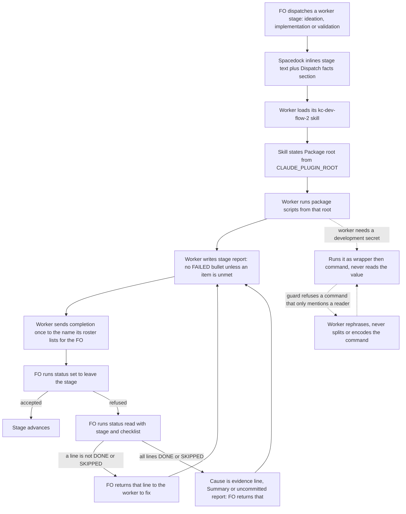

Four dispatch and report defects from qnow dogfooding (2026-09-28..30) that cost retries or leaked secrets.

## Scope

Captain 2026-09-30, approving the FO's batching of the dev2 fixes: 「可以」 — batch A (guardrails) first. This task covers issues #526, #527, #528 and #530.
Evidence (qnow): every worker reported "team-lead was unreachable, sent to main"; a report line "- FAILED: none." blocked `spacedock status --set`; one worker searched the whole filesystem for comment_ratio.py for about three hours; two workers printed the Clerk development secret key despite dispatch-note bans, and a user-level PreToolUse(Bash) guard (block Netlify environment and database API reads, 1Password value reads and reveals, Keychain password reads) has held since.
Non-goals (ideation, 2026-09-30): any change to Spacedock (its dispatch builder, ensign contract or report parser; those are spacedock-dev/spacedock #523, #608 and #625); a secret-guard hook shipped in the package; better regex precision in the Captain's user-level guard; a script or lint that checks stage reports; Codex or Pi behavior beyond the stated limits; edits to any adopter repository; migration and ADR numbering (sibling task `migration-and-number-guards`).

## Acceptance criteria

**AC-1** (#528): A worker that loads a kc-dev-flow-2 skill is told the absolute package root by that skill, and no skill or reference names a package script in a way that leaves the root open.
Verified by: (a) `lint-skills.py` and `test_lint_skills.py`: on a copy of the tree, a bare `comment_ratio.py`, a `/absolute/plugin/scripts/` path, a `{package}` placeholder, and a skill folder that uses `<package>` while its `SKILL.md` lacks a `Package root:` line each exit 1 naming the file; the unmodified tree exits 0. Falsifier: remove the `Package root:` line from `skills/implementation/SKILL.md` and the third case flips. (b) Probe run at validation: `claude -p --plugin-dir <checkout>/kc-dev-flow-2` invoking `kc-dev-flow-2:implementation` prints a `Package root:` value that is an absolute path in which `scripts/comment_ratio.py` exists (the ideation probe showed `${CLAUDE_PLUGIN_ROOT}` expands in a skill body on Claude Code 2.1.284, including inside a dispatched subagent). Limit: Codex expansion is not probed; the skill's fallback sentence says the root is two directories above its own `SKILL.md`.

**AC-2**: The three worker stages receive the same `## Dispatch facts` section through Spacedock, so no FO has to retype it.
Verified by: `test_sd_dispatch.py --sd-plugin-root <active Spacedock root>` asserts `dispatch show-stage-def --stage ideation|implementation|validation` each print `## Dispatch facts` with its `Signal:`, `Package:` and `Secrets:` bullets, and that `dispatch build` for implementation writes a dispatch file containing them. Falsifier: drop `Dispatch facts` from the ideation entry's `context-sections` and the ideation assertion fails. Limit: proves transport, not that a worker obeys.

**AC-3** (#526): The section names the recipient the runtime lists for the first officer instead of `team-lead`, and a worker sends the completion message once.
Verified by: the behavior run in AC-6 (its transcript shows the first completion `SendMessage` addressed to `main` and accepted). Limit: bounded to Claude Code dispatch; Codex and Pi completion blocks do not use `SendMessage`. The line is a workaround for Spacedock #523/#608 and is deleted when they land; Spacedock's own FO reference still says workers should not send completion to `main`, so a session that follows that sentence over this section will still see the old fallback.

**AC-4** (#527): The report rule is in every stage skill, and the FO's recovery step names the offending line.
Verified by: `test_sd_dispatch.py` writes a task whose committed stage report ends `- FAILED: none.` with an evidence line and asserts `status --set` exits non-zero with "durable, complete", then that `status --read <task> --stage <stage> --checklist` prints `status=FAILED` and `text=none.`; the same report without that bullet asserts `--set` exits 0 (both reproduced by hand at ideation on Spacedock 0.27.2). Falsifier: if Spacedock starts accepting `FAILED: none` (issue #625), the first assertion flips and the rule and test are deleted. Limit: the refusal message itself cannot name the line (Spacedock reports one boolean); a worker's compliance with the sentence is measured only by AC-6 (one run) and by later dispatches.

**AC-5** (#530): Dispatches name one run-time secret wrapper; the package documents the guard contract and ships no hook.
Verified by: `show-stage-def` for implementation and validation prints a `Secrets:` bullet naming the wrapper (AC-2 test); `references/sd/adoption.md` gains a "Secret reads" section stating the contract (a PreToolUse Bash hook that exits 2 and whose message names the wrapper; adopter-owned patterns; the rephrase rule; Codex has no equivalent hook) with no machine-local path; the package tree still has no `hooks/` PreToolUse entry (`git diff --stat` at validation lists none). The ideation probe showed a plugin PreToolUse hook fires in an unrelated project's cwd, which is why shipping is rejected. Limit: enforcement stays in the adopter or user settings; the package cannot verify an adopter installed one.

**AC-6**: One real worker, dispatched from a scratch workflow that carries the candidate `workflow.md`, avoids the three observed failures.
Verified by: at validation, a scratch workflow (`/tmp`, not the repository) built from the candidate; FO builds one implementation dispatch for a trivial task (write one file, run `<package>/scripts/comment_ratio.py` on a two-commit scratch repo, report) and spawns one ensign on it. Pass: its transcript has no failed `SendMessage`, no `find`/`mdfind`/`ls -R` search for a script, its report has no `FAILED:` bullet and `status --set` accepts it. Fail on any one. Limit: N=1; qnow's rate for the signal failure was every worker, so one clean run is informative for it and only weakly informative for `FAILED: none`, which qnow saw once.

## FO alignment

Needed at ideation: the name the runtime actually exposes for the dispatching FO; how every dispatch carries the absolute scripts directory of the installed package version; the report-template rule that FAILED marks only an unmet item; and whether kc-dev-flow-2 ships the secret guard for adopters or documents it, plus how dispatches name one run-time secret wrapper.
Result: the FO delegates these questions to ideation, which decides each with its source and returns any ruling that needs the Captain.
Surfaces: none
Visible change: none

## Design

**Ruling.** Move the four sentences that FOs now retype by hand into the package, each in the place that reaches the worker without the FO's help: package facts in the stage skills (`Package root:` line, the FAILED rule), and runtime and adopter facts in one new workflow section, `## Dispatch facts`, that Spacedock inlines into every worker stage through `context-sections` (the completion recipient, the meaning of `<package>`, the secret wrapper). The package ships no secret-guard hook; it documents the contract for adopters. One Captain ruling is asked (Unresolved decisions 1); the design ships with the recommendation.

### What this changes, in plain words

Today each First Officer (FO, the workflow orchestrator) has to remember four things when it dispatches a worker: who to signal, where the package scripts are, not to write "FAILED: none", and how not to leak a key. Every qnow worker that missed one of them lost time or leaked a secret. After this change the worker is told all four by the package itself. The path to the scripts comes from the skill the worker loads anyway, so it always matches the version that worker runs; the other three come from one short section every worker stage receives.

### Evidence read 2026-09-30

- **Recipient (#526).** This session's roster lists the addressable agents as `main` and a sibling worker; Spacedock's builder writes `SendMessage(to="team-lead", ...)` (`completionSignalBlock` in `internal/dispatch/build.go`, "pinned to the single name team-lead"), while its own `claude-fo-dispatch.md` says workers reach the lead with `SendMessage(to="main")`. Spacedock issues #523 and #608 (open, no comments) describe the same failure as "harmless, but every worker spends turns discovering it".
- **Scripts (#528).** Three installs of this package exist on this machine: `cache/kc-claude-plugins/kc-dev-flow-2/0.9.0` (the enabled one), `~/.claude/plugins/local/kc-dev-flow-2` (byte-identical today, the path this dispatch named) and `cache/local/kc-dev-flow-2/0.1.0` (disabled, old). Stage text writes `<package>/scripts/...`, `{package}/...` and `/absolute/plugin/scripts/...` and defines none of them.
- **Report (#527).** Reproduced on Spacedock 0.27.2 in a scratch workflow: a committed report ending `- FAILED: none.` makes `status --set` print only "cannot change status away from entered stage ... until a durable, complete ## Stage Report ... is committed", because `hasCompleteStageReport` returns one boolean over five conditions (missing report, no items, an item not DONE/SKIPPED, an item with no evidence line, no Summary) plus uncommitted state. `status --read <task> --stage <stage> --checklist` does name it: `status=FAILED start=13 end=14 text=none.`. Removing the bullet and committing lets `--set` pass.
- **Guard (#530).** `~/.claude/hooks/block-secret-reads.py` is 7 regex rules over the whole command text, exit 2 with a message naming `scripts/with-dev-secrets.sh`. Its false positive happened in this session: my own read-only Bash call was refused in full because its text contained a guarded tool name as test data, and nothing in it ran. A plugin `hooks/hooks.json` PreToolUse hook fired in an unrelated project's cwd under `claude -p --plugin-dir` (probe, this session).

### Chain check (what already exists)

| Layer | Found | Consequence |
| --- | --- | --- |
| Spacedock 0.27.2 | `context-sections` inlines named README sections into `dispatch show-stage-def` (probe: a `Dispatch facts` line printed under the implementation stage). `--scope-notes-file` carries FO text. `status --read --checklist` names report lines. No knob for the completion recipient; the parser and refusal are upstream (#523, #608, #625). | Use the first three; do not build around the last. |
| Claude Code 2.1.284 | `${CLAUDE_PLUGIN_ROOT}` and `${CLAUDE_SKILL_DIR}` expand in a skill body (probe with a throwaway plugin; also seen in an installed skill inside this subagent). They do not expand in files read with `Read`. | The root line goes in each `SKILL.md`; linked files keep `<package>` bound by it. |
| kc-dev-flow-2 0.9.0 (`b753d344`) | No package-root binding; the report sentence in the three stage skills gives the form but not the FAILED rule; no secret text. `lint-skills.py` has `--root` and mutation tests in `test_lint_skills.py`. | Extend those two files; no new script. |
| Adopters | qnow owns the wrapper (`scripts/with-dev-secrets.sh`, its ADR 0027) and the user-level guard. carlove and subspace-relay: not searched for a guard; not needed for a package that ships none. | The wrapper is an adopter value. |

### PRFAQ

**Press release.** kc-dev-flow-2 workers now start knowing where the package scripts are, who to signal, what a stage report may not contain and how to reach a secret. A worker that implements a task runs `comment_ratio.py` from the exact install it loaded its skills from, sends one completion message that arrives, and writes a report Spacedock accepts on the first `status --set`.

**FAQ.**
- *Why not have the FO type the scripts path into every dispatch, as issue #528 suggests?* A path the FO types can name a different install than the worker loaded (three exist here) and depends on the FO remembering; the skill's own root cannot disagree with the skill. On disagreement the worker follows the skill's root. The FO still types what only it knows, and this design needs nothing typed.
- *Why put the recipient in a section rather than a skill sentence?* It is a fact about the runtime, not about the package, and it must vanish when Spacedock fixes #523/#608; one section is one deletion. It reaches the worker at the top of its stage text, before the completion block.
- *Why not fix `FAILED: none` in the parser?* That is Spacedock's (#625 asks for it). The package rule costs one sentence and the test flips if Spacedock changes, telling us to delete the sentence.
- *Why not ship the guard?* A plugin hook fires in every session where the plugin is enabled, in repositories with no dev2 adoption, on machines that already carry the Captain's own copy (it would fire twice). Its patterns are stack-specific (Netlify, 1Password, Keychain), and a package-wide default would refuse text such as a commit message that mentions a guarded tool. Codex has no PreToolUse equivalent, so a hook is Claude-only anyway. What the package can own is the contract and the positive path: name one wrapper.
- *Does a worker really obey a bare sentence?* Not always: qnow had two leaks despite dispatch bans. That is why secrets rest on a hook plus a positive route, and why the FAILED and signal rules are graded by a real run (AC-6), not by text.

### Flow

### Where each rule lives

| Rule | Home | Enforcement point |
| --- | --- | --- |
| `Package root:` line, and "`<package>` in this skill and its linked files is this root; if the value above is not an absolute path it is two directories above this `SKILL.md`" | `skills/{ideation,implementation,validation,dev,learn,evaluate-learning}/SKILL.md` | `lint-skills.py` exit 1 (AC-1); reaches adopters with the package version |
| No bare script name, no `/absolute/plugin`, no `{package}` in `skills/**` and `references/**`; every script is `<package>/scripts/NAME.py` (or a `../../scripts/` link, or maintainer `kc-dev-flow-2/scripts/`) | same tree, `learn`, `evaluate-learning`, `dev` and `references/sd/adoption.md` rewritten to `<package>` | same lint |
| FAILED marks an item actually not met; a report with nothing failed has no FAILED bullet; never write a summary line as a bullet | one sentence in the report-form paragraph of the three stage skills | text plus AC-4 and AC-6 evidence; upstream #625 is the durable fix |
| FO recovery: on a refused `status --set`, run `status --read <task> --stage <stage> --checklist`, return the offending line to the worker, do not edit the report; FO resolves `<package>` from the `Package root:` of `kc-dev-flow-2:dev` | `references/sd/workflow.md` Stages preamble (FO reads the whole README) | FO instruction; AC-4 test proves the command names the line |
| `## Dispatch facts` (Signal, Package, Secrets) | `references/sd/workflow.md`, added to `context-sections` of ideation, implementation and validation; `Secrets:` holds a `<wrapper>` value adoption resolves (qnow: `scripts/with-dev-secrets.sh`; none: "this project declares no wrapper; run no command that reads a secret value") | AC-2 test; adopters receive it by refit or three-way merge |
| Secret guard contract, no shipped hook | `references/sd/adoption.md` "Secret reads", about 12 lines | ADR 0003 records the boundary; not mechanically enforced |

Section text (final wording fixed at implementation, same meaning):
- `Signal:` send the completion message once, to the first officer by the name your session lists as addressable (`main` under Claude Code dispatch). The completion block's `team-lead` is Spacedock's default and is not registered there (spacedock-dev/spacedock #523, #608); do not try it first and do not describe a fallback in the report.
- `Package:` `<package>` in stage text is the `Package root:` line of the skill you loaded. Run package scripts only from it; never search the filesystem, `/tmp` or another install for them.
- `Secrets:` `<wrapper>` is the only route to a development secret: run a command that needs one as `<wrapper> <command>`. Never read or print a value. If a guard refuses a command that only mentions a secret-reading tool, rephrase it; do not split, encode or wrap the command to pass the guard.

### Failure modes

| Event | Result | Where it shows |
| --- | --- | --- |
| Skill loaded from a host that does not expand the root | Line shows a non-absolute value; fallback sentence gives the rule | Worker follows the sentence; Codex not probed (limit) |
| Worker ignores the recipient line and tries `team-lead` first | One failed call, as today; completion still arrives by task notification | Transcript; Spacedock #523/#608 own it |
| Worker writes `- FAILED: none` anyway | `--set` refused; FO's checklist command names the line | FO recovery step |
| Adopter has not resolved `<wrapper>` | Dispatch shows the literal placeholder | Adoption reference tells the adopter to resolve template values; a dispatch showing it is visible to the Captain at the gate |
| Guard blocks a command that only mentions a reader | Worker rephrases; cost one retry | Stated in `Secrets:`; message wording is the adopter's |
| Worker circumvents the guard by splitting or encoding | Not prevented by the package | Known limit; the sentence forbids it, nothing detects it |
| Adopter or user installs no guard | Bans alone, which failed twice at qnow | Known limit; ADR 0003 |
| Spacedock later fixes #523, #608 or #625 | AC-4's first assertion flips or the section line becomes redundant | Delete the rule; the test says so |

"Workers can always find the package scripts" holds only for workers that load a stage skill on a host that expands the root, or that follow the fallback sentence; the enforcement point is `lint-skills.py` for the text and AC-1(b) for the expansion.

### Evidence plan

Done at ideation, on real tools: the report refusal and its `--checklist` diagnosis (scratch workflow, Spacedock 0.27.2); the `context-sections` transport (scratch workflow); `${CLAUDE_PLUGIN_ROOT}` and `${CLAUDE_SKILL_DIR}` expansion (throwaway plugin under `claude -p`); a plugin PreToolUse hook firing outside its project (same recipe); the guard false positive (this session). Not done: any candidate edit, lint mutation, Codex expansion, and the AC-6 run; those are validation's.

### ADR

Needed: yes. Ruling: secret-read enforcement is adopter- or user-owned; the package documents the contract, ships no hook, and dispatches name one run-time wrapper; facts only the package knows are stated by its skills, facts about the runtime and the adopter by one inlined section. It is a boundary later work must respect (someone will otherwise propose a shipped hook again), settled by this task's design, so `references/sd/workflow.md` § Decision records requires it before terminal approval, written by the implementation worker. Number: the dispatch says 0003 (migration-and-number-guards takes 0002); the implementation worker asserts nothing beyond what `reserve` gives once that task lands. The decider's words come from the Captain's ideation-gate reply.

### Unresolved decisions

1. **Captain (recommended default in place): document the secret guard, do not ship it.** Shipping means a `hooks/hooks.json` PreToolUse entry in the package: it protects adopters who did nothing, and it works only on Claude Code. Costs: it fires wherever the plugin is enabled, including non-dev2 repositories, and doubles the Captain's user-level guard here; stack-specific patterns would need per-adopter configuration the hook mechanism does not offer; a false positive refuses ordinary text in every project. Under the recommendation, an adopter who never reads `adoption.md` stays unprotected.
2. **Captain, only if wanted (outward-facing, not done).** A comment on spacedock-dev/spacedock #608 and #625 with the qnow counts and the two symbols (`completionSignalBlock`, `hasCompleteStageReport`), so the workarounds here can be deleted. Nothing in this design waits on it.
3. **Note, no decision.** `context-sections` edits touch the same frontmatter lines as the sibling task's (`Number guards`); whichever merges second rebases trivially. Adding `Dispatch facts` to the ideation entry also puts a line inside the block `poc_readme.py derive` removes, so the POC README needs no change.

### Captain acceptance script (after delivery; `PKG` is a checkout of the merged package, run from any directory)

1. `python3 $PKG/kc-dev-flow-2/scripts/lint-skills.py; echo exit=$?` expect `PASS` and `exit=0`.
2. `cp -R $PKG/kc-dev-flow-2 /tmp/acc-kdf2 && printf '\nRun python3 comment_ratio.py a b\n' >> /tmp/acc-kdf2/skills/implementation/principles.md && python3 $PKG/kc-dev-flow-2/scripts/lint-skills.py --root /tmp/acc-kdf2; echo exit=$?` expect a `FAIL:` line naming `principles.md` and `exit=1`.
3. `mkdir /tmp/acc-plug && cp -R $PKG/kc-dev-flow-2 /tmp/acc-plug/ && cd /tmp && claude -p --model haiku --plugin-dir /tmp/acc-plug/kc-dev-flow-2 --allowedTools Skill "Invoke the skill kc-dev-flow-2:implementation and print only its Package root line" < /dev/null` expect an absolute path under `/tmp/acc-plug/kc-dev-flow-2`; then `ls` that path plus `/scripts/comment_ratio.py` shows the file.
4. `python3 $PKG/kc-dev-flow-2/scripts/test_sd_dispatch.py --sd-plugin-root <active Spacedock plugin root>; echo exit=$?` expect `exit=0` (covers the three `show-stage-def` prints and the `FAILED: none` refusal).
5. Read the AC-6 receipt in the validation report: one scratch-workflow worker, its transcript excerpts for the first `SendMessage`, the script invocation and the report tail.

Does not cover: Codex, a real qnow dispatch, a real secret read, whether any adopter installs a guard. Exact strings are fixed at implementation; validation rewrites this script against the shipped text.

### Cost

No new script, no new CI step: `lint-skills.py`, `test_lint_skills.py` and `test_sd_dispatch.py` already run in `.github/workflows/kc-dev-flow-2-tests.yml`. CI minutes per PR: not measured. The AC-6 run is one Sonnet ensign on a trivial task: tokens not measured. Adopter cost: one refit or merge of `workflow.md` for the section and the FO paragraph.

## Stage Report: ideation

- DONE: Design, in the task file, the kc-dev-flow-2 package change for issues #526, #527, #528 and #530 — (1) dispatches address the dispatching FO by the name the runtime actually exposes
  `## Design` Ruling and `## Dispatch facts` Signal bullet: workers send once to the roster name (`main`); this session's roster lists `main`; builder pin is `completionSignalBlock`, upstream #523/#608 own the real fix.
- DONE: (2) every dispatch carries the absolute scripts directory of the installed package version and no stage definition names a script by bare name
  Root comes from each skill's `Package root:` line (`${CLAUDE_PLUGIN_ROOT}` expansion probed in a throwaway plugin and inside this subagent), not FO text; three installs found on this machine; lint rule AC-1 rejects bare names, `/absolute/plugin`, `{package}`.
- DONE: (3) the stage-report template rule that FAILED marks only an unmet item and never a summary line such as "FAILED: none", and whether the refusal can name the line
  Rule goes in the three stage skills; refusal cannot name the line (`hasCompleteStageReport` is one boolean, upstream #625) but `status --read --stage --checklist` does, reproduced by hand on Spacedock 0.27.2; FO recovery step and AC-4 test defined.
- DONE: (4) whether kc-dev-flow-2 ships a PreToolUse secret guard for adopters or documents it, and how dispatches name one run-time secret wrapper instead of listing forbidden commands, noting the guard's false positives
  Recommend document, not ship (plugin PreToolUse hook fires in unrelated projects, probed); `Secrets:` bullet names one `<wrapper>`; the guard's false positive reproduced live when this session's own read-only command was refused; Captain ruling 1.
- DONE: Check the chain first (spacedock's dispatch builder and ensign skill, kc-dev-flow-2, adopters) and report what exists
  Chain-check table: Spacedock builder/ensign/parser read at 0.27.0 cache with issues #523, #608, #625 open; `context-sections` transport probed; kc-dev-flow-2 0.9.0 and qnow read; carlove and subspace-relay not searched, stated.
- DONE: ACs with evidence plans
  AC-1..AC-6 each carry `Verified by:` with a falsifier and a limit; only the ideation-time probes are run, no candidate exists yet.
- DONE: Whether an ADR is needed (it would take 0003)
  Yes: secret enforcement is adopter-owned and the package ships no hook; number stated as 0003 per the dispatch, subject to the FO's reservation.
- DONE: The Captain-run minimal acceptance script
  Five steps in Design with expected exit codes and stated non-coverage; strings are rewritten by validation against shipped text.
- DONE: `design_surfaces.py check` passes and the Mermaid flow renders
  Output: `dispatch-and-report-hygiene.md: design surfaces presentable`; flow rendered to SVG with mermaid-cli (syntax only).

### Summary

The design moves the hand-typed dispatch facts into the package: a `Package root:` line in the stage skills (so scripts always come from the loaded install), the FAILED rule in the three stage skills, and one `## Dispatch facts` section inlined into every worker stage for the recipient, `<package>` meaning and the secret wrapper, plus an FO recovery step using `status --read --checklist`. One Captain ruling is asked: document the secret guard rather than ship it. Not verified yet: any candidate edit, Codex expansion, and the AC-6 real-worker run. The completion block said `team-lead`; I signal `main` as the FO instructed.
