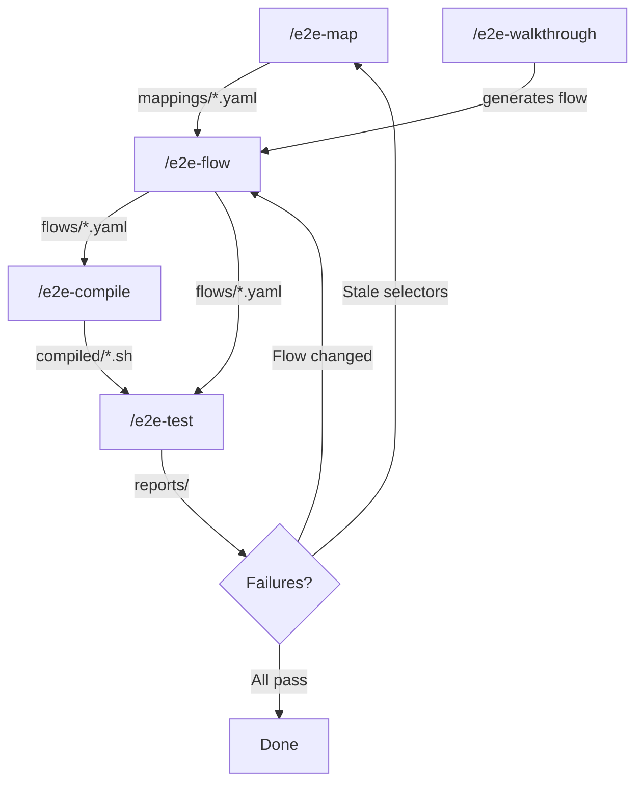

# Architecture

## The Closed-Loop Pipeline

This plugin forms a self-healing cycle: **Map -> Test -> Analyze -> Repair -> Re-test**.



Every step feeds back into the next. A walkthrough auto-generates a reusable flow. A failing test tells you whether to update the mapping or the flow. No manual glue needed.

> **CLI-only flows (no browser app) start directly at `/e2e-flow` -- no mapping required.**
> When no mapping exists and the source material contains CLI/API signals, the skill
> auto-detects CLI intent and generates a flow using only `Execute external` /
> `Verify external` steps. Terminal output is recorded via `asciinema` instead of
> browser screenshots. See [Cross-Boundary Testing: CLI-Only Flows](cross-boundary-testing.md#cli-only-flows-no-mapping-required).

## Skill -> Agent Architecture

Skills run in main context as thin orchestrators. Heavy browser work is delegated to subagents:

| Skill | Agent(s) | Role |
|-------|----------|------|
| `e2e-map` | `e2e-mapper` | Explore pages, extract selectors |
| `e2e-test` | `e2e-test-runner` + `e2e-trace-analyzer` + `e2e-media-processor` | Execute flow steps, collect results, analyze trace, generate media |
| `e2e-walkthrough` | `e2e-trace-analyzer` + `e2e-media-processor` | Interactive exploration, trace analysis, media generation |
| `e2e-flow` | `e2e-flow-writer` + `e2e-flow-verifier` + `e2e-trace-analyzer` + `e2e-media-processor` | Generate flows from plans/specs, verify in browser, generate media |
| `e2e-debug` | `e2e-debug-observe` | Inject console.log probes, observe in browser, diagnose data flow bugs |
| `e2e-compile` | *(none)* | Node.js compiler, runs locally |
| `e2e-skill-ops` | *(none)* | Meta-skill for pipeline maintenance |
| `e2e-dispatch` | *(none)* | Router to the right skill |
| `e2e-help` | *(none)* | Interactive help, topic guide, feedback collection |
| `e2e-doc-sync` | `doc-probe` | Unified doc sync: diff-aware scan + history enrichment (journal + memory) + write + live behavioral probe verification |
| `ui-verify` | *(none)* | Static UI computed-style checks via deterministic Node runner (`skills/ui-verify/bin/run.js`); no subagent dispatch |

**`e2e-doc-sync` details**: This skill runs a 6-phase pipeline: diff-aware static scan (git diff + inventory sources vs docs), history enrichment (search journal + memory for usage patterns), doc write/update, live probe verification (dispatches `doc-probe` agent to execute CLI probes against behavioral claims), self-update of its reference config, and knowledge loop reporting.

**`doc-probe` agent**: A mechanical accuracy verifier. Receives a list of behavioral claims extracted from documentation, executes each as a CLI probe, compares output against expected signals, and returns a structured pass/fail report. Safety-gated (rejects destructive commands). Uses Sonnet model for cost efficiency.

This keeps browser screenshots, accessibility trees, and trace data out of the main conversation context.

## File Structure

```
.claude/e2e/
|- mappings/          # UI element mappings (YAML)
|   |- my-app.yaml
|   +-- my-admin.yaml
|- flows/             # Test flow definitions (YAML)
|   +-- login-flow.yaml
|- compiled/          # Compiled bash scripts (generated by /e2e-compile)
|   +-- login-flow.sh
|- suites/            # Test suite definitions (YAML) -- see docs/suites.md
|   +-- smoke.yaml
|- coverage/          # Coverage reports (generated by --coverage)
|   |- coverage.json
|   +-- coverage-history.json
|- metrics/           # Per-run metrics (generated by --metrics-output)
|   +-- login-flow-20260315T120000Z.json
|- debug/             # Runtime debug data (generated by /e2e-debug)
|   |- manifest.yaml
|   |- report.md
|   +-- history/
+-- quarantine.json    # Quarantine state (managed by e2e-quarantine.js)
```

## Multi-Site Testing

The pipeline supports testing across multiple web applications with automatic session isolation.

### Approaches

| Approach | Use case | Command |
|----------|----------|---------|
| **Cross-site flow** | Flow steps alternate between apps (A -> B -> A) | `/e2e-test <flow> --site <alias>` or `--all-sites` |
| **Suite** | Curated set of flows with per-flow site assignment | `/e2e-test --suite <name>` |
| **Auto-discover** | Run all applicable flows on all mapped sites | `/e2e-test --all-sites` |

### Cross-Site Flow Format

Flows use `sites:` instead of `mapping:`. Every step requires `site:`:

```yaml
sites:
  admin:
    mapping: admin-panel
  portal:
    mapping: customer-portal

steps:
  - id: admin-create-user
    site: admin
    action: Click create_user_button on users-page
  - id: portal-verify-login
    site: portal
    action: Navigate to /login
```

### Session Isolation

When running multi-site tests (`--all-sites` or `--suite`), each site gets its own browser session via `--session <app>`. Cookies, localStorage, and auth state are isolated per site.

### Suite Orchestration

Suites (`.claude/e2e/suites/<name>.yaml`) define flow + site assignments:

```yaml
name: smoke
runs:
  - flow: smoke-navigation
    sites: [admin-panel, customer-portal]
  - flow: admin-creates-customer-verifies  # cross-site, uses flow's own sites:
```

### Detailed Guides

- [Multi-Site Testing](multi-site-testing.md) -- cross-site flows, `--site`, `--all-sites`, session isolation
- [Test Suites](suites.md) -- suite format, site assignment, CI patterns

## Plugin File Structure

```
e2e-pipeline/
|- .claude-plugin/plugin.json   # Claude Code plugin manifest
|- .codex-plugin/plugin.json    # Codex platform plugin manifest
|- skills/
|   |- e2e-dispatch/            # Router (auth gate + skill selection)
|   |- e2e-map/                 # Mapping orchestrator -> e2e-mapper agent
|   |- e2e-test/                # Test orchestrator -> e2e-test-runner + trace-analyzer
|   |- e2e-walkthrough/         # Interactive exploration (main context)
|   |- e2e-flow/                # Generate & verify flows from plans/specs/PRs
|   |- e2e-compile/             # Compile flow YAML -> bash scripts
|   |- e2e-skill-ops/           # Meta-skill for pipeline maintenance
|   |- e2e-help/                # Interactive help guide, topic deep-dive, feedback
|   |- e2e-doc-sync/            # Unified doc sync: diff-aware scan + history + write + live probe
|   |- e2e-debug/               # Runtime debug: inject -> observe -> diagnose -> cleanup
|   +-- ui-verify/              # Static UI verify: declarative computed-style checks
|- agents/
|   |- e2e-mapper.md            # UI exploration subagent
|   |- e2e-test-runner.md       # Flow execution subagent
|   |- e2e-flow-writer.md       # Flow generation subagent
|   |- e2e-flow-verifier.md     # Flow verification subagent
|   |- e2e-trace-analyzer.md    # Trace parsing subagent
|   |- e2e-media-processor.md   # Media post-processing subagent
|   |- doc-probe.md             # Documentation accuracy verifier (live probes)
|   +-- e2e-debug-observe.md    # Browser observation for debug pipeline
|- hooks/                       # PreToolUse (pre-commit + flow-guard) + PostToolUse (plan-check)
|- references/                  # agent-browser CLI docs, patterns, knowledge capture
|- compiler/                    # Node.js compiler modules (selector-translate, action handlers)
|- bin/                         # CLI entry points
|   |- e2e-compile.js           # Compiler CLI
|   +-- e2e-quarantine.js       # Quarantine evaluator CLI
|- scripts/                     # Auxiliary CLI helpers
|   |- lint-mapping.sh          # Mapping YAML banned-token linter (CI gate)
|   +-- measure-fallback-baseline.sh  # eval_fallback_hits baseline orchestrator
|- test/                        # Integration smoke pipeline + fixtures + baselines
|- templates/
|   +-- browser-e2e.yml         # GitHub Actions workflow template
+-- docs/                       # Documentation (you are here)
```

## Related

- [Commands](commands.md) -- all skills, CLI tools, and flags
- [Self-Improvement](self-improvement.md) -- how skills learn from execution (D1/D2 framework)
- [CI Integration](ci-integration.md) -- GitHub Actions setup and quarantine system
- [Getting Started](getting-started.md) -- install and first run
- [Cross-Boundary Testing](cross-boundary-testing.md) -- CLI-only flows, mixed browser + CLI tests
- [Debugging](debugging.md) -- runtime debugging with `/e2e-debug`
- [UI Verify](ui-verify.md) -- static UI computed-style checks via `/ui-verify`

---

> **Found a better pattern?** [Open a PR](https://github.com/iamcxa/kc-claude-plugins/pulls) to share it.
> **Docs unclear?** Use `/e2e-help --feedback "<description>"` to let us know.
