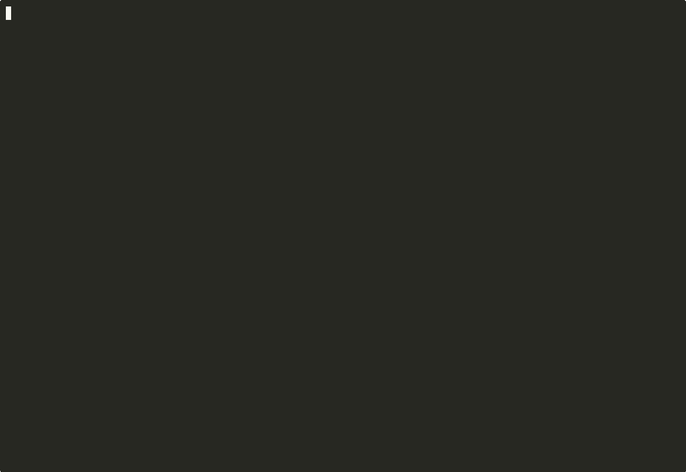

# Cross-Boundary Testing

When a feature spans browser UI, backend APIs, and external services (analytics, tracing), a single browser test isn't enough. Cross-boundary flows combine browser steps with `Execute external` (trigger actions) and `Verify external` (check side effects).

## When to Use

- Feature involves CLI commands or API calls that change what the UI displays
- Verification requires checking analytics events (PostHog, Mixpanel) or tracing (Langfuse, Sentry)
- The test scenario crosses the browser boundary: **do something outside** -> **observe result inside**

## Flow Structure

A cross-boundary flow has three step types:

| Step type | `action:` value | Purpose | Runs in |
|-----------|----------------|---------|---------|
| Browser | `Navigate to`, `Click`, `Fill`, `Wait for networkidle` | UI interaction + assertion | agent-browser |
| Execute external | `"Execute external"` | Trigger non-browser action | CLI / API |
| Verify external | `"Verify external"` | Check external service state | API / dashboard |

```yaml
steps:
  # Phase 1: Browser -- observe initial state
  - id: verify-empty-state
    action: "Navigate to /dashboard"
    expect:
      - "items_table visible on dashboard"
      - "empty_state_cta visible on dashboard"

  # Phase 2: Execute external -- trigger the change
  - id: trigger-data-load
    action: "Execute external"
    description: "Load 3 batches of data via CLI"
    execute:
      cli:
        - run: "my-tool load-batch --name batch-${i}"
          repeat: 3
          expect: "exit code 0"
    wait_after: 5
    on_fail: fail

  # Phase 3: Browser -- verify the change appeared
  - id: verify-data-appeared
    action: "Navigate to /dashboard"
    expect:
      - "items_table visible on dashboard"
      - "empty_state_cta not visible on dashboard"

  # Phase 4: Verify external -- check side effects
  - id: verify-analytics-event
    action: "Verify external"
    description: "Confirm analytics event was emitted"
    wait: 10
    verify:
      posthog:
        - event: data_batch_loaded
          expect: "Event exists with batch_count=3"
    on_fail: warn
```

## CLI-Only Flows (No Mapping Required)

Not every E2E test needs a browser. When the entire test scenario involves CLI commands, API calls, or database operations -- with no browser UI interaction -- you can generate a **CLI-only flow** without any mapping file.

### When to use CLI-only mode

- Backend migration verification (run migration, check database state)
- API endpoint testing (curl commands + response validation)
- CLI tool validation (run tool, verify output)
- Database seeding verification (insert data, query to confirm)

### Auto-detection

`/e2e-flow` auto-detects CLI-only intent when:

1. **No mapping exists** in `.claude/e2e/mappings/`
2. **Source material contains CLI signals**: shell commands (`curl`, `psql`, `npm run`, `bun`), API endpoint testing, database queries, migration scripts, or `Execute external` mentions

When both conditions are met, the skill informs you and proceeds without a mapping:

```
No mapping found. Detected CLI/backend intent --
generating CLI-only flow (Execute external / Verify external steps only).
```

If no CLI signals are detected either, the skill asks whether this is a CLI test or a browser test that needs `/e2e-map` first.

### Manual trigger

You can also explicitly request CLI-only mode by using trigger phrases like "cli flow", "backend e2e", "api test flow", or "cli recording" in your request to `/e2e-flow`.

### CLI-only flow YAML

CLI-only flows omit the `mapping:` field entirely and use only `Execute external` and `Verify external` steps:

```yaml
name: verify-migration-rollback
description: "Run migration, verify schema change, rollback, verify revert"
tags: [cli-only, migration]

steps:
  - id: run-migration
    action: "Execute external"
    description: "Apply the pending migration"
    execute:
      cli:
        - run: "npx prisma migrate deploy"
          expect: "exit code 0"
    on_fail: fail

  - id: verify-schema-change
    action: "Verify external"
    description: "Confirm new column exists in target table"
    verify:
      db:
        - check: "SELECT column_name FROM information_schema.columns WHERE table_name='users' AND column_name='preferences'"
          expect: "Row returned"
    on_fail: fail

  - id: rollback-migration
    action: "Execute external"
    description: "Roll back to previous state"
    execute:
      cli:
        - run: "npx prisma migrate reset --skip-seed --force"
          expect: "exit code 0"
    on_fail: fail
```

### What happens during verification

CLI-only flows skip the browser verifier entirely. Instead:

1. The flow-writer generates only `Execute external` / `Verify external` steps
2. Browser verification (Phase 2a-2d) is skipped -- there are no browser steps to verify
3. CLI execution is recorded via `asciinema` (terminal recording instead of screenshots)
4. The `e2e-media-processor` agent converts the `.cast` file to GIF, MP4, and thumbnail

### Limitations

- **`--smoke` requires a mapping.** Smoke mode generates a visit-all-pages flow, which is inherently browser-based.
- **No compiled script output.** The compiler targets browser flows with mapping references. CLI-only flows run through the LLM test runner.
- **Browser steps cannot be mixed in.** If any step needs browser interaction, a mapping is required -- use a cross-boundary (mixed) flow instead.

## Using Project-Specific Commands in Execute external Steps

`Execute external` steps run shell commands in the working directory of the Claude Code session. Any executable reachable from that working directory -- wrapper scripts, installed CLI tools, local dev installs -- can be used directly.

### What counts as a project-specific command

- **Wrapper scripts**: `bash scripts/run-checks.sh`, `./bin/verify`, `make test-mcp`
- **Installed CLI tools**: `recce run`, `dbt run`, `prisma migrate`
- **Local dev installs**: packages installed with `pip install -e .` or `npm link`
- **Inline commands**: multi-line shell blocks with env vars, pipes, and conditionals

```yaml
- id: run-project-checks
  action: "Execute external"
  description: "Run the project's preset check suite"
  execute:
    cli:
      - run: |
          cd /path/to/project
          python -m recce run --select tag:pr_check
        expect: "All checks passed"
  on_fail: fail
```

### What does NOT work

**Claude Code skill invocations are not shell commands.** You cannot write:

```yaml
# WRONG -- /skill-name is a Claude Code slash command, not a shell executable
- run: "/e2e-help --feedback 'test'"
```

If a Claude Code skill wraps an underlying script, invoke the script directly instead. For example, if `/recce-mcp-e2e` ultimately calls `bash .claude/scripts/recce-mcp-e2e.sh`, use the script path in your `run:` block.

### Pattern: wrap project commands in a shell script

For complex setups, create a thin wrapper script and call it from the flow:

```bash
# .claude/scripts/verify-mcp-errors.sh
#!/usr/bin/env bash
set -euo pipefail
cd "$(dirname "$0")/../.."

# Set up environment
export PYTHONPATH="${PYTHONPATH:-}:$(pwd)"
source .venv/bin/activate 2>/dev/null || true

# Run the verification
python -m pytest tests/mcp/ -k "error_classification" -v
```

```yaml
- id: verify-mcp-error-classification
  action: "Execute external"
  description: "Run MCP error classification tests"
  execute:
    cli:
      - run: "bash /path/to/project/.claude/scripts/verify-mcp-errors.sh"
        expect: "passed"
  on_fail: fail
```

### Real-world example: recce MCP error classification

The recce project uses a template script (`recce-mcp-e2e`) to verify that the MCP server correctly classifies SQL errors (Snowflake syntax errors, missing table errors, permission errors) and routes them to the appropriate Sentry channel.

The `Execute external` step calls the underlying Python test suite directly:

```yaml
- id: run-mcp-error-classification-tests
  action: "Execute external"
  description: "Verify MCP server classifies Snowflake SQL errors correctly"
  execute:
    cli:
      - run: |
          cd /Users/kent/Project/recce/recce
          source .venv/bin/activate
          python -m pytest tests/mcp/test_error_classification.py -v \
            -k "snowflake or syntax_error or permission_denied"
        expect: "passed"
  on_fail: fail

- id: verify-sentry-routing
  action: "Verify external"
  description: "Confirm errors appear in Sentry with correct classification tags"
  wait: 15
  verify:
    sentry:
      - check: "Issues tagged error_type=syntax_error exist for DRC-3053"
        expect: "At least 1 issue with correct tag"
      - check: "Issues tagged error_type=permission_denied exist for DRC-3054"
        expect: "At least 1 issue with correct tag"
  on_fail: warn
```

### Caveats

| Issue | Cause | Fix |
|-------|-------|-----|
| `command not found` | Tool not on PATH in the subshell | Use absolute path, or `source .venv/bin/activate` first |
| `ModuleNotFoundError` | Local dev install not active | Add `export PYTHONPATH=...` or activate virtualenv |
| Wrong working dir | Relative paths resolve from session cwd | Use `cd /absolute/path` at the start of `run:` block |
| Env vars missing | Session env not inherited | Set vars explicitly in `run:` block |
| Script not executable | Missing `chmod +x` | Add `chmod +x` or invoke with `bash script.sh` |

## Real-World Example -- DRC-2880

**Feature:** When CI runners upload dbt artifacts 3 times (via `recce-cloud upload`), the system marks the project as having auto-uploaded artifacts and fires a PostHog funnel event.

**What makes it cross-boundary:**
- Browser: verify sessions appear in the project page table
- CLI: run `recce-cloud upload` 3 times to trigger the threshold
- Analytics: verify PostHog receives `onboarding_artifacts_auto_uploaded` event

### Prerequisites

```bash
# Install the CLI tool
pip install recce-cloud

# Login to local dev server (not production!)
RECCE_CLOUD_API_HOST=http://localhost:9527 \
RECCE_CLOUD_BASE_URL=http://localhost:3000 \
recce-cloud login

# Bind a dbt project directory to a Recce Cloud project
cd /path/to/your-dbt-project
RECCE_CLOUD_API_HOST=http://localhost:9527 \
recce-cloud init --org <org-slug> --project <project-slug>
```

### The Flow

```yaml
name: verify-artifacts-auto-uploaded
description: |
  DRC-2880: After 3 recce-cloud uploads, sessions appear in the
  project page and a PostHog event fires.
tags: [drc-2880, cross-boundary]
mapping: recce-cloud

steps:
  # Phase 1: Browser -- confirm empty state
  - id: navigate-to-project
    action: "Navigate to /${orgName}/${projectName}"
    expect:
      - "heading visible on project"
      - "dev_sessions_heading visible on project"
    screenshot: true
    timeout: 15

  - id: verify-sessions-table-initial
    action: "Wait for networkidle"
    expect:
      - "sessions_table visible on project"

  # Phase 2: CLI -- upload artifacts 3 times
  - id: trigger-ci-touch-1
    action: "Execute external"
    description: "First upload: creates session, ci_touch_count=1"
    execute:
      api:
        - run: |
            RECCE_CLOUD_API_HOST=http://localhost:9527 \
            recce-cloud upload --session-name "test-session-1" \
            --yes --target-path target
          expect: "Uploaded Successfully"
    wait_after: 2
    on_fail: fail

  - id: trigger-ci-touch-2
    action: "Execute external"
    description: "Second upload: ci_touch_count=2"
    execute:
      api:
        - run: |
            RECCE_CLOUD_API_HOST=http://localhost:9527 \
            recce-cloud upload --session-name "test-session-2" \
            --yes --target-path target
          expect: "Uploaded Successfully"
    wait_after: 2
    on_fail: fail

  - id: trigger-ci-touch-3-threshold
    action: "Execute external"
    description: "Third upload: threshold reached, PostHog event fires"
    execute:
      api:
        - run: |
            RECCE_CLOUD_API_HOST=http://localhost:9527 \
            recce-cloud upload --session-name "test-session-3" \
            --yes --target-path target
          expect: "Uploaded Successfully"
    wait_after: 3
    on_fail: fail

  # Phase 3: Browser -- verify sessions appeared
  - id: reload-project-page
    action: "Navigate to /${orgName}/${projectName}"
    expect:
      - "heading visible on project"
      - "sessions_table visible on project"
    screenshot: true
    timeout: 15

  - id: verify-sessions-appeared
    action: "Wait for networkidle"
    expect:
      - "sessions_table visible on project"
      - "create_first_session not visible on project"
    screenshot: true

  # Phase 4: Analytics -- verify PostHog event
  - id: verify-posthog-artifacts-event
    action: "Verify external"
    description: "Confirm PostHog received the funnel event"
    wait: 10
    verify:
      posthog:
        - event: onboarding_artifacts_auto_uploaded
          expect: "Event exists with distinct_id 'ci:github' and artifacts_count 3"
        - check: "No duplicate events (fires once per project lifetime)"
    on_fail: warn
```

### Running It

**Step 1: Generate the flow** (flow-writer handles cross-boundary steps):
```
/e2e-flow --from <plan-or-spec>
```

**Step 2: Run browser verification** (checkpoints are skipped if env not configured):
```
/e2e-flow --verify-only verify-artifacts-auto-uploaded
```
Browser steps pass/fail independently. Checkpoint steps report `skip` when the required CLI tool or API token isn't available.

**Step 3: Execute checkpoints manually** (when full E2E is needed):
```bash
# Run the uploads
cd /path/to/dbt-project
RECCE_CLOUD_API_HOST=http://localhost:9527 \
recce-cloud upload --session-name "test-1" --yes

# Repeat 2 more times with different session names
```

**Step 4: Re-verify browser** (now sessions should appear):
```
/e2e-flow --verify-only verify-artifacts-auto-uploaded
```

### Key Takeaways

1. **Flow-writer generates all step types** -- browser, `Execute external`, and `Verify external`. Don't hand-write flows to avoid the agent.
2. **Browser and checkpoint steps are independent** -- browser verification works even when checkpoints are skipped.
3. **`RECCE_CLOUD_API_HOST` env var** controls which server the CLI talks to. Always set it for local dev to avoid hitting production.
4. **`on_fail: warn` for analytics** -- PostHog verification is advisory. Don't block the test on analytics propagation delays.

## Real-World Example -- MCP Error Classification Verification (CLI-Only)

**Feature:** The recce MCP server must correctly classify SQL errors from Snowflake (syntax errors, missing table, permission denied) and route them to the appropriate Sentry channel. Issues DRC-3051, DRC-3052, DRC-3053, DRC-3054.

**Why CLI-only:** There is no browser UI involved. The entire verification is: run pytest against the MCP server's error classification logic, confirm Sentry receives correctly-tagged events.

**Pipeline flow:** No mapping exists for this project's MCP layer, so `/e2e-flow` auto-detects CLI intent and generates a CLI-only flow. The flow runs via the LLM test runner (no browser verifier), records via `asciinema`, and the media processor produces a GIF embedded in the PR comment.

### The Flow

```yaml
name: verify-mcp-error-classification
description: |
  DRC-3051/3052/3053/3054: MCP server correctly classifies SQL errors
  and routes them to Sentry with proper error_type tags.
tags: [cli-only, mcp, drc-3051, drc-3052, drc-3053, drc-3054]

steps:
  - id: run-none-relation-guard-tests
    action: "Execute external"
    description: "DRC-3051: verify get_columns handles None relation without crashing"
    execute:
      cli:
        - run: |
            cd /Users/kent/Project/recce/recce
            source .venv/bin/activate
            python -m pytest tests/mcp/test_get_columns.py \
              -k "none_relation" -v
          expect: "passed"
    on_fail: fail

  - id: run-syntax-error-classification-tests
    action: "Execute external"
    description: "DRC-3053/3054: verify Snowflake SQL syntax and permission errors are classified correctly"
    execute:
      cli:
        - run: |
            cd /Users/kent/Project/recce/recce
            source .venv/bin/activate
            python -m pytest tests/mcp/test_error_classification.py \
              -k "snowflake" -v
          expect: "passed"
    on_fail: fail

  - id: run-integration-syntax-error-path
    action: "Execute external"
    description: "DRC-3052: verify new syntax_error classification path via integration test"
    execute:
      cli:
        - run: |
            cd /Users/kent/Project/recce/recce
            source .venv/bin/activate
            python -m pytest tests/mcp/test_integration.py \
              -k "syntax_error" -v
          expect: "passed"
    on_fail: fail

  - id: verify-sentry-error-tags
    action: "Verify external"
    description: "Confirm Sentry received issues with correct error_type classification tags"
    wait: 15
    verify:
      sentry:
        - check: "Issues tagged error_type=syntax_error present for recent MCP runs"
          expect: "At least 1 issue"
        - check: "Issues tagged error_type=permission_denied present for recent MCP runs"
          expect: "At least 1 issue"
        - check: "No unclassified MCP errors (error_type tag always present)"
          expect: "0 issues without error_type tag"
    on_fail: warn

  - id: verify-no-sentry-noise
    action: "Verify external"
    description: "Confirm classified errors are warnings (no Sentry events), not errors"
    wait: 5
    verify:
      sentry:
        - check: "table_not_found errors logged as warnings, not captured as Sentry exceptions"
          expect: "No new Sentry exceptions for table_not_found category"
        - check: "permission_denied errors logged as warnings, not captured as Sentry exceptions"
          expect: "No new Sentry exceptions for permission_denied category"
    on_fail: warn
```

### What the PR comment looks like

Because there are no browser steps, the PR comment omits the steps screenshot table and divergence analysis. Instead it embeds the asciinema GIF and shows a checkpoint results table:

```markdown
## E2E Test: verify-mcp-error-classification

PASS -- 5 checkpoints, 3 executed, 2 advisory

Verified MCP server error classification for DRC-3051/3052/3053/3054:
get_columns None guard, Snowflake syntax error classification, and
permission_denied classification all pass. Sentry routing advisory checks
deferred to post-deploy verification.

### CLI Recording


### Checkpoint Results

| # | Checkpoint | Result | Detail |
|---|-----------|--------|--------|
| 1 | none_relation guard tests | PASS | 3 tests passed |
| 2 | Snowflake syntax error tests | PASS | 5 tests passed |
| 3 | integration syntax_error path | PASS | 2 tests passed |
| 4 | Sentry error_type tags | SKIP | post-deploy only |
| 5 | No Sentry noise for classified errors | SKIP | post-deploy only |

### Health

| Check | Result |
|-------|--------|
| Test failures | 0 |
| Unclassified errors | 0 |
| Advisory skips | 2 (Sentry -- post-deploy) |

<details>
<summary>Full terminal output</summary>

[Embedded asciinema cast or link to .mp4]
</details>
```

### Pipeline flow (no mapping)

```
/e2e-flow (no mapping in .claude/e2e/mappings/)
    |
    +-- CLI signal detected (pytest, python, source .venv)
    |
    v
flow-writer agent (CLI-only mode)
    +-- generates 5 Execute external / Verify external steps
    +-- no mapping: field in YAML
    |
    v
LLM test runner (no browser verifier)
    +-- executes each step via shell
    +-- asciinema records terminal session
    |
    v
e2e-media-processor (CLI mode, cast_path provided)
    +-- steps.gif (agg: 120x35, 2x speed)
    +-- test-run.mp4 (ffmpeg)
    +-- thumbnail.png
    |
    v
Draft release upload (.gif + .mp4)
    |
    v
gh pr comment (checkpoint results table + embedded GIF)
```

Note that draft release upload still applies for CLI-only flows. The `.mp4` and `.gif` from asciinema are uploaded to `e2e-assets-<branch>` just like browser recording artifacts.

## Step Type Reference

### Execute external

Triggers actions outside the browser. Use for CLI commands, API calls, database seeding, file operations.

```yaml
- id: trigger-something
  action: "Execute external"
  description: "Why this step exists"   # required
  execute:
    <context>:                           # cli, api, db, or any label
      - run: "<command or instruction>"
        repeat: 3                        # optional, default: 1
        expect: "exit code 0"           # optional per-command assertion
  wait_after: 5                          # seconds after execution (default: 0)
  on_fail: fail                          # fail (default) | warn | block
```

### Verify external

Checks state in external services. Use for analytics events, tracing spans, webhook deliveries.

```yaml
- id: verify-something
  action: "Verify external"
  description: "Why this checkpoint exists"   # required
  wait: 10                                    # propagation delay (default: 5)
  verify:
    <service>:                                # posthog, langfuse, sentry, etc.
      - event: <event_name>                   # structured hint (optional)
        expect: "natural language assertion"
      - check: "general verification"         # freeform check (optional)
  on_fail: warn                               # warn (default) | fail | block
```

### Key differences

| | Execute external | Verify external |
|---|---|---|
| Purpose | Do something | Check something |
| Block | `execute:` | `verify:` |
| Default `on_fail` | `fail` | `warn` |
| Timing | `wait_after` (after) | `wait` (before) |
| Browser state | Unchanged | Unchanged |

## Recording CLI-Only Flows

When a flow has **zero browser steps** (only `Execute external` + `Verify external`), the browser-based recording pipeline (screenshots + WebM) doesn't apply. Use terminal recording instead.

**Demo** -- `recce summary` recorded via the CLI pipeline (asciinema -> agg -> GIF):



### Detection

A flow is CLI-only when all steps have `action: "Execute external"` or `action: "Verify external"`. No `Navigate`, `Click`, `Fill`, or other browser actions.

### Recording Pipeline

```
Skill wraps CLI command with asciinema
    +-- recording.cast      (JSONL: timestamp + character data)
          |
          v
e2e-media-processor (CLI mode, cast_path provided)
          |
          +-- steps.gif     (agg: 120x35, 2x speed, monokai)
          +-- test-run.mp4  (ffmpeg: yuv420p, faststart)
          +-- thumbnail.png (first GIF frame)
```

### Skill Dispatch Pattern

```bash
# 1. Record execution
asciinema rec --cols 120 --rows 35 \
  -c "<command>" "$REPORT_DIR/recording.cast"

# 2. Dispatch media processor in CLI mode
Agent(subagent_type="e2e-pipeline:e2e-media-processor"):
  "Process media:
   report_dir: $REPORT_DIR
   cast_path: $REPORT_DIR/recording.cast
   output_name: test-run"
```

### Prerequisites

`asciinema` and `agg` must be installed. Skills check availability before recording:

```bash
command -v asciinema >/dev/null 2>&1 && command -v agg >/dev/null 2>&1
```

If missing: warn user, skip recording, proceed with text-only results. Install: `brew install asciinema agg`.

### Headless Mode

In non-interactive shells (CI, subagents), asciinema runs in headless mode automatically ("TTY not available, recording in headless mode"). This is expected -- the cast file is still produced correctly.

## Related

- [Writing Tests](writing-tests.md) -- flow YAML format and checkpoint syntax
- [Commands](commands.md) -- all skills and flags
- [Recording & Evidence](recording-evidence.md) -- media processing pipeline, CLI terminal recording parameters
- [Multi-Site Testing](multi-site-testing.md) -- cross-site flows with `sites:` and `--all-sites`
- [PR Workflow](pr-workflow.md) -- how CLI-only results appear in PR comments

---

> **Found a better pattern?** [Open a PR](https://github.com/iamcxa/kc-claude-plugins/pulls) to share it.
> **Docs unclear?** Use `/e2e-help --feedback "<description>"` to let us know.
