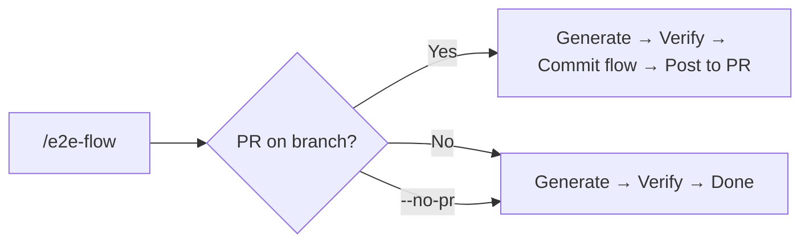
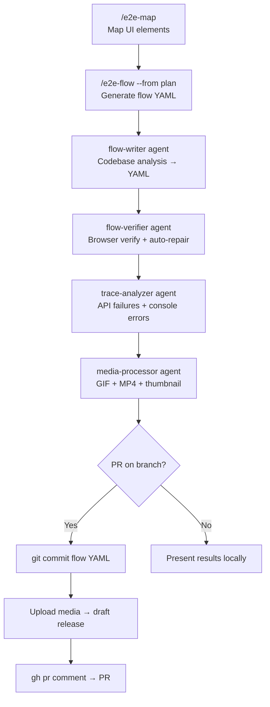

# PR Workflow — E2E Evidence for Pull Requests

End-to-end guide for producing E2E test evidence and posting it to a PR as a structured comment with screenshots, video, and health data.

## PR Mode is Default

As of v2.4.0, **PR mode is enabled by default** for `/e2e-flow`. When you're on a branch with an open PR, the skill automatically:

1. Detects the PR via `gh pr view`
2. Commits the verified flow YAML
3. Posts results as a PR comment

Use `--no-pr` to opt out. If no PR exists on the current branch, PR mode is silently skipped.



## Quick Reference

```bash
# Feature — flow from plan (PR mode automatic)
/e2e-flow --from <plan-or-spec> --issue DRC-2779

# Bug fix — walkthrough + test + PR comment
/e2e-walkthrough --pr 940
/e2e-test <generated-flow> --pr 940 --video

# Existing flow — replay with evidence
/e2e-test login-flow --pr 940

# Opt out of PR mode
/e2e-flow --from <plan> --no-pr
```

## Full Workflow: Map to PR Comment



### Step 1 — Map the UI (one-time setup)

```
/e2e-map
```

Generates `.claude/e2e/mappings/<app>.yaml` with page selectors. Skip if mapping already exists.

### Step 2 — Generate a flow

Choose one approach:

| Approach | Command | When |
|----------|---------|------|
| From a PR diff | `/e2e-walkthrough --pr 940` | Bug fix, visual change |
| From a plan/spec | `/e2e-flow --from <plan>` | Feature with acceptance criteria |
| From an issue | `/e2e-walkthrough --pr 940 --issue DRC-2779` | Feature with Linear/GitHub issue |
| Smoke test | `/e2e-flow --smoke` | Quick visit-all-pages check |

All approaches produce a flow YAML at `.claude/e2e/flows/<name>.yaml`.

### Step 3 — Run the test with recording

```
/e2e-test <flow-name> --pr 940 --video
```

`--pr` auto-enables video recording. What happens:

1. **Browser agent** executes flow steps, captures screenshots per step
2. **Media processor** generates GIF (step overview), MP4 (2x speed video), thumbnail
3. **Trace analyzer** parses network/console for API failures and errors
4. **Auto-compile** runs the same flow as a deterministic script, compares results (divergence analysis)
5. **PR report** assembles `pr-summary.md` from all artifacts

### Step 4 — Post to PR

After test completes, the skill:

1. **Uploads media to a draft release** (private repos need this — `raw.githubusercontent.com` returns 403 for private assets):

   ```bash
   gh release create e2e-assets-<branch> --draft --title "E2E assets (<branch>)" --notes ""
   gh release upload e2e-assets-<branch> .claude/e2e/reports/<ts>/*.png .claude/e2e/reports/<ts>/*.mp4 --clobber
   ```

2. **Updates image paths** in `pr-summary.md` to use release asset URLs
3. **Posts to PR**: `gh pr comment <N> --body-file .claude/e2e/reports/<ts>/pr-summary.md`

You confirm before posting.

## What the PR Comment Looks Like

The comment follows the [unified PR report template](../references/pr-report-template.md):

```markdown
## E2E Test: login-flow

PASS — 7 steps, 0 diverged steps

Verified login flow: navigate to login, enter credentials, submit, verify dashboard loads.

### Steps

| # | Step | Screenshot | Result | Detail |
|---|------|-----------|--------|--------|
| 1 | Navigate to /login |  | PASS | |
| 2 | Fill email field |  | PASS | |
| 3 | Fill password field |  | PASS | |
| 4 | Click submit button |  | PASS | |
| 5 | Verify dashboard |  | PASS | |

### Divergence LLM vs Compiled

| Step | LLM | Compiled | Likely Cause |
|------|-----|----------|-------------|
| (all match) | | | |

> 0 diverged steps out of 5 total

### Quick Re-Run

bash .claude/e2e/compiled/login-flow.sh

### Health

| Check | Result |
|-------|--------|
| API failures | 0 |
| Console errors | 0 |
| Trace | Clean |

<details>
<summary>Video (42s)</summary>
<!-- drag-drop video file here -->
Video file: .claude/e2e/reports/20260318-143000/test-run.mp4
</details>
```

### Report sections by skill

| Section | e2e-test | e2e-walkthrough | e2e-flow |
|---------|:--------:|:---------------:|:--------:|
| Flowchart | optional | required | required |
| Divergence (LLM vs Compiled) | yes | -- | -- |
| Quick Re-Run | yes | -- | -- |
| Corrections | -- | -- | yes |
| Key Findings | -- | yes | -- |
| Health | 3 rows | 5 rows | 3 rows |

## PR Mode Across Skills

| Skill | PR behavior | Opt-in/out |
|-------|------------|------------|
| `/e2e-flow` | **Default ON** — auto-detects PR, commits flow, posts results | `--no-pr` to disable |
| `/e2e-test` | Opt-in — auto-enables video, posts `pr-summary.md` | `--pr N` to enable |
| `/e2e-walkthrough` | Opt-in — reads PR diff, posts results | `--pr N` to enable |

All three use the same draft release + `gh pr comment` mechanism for posting.

## Draft Release Explained

GitHub CLI has no API for uploading images directly to PR comments ([cli/cli#1895](https://github.com/cli/cli/issues/1895)). The workaround:

- **Draft releases** produce stable, repo-scoped URLs for images and videos
- The release appears in the Releases page but is not a real release (draft = not published)
- Tag format: `e2e-assets-<branch>` — one per branch, reused with `--clobber`
- Asset URL pattern: `https://github.com/<owner>/<repo>/releases/download/e2e-assets-<branch>/<filename>`

Public repos don't strictly need this (raw GitHub URLs work), but the draft release approach is used universally for consistency.

## Combining with kc-pr-flow

If you use the `kc-pr-flow` plugin, the PR creation skill (`/kc-pr-create`) has built-in E2E integration:

1. **Step 1.5** detects if the PR touches frontend + backend (integration change)
2. Suggests running `/e2e-walkthrough --verify` or `/e2e-test <flow> --video` before creating the PR
3. **Step 10** detects existing E2E artifacts (reports, videos) and offers to draft a Slack announcement via `/kc-pr-announce`

Typical combined flow:

```
# 1. Implement feature
# 2. Generate and verify E2E flow
/e2e-flow --from <plan> --pr <N>

# 3. Create PR (detects E2E artifacts automatically)
/kc-pr-create

# 4. (optional) Announce with demo evidence
/kc-pr-announce
```

## Common Scenarios

### Regression test for a bug fix

```
/e2e-walkthrough --pr 940           # Walk through the fix, generates flow
/e2e-test <flow> --pr 940           # Replay + post evidence
```

The walkthrough produces a reusable flow YAML — future regressions of this bug are caught automatically.

### Feature acceptance with issue traceability

```
/e2e-flow --from acceptance-criteria.md --pr 940 --issue SC-500
/e2e-test <flow> --pr 940 --issue SC-500
```

The `--issue` flag adds issue context to the report header, making the PR comment self-documenting for reviewers.

### Quick smoke test before merge

```
/e2e-test --tag smoke --pr 940
```

Runs all flows tagged `smoke` and posts a batch summary to the PR.

### Re-run after fixing a test failure

```
# Compiled script for instant replay (no AI)
bash .claude/e2e/compiled/<flow>.sh

# Or with AI + fresh video
/e2e-test <flow> --pr 940
```

## Output Files

After a `--pr` run, the report directory (`.claude/e2e/reports/<timestamp>/`) contains:

| File | Purpose |
|------|---------|
| `report.md` | Full test report (local reference) |
| `pr-summary.md` | PR comment body (image URLs point to draft release) |
| `step-*.png` | Individual step screenshots |
| `steps.gif` | Step overview animation (blank frames skipped) |
| `test-run.mp4` | 2x speed video (trimmed) |
| `thumbnail.png` | First non-blank screenshot |
| `trace.zip` | Network + console trace (replay with `npx playwright show-trace`) |
| `compiled-junit.xml` | JUnit output from compiled script run |

## Related

- [Recording & Evidence](recording-evidence.md) -- artifact details, recording defaults
- [Commands](commands.md) -- all flags including `--pr`, `--video`, `--issue`
- [CI Integration](ci-integration.md) -- automated runs in CI pipelines
- [Getting Started](getting-started.md) -- first-time setup

---

> **Found a better workflow?** [Open a PR](https://github.com/iamcxa/kc-claude-plugins/pulls) to share it.
> **Docs unclear?** Use `/e2e-help --feedback "<description>"` to let us know.
