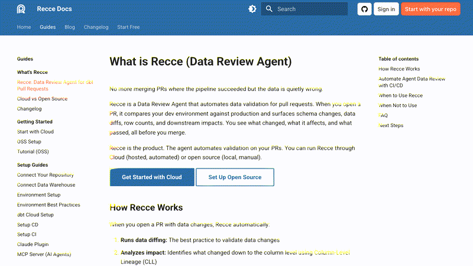

# Recording & Evidence

## Artifacts per run

| Artifact | Format | When |
|----------|--------|------|
| Accessibility snapshots | Text (a11y tree) | Every step |
| Screenshots | PNG | Every step (when recording) or on failure |
| Annotated screenshots | PNG with labeled elements | On demand (`--annotate`) |
| MP4 video | MP4 (step-paced, 2s per step) | Generated by `e2e-media-processor` agent from step screenshots |
| Steps GIF | GIF (800px, 1fps loop) | Generated by `e2e-media-processor` agent (blank frames skipped) |
| Thumbnail | PNG | First non-blank screenshot, generated by `e2e-media-processor` agent |
| Network trace | JSONL HAR (trace.zip) | Per walkthrough/test run |
| Console log | JSONL (trace.zip) | Per walkthrough/test run |
| Trace analysis report | Markdown | After each trace |
| Test report | Markdown | After each test run |
| Flow YAML | YAML | Auto-generated after walkthrough |
| Metrics JSON | JSON | When `--metrics-output` is used |
| Terminal cast | asciinema .cast (JSONL) | CLI-only flows (Execute/Verify external steps only) |

## Recording defaults

| Skill | Video Default | Override |
|-------|--------------|----------|
| `/e2e-walkthrough` | ON | `--no-video` |
| `/e2e-flow` (generation + browser verify) | ON | `--no-video` |
| `/e2e-flow` (CLI-only verify) | ON (asciinema) | `--no-video` |
| `/e2e-test` | OFF | `--video` or `--pr` |
| `/e2e-map` | No recording | -- |
| CLI-only flows | ON (asciinema) | `--no-video` |

Video is generated post-hoc from step screenshots by the `e2e-media-processor` agent -- no simultaneous browser recording is needed. Browser agents produce step screenshots + trace.zip only. The media processor assembles screenshots into MP4 (each step gets `step_duration` seconds, default 2s) and GIF after the browser work completes.

## Output files per run

| File | Purpose |
|------|---------|
| `test-run.mp4` / `walkthrough.mp4` | Step-paced MP4 for sharing (generated from step screenshots) |
| `steps.gif` | Step overview for communication (PR comments, Slack) |
| `step-*.png` | Individual step screenshots |
| `trace.zip` | Interactive replay with network waterfall and DOM snapshots |

> Large binary artifacts (`*.mp4`, `trace.zip`) are automatically added to the project's `.gitignore` on first run to prevent accidental commits.

Replay a trace interactively:

```bash
npx playwright show-trace trace.zip
```

---

## PR Review with E2E Evidence

### Proving a bug fix works

A PR claims to fix a frontend bug. Use the pipeline to produce evidence:

```
/e2e-walkthrough --pr 940
```

The skill reads the PR diff, identifies which UI pages are affected, and proposes a walkthrough targeting the fix. Walk through the repaired flow -- the output includes:

- Step-by-step screenshots
- Console error / API failure counts (via trace analysis)
- Auto-generated flow YAML capturing the working state

Then post the results as a PR comment:

```
/e2e-test <generated-flow> --pr 940
```

The test summary (pass/fail, step count, health data) is posted directly to the PR as a comment, giving reviewers concrete proof.

### Proving a feature matches requirements

A PR implements a feature from a spec or flowchart. You need to verify the implementation matches the expected flow:

```
/e2e-walkthrough --pr 940 --issue DRC-2779
```

The skill reads both the PR diff and the issue description (from Linear/GitHub), then proposes a walkthrough plan covering the feature's expected flow. Walk through it step by step:

1. The walkthrough plan maps issue requirements to UI pages to expected elements
2. Each step verifies elements exist, interactions work, and navigation is correct
3. Trace analysis catches API errors or console warnings hidden from the UI
4. A flow YAML is auto-generated, becoming a **regression test** for this feature

Post results:

```
/e2e-test <generated-flow> --pr 940 --issue DRC-2779
```

The PR comment includes the issue context, making the review self-documenting.

## Media Processing Pipeline

After browser work completes, each skill dispatches the `e2e-media-processor` agent to transform raw artifacts into shareable assets.

**Browser recording demo** -- 4-page walkthrough of docs.reccehq.com (screenshots -> GIF):



<details>
<summary>Flow YAML used to generate this demo</summary>

```yaml
name: demo-browser-recording
description: Browse docs.reccehq.com to demonstrate the browser media pipeline
mapping: recce-docs
tags: [demo, browser-recording]

steps:
  - id: landing
    action: "Navigate to https://docs.reccehq.com/"
    expect:
      - "page loaded with title containing 'Recce'"
    screenshot: true

  - id: summary-agent
    action: "Navigate to https://docs.reccehq.com/recce-cloud/recce-summary-agent/"
    expect:
      - "page loaded with Summary Agent content"
    screenshot: true

  - id: mcp-server
    action: "Navigate to https://docs.reccehq.com/recce-cloud/mcp-server/"
    expect:
      - "page loaded with MCP Server content"
    screenshot: true

  - id: lineage-diff
    action: "Navigate to https://docs.reccehq.com/features/lineage/"
    expect:
      - "page loaded with Lineage Diff content"
    screenshot: true
```

</details>

### Pipeline flow

```
Browser agent (raw output)
    +-- step-*.png          (screenshots per step)
    +-- trace.zip           (network + DOM snapshots)
          |
          v
Skill dispatches e2e-media-processor
          |
          +-- steps.gif     (800px wide, 1fps loop, blank frames skipped)
          +-- test-run.mp4  (step-paced, 2s per step, from screenshots)
          +-- thumbnail.png (first non-blank screenshot)

CLI agent (raw output)
    +-- recording.cast      (asciinema terminal recording)
          |
          v
Skill dispatches e2e-media-processor (CLI mode: cast_path)
          |
          +-- steps.gif     (agg render, 2x speed, monokai theme)
          +-- test-run.mp4  (ffmpeg from GIF, yuv420p)
          +-- thumbnail.png (first frame extracted from GIF)
```

> See the CLI recording demo in [Cross-Boundary Testing -- Recording CLI-Only Flows](cross-boundary-testing.md#recording-cli-only-flows).

### Blank frame detection

The media processor scans `step-*.png` for leading and trailing blank frames (white/empty screenshots from page load delays). These are excluded from the GIF to avoid dead frames at the start or end of the animation.

Example: 12 screenshots captured, 1 leading blank, 1 trailing blank -> GIF contains 10 frames.

### Processing parameters

| Output | Format | Parameters |
|--------|--------|------------|
| GIF (browser) | 800px wide, 1fps, loop | Blank frames excluded |
| MP4 (browser) | Step-paced, `step_duration` seconds per step (default: 2s) | Blank frames excluded, libx264/yuv420p, even dimensions via pad filter |
| Thumbnail (browser) | Original resolution PNG | First non-blank screenshot |
| GIF (CLI) | agg render, 120x35 terminal, 2x speed, monokai theme | From asciinema .cast file |
| MP4 (CLI) | ffmpeg from GIF, yuv420p, faststart | Even dimensions enforced via scale filter |
| Thumbnail (CLI) | PNG | First frame extracted from GIF |

### When media processor runs

The processor is **always dispatched** after browser work -- even without video recording -- because GIF and thumbnail are generated from screenshots (which are always captured).

| Source | GIF | MP4 | Thumbnail |
|:------:|:---:|:---:|:---------:|
| Browser (screenshots) | from screenshots | from screenshots | from screenshots |
| CLI-only (cast file) | from cast via agg | from GIF via ffmpeg | first GIF frame |

## Related

- [PR Workflow](pr-workflow.md) -- full guide for posting E2E evidence to PRs
- [Commands](commands.md) -- all skills and flags including `--video`, `--pr`, `--no-video`
- [Cross-Boundary Testing](cross-boundary-testing.md) -- external checkpoints that produce evidence, CLI terminal recording pipeline
- [Debugging](debugging.md) -- using traces and recordings to diagnose failures
- [CI Integration](ci-integration.md) -- metrics and JUnit output for CI pipelines

---

> **Found a better pattern?** [Open a PR](https://github.com/iamcxa/kc-claude-plugins/pulls) to share it.
> **Docs unclear?** Use `/e2e-help --feedback "<description>"` to let us know.
