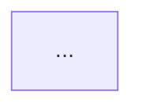

# Unified PR Report Template Design

**Date:** 2026-03-17
**Status:** Draft
**Scope:** e2e-pipeline plugin — e2e-test, e2e-walkthrough, e2e-flow skills

## Problem

Three skills produce `pr-summary.md` files with inconsistent formats:

| Issue | walkthrough | flow | test |
|-------|------------|------|------|
| Title format | `## E2E Walkthrough Verification Report` | `## E2E Verification: <name>` | No formal template |
| Step table cols | `Step \| Screenshot \| What happens` | `Step \| Screenshot \| Status` | Undefined |
| Flowchart | Yes (mermaid) | No | No |
| Video embed | `<details>` + drag-drop | `<VIDEO_LINK_IF_AVAILABLE>` | Plain text lines |
| Footer | Replay blockquote | `Generated by` line | Replay line |
| Template quality | Full markdown template in reference.md | Simpler template in reference.md | Bullet points in SKILL.md |

PR reviewers see different structures depending on which skill generated the report, making it harder to scan results quickly.

## Decision Record

| Question | Decision | Rationale |
|----------|----------|-----------|
| Primary audience | PR reviewer first, self-reference second | Optimise for quick scanning in GitHub PR comments |
| Unification level | Unified skeleton + free extension | Rigid slots too constraining (flow corrections ≠ test divergence); style guide too loose (current state) |
| Flowchart | Required for walkthrough + flow, optional for test | Test is replay — reviewer already saw flowchart at generation time |
| Template location | `references/pr-report-template.md` (single source of truth) | Each skill's reference.md deletes its own template, replaces with reference |

## Unified Skeleton

```markdown
## E2E <Type>: <flow-name>

<status-emoji> **<STATUS>** — <N> steps, <key-metric>

<1-2 sentence overview: what was verified and which scenarios were covered>

### Flowchart <!-- REQUIRED: walkthrough, flow | OPTIONAL: test (omit section entirely) -->



### Steps

| # | Step | Screenshot | Result | Detail |
|---|------|-----------|--------|--------|
| 1 | <step name> |  | PASS | <what happened or blank> |

<!-- SKILL-SPECIFIC SECTIONS (between Steps and Health) -->

### Health

| Check | Result |
|-------|--------|
| API failures | <N> |
| Console errors | <N> |
| Trace | Clean / <note> |

<details>
<summary>Video (<duration>)</summary>

<!-- 👇 DRAG-DROP video.mp4 HERE (replace this line) -->
Video file: `<path>`

</details>

---

> **Replay:** `/e2e-test <flow>` | **Trace:** `npx playwright show-trace <path>`
> Generated by `/<skill>` · [e2e-pipeline](https://github.com/iamcxa/kc-claude-plugins/tree/main/e2e-pipeline)
```

## Field Specifications

| Field | Specification |
|-------|--------------|
| **Title** | `## E2E <Type>: <name>` — Type values: `Test` (e2e-test), `Walkthrough` (e2e-walkthrough), `Verification` (e2e-flow) |
| **Status emoji** | `✅` PASS, `⚠️` PARTIAL/WARN, `❌` FAIL |
| **Status line** | `<emoji> **<STATUS>** — <N> steps, <key-metric>` |
| **Key metric** | test: `N diverged steps` / flow: `K corrections applied` / walkthrough: `M anomalies recorded` |
| **Overview** | 1-2 sentences. What was verified, which pages/scenarios covered. |
| **Flowchart** | Mermaid `flowchart TD`. REQUIRED for walkthrough and flow. OPTIONAL for test (omit section entirely if skipped). Uses shared node type rules (see § Flowchart Node Types). |
| **Steps table** | Fixed 5 columns: `#`, `Step`, `Screenshot`, `Result`, `Detail` |
| **# column** | Sequential integer, 1-indexed |
| **Step column** | Concise action description (≤40 chars). Format: verb + target (e.g., "Navigate to dashboard", "Click submit button") |
| **Screenshot column** | ``. Use draft release URLs for private repos. If no screenshot: `—` |
| **Result column** | One of: `PASS`, `FAIL`, `SKIP`, `WARN`, `ERROR`. Always uppercase. |
| **Detail column** | Skill-specific semantics. **walkthrough**: narrative description of what happened (always populated — this is the reviewer's primary reading alongside screenshots). **test/flow**: empty for PASS; for FAIL/WARN/ERROR: reason ≤50 chars; for SKIP: why skipped. |
| **Health table** | Base 3 rows (always present): API failures, Console errors, Trace. Values: integer count or `Clean`/description. **Walkthrough extension**: +2 rows (Anomalies observed, Silent failures) when step-log cross-reference data is available. |
| **Video section** | Always `<details>` collapse. Include duration in summary. Drag-drop placeholder for GitHub. Show file path as fallback. Omit section entirely if no recording. |
| **Footer** | Two-line blockquote. Line 1: Replay command + Trace command. **e2e-test override**: Line 1 shows compiled script command instead of `/e2e-test` (since Quick Re-Run section provides the detailed replay). Line 2: Generated by + plugin link. |

## Flowchart Node Types (shared)

Moved from walkthrough/reference.md to shared template. All skills producing flowcharts use these rules.

| UI concept | Mermaid syntax | Example |
|------------|---------------|---------|
| Page | `["..."]` | `A["Dashboard"]` |
| Dialog/Modal | `{{"..."}}` | `C{{"Add Member Dialog"}}` |
| Form submit | `(["..."])` | `F(["Submit Form"])` |
| Conditional branch | `{"..."}` | `D{"Select Role"}` |
| Final result (PASS) | `["..."]` + style | `G["PASS"]` + `style G fill:#4caf50,color:white` |

**Edge rules:**
- Label: `"N. action summary"` (N = step number, summary ≤15 chars)
- Return to same page: dashed arrow `-.->`
- Reuse existing node for same page appearing multiple times

**Cross-site flowchart:**
- Each site wrapped in `subgraph`
- Cross-site edges annotated with switch action

## Skill-Specific Extension Sections

Extensions insert between `### Steps` and `### Health`. Each skill defines its own sections.

### e2e-flow extensions

**Corrections** (always present when corrections > 0):

```markdown
### Corrections

| Change | Type | Detail |
|--------|------|--------|
| +step 3.1 | auto-inserted | Confirm dialog after "Add Connection" |
| fix step 2 | selector repair | `add_btn` → `add_connection_button` |
```

**Acceptance Mapping** (when `--from plan/spec` used):

```markdown
### Acceptance Mapping

| # | Criterion | Steps | Status |
|---|-----------|-------|--------|
| 1 | User can create project | step-1 → step-4 | ✅ Covered |
| 2 | Success toast appears | step-5 | ✅ Covered |
| 3 | PostHog event tracked | verify-tracking | ⚠️ SKIP (no API key) |
```

**Checkpoint Results** (when flow has external checkpoints):

```markdown
### Checkpoint Results

| Checkpoint | Type | Result | Detail |
|-----------|------|--------|--------|
| trigger-sessions | Execute | PASS | recce-cloud run ×3, exit 0 |
| verify-posthog | Verify | SKIP | POSTHOG_API_KEY not set |
```

### e2e-test extensions

**Divergence** (when Phase 1.8 auto-compile ran):

```markdown
### Divergence (LLM vs Compiled)

| Step | LLM | Compiled | Likely Cause |
|------|-----|----------|-------------|
| step-3 | PASS | FAIL | Timing-sensitive selector |
| step-7 | FAIL | PASS | LLM hallucinated failure |

> N diverged steps out of M total
```

**Quick Re-Run** (always present):

```markdown
### Quick Re-Run

```bash
bash .claude/e2e/compiled/<flow>.sh
```

> Compiled script auto-regenerated. Force recompile: `/e2e-compile <flow>`
```

### e2e-walkthrough extensions

**Key Findings** (always present):

```markdown
### Key Findings

- <bullet points from anomaly cross-reference>
- <behavioral observations>
- <UX quality notes>
```

**Scenario Summary** (when multiple scenarios/flows in one walkthrough):

```markdown
### Summary

| Flow | Steps | Result | Trace |
|------|:-----:|:------:|:-----:|
| <flow name> | <N> | PASS/FAIL | Clean / <note> |
```

This replaces the walkthrough's current standalone summary table. Omit when only one scenario.

## Migration: Files Changed

### New file

- `references/pr-report-template.md` — unified skeleton + field specs + flowchart rules + extension slot docs

### Modified files

| File | Change |
|------|--------|
| `skills/e2e-walkthrough/reference.md` | Delete `§ pr-summary.md — PR Comment Report` template section. Replace with: `See [pr-report-template.md](../../references/pr-report-template.md) for the unified PR report skeleton.` + extension docs for Key Findings and Scenario Summary. Delete `§ Flowchart Rules` — moved to shared template. Keep: `report.md` template, all other sections unchanged. |
| `skills/e2e-flow/reference.md` | Delete `§ PR Summary (for --pr posting)` template. Delete `§ Acceptance Report` template. Replace with reference to shared template + extension docs for Corrections, Acceptance Mapping, Checkpoint Results. |
| `skills/e2e-test/SKILL.md` | Replace `§ PR comment (if --pr):` section in Phase 2 with reference to shared template + extension docs for Divergence, Quick Re-Run. |
| `agents/e2e-flow-verifier.md` | Update `§ 4b. PR Summary (pr-summary.md)` — replace hardcoded template with reference to shared template. The verifier agent physically writes `pr-summary.md`, so it must follow the unified skeleton + flow extension slots (Corrections, Checkpoint Results). |

### Follow-up (outside this spec's scope)

- `skills/e2e-skill-ops/SKILL.md` — add "PR template conformance" to the `--maintain` audit checklist (checks that all 3 skills' pr-summary output matches the shared skeleton structure)

### Not changed

- `report.md` (full artifact report) in each skill — remains skill-specific, serves different audience
- walkthrough `report.md` template stays in walkthrough/reference.md
- `agents/e2e-test-runner.md` and `agents/e2e-mapper.md` — they produce raw data, not PR reports; skills format the output

## Risks

| Risk | Mitigation |
|------|-----------|
| Template drift — skills stop following shared template over time | e2e-skill-ops `--maintain` audit should include template conformance check |
| Extension sections grow unbounded | Document max 3 extension sections per skill in template rules |
| Flowchart generation inconsistency | Shared node type rules eliminate interpretation differences |
| Breaking existing PR comments | This is forward-only — existing posted comments are not affected |
| Agent template divergence — verifier agent writes pr-summary.md directly | Migration includes verifier agent update; shared template is the single source of truth for all producers |
