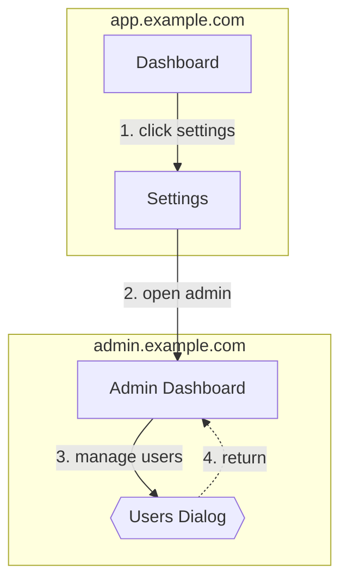

# PR Report Template (pr-summary.md)

Single source of truth for all `pr-summary.md` formatting across e2e-pipeline skills.

**Consumers:** e2e-test, e2e-walkthrough, e2e-flow skills + e2e-flow-verifier agent.

---

## Unified Skeleton

Every PR report follows this exact structure. Skill-specific extension sections insert between `### Steps` and `### Health` (see [Extension Sections](#extension-sections)).

```markdown
## E2E <Type>: <flow-name>

<status-emoji> **<STATUS>** — <N> steps, <key-metric>

<1-2 sentence overview: what was verified and which scenarios were covered>

### Flowchart <!-- REQUIRED: walkthrough, flow | OPTIONAL: test (omit section entirely) -->

` ` `mermaid
flowchart TD
    ...
` ` `

### Steps

| # | Step | Screenshot | Result | Detail |
|---|------|-----------|--------|--------|
| 1 | <step name> |  | PASS | <what happened or blank> |

<!-- SKILL-SPECIFIC SECTIONS (between Steps and Health) -->

### Health

| Check | Result |
|-------|--------|
| API failures | <N> |
| Console errors | <N> |
| Trace | Clean / <note> |
| Trace infrastructure | PASS / FAIL (`<finalization_status>`) |

<details>
<summary>Video (<duration>)</summary>

<!-- drag-drop video.mp4 HERE (replace this line) -->
Video file: `<path>`

</details>

---

> **Replay:** `/e2e-test <flow>` | **Trace:** `npx playwright show-trace <path>`
> Generated by `/<skill>` · [e2e-pipeline](https://github.com/iamcxa/kc-claude-plugins/tree/main/e2e-pipeline)
```

---

## Field Specifications

| Field | Specification |
|-------|--------------|
| **Title** | `## E2E <Type>: <name>` — Type values: `Test` (e2e-test), `Walkthrough` (e2e-walkthrough), `Verification` (e2e-flow) |
| **Status emoji** | `✅` PASS, `⚠️` PARTIAL/WARN, `❌` FAIL |
| **Status line** | `<emoji> **<STATUS>** — <N> steps, <key-metric>` |
| **Key metric** | test: `N diverged steps` / flow: `K corrections applied` / walkthrough: `M anomalies recorded` |
| **Overview** | 1-2 sentences. What was verified, which pages/scenarios covered. |
| **Flowchart** | Mermaid `flowchart TD`. REQUIRED for walkthrough and flow. OPTIONAL for test (omit section entirely if skipped). Uses shared node type rules (see [Flowchart Node Types](#flowchart-node-types)). |
| **Steps table** | Fixed 5 columns: `#`, `Step`, `Screenshot`, `Result`, `Detail` |
| **# column** | Sequential integer, 1-indexed |
| **Step column** | Concise action description (max 40 chars). Format: verb + target |
| **Screenshot column** | ``. Use draft release URLs for private repos. If no screenshot: `—` |
| **Result column** | One of: `PASS`, `FAIL`, `SKIP`, `WARN`, `ERROR`. Always uppercase. |
| **Detail column** | Skill-specific semantics — see below. |
| **Health table** | Base 4 rows (always present): API failures, Console errors, Trace, Trace infrastructure. Walkthrough extension: +2 rows when step-log cross-reference data is available (see below). |

**Walkthrough Health table** (6 rows):

| Check | Result |
|-------|--------|
| API failures | `<N>` |
| Console errors | `<N>` |
| Trace | `Clean` / `<issue summary>` |
| Trace infrastructure | `PASS` / `FAIL (<finalization_status>)` |
| Anomalies observed | `<N>` (from step-log cross-reference) |
| Silent failures | `<N>` (API errors with no client-visible error) |

The extra 2 rows are only present when the walkthrough's trace-analyzer returns enhanced data
(i.e., `step_log_path` was provided). For test and flow, always use the base 4-row table. When
trace analysis is ineligible, trace-derived counts are `N/A`; the infrastructure row names the
finalization status and report detail includes validation, recovery, disposition, and artifact path.
| **Video section** | Always `<details>` collapse. Include duration in summary. Drag-drop placeholder for GitHub. Omit section entirely if no recording. |
| **Footer** | Two-line blockquote. Line 1: Replay command + Trace command. Line 2: Generated by + plugin link. |

### Detail Column Semantics by Skill

| Skill | PASS | FAIL / WARN / ERROR | SKIP |
|-------|------|---------------------|------|
| **e2e-walkthrough** | Narrative description of what happened (always populated) | Narrative description (always populated) | Narrative description (always populated) |
| **e2e-test** | Empty | Reason, max 50 chars | Why skipped |
| **e2e-flow** | Empty | Reason, max 50 chars | Why skipped |

### Footer Overrides

| Skill | Line 1 override |
|-------|----------------|
| **e2e-test** | Compiled script command (e.g., `bash .claude/e2e/compiled/<flow>.sh`) instead of `/e2e-test <flow>` |
| **e2e-walkthrough** | Standard: `/e2e-test <flow>` |
| **e2e-flow** | Standard: `/e2e-test <flow>` |

---

## Flowchart Node Types

### Node Shapes

| UI concept | Mermaid syntax | Example |
|------------|---------------|---------|
| Page | `["..."]` | `A["Dashboard"]` |
| Dialog / Modal | `{{"..."}}` | `C{{"Add Member Dialog"}}` |
| Form submit | `(["..."])` | `F(["Submit Form"])` |
| Conditional branch | `{"..."}` | `D{"Select Role"}` |
| Final result (PASS) | `["..."]` + style | `G["PASS"]` + `style G fill:#4caf50,color:white` |

### Edge Rules

- **Label format:** `"N. action summary"` — N = step number, summary max 15 chars
- **Return to same page:** dashed arrow `-.->`
- **Same page appearing multiple times:** reuse the existing node ID (do not create duplicates)

### Cross-Site Flowchart Rules

- Each site wrapped in a `subgraph` block
- Cross-site edges annotated with the switch action (e.g., `"5. open external link"`)
- **Node IDs:** camelCase abbreviation of page name; dialogs get `Dlg` suffix

Example:



---

## Extension Sections

Extensions insert between `### Steps` and `### Health`. Each skill may add up to 3 extension sections.

### e2e-flow Extensions

1. **Corrections** — table of corrections applied during verification

   | Change | Type | Detail |
   |--------|------|--------|
   | Step 3 selector | selector | `#old-btn` -> `#new-btn` |

2. **Acceptance Mapping** — traceability from acceptance criteria to steps

   | # | Criterion | Steps | Status |
   |---|-----------|-------|--------|
   | 1 | User can log in | 1-3 | PASS |

3. **Checkpoint Results** — external and internal checkpoint outcomes

   | Checkpoint | Type | Result | Detail |
   |------------|------|--------|--------|
   | API health | external | PASS | 200 OK |

### e2e-test Extensions

1. **Divergence LLM vs Compiled** — comparison when both modes ran

   | Step | LLM | Compiled | Likely Cause |
   |------|-----|----------|-------------|
   | 3 | PASS | FAIL | Timing race |

2. **Quick Re-Run** — copy-paste command block

   ```bash
   bash .claude/e2e/compiled/<flow>.sh
   ```

### e2e-walkthrough Extensions

1. **Key Findings** — bullet list of notable observations

   - Login form has no ARIA labels on email field
   - Dashboard takes 3.2s to load (above 2s threshold)

2. **Scenario Summary** — only for multi-scenario walkthroughs

   | Flow | Steps | Result | Trace |
   |------|-------|--------|-------|
   | login-happy | 5 | PASS | Clean |
   | login-error | 4 | WARN | 1 console error |

---

## Media Hosting

For private repos, use GitHub draft releases to host screenshots and videos:

```bash
# Create draft release (once per branch)
gh release create e2e-assets-<branch> --draft --title "E2E assets (<branch>)" --notes ""

# Upload assets (idempotent with --clobber)
gh release upload e2e-assets-<branch> $REPORT_DIR/*.png $REPORT_DIR/*.mp4 --clobber
```

Asset URL pattern:
```
https://github.com/<owner>/<repo>/releases/download/e2e-assets-<branch>/<filename>
```

Use these URLs in the `Screenshot` column of the Steps table.
