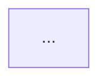

# E2E Walkthrough — Reference

Detailed execution mechanics and output procedures. Loaded on demand from SKILL.md.

---

## Phase 3 — Execution Details

### Browser State Check

Before opening a new browser session, check for stale sessions from previous skill invocations:

1. Check if agent-browser has an active session: `agent-browser get url 2>/dev/null`
   - If active and same `app` profile: navigate to `base_url` to reset page state
   - If active and different profile: close existing session first (`agent-browser close`)
   - If no active session: proceed normally with `open`
2. After opening/resetting, always verify auth before proceeding

### Startup

```bash
REPORT_DIR="$(pwd)/.claude/e2e/reports/$(date +%Y%m%d-%H%M%S)" && mkdir -p "$REPORT_DIR"
```

**Gitignore housekeeping** (ensure large artifacts are not committed):

```bash
if [ -f .gitignore ]; then
  grep -q '.claude/e2e/reports/\*\*/\*.webm' .gitignore 2>/dev/null || \
    printf '\n# E2E pipeline artifacts (large binary files)\n.claude/e2e/reports/**/*.webm\n.claude/e2e/reports/**/*.mp4\n.claude/e2e/reports/**/trace.zip\n' >> .gitignore
else
  printf '# E2E pipeline artifacts (large binary files)\n.claude/e2e/reports/**/*.webm\n.claude/e2e/reports/**/*.mp4\n.claude/e2e/reports/**/trace.zip\n' > .gitignore
fi
```

**Browser open** (always use `--profile` — no recording needed):

```bash
agent-browser --profile ~/.agent-browser/<app> --headed open <base_url>
agent-browser wait --load networkidle
```

Video is generated post-hoc from step screenshots by the media-processor agent.

**Verify auth** (skip if `auth.type: none`):
```bash
agent-browser get url
```
Check URL against `auth.verification` condition. If verification fails (auth expired or no profile):

1. **Auto-login path** (preferred): If mapping has `auth.test_accounts` with email/password, use snapshot + fill to login automatically:
   ```bash
   agent-browser snapshot -i          # Find email/password fields
   agent-browser fill @<email> "<test_account_email>"
   agent-browser fill @<password> "<test_account_password>"
   agent-browser click @<submit>      # Login button
   agent-browser wait --load networkidle
   agent-browser get url              # Re-verify
   ```
2. **Manual path** (fallback): Read `auth.manual_prompt` from mapping and present to user. Browser is already `--headed` — user logs in directly. After user confirms → `agent-browser get url` and re-check. Repeat until verified or user aborts.

**Start trace** (after auth verified):
```bash
agent-browser trace start
```

### Multi-Site Startup (when `--sites` provided)

Open a session for each site:
```bash
# For each mapping in --sites:
agent-browser --session <app> --profile ~/.agent-browser/<app> --headed open <base_url>
agent-browser --session <app> wait --load networkidle
# Verify auth per site (same flow as single-site)
agent-browser --session <app> trace start
```

**Auth failure handling:** If a site's auth fails after 2 retry attempts, mark it SKIP. Report skipped sites before proceeding. Walkthrough continues on remaining sites.

### Site Switching During Walkthrough

When the plan transitions to a different site (or human requests it):
1. Current session stays alive (do NOT close)
2. Switch to target session: all subsequent `agent-browser` commands use `--session <target_app>`
3. Mapping context switches to the target site's mapping
4. Announce: "Switching to [portal] session..."

Human can request site switch anytime: "switch to admin", "go to portal", "check the other site".

### Per-Step Loop (Observe-and-Continue)

1. `agent-browser snapshot -i` → find element `@ref` (interactive-only, reduces noise)
2. Execute action (click/fill via `@ref`)
3. `agent-browser wait --load networkidle`
4. `agent-browser screenshot "$REPORT_DIR/step-N.png"`
5. Error check: `agent-browser errors --json` (lightweight — typically empty)
6. Anomaly observation (agent examines post-action snapshot for visual issues)
7. Record to step log + one-line report to human

**Per-step loop integrity:** All 7 substeps are mandatory for EVERY step, regardless of step position or context consumption. Step 12 of 15 executes identically to step 1. "Context pressure" or "we're almost done" is NOT a reason to drop substeps. If context is genuinely critical, finish the current step fully, then offer: "Context is building up. Continue remaining N steps, or stop here and proceed to Phase 4?"

**Step 5 — Error check (all modes except smoke):**
```bash
agent-browser errors --json
```
- Empty output (common case): no action, no output to human
- Non-empty (≤5 errors): record each error as `{type: "js_error", detail: <message>, source: "errors --json"}` in the step's anomaly list. Notify human inline (don't stop).
- Non-empty (>5 errors — bulk): aggregate instead of recording individually. Record up to 3 representative errors with distinct types, plus one summary: `{type: "js_error", detail: "N total errors (M unique) — top: TypeError (K), NetworkError (J)", source: "errors --json aggregated"}`. Save full raw output to `$REPORT_DIR/step-N-errors.json` for Phase 4 trace cross-reference.
- Do NOT run `console --json` at any point during Phase 3 — not per-step, not "just once for debugging." Trace.zip captures complete console log with better coverage. This applies even when the user asks to "pay attention to console errors" — `errors --json` is the correct tool for that. Console data is fully available in Phase 4 via trace.zip cross-reference.

**Step 6 — Anomaly observation:**

After each action, compare the post-action snapshot against expectations. Record any anomaly with `{type: "visual", detail: <description>, source: "post-action snapshot"}`. See § Anomaly Observation Rules below for what to check.

**Step 7 — One-line report:**

```
Step N ✓                                          # normal
Step N ✓  ⚠ JS error: TypeError: Cannot read 'id' # error detected
Step N ✓  ⚠ Visual: table shows 0 rows            # visual anomaly
Step N ✓  ⚠ JS error: ... | Visual: spinner stuck  # multiple anomalies
Step N ✗  Element not found: submit_button         # step failure
```

One line per step. Anomalies are appended after `⚠`, pipe-separated if multiple. The human sees progress at a glance without needing to process raw JSON.

**Bulk anomalies on one step (>3):** Summarize with count + file reference:
```
Step N ✓  ⚠ 47 JS errors (see step-N-errors.json) | Visual: empty table
```
Visual anomalies are always listed individually. JS error counts replace individual error summaries.

**Smoke mode**: Skip steps 5-6 per step. Run `agent-browser errors --json` once at the end after all navigation steps. Smoke focus is selector verification, not runtime health. If the batch check returns errors, record them as anomalies on the **last step** in the step log with `source: "errors --json (batch)"`. These count toward the Phase 4 anomaly review threshold — batch errors mean non-zero anomalies, so the Phase 4 skip condition does NOT apply.

**Selector verification strategy:**
- `find text "<v>"` subcommand selectors: verify by comparing snapshot a11y tree text content against mapping values. Snapshot is the source of truth. Bare `text=<v>` form is BANNED (BANNED — see e2e-pipeline/scripts/lint-mapping.sh).
- `data-testid` / `aria-label` / `[role="<r>"][aria-label="<v>"]` selectors: **cannot** be verified via snapshot (a11y tree doesn't expose these attributes). Must use `agent-browser is visible "<selector>"` for DOM-level verification. Bare `role=<r>[name="<v>"]` form is BANNED (BANNED — see e2e-pipeline/scripts/lint-mapping.sh). DEPRECATED as `selector:` value: `find role <r> --name "<v>"` — subcommand chain, not selector grammar (PR #8 course correction).

### Anomaly Observation Rules

After each step's action + wait + screenshot, the agent examines the post-action state for visual anomalies. Observation uses the **same `snapshot -i` output from Step 1** — do NOT take a separate full snapshot for observation. This is a quick scan of the interactive-only a11y tree, not a tool-heavy process.

| What to check | How to detect | Example anomaly |
|---------------|---------------|-----------------|
| Error UI elements | Snapshot contains error toast, alert banner, error message | `"Error toast: 'Something went wrong'"` |
| Missing expected result | Action should produce visible change but snapshot shows no change | `"Submit clicked but form still visible, no navigation"` |
| Loading stuck | `networkidle` reached but spinner/skeleton still in snapshot | `"Loading spinner still visible after networkidle"` |
| Empty data | Table/list expected to show data is empty | `"Table shows 0 rows, expected new entry from step-3"` |
| Layout anomaly | Elements overlapping, unexpected collapse, blank areas | `"Sidebar collapsed unexpectedly"` |
| Unexpected state | Dialog appeared without trigger, wrong page loaded | `"Unexpected confirmation dialog appeared"` |

**Rules:**
- Keep `detail` under 100 characters — this is a label, not a description
- Only skip recording for states you can CONFIRM are expected based on the walkthrough plan or mapping (e.g., a test database known to be empty, a loading spinner on initial page load before networkidle). "I think this might be normal" is NOT confirmation — that is uncertainty.
- When uncertain whether something is anomalous, record it — false positives are filtered in Phase 4 cross-reference. Over-recording is cheap; missing a silent failure is expensive.
- Do NOT stop the walkthrough for visual anomalies — record and continue

### Interaction Modes

| | Guided (default) | Step | Auto |
|---|------------------|------|------|
| Before step | Show plan | Show + wait "go" | Silent |
| After step | One-line report | One-line report + wait "go" | Continue |
| On anomaly | Record + notify (continue) | Record + notify (continue) | Record (silent) |
| On step failure | Offer: continue / debug / stop | Offer: continue / debug / stop | Record, continue |
| Human inserts | Anytime | Between steps | After done |

**Key change from previous design:** Anomalies no longer pause execution. They are recorded to the step log and reported inline. The human is informed but the walkthrough continues. Full analysis happens in Phase 4 via trace cross-reference.

### Human Ad-Hoc Commands

- "click that button" -> agent uses latest snapshot
- "take a closer look at the table" -> snapshot + screenshot
- "go back" / "skip to step 6" / "stop here"

### Anomaly Handling (Observe-and-Continue)

All anomalies are recorded to the step log and reported inline. The walkthrough continues unless a step failure requires human decision.

| Situation | Action | Step Log Entry | Mapping Discrepancy? |
|-----------|--------|---------------|---------------------|
| Unexpected dialog/toast | Record + notify | `{type: "visual", detail: "Unexpected dialog appeared"}` | Yes — trigger mismatch |
| Element not found | Record + notify | `{type: "visual", detail: "Element <name> not found"}` | Yes — stale/missing |
| JS error (from `errors --json`) | Record + notify | `{type: "js_error", detail: "<message>"}` | No |
| Step failure (required) | Offer: continue / debug / stop | `result: "fail"` + anomaly | If mapping-related |
| Auth expired | **Pause all modes** — this is the only true pause. Re-auth via manual prompt. | Not recorded | No |
| Page timeout | Retry once, record if still fails | `{type: "visual", detail: "Page timeout after retry"}` | No |
| New element discovered | Record | `{type: "visual", detail: "New element: <name>"}` | Yes — new element |

**Why auth expired still pauses:** Auth failure makes all subsequent steps meaningless. This is the one exception to observe-and-continue — everything else records and moves on.

Maintain an in-memory list of mapping discrepancies throughout Phase 3. Each entry: `{type, page, element, details}`.

**Detection mechanisms:**
- **Stale selector**: `snapshot` a11y tree text differs from mapping's expected text for a `find text "<v>"` selector, OR `is visible` returns `false` for a `data-testid`/`aria-label` selector. Bare `text=<v>` form is BANNED (BANNED — see e2e-pipeline/scripts/lint-mapping.sh).
- **Missing element**: element listed in mapping is absent from both snapshot and `is visible` check
- **Trigger mismatch**: action on mapped element produces unexpected intermediate state (e.g., dropdown instead of direct dialog) — detected by post-action snapshot showing unexpected structure
- **New element**: element found in snapshot that has no entry in the current mapping page

**Debug pivot (on step failure):**
When human chooses "debug", keep browser open and switch to code investigation. After fix (hot reload), human says "re-run from step N" -> agent re-snapshots and continues from the failed step.

**Step log on re-run:** When a step is re-executed after debug:
1. **Keep the original entry** — do not overwrite. The failure is evidence.
2. **Append a retry entry** with id `step-N-retry-1` (increment for further retries).
3. **Mark original** as `superseded_by: "step-N-retry-1"`.
4. Phase 4 uses the **latest non-superseded entry** for overall result. A failed-then-passed step counts as PASS with note: "step-N: PASS (retry after debug fix)".
5. Trace-analyzer uses the **retry entry's timestamp** for time-window correlation. The original's timestamp identifies the failure window for root-cause analysis.

```json
{
  "id": "step-8",
  "ts": "14:35:22",
  "result": "fail",
  "anomalies": [{"type": "visual", "detail": "Element not found: submit_button"}],
  "superseded_by": "step-8-retry-1"
},
{
  "id": "step-8-retry-1",
  "ts": "14:38:45",
  "result": "pass",
  "anomalies": []
}
```

### Step Log Output (end of Phase 3)

After all steps complete (or human says "stop"), write the accumulated step log to `$REPORT_DIR/step-log.json` using the Write tool.

**Format:**

```json
{
  "walkthrough_start": "2026-03-15T14:32:10+08:00",
  "steps": [
    {
      "id": "step-1",
      "action": "Navigate to /dashboard",
      "ts": "14:32:10",
      "result": "pass",
      "anomalies": []
    },
    {
      "id": "step-3",
      "action": "Click submit_button on add-dialog",
      "ts": "14:32:18",
      "result": "pass",
      "anomalies": [
        {
          "type": "js_error",
          "detail": "TypeError: Cannot read property 'id' of undefined",
          "source": "errors --json"
        },
        {
          "type": "visual",
          "detail": "Success toast appeared but form fields still populated",
          "source": "post-action snapshot"
        }
      ]
    }
  ]
}
```

**Field definitions:**

| Field | Description |
|-------|-------------|
| `walkthrough_start` | ISO-8601 timestamp of walkthrough start |
| `steps[].id` | Step ID matching the walkthrough plan (e.g., "step-1") |
| `steps[].action` | Action description in structured format |
| `steps[].ts` | Step execution time as `HH:MM:SS` (for trace timestamp correlation) |
| `steps[].result` | `pass` / `fail` / `skip` — whether the step itself succeeded |
| `steps[].anomalies` | Array of observed anomalies (may be empty) |
| `steps[].superseded_by` | ID of retry entry that replaces this one (only present on re-run originals) |
| `anomaly.type` | `js_error` (from errors --json), `visual` (agent observation), `network_hint` (a11y tree fetch error) |
| `anomaly.detail` | Concise description, ≤ 100 chars |
| `anomaly.source` | Where the anomaly was detected |

**Rules:**
- Always write step-log.json, even if zero anomalies (trace-analyzer uses step timestamps for correlation)
- Write BEFORE stopping trace — the file must exist before Phase 4 dispatch
- Use Write tool, not Bash — consistent with other file creation in the pipeline

**End-of-Phase-3 summary to human:**

```
7/7 steps passed, 4 anomalies recorded → analyzing with trace...
```

Or if no anomalies:
```
7/7 steps passed, no anomalies → analyzing trace for background issues...
```

---

## Phase 4 — Output Details

### Stop Trace

```bash
agent-browser trace stop "$REPORT_DIR/trace.zip"
```

**Do NOT close the browser** — human may want to inspect the final state or continue exploring.

### Trace Analysis (Subagent — Enhanced)

Dispatch trace analysis to isolated context to keep verbose HAR data out of the walkthrough conversation. When `step-log.json` is available, the analyzer performs step-correlated analysis and anomaly cross-reference.

| Field | Source | Required |
|-------|--------|----------|
| `trace_path` | `$REPORT_DIR/trace.zip` | YES |
| `report_dir` | `$REPORT_DIR` | YES |
| `step_log_path` | `$REPORT_DIR/step-log.json` | YES (walkthrough always writes this) |
| `noise_patterns` | mapping's `health.known_noise` list (if present) | NO |

```
Agent(subagent_type="e2e-trace-analyzer"):
  trace_path: "$REPORT_DIR/trace.zip"
  report_dir: "$REPORT_DIR"
  step_log_path: "$REPORT_DIR/step-log.json"
  noise_patterns: <from mapping health.known_noise, or omit>
```

**Standard returns:** `analysis_path`, `api_failures`, `console_errors`, `clean`.

**Enhanced returns (when step_log provided):** Additionally: `anomalies_observed`, `anomalies_correlated`, `anomalies_unmatched`, `silent_failures`.

### Anomaly Review (after trace analysis returns)

If the trace analyzer returns `anomalies_observed > 0` or `api_failures > 0`, present the anomaly review to the human before proceeding to report generation:

```
⚠ N anomalies detected, cross-referenced with trace:

Correlated (M):
  1. step-3: API failure → client error → silent failure
  2. step-3: Success toast despite API 500
  3. step-6: Empty table — cascading from step-3

Unmatched (K):
  4. step-4: Spinner after networkidle (likely client state)

→ Full analysis: $REPORT_DIR/trace-analysis.md

What's next?
1. Review anomaly details (expand with trace evidence)
2. Fix from #1 (highest severity)
3. Re-walk affected steps after fix
4. Continue to report generation
```

**"Review anomaly details"**: Read `trace-analysis.md` and present the `Anomaly × Trace Cross-Reference` table. Let human confirm or dismiss each.

**"Fix from #N"**: Keep browser open, switch to code investigation. After fix + hot reload, offer to re-walk the affected steps.

**"Re-walk affected steps"**: Re-execute only the steps that had anomalies. Update step-log.json with new results.

**"Continue"**: Proceed to report generation with current results.

If zero anomalies and trace is clean:
```
✓ No anomalies, trace clean → generating reports...
```
Skip the review menu entirely and proceed to reports.

### Phase 4 Self-Check (before writing reports)

Before proceeding to report generation, verify these prerequisites exist:

1. `$REPORT_DIR` exists and contains step screenshots from Phase 3
2. `trace.zip` exists in `$REPORT_DIR` (from `trace stop`)
3. `step-log.json` exists in `$REPORT_DIR` (from Phase 3 step log output)
4. `trace-analysis.md` exists in `$REPORT_DIR` (from trace-analyzer subagent)

If any is missing, **stop and complete the missing step** before writing reports. Reports without trace analysis are incomplete — the Health Log section requires trace-analysis.md data.

### Report (Dual Output)

Both `report.md` and `pr-summary.md` are auto-generated in Phase 4 to `$REPORT_DIR/`. They share the same walkthrough data but serve different audiences.

| File | Purpose | Audience |
|------|---------|----------|
| `report.md` | Complete walkthrough record with all details | Artifacts, future reference, debugging |
| `pr-summary.md` | Visual summary with inline screenshots | PR reviewers, team sharing |

Both files are MANDATORY. Always generate both, regardless of whether `--pr` was provided.

#### `report.md` — Full Artifact Report

````markdown
# E2E Walkthrough Report: <walkthrough-name>

**Date:** <YYYY-MM-DD HH:MM>
**Flow:** `<flow-yaml-filename>`
**Branch:** `<branch>`
**Mapping:** `<mapping-name>`
**Result:** <PASS/FAIL> (<N/M steps>)

## Summary

<2-3 sentence overview: starting page, main path, conclusion>

## Flowchart



## Step Results

| Step | Action | Expected | Result |
|------|--------|----------|--------|
| <step-id> | <action summary> | <expectation summary> | PASS/FAIL |

## Health Log

| Check | Result |
|-------|--------|
| API failures | <N> |
| Console errors | <N> |
| Trace status | Clean / <issue summary> |

<if non-noise failures exist, add detail paragraph distinguishing app issues from infra noise>

## Observations

1. **<finding title>** — <finding detail>

## Artifacts

| File | Description |
|------|-------------|
| `<filename>` | <description> |
````

**Section rules:**

- **Summary**: 2-3 sentences. Template: "Starting from `{start page}`, {path summary}. {conclusion}." Conclusion auto-select: 0 anomalies → "All steps passed." / has anomalies → "Found N issues — see Observations." / has health issues → "Found N console errors / API failures — see Health Log."
- **Flowchart**: Covers the complete walkthrough path. See [pr-report-template.md](../../references/pr-report-template.md) § Flowchart Rules.
- **Step Results**: One row per walkthrough step. Action = concise verb phrase. Expected = shortened expectation from flow. Result = PASS, FAIL, SKIP, or CONDITIONAL (RBAC).
- **Health Log**: Integrate trace-analysis.md content. Always show the base 3-row table (API failures / Console errors / Trace status). When step-log cross-reference data is available, add 2 additional rows (Anomalies observed / Silent failures). If all clean, values are `0 / 0 / Clean / 0 / 0`. If failures exist, add a paragraph after the table explaining each — distinguish app issues from infra noise (e.g., Sentry 429 rate limiting). Include step-correlated detail when available (e.g., "step-3: POST /api/items 500 → TypeError").
- **Observations**: Key behavioral findings. Focus on: bug status (reproduced / not reproduced vs prior sessions), anomaly cross-reference insights (silent failures, cascading errors), UX quality (suggestion chips, confirmation flows), deviations from expected flow YAML. **Omit section entirely** if walkthrough was purely mechanical with no notable findings.
- **Artifacts**: All files in `$REPORT_DIR/` — screenshots, trace.zip, trace-analysis.md, video files. One row per file.
- **Replay**: Always the last section. Shows commands to re-run and inspect. Template:

```markdown
## Replay

| Action | Command |
|--------|---------|
| Re-run as automated test | `/e2e-test <flow-yaml-name>` |
| Re-walk interactively | `/e2e-walkthrough` |
| View trace | `npx playwright show-trace $REPORT_DIR/trace.zip` |

> **Tip:** The `.claude/e2e/reports/` directory can be gitignored — only `.claude/e2e/flows/` and `.claude/e2e/mappings/` are needed to reproduce results.
```

#### `pr-summary.md` — PR Comment Report

See [pr-report-template.md](../../references/pr-report-template.md) for the unified PR report skeleton and field specifications. All `pr-summary.md` files follow that template.

**Walkthrough-specific extensions** (insert between `### Steps` and `### Health`):

1. **Key Findings** (always present):

```markdown
### Key Findings

- <bullet points from anomaly cross-reference>
- <behavioral observations>
- <UX quality notes>
```

2. **Scenario Summary** (only for multi-scenario walkthroughs):

```markdown
### Summary

| Flow | Steps | Result | Trace |
|------|:-----:|:------:|:-----:|
| <flow name> | <N> | PASS/FAIL | Clean / <note> |
```

Omit when only one scenario.

**Walkthrough Detail column**: Always populate with narrative description of what happened at each step — this is the reviewer's primary reading alongside screenshots. See template for full Detail column semantics.

**Walkthrough Health table**: Includes 2 additional rows (Anomalies observed, Silent failures) when step-log cross-reference data is available. See template for row format.

### Flow YAML Auto-Generation (MANDATORY)

**Always auto-generate a flow file after walkthrough completes.** Do NOT ask "Save as reusable flow?" — always write the file. This is mandatory because the proposal pattern gets skipped under context pressure, losing valuable walkthrough data.

**Flow write authorization**: A PreToolUse hook blocks direct writes to `.claude/e2e/flows/*.yaml`. Before writing the flow YAML, create sentinel `.claude/e2e/.flow-write-authorized` (content: current unix timestamp). Delete the sentinel after the write completes.

**Auto-naming:**
```
walkthrough-<YYYYMMDD-HHMMSS>-<first-page>.yaml
```
- `<YYYYMMDD-HHMMSS>`: timestamp from `$REPORT_DIR` name (already in this format)
- `<first-page>`: the first page navigated to during the walkthrough, converted to kebab-case (replace `_` with `-`, strip characters outside `[a-z0-9-]`, truncate to 40 chars). E.g., `onboarding_get_started` → `onboarding-get-started`, `dashboard` → `dashboard`
- If the walkthrough starts with a verification (no navigation), use the page from the first action's `on <page>` reference
- Example: `walkthrough-20260308-143022-onboarding-get-started.yaml`

**Directory setup:** `mkdir -p .claude/e2e/flows/` before writing (directory may not exist on first walkthrough).

**Overlap detection (informational only):**
Before writing, scan `.claude/e2e/flows/*.yaml` for existing flows where 50%+ **of the new flow's** unique action target pages also appear in the existing flow. If overlap found:
```
Note: New flow overlaps with existing flow(s):
  - onboarding-full-flow.yaml (7/10 pages overlap)
You may want to consolidate or replace the older flow later.
```
This is informational — always write the new flow regardless.

**Serialization rules:**
- Use structured action references (`"Click <element> on <page>"`) not natural-language descriptions
- Set `mapping:` to the mapping filename without `.yaml` extension
- Format must match `/e2e-test` flow spec — valid keys: `name`, `description`, `tags`, `mapping` (single-site) or `sites` (cross-site), `variables`, `steps` (each with `id`, `site` (cross-site only), `action`, `expect`, `screenshot`, `optional`, `timeout`, `note`)
- **Checkpoint steps**: serialize with `action: "Verify external"`, `description`, `wait`, `verify:` block, and `on_fail`. Preserve the full `verify:` structure including service groups and natural language checks. For execution checkpoints, use `action: "Execute external"`, `description`, `execute:` block, `wait_after`, and `on_fail`.
- Set `tags: [walkthrough, auto-generated]` plus any context-specific tags
- For verification flows, use `/e2e-flow --verify-only` instead
- Set `description:` summarizing the walkthrough context

**Output path:** `.claude/e2e/flows/<auto-name>.yaml`

```
Flow saved: .claude/e2e/flows/walkthrough-20260308-143022-onboarding-get-started.yaml
  10 steps, tags: [walkthrough, auto-generated, onboarding]
  Replay: /e2e-test walkthrough-20260308-143022-onboarding-get-started
```

### Cross-Site Flow Generation

When a walkthrough used `--sites`, the auto-generated flow uses `sites:` instead of `mapping:`. The same mandatory auto-generation and auto-naming rules apply.

```yaml
# Auto-generated from cross-site walkthrough
name: <name>
description: "<description>"
tags: [cross-site]

sites:
  <alias1>: { mapping: <mapping1-filename-no-ext> }
  <alias2>: { mapping: <mapping2-filename-no-ext> }

steps:
  - id: <step-id>
    site: <alias>
    action: "<action string>"
    expect: [...]
```

Each step's `site:` is set based on which session was active during that walkthrough step.

### PR/Issue Posting

`pr-summary.md` is already auto-generated in `$REPORT_DIR/` (see § Report above). Posting is a separate step triggered by user confirmation.

**Posting commands:**

- `--pr`: `gh pr comment <N> --body-file $REPORT_DIR/pr-summary.md`
- `--issue`: Linear MCP `create_comment` with `pr-summary.md` content

**Media hosting (private repos):** `raw.githubusercontent.com` returns 403 for private repos. Use draft releases to host screenshots and videos:

```bash
# Create/reuse a draft release for E2E assets
gh release create e2e-assets-<branch> --draft --title "E2E assets (<branch>)" --notes ""
# Upload media files (--clobber overwrites existing)
gh release upload e2e-assets-<branch> $REPORT_DIR/*.png $REPORT_DIR/*.mp4 --clobber
```

Asset URLs: `https://github.com/<owner>/<repo>/releases/download/e2e-assets-<branch>/<filename>`

The posting step should:
1. Upload screenshots/videos to draft release (command above)
2. Update `pr-summary.md`: replace relative image paths (``) with release asset URLs
3. Post the comment: `gh pr comment <N> --body-file $REPORT_DIR/pr-summary.md`

**Why draft release?** GitHub CLI has no API for uploading images to PR comments ([cli/cli#1895](https://github.com/cli/cli/issues/1895)). Draft releases produce stable, repo-scoped URLs without creating a real release.

### Mapping Self-Repair

During the walkthrough, track every mapping discrepancy:
- **Stale selector**: element exists but selector doesn't match (text changed, role changed)
- **Missing element**: element removed or relocated to different page
- **Trigger mismatch**: interaction produces unexpected intermediate state
- **New element discovered**: element found during exploration that isn't in mapping

**Repair strategy by severity:**

| Discrepancies | Action |
|---------------|--------|
| 1-2 selector text changes | In-place patch: update selector/description in mapping. Human approves each change. |
| Structural change (trigger pattern, page reorganization) | In-place patch with `trigger_note` field documenting the new behavior. |
| 3+ stale selectors on same page | "Mapping for `<page>` appears significantly outdated. Recommend re-running `/e2e-map --page <page>` to refresh rather than patching individual selectors." |
| New elements discovered | Add to mapping under the correct page/dialog section. |

**`trigger_note` example:**
```yaml
project_settings:
  trigger_page: project
  trigger_element: project_settings_button
  trigger_note: "Two-step: button opens dropdown menu -> click menuitem 'Settings' to open dialog"
```

**Mapping file safety:** Before writing mapping changes, re-read the file to check for concurrent modifications (compare with the version loaded at skill start). If the file has changed since loading, present both versions and ask the user which to keep.

Always present the discrepancy list before making changes. Human approves -> agent updates mapping file.

### Browser Handoff (BLOCKING: flow YAML must be written first)

**Do NOT present this summary until Flow YAML Auto-Generation is complete.** Flow generation is lightweight (~20 lines YAML) and MUST finish even under context pressure.

Browser stays open after walkthrough. Present summary:

```
Walkthrough complete: 7/7 PASS
Browser still open at: <current URL>
-> Inspect manually, or say "close" when done
```

Only close after human confirms:
```bash
agent-browser close
```
