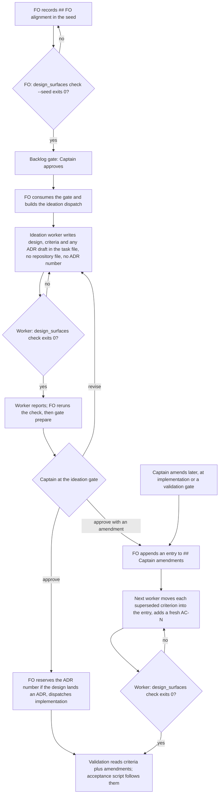

Four ideation-stage gaps from qnow dogfooding (2026-09-26..30) that each cost a worker round, a hand rewrite at a gate, or a drifting ADR number.

## Scope

Captain 2026-09-30, on the FO's split of batch C: 「可以」 — this task (issues #517, #518, #519, #529) first; #520 (whole-journey release re-review) waits for his journey-map alignment work; the package release waits for batch C.
Evidence (qnow and this repo): `dispatch build --stamp` succeeded for an entity with no `## FO alignment` section and the worker then held on `design_surfaces.py check`; after an approved ideation gate the Captain changed the direction, the superseded acceptance criteria stayed in force for `status --read --ac-scan`, and the FO rewrote the acceptance script by hand; `gate prepare` accepted a pilot ideation report with no `## FO alignment` section and the worker then held on `design_surfaces.py check`; after an approved ideation gate the Captain changed the direction, the superseded acceptance criteria stayed in force for `status --read --ac-scan`, and the FO rewrote the acceptance script by hand; `gate prepare` accepted a pilot ideation report with no `## Acceptance criteria` section; one ideation worker committed a draft ADR to a branch in the shared checkout and later designs kept ADR drafts inline with drifting numbers. Since then `number_guards.py reserve` (PR #533) reserves ADR numbers per task, and in this repo's last two tasks the FO recorded Captain amendments only in the gate reason and dispatch checklists.
Non-goals (ideation 2026-09-30): no Spacedock change and no upstream filing (0.27.2 has no dispatch-time or gate-prepare hook; a filing needs the Captain's word first); no check of the `Result:` line (whether alignment is "needed" is free text, so the worker's own stop rule stays the backstop); no ADR-number check inside design prose (a design may cite existing ADRs); no throwaway worktree for ideation; no script that moves acceptance criteria (a worker moves the blocks, the check only verifies); no adopter README re-sync in this task (a per-adopter three-way merge, the same follow-up review-cadence recorded; the package release waits for batch C); no rewrite of past tasks' acceptance criteria.

## Acceptance criteria

All evidence below is planned for implementation and validation unless it says "current". Numbers in Verified by are `design_surfaces.py` cases unless named otherwise.

**AC-1 — the FO learns the FO-alignment record is missing before it spawns the worker (#517).** `design_surfaces.py check --seed <task>` checks only what a seed owes before ideation is dispatched: the `## FO alignment` heading, a known `Surfaces:` value, a `Visible change:` line consistent with it. It exits 1 naming each defect. It does not ask for the artifacts a `ui` or `db` surface owes, which the worker authors. `workflow.md` `### backlog` says FO runs it before `gate prepare` on the five-stage route and holds the gate until it exits 0.
Verified by: (a) current, 0.27.2 in a `/tmp` workflow: `dispatch build --stamp` exit 0 for a seed with no `## FO alignment`, and the shipped `check` on a legitimate `Surfaces: ui` seed exits 1 for the missing `UI proposal:` and `Preview:`, so one mode cannot serve both moments. (b) `test_design_surfaces.py`: missing heading, missing `Surfaces:`, unknown value and contradictory `Visible change:` each exit 1 under `--seed`; a `ui` seed with no proposal exits 0 under `--seed` and 1 without it; mutations, one each, each failing its case: drop the heading rule from seed mode, and make seed mode run the artifact rules. (c) `test_sd_dispatch.py`: `dispatch show-stage-def --stage backlog`, built from the package `workflow.md` in a disposable repository, prints the step; a copy with the sentence deleted does not. Limit: an FO that skips the step still dispatches (the worker's check is the backstop that cost a round in #517); `Result:` is not checked.

**AC-2 — an ideation report cannot reach the gate without a usable `## Acceptance criteria` (#519).** `design_surfaces.py check <task>` (the command the worker and the FO already run before the gate) also exits 1 when the section is absent or declares no bold criterion (`AC-` plus an id between double asterisks), using the grammar Spacedock's `--ac-scan` reads: the first line that is exactly `## Acceptance criteria` (case-insensitive), to the next `## ` line, `**AC-<alphanumerics>[label]**` declarations. `skills/ideation/principles.md` states that grammar and the command.
Verified by: (a) current, 0.27.2: `gate prepare` exits 0 with `state=open` on a report whose task has no such section, and `--ac-scan` then exits 1 (`no ## Acceptance criteria section in this file`); on a plain `- AC-1:` list or an empty section `--ac-scan` exits 0 with no criterion at all, so its exit code alone cannot serve as the gate. (b) current, a `/tmp` prototype of the rule against the real 0.27.2 `--ac-scan` on 11 fixtures (absent, level-1 heading, plain list, empty, lowercase heading, trailing space, `**AC-1 (VALUE)**`, valid, and three amendment shapes): the two agree on "at least one criterion" in 11 of 11. (c) `test_sd_dispatch.py` runs a fixture list through the real `--ac-scan --json` and `design_surfaces.py check` and asserts they agree; `test_design_surfaces.py` covers each fixture; mutations, each failing a named case: accept `- AC-1:` as a declaration, drop the empty-section rule, match the heading case-sensitively, restore the column-zero anchor (validation cycle 1 found 976 of 8448 generated heading cases where a leading space, tab or no-break space or a trailing no-break space made `check` say "missing" where `--ac-scan` lists the ids; repaired to Spacedock's rule, any case with surrounding Unicode whitespace trimmed, and re-run on 17820 cases with 0 divergences).

**AC-3 — a Captain amendment has one supported record (#518).** `workflow.md` gains a `## Captain amendments` section that states the route. FO appends one entry per amendment to the task's `## Captain amendments` section (append-only): `### Amendment N — <date>, <gate or chat>`, `Captain:` his words verbatim with where he said them, `Supersedes:` the acceptance-criterion ids or `none`, optionally `Design:` the design paragraph it overrides. The next dispatched worker (implementation, or the repair worker on a feedback route) moves each superseded criterion's block verbatim into its entry, adds any replacement under a fresh id and never reuses an id. `design_surfaces.py check` exits 1 when an entry has no `Captain:` line or a superseded id is still declared in `## Acceptance criteria`.
Verified by: (a) current, 0.27.2: with a superseded criterion moved out of the section `--ac-scan` lists only the in-force ids; annotated in place (`**AC-2** (superseded ...)`) it still lists it as unevidenced; annotated in place plus one `- SKIPPED: AC-2 ...` bullet it lists it as evidenced with one citation. (b) `test_design_surfaces.py`: an entry without `Captain:` exits 1; a superseded id still declared exits 1 (this also refuses re-declaring the old id with new text); a relocated criterion, `Supersedes: none`, a task with no amendments and a task that shows an example record inside a fenced code block (this design does) exit 0, because the amendment rules skip fenced blocks; mutations: drop the disjointness rule, the `Captain:` rule, the fence skip (a `/tmp` prototype without the fence skip flagged this very design, 3 false findings). The `## Captain amendments` heading is matched like the criteria heading (any case, surrounding whitespace trimmed); a `## Captain Amendments` entry with no `Captain:` line and a still-declared superseded id exits 1, and a mutation making it case-sensitive fails that case. (c) `test_sd_dispatch.py`: the real `--ac-scan --json` lists no superseded id on the relocated fixture and lists it on the in-place fixture, and `check` agrees on both. Limit: the FO's record and the worker's move are prose steps; `check` refuses a state where the move was skipped, not a skipped record.

**AC-4 — the later stages and the Captain's acceptance script follow the amendment (#518), carried by `workflow.md`, not by a `principles.md` sentence.** `Captain amendments` is a `context-sections` entry of implementation and validation in `references/sd/workflow.md`, so a dispatched worker's stage definition holds the record format, the move rule, and the sentence that implementation and validation run `design_surfaces.py check <task>` (exit 1 is a repair finding through feedback). `skills/implementation/principles.md` and `skills/validation/principles.md` carry no amendment sentence.
Verified by: (a) measured at validation (cycle 1) on candidate 7e4798909fab, N=1 per arm, one Sonnet run each, from a scratch task whose design described the old flow and whose amendment superseded one criterion: the candidate arm and the origin/main 05b772b7 arm both wrote an acceptance script that follows the amendment and never runs the superseded behaviour. The design's own rule applied ("If the origin/main arm passes too, the sentences change nothing and are removed"), and the two sentences were removed in the repair commit de57e9137ef1; ADR 0005 Consequences records it. (b) `lint-skills.py` and `test_lint_skills.py` pass; the context-sections entries are proved by validation's run of `dispatch show-stage-def` for both stages with and without them. Limits: N=1 per arm, one model; the probe ran in the post-move state (the superseded criterion already relocated), so the effect of the FO's record before the move is unmeasured; it exercised the validation worker's acceptance script only, not the implementation worker's move duty; `check` running in the later stages now rests on the one `workflow.md` sentence.

**AC-5 — an ideation-time ADR draft lives in the task file with no number until FO reserves it (#529).** `skills/ideation/principles.md` says ideation writes no repository file, branch or commit; a design that lands an ADR names the ruling and the file's short title in its design, with no ADR number; FO reserves the number by `number_guards.py reserve --kind adr` when it dispatches implementation, and the implementation worker writes `docs/adr/<reserved number>-<short-title>.md`. `workflow.md` Number guards and Decision records say the same.
Verified by: (a) current: `number_guards.py reserve` needs no worktree: run from a `/tmp` checkout of origin/main 05b772b7 against the state directory it printed `ADR: 0005` (0004 is on that base) on 2026-09-30. (b) current, existing tests, run: `test_number_guards.py` cases `test_an_added_adr_number_the_task_did_not_reserve_is_refused` and `test_an_added_adr_number_already_on_the_base_is_refused` pass (17 tests, OK), so a drifted number cannot reach a candidate that runs `check`. (c) `lint-skills.py` and `test_lint_skills.py` pass. Limits: nothing in the package blocks an ideation worker from writing a file (ideation runs in the shared checkout by design, `worktree: false`); a wrong number in design prose is not detected; the sentence is the whole control for the no-file rule.

**AC-6 — the rules reach the FO, the worker and the adopter.** The FO steps (backlog check, amendment record, ADR reservation timing) live in `references/sd/workflow.md`; the worker rules live in the three stage `principles.md` files; `references/sd/adoption.md` says an adopter receives the FO steps by re-syncing its workflow README from `workflow.md`, and the worker rules and `design_surfaces.py` with the package. No new CI step: `test_design_surfaces.py` and `test_sd_dispatch.py` already run in `.github/workflows/kc-dev-flow-2-tests.yml`.
Verified by: `lint-skills.py` and `test_lint_skills.py` pass; `test_sd_dispatch.py` (AC-1(c)) proves the README text reaches a stage definition; `doc_impact.py <base> <candidate>` lists `README.md` of the package and each listed document carries `updated` or `unaffected: <reason>`.

**AC-7 — the ruling is an ADR.** One ADR for the Captain's ruling on the amendment route (his words verbatim, options considered: FO record plus worker move, FO applies the move itself, routed re-ideation), the seed and criteria checks, and the unnumbered ideation draft, `docs/adr/<reserved number>-<short-title>.md`, number reserved under `## Number guards` by FO at implementation dispatch (`reserve` printed 0005 on 2026-09-30; FO records what it prints then).
Verified by: `python3 <package>/scripts/adr_lint.py docs/adr --require <number>` exits 0; `number_guards.py check` exits 0.

## FO alignment

Needed at ideation: where the FO learns before spawning an ideation worker that the task lacks `## FO alignment`; where a missing `## Acceptance criteria` section is caught before an ideation gate opens; a supported way to record a Captain amendment that supersedes named acceptance criteria and that later stages, the acceptance script and `--ac-scan` respect; where ideation-time ADR drafts live and how their number relates to `number_guards.py reserve`.
Result: the FO delegates these questions to ideation, which decides each with its source and returns any ruling that needs the Captain.
Surfaces: none
Visible change: none

## Design (ideation, 2026-09-30)

### PRFAQ

**Proposition.** An ideation stage stops at the cheapest point that can catch each of the four gaps. The FO checks the seed before it dispatches a worker, the worker and the FO run one command that refuses a design without a usable acceptance-criteria section, a Captain amendment has one written place and a check that refuses a half-applied one, and an ADR draft stays in the task file with no number until the FO reserves one. Nothing changes in Spacedock.

**FAQ**

- *What does Spacedock 0.27.2 already offer for each gap?* Nothing that reads the task body. Checked in a `/tmp` workflow on the installed 0.27.2 binary and in a source extract of tag v0.27.2: `dispatch build --stamp` validates the request and that the entity's status equals the stage, then builds (exit 0 with no `## FO alignment`); the only mod hooks are `startup`, `idle` and `merge`; `context-sections` names sections of the workflow README, not of a task; `status --validate` reads frontmatter; `gate prepare` binds the artifact and exit 0 with no acceptance-criteria section; `--ac-scan` runs after prepare. v0.27.3 only adds release-tooling commits over v0.27.2. Upstream has related open issues (spacedock-dev/spacedock #765 the producer side of the heading grammar, #766 and #793 `--ac-scan` evidence edge cases), which the parity test in AC-2 would catch if they change the grammar.
- *Why not run `--ac-scan` before `gate prepare` and stop there for #519?* Its exit code covers only an absent or level-1 heading. A plain `- AC-1:` list and an empty section exit 0 with zero criteria (spike, 0.27.2). The new rule checks "at least one declared criterion", which is what the gate needs, and it rides on the command the worker and FO already run.
- *Why is `--seed` a second mode?* The first moment (FO, before the worker exists) owes only the FO-alignment record; the second (worker done, gate) owes the artifacts a `ui` or `db` surface names and the criteria. The shipped check on a valid `ui` seed exits 1 (spike), so one mode cannot serve both. The FO records `## FO alignment` before the backlog gate, so the backlog gate is the earliest point; the `Result:` line arrives after that gate and is not checked.
- *What happened to amendments in this repo?* dispatch-and-report-hygiene: at the validation gate the Captain added "every dispatch carries the absolute package root" (「准」 with the requirement in the gate reason); AC-1..AC-6 kept their text, the requirement lived in the reason and in the dispatch checklists. review-cadence: the ideation gate was approved 15:43 with two amendments in the reason; the FO's implementation checklist said "Update the design text, ACs and acceptance script to match both amendments"; the implementation worker's state commit 1f3c19f6 (15:53, nine minutes after dispatch) rewrote 65 lines, so AC-3 changed from "a declared maximum" to "defaults to 5 percent" and the wording the Captain approved survives only in git history. Both routes worked by luck of a careful checklist; neither leaves a reader able to tell which criteria are in force, what the Captain approved, and what he changed.
- *Why relocate a superseded criterion instead of annotating it?* Annotating in place leaves `--ac-scan` listing it as unevidenced; adding one `- SKIPPED: AC-2 superseded` bullet makes it "evidenced" (one citation) but the bullet must be repeated in every later stage report and the gate then shows a superseded criterion as covered. Relocation is one edit, keeps `## Acceptance criteria` meaning "in force", and needs nothing in the reports (all three measured, AC-3(a)).
- *Why does the FO record and a worker move?* Spacedock's FO write scope keeps a task body's design and criteria with dispatched workers, and this workflow's `### ideation` says an FO correction preserves acceptance criteria. The FO already writes two sections of the task (`## FO alignment`, `## Number guards`) by README grant; the amendment record is the same class (the Captain's words, nothing added), while moving and rewriting criteria is worker work. The alternatives are in Needs the Captain.
- *And an amendment while the ideation gate is still open?* Not an amendment: he calls `revise` and the ideation worker reworks the design (0.27.2: `gate record --decision revise` closes the attempt and leaves the status at `ideation`, spike). `## Captain amendments` is for a design he has accepted.
- *Why leave the ADR number to implementation dispatch, and not a throwaway worktree?* `reserve` prints one above the base tip and every task's `ADR:` lines; a number reserved at ideation would sit for the whole implementation and validation window while the base moves, so a late number is the fresher one, and a draft with no number cannot drift. A worktree for ideation would create a branch per task, most of which land no ADR, and the draft file would still need a number. `adr_lint.py` takes a directory, so a draft inside the task file is not linted until the implementation worker writes the file; validation lints it then, as today.
- *What does this cost per PR?* No new CI step or trigger: the two test files already run in `kc-dev-flow-2-tests.yml`. Duration not measured.

### Flow



Stops: the FO holds the backlog gate while `--seed` exits 1; the worker does not report while `check` exits 1; a `check` exit 1 after an amendment is a repair finding returned through feedback. Approvals stay the Captain's: the FO records his words and adds none.

### Chain check (what exists, where)

| Layer | Found | Consequence |
| --- | --- | --- |
| Spacedock 0.27.2 (binary and v0.27.2 source) | No dispatch, gate-prepare or task-body hook; `--ac-scan` grammar in `internal/status/gate_extract.go`; `gate record --decision revise` re-opens ideation; a consumed approval is spent and `status --set status=ideation` succeeds but is not a documented route | Package-side FO step plus script; no upstream change |
| `kc-dev-flow-2` on origin/main 05b772b7 | `design_surfaces.py check` (FO alignment, surfaces) run by worker and FO; `number_guards.py reserve` and `check` (R4, R5); ideation principles already stop the worker on a missing `## FO alignment`; #536 (review cadence, ADR 0004) is merged | Extend the existing check; reuse `reserve` unchanged |
| `kc-dev-flow` (v1) | `--ac-scan` used only by `poc-close-guard.py`; no amendment or seed-check convention (grep for amend and supersede: none relevant) | Nothing to borrow |
| Adopters: qnow and qnow-adopt-dev2 (dev2), subspace-relay and carlove (docs greps only) | Grep of each `docs/` for `Captain amend`, `## Amendments`, `Amended by`, `Supersedes: AC-`, `design_surfaces`, `number_guards`: no amendment convention in qnow, subspace-relay or carlove; the matches in subspace-v0 state files were not read | Nothing to borrow; dev2 adopters take the FO steps by README re-sync |

### Package change (implementation scope)

| File | Change |
| --- | --- |
| `scripts/design_surfaces.py` | `--seed` mode (FO-alignment rules only); default mode adds the acceptance-criteria rule and, when `## Captain amendments` exists, the `Captain:` and disjointness rules; about 40 lines |
| `scripts/test_design_surfaces.py`, `scripts/test_sd_dispatch.py` | Cases and mutations in AC-1..AC-3; the parity fixtures run against the real `--ac-scan` |
| `references/sd/workflow.md` | `### backlog` FO step; new `## Captain amendments` section (record format, who records, who moves); Number guards and Decision records: ideation drafts carry no number |
| `skills/ideation/principles.md` | Exact acceptance-criteria grammar; no repository file, branch or commit from ideation; ADR draft inline and unnumbered |
| `skills/implementation/principles.md`, `skills/validation/principles.md` | No amendment sentence: the AC-4 probe passed on the origin/main arm too, so the design's own without-it rule removed them |
| `references/sd/adoption.md`, package `README.md` | Delivery note (AC-6); affected-document entries |
| `docs/adr/<reserved>-<short-title>.md` | AC-7 |

Amendment record, as FO writes it (the worker's move adds the `Superseded text:` block):

```
## Captain amendments

### Amendment 1 — 2026-09-30, ideation gate approval
Captain: 「<his words, verbatim>」 (gate resolution reason, or chat with date)
Supersedes: AC-2
Design: the paragraph under "Flow" no longer applies
Superseded text:
**AC-2**: <the old block, verbatim, with its Verified by>
```

The replacement criterion is appended to `## Acceptance criteria` as a new `**AC-N**` line that says "Amended by Captain, amendment 1".

### Needs the Captain

1. **Who moves the criteria after an amendment** (material, changes who may edit accepted criteria). Recommended A: the FO records his words in `## Captain amendments`; the next dispatched worker moves the superseded block and writes the replacement. B: the FO also moves and rewrites (adds a new FO write to accepted criteria, which `### ideation` forbids today, and puts his intent through the FO's paraphrase). C: routed re-ideation for each amendment (`status --set status=ideation` after a spent approval is not a documented route, and costs a gate attempt and a worker round for text he has already stated). Under A the cost is that between the record and the worker's move the task shows both; nothing reads it then (the next `--ac-scan` and `check` run after the worker's report).
2. Optional, no ruling needed unless he wants it different: AC-4(b) is a live model probe (N=1 per arm) at validation; the earlier live check (dispatch-and-report-hygiene AC-6) took three validation cycles because of an installed-package confound. Recommended: keep it, since it is the only evidence that the worker sentences change behaviour; strike it at the gate to accept text-only evidence. Resolved at validation: both arms passed, the design's own rule removed the sentences (AC-4).

### Captain's minimal acceptance script (for the implementation candidate)

Set `PKG` to the candidate's `kc-dev-flow-2` directory (worktree `.worktrees/spacedock-ensign-ideation-gaps`, commit `de57e9137ef1`) and `SD` to the activated Spacedock plugin root, the directory that contains `mods/pr-merge.md` (`spacedock` 0.27.2 must be on PATH).

1. `python3 $PKG/scripts/test_design_surfaces.py` ends with `OK` (22 tests); it covers the seed mode, the criteria rule (with its heading-whitespace fixtures) and the amendment rules with their mutation cases.
2. `python3 $PKG/scripts/test_sd_dispatch.py --sd-plugin-root $SD` exits 0 and its last PASS line reads "criteria and amendment fixtures agree with the real --ac-scan"; those cases ran the real `spacedock status --read --ac-scan` on the fixtures.
3. In an empty directory, write `task.md` holding `# T`, then `## FO alignment` with `Surfaces: none` and `Visible change: none`, and no acceptance criteria. `python3 $PKG/scripts/design_surfaces.py check task.md` prints `task.md: missing '## Acceptance criteria' section` and exits 1. Append `## Acceptance criteria` and `**AC-1**: x`; it prints `design surfaces presentable` and exits 0.
4. Append `## Captain amendments`, `### Amendment 1`, `Captain: 「x」` and `Supersedes: AC-1`. `check` prints `'### Amendment 1' supersedes AC-1 but it is still declared in '## Acceptance criteria'` and exits 1. Replace `**AC-1**: x` with `**AC-2**: y` (in a real task the old block moves under `Superseded text:` in the entry); it exits 0.
5. Write `seed.md` with `## FO alignment`, `Surfaces: ui` and `Visible change: a user sees a label`, no `UI proposal:`. `check --seed seed.md` prints `FO alignment recorded` and exits 0; `check seed.md` exits 1 naming the missing `UI proposal:`, `Preview:` and `## Acceptance criteria`.
Not covered: that an FO follows the steps (prose), that a worker's script follows an amendment before the move (AC-4(a), one post-move probe), and that ideation writes no repository file (no enforcement point).

## Number guards

ADR: 0005

## Stage Report: ideation

- DONE: (1) Where the FO learns before spawning an ideation worker that the task lacks `## FO alignment`, and what Spacedock 0.27.2 already offers
  AC-1: FO runs `design_surfaces.py check --seed` before the backlog `gate prepare`; Spacedock 0.27.2 has no task-body hook (`dispatch build --stamp` exit 0 with no section, hooks are startup/idle/merge only), current spike; the tests and mutations are planned, not run.
- DONE: (2) Where a missing `## Acceptance criteria` section is caught before an ideation gate opens
  AC-2: the default `check` (worker and FO already run it) gains the criteria rule; current: `gate prepare` exit 0 with no section, and a `/tmp` prototype agrees with the real `--ac-scan` on 11 of 11 fixtures; the shipped-script tests and mutations are planned.
- DONE: (3) A supported way to record a Captain amendment that later stages, the Captain acceptance script and `status --read --ac-scan` respect
  AC-3: `## Captain amendments` (FO records his words, next worker moves the superseded block, `check` refuses a half-applied state); AC-4: implementation and validation principles plus one N=1-per-arm probe; measured now: relocating drops the id from `--ac-scan`, annotating does not; probe not yet run.
- DONE: (4) Where ideation-time ADR drafts live and how their number relates to `number_guards.py reserve`
  AC-5: draft in the task file, no number, FO reserves at implementation dispatch (`reserve` printed `ADR: 0005` from a `/tmp` checkout of origin/main 05b772b7, run now); existing R4 and R5 tests pass (17 OK); the no-file rule has no enforcement point, stated as a limit.
- DONE: Check the chain first (spacedock dispatch build, gate prepare, status --read --ac-scan, feedback reflow; kc-dev-flow-2 on origin/main; kc-dev-flow and adopters)
  Chain-check table in the Design: v0.27.2 binary and source read, `revise` and `status --set` behaviour probed in a `/tmp` workflow, kc-dev-flow (v1) and adopters grepped; open Spacedock issues #765, #766, #793 noted; both earlier tasks' amendment history read from the state log (review-cadence commit 1f3c19f6).
- DONE: ACs with evidence plans — AC-6 (the rules reach the FO, the worker and the adopter), AC-7 (the ruling is an ADR)
  AC-6: not yet verified, planned `lint-skills.py`, `test_sd_dispatch.py` and `doc_impact.py`; AC-7: not yet verified, planned `adr_lint.py --require` and `number_guards.py check`; no new CI step, both test files already run in `kc-dev-flow-2-tests.yml`.
- DONE: Whether an ADR is needed (number by `number_guards.py reserve`, not assumed)
  Yes, one (AC-7); `reserve` printed `ADR: 0005` on 2026-09-30 against origin/main 05b772b7; not recorded here, FO reserves at implementation dispatch.
- DONE: What needs the Captain
  One ruling: who moves the criteria after an amendment (recommended: FO records, next worker moves); one optional strike: the live probe in AC-4.
- DONE: The Captain-run minimal acceptance script
  Five steps in the Design, each an exact command with its expected exit code, plus what it does not cover.
- DONE: Run `python3 <package>/scripts/design_surfaces.py check <task>` and cite its output
  `python3 <origin/main package>/scripts/design_surfaces.py check ideation-gaps.md` printed "ideation-gaps.md: design surfaces presentable", exit 0 (the rules AC-2 and AC-3 add do not exist in that script yet).

### Summary

Nothing needs a Spacedock change: 0.27.2 reads no task body at dispatch or gate prepare, so the design extends `design_surfaces.py` with a `--seed` mode, a criteria rule and an amendment rule, adds FO steps to `workflow.md`, and adds short worker rules. The amendment route rests on one measured fact (moving a superseded criterion out of the section is the only form `--ac-scan` respects without a per-stage bullet) and one Captain ruling (FO records, next worker moves). Throwaway checkouts under `/tmp` are removed.

## Stage Report: implementation

- DONE: Implement ideation-gaps' approved design (Captain 2026-09-30 「准」, option A: the FO records his words in `## Captain amendments`, the next dispatched worker moves superseded criteria; the AC-4(b) live probe stays for validation): every row of the design's "Package change" table.
  All seven rows are in commit 7e4798909fab (base 05b772b7, branch spacedock-ensign/ideation-gaps): design_surfaces.py, its two test files, workflow.md, the three principles.md, adoption.md plus README.md, ADR 0005.
- DONE: Every AC with the evidence its "Verified by" names that implementation can produce, including each named mutation and the parity cases against the real `spacedock status --read --ac-scan`; AC-4(b) is validation's, do not run it.
  Per-AC lines below; test_design_surfaces.py 19 OK (7 mutation cases), test_sd_dispatch.py exit 0 on spacedock 0.27.2 (its criteria and amendment cases fail against the old design_surfaces.py and against a disjointness mutation, run).
- DONE: ADR 0005 in docs/adr (the task's `## Number guards` holds `ADR: 0005`); the decider's words are the Captain's 「准」 at the ideation gate on 2026-09-30 with option A.
  docs/adr/0005-a-captain-amendment-is-recorded-by-fo-and-moved-by-the-next-worker.md; `adr_lint.py docs/adr --require 0005` exit 0 (5 ADRs); Words line is 「准」 plus the FO-recorded gate reason.
- DONE: Follow this repo's CLAUDE.md: Conventional Commits scoped `feat(kc-dev-flow-2): …`, no version edits, stage files explicitly; the candidate's own `kc-dev-flow-2/scripts/comment_ratio.py` from 05b772b7 to the candidate exits 0; `/Users/kent/.claude/plugins/local/kc-dev-flow-2/scripts/doc_impact.py` reported; exact candidate SHA; the Captain-run minimal acceptance script rewritten against the shipped text.
  Candidate 7e4798909fabd69fc6b3fc95ec92199f02efbbca, ten files staged by name, no version edits; comment_ratio "code lines 252, comment lines 6, 2.4%" exit 0 (the 6 are `##` heading lines inside test fixtures); number_guards check PASS, base 05b772b7 head 7e4798909fab; doc_impact listed README.md (updated) and references/sd/adoption.md (updated); acceptance script in the Design section rewritten and its steps 3-5 run in an empty directory.
- DONE: AC-1 the FO learns the FO-alignment record is missing before it spawns the worker
  `check --seed` in design_surfaces.py; SeedModeTests (4 refusal cases exit 1, ui seed exit 0 under --seed and 1 without, and mutations dropping the heading rule and running artifact rules in seed mode each fail their case); test_sd_dispatch prints the backlog stage definition with the seed step and a copy without the bullet prints none; limit as designed, a skipping FO still dispatches.
- DONE: AC-2 an ideation report cannot reach the gate without a usable `## Acceptance criteria`
  CriteriaTests (11 fixtures, mutations accepting `- AC-1:`, dropping the empty rule, case-sensitive heading each fail); test_sd_dispatch runs 10 fixtures through the real `--ac-scan --json` and the shipped check and asserts the same verdict; I probed the grammar first (bold must close without an inner `*`, heading ends at the next `## ` line, fences not skipped) and the rule follows it.
- DONE: AC-3 a Captain amendment has one supported record
  AmendmentTests (no `Captain:` line or empty words, superseded id still declared including a re-declared id, relocated/none/no-amendment/fenced example exit 0; mutations dropping disjointness, the Captain rule and the fence skip each fail); real `--ac-scan` lists AC-1 only on the relocated fixture, lists AC-2 in place, and as evidenced with a SKIPPED bullet, and `check` exits 0, 1, 1.
- DONE: AC-4 the later stages and the Captain's acceptance script follow the amendment
  (a) implementation and validation principles.md carry the sentence, lint-skills.py exit 0 and test_lint_skills.py 21 OK, text presence only; (b) the live N=1-per-arm probe is validation's and was not run.
- DONE: AC-5 an ideation-time ADR draft lives in the task file with no number until FO reserves it
  ideation principles.md, workflow.md `### ideation`, Decision records and Number guards say it; test_number_guards RecheckTests.test_an_added_adr_number_the_task_did_not_reserve_is_refused and ...already_on_the_base_is_refused OK (17 tests OK); lint-skills and test_lint_skills OK; limit: the no-file rule has no enforcement point, the sentence is the whole control.
- DONE: AC-6 the rules reach the FO, the worker and the adopter
  FO steps in workflow.md, worker rules in the three principles.md, adoption.md new section and README.md updated; no CI change; test_sd_dispatch proves the README text reaches a stage definition; test_poc_readme 4 OK after keeping the word "ideation" out of every shared section.
- DONE: AC-7 the ruling is an ADR
  ADR 0005 committed; `adr_lint.py docs/adr --require 0005` exit 0 and `number_guards.py check` exit 0.

### Summary

Every Package-change row is implemented in one commit; the real `ideation-gaps.md` itself passes the new `check` (its fenced example record is skipped, the false-positive class the design named). One addition is outside the table: `Captain amendments` is now a `context-sections` entry of implementation and validation in workflow.md so a worker sees the record format and the move rule without opening the README; validation may weigh it as a decision, not an unmapped surface. Limits: AC-4(b) is not run; that FO records an amendment, runs the seed check and that ideation writes no repository file are prose with no enforcement point (`check` refuses only a skipped move).

## Stage Report: validation

- DONE: Independent verdict on candidate 7e4798909fabd69fc6b3fc95ec92199f02efbbca (branch spacedock-ensign/ideation-gaps, base 05b772b7) against ideation-gaps' approved design, AC-1..AC-7 and the Captain's ruling
  Recommend PASSED with one Needs-decision item (AC-4(b) control arm also passes, below) and two Deferred risks; each AC's reproducible evidence held on a `git archive` copy at the candidate SHA; worktree `git status --short` empty before this report.
- DONE: Reproduce yourself on a `git archive` copy: the CI suite list, each named mutation in AC-1..AC-3, the parity cases against the real `spacedock status --read --ac-scan --json`, the Captain acceptance script as written, the shipped `check` on this task file and this repo's other state task files
  CI list all exit 0 (Spacedock v0.27.2 root at commit 4d158a48 plus binary 0.27.2; test_design_surfaces 19 OK, test_sd_dispatch 6 PASS lines incl. "criteria and amendment fixtures agree"); 8 named mutations plus 3 extra (`--seed` ignored in main, criteria never checked, amendments never checked) applied one at a time to the script, each fails at least one non-mutation behavioural case (M3/M4/M5/M6 also fail test_sd_dispatch parity), and deleting the `Seed check` bullet from workflow.md fails test_sd_dispatch; acceptance steps 1-5 ran as written with the printed messages and exits stated; `check` on ideation-gaps.md and 8 other state tasks (archive included) gives byte-identical output at base and candidate, so no false positive from the new rules (the state README.md is not a task).
- DONE: Judge the implementation's addition outside the design table (`Captain amendments` in `context-sections` of implementation and validation) as a finding: keep, or a surface the Captain did not approve
  Keep, not a new surface: with the entry the `## Captain amendments` section (about 22 lines) is in `dispatch show-stage-def` for both stages, without it (both entries removed, run) neither stage definition contains the record format or the move rule, so it is the only way the FO-recorded/worker-moves route of the approved option A reaches a dispatched worker; cost is those lines in every implementation and validation dispatch, amendments or not, not measured in tokens; coupled to the AC-4(b) item: if the principles sentences are removed this stays the only path.
- DONE: Run AC-4(b), one Sonnet run per arm, same prompt and same scratch task in /tmp, arm 1 candidate snapshot, arm 2 origin/main 05b772b7
  Both arms passed: each printed its own `PACKAGE_ROOT:` (`/tmp/gaps-val/cand/kc-dev-flow-2`, `/tmp/gaps-val/base/kc-dev-flow-2`, from the skill's `Package root:` line), each script runs `python3 greet.py Ada --loud` expecting `HELLO, ADA!!!` and never runs `--shout`; candidate: "AC-2 and `--shout` are withdrawn by Amendment 1", base: "It does not check the superseded `--shout` flag (AC-2). It was dropped by amendment 1"; the control arm passing means the design's AC-4 and ADR 0005's Consequences both name this outcome (sentences "change nothing and are removed", "Reopen if the live probe ... shows the worker sentences change nothing"): Needs decision (Captain), `value-ac[AC-4]`; limits: N=1 per arm, the scratch task was in the post-move state (AC-2 already relocated, so both arms read only in-force criteria), no stage definition was inlined as FO dispatch does, and the probe tests the validation sentence only, not the implementation worker's move duty; effect in the pre-move state is unmeasured, not zero.
- DONE: ADR 0005 with adr_lint and its Words against the gate record; every added comment line; `comment_ratio.py` (the candidate's own) from 05b772b7; `doc_impact.py`
  `adr_lint.py docs/adr --require 0005` exit 0 (5 ADRs) and `number_guards.py check` PASS; Words line 「准」 plus option A matches the ideation gate resolution reason verbatim; zero Python `#` comments added (tokenize diff of the three scripts: base 1/0/5, candidate 1/0/5), `comment_ratio.py` reports 6 of 252 (2.4%, maximum 5% met, exit 0) which are markdown `##` lines inside test-fixture string literals, not comments; `doc_impact.py` lists `README.md` and `references/sd/adoption.md`, both changed by the candidate, no CI change.

### Summary

Recommend PASSED with a Captain ruling pending: every AC's evidence reproduced, all named mutations were caught, the Captain acceptance script ran as written, and the shipped check adds no finding to any state task in this repository; nothing found is Material (no supported-workflow harm shown). Needs the Captain: AC-4(b)'s control arm also passes, which the approved design and ADR 0005 name as the trigger to remove the worker sentences in `skills/implementation/principles.md` and `skills/validation/principles.md` and to reopen the ADR, decided with the unmeasured pre-move state and the `context-sections` coupling in view; nothing was changed. Deferred risks for FO to decline or route:
- Heading parity: 8448 generated cases (16 heading forms x 22 declaration forms x 8 terminators x 3 prefixes) against the real `--ac-scan` id set gave 976 divergences, all one class, a heading with leading space, tab or NBSP or a trailing NBSP. Spacedock's `findAcceptanceCriteria` does TrimSpace plus EqualFold, `AC_HEADING` is anchored at column 0 and trims only `[ \t\r]`, so `check` says "missing section" where `--ac-scan` lists the ids (stricter, never a false pass). The shipped parity test has no such fixture and ideation `principles.md` says "exactly that heading". Would become material if an ideation worker indents the heading and the gate holds on a task the scan reads fine; fix direction `^\s*## Acceptance criteria\s*$` plus one fixture.
- Amendments heading: `AMENDMENTS_HEADING` is case-sensitive while `AC_HEADING` is not; a task with `## Captain Amendments`, an entry with no `Captain:` line and a still-declared superseded id exits 0 (run). Would become material if an FO writes the heading in another case and the half-applied state the check exists to refuse passes; one-flag fix (`re.I`).
Scratch under `/tmp/gaps-val` only.

## Stage Report: implementation (cycle 2)

- DONE: Apply the three FO-routed repairs on top of candidate 7e4798909fabd69fc6b3fc95ec92199f02efbbca in the same worktree, keeping everything else shipped; update AC-4, the acceptance script and ADR 0005 where they change
  New candidate de57e9137ef1b4afa13c50be5ef512965eee6513 (one commit on spacedock-ensign/ideation-gaps, eight files staged by name, no version edits); AC-4, the Package-change row, AC-2/AC-3 evidence, the acceptance script (SHA, 22 tests) and ADR 0005 Decision and Consequences rewritten.
- DONE: Repair 1: remove the AC-4 sentences from the implementation and validation principles.md, keep `Captain amendments` in context-sections, rewrite AC-4 and ADR 0005 Consequences with the measured result and the stated limit
  Both paragraphs deleted; lint-skills.py exit 0 and test_lint_skills.py 21 OK; AC-4 now states both arms passed and the limit (post-move state only, pre-move unmeasured); one judgment for FO: the "run `check`, exit 1 is a repair finding" clause lived only in those sentences, so I moved that one clause into the `workflow.md` `## Captain amendments` section rather than lose it.
- DONE: Repair 2: heading parity with Spacedock's findAcceptanceCriteria, fixtures in test_sd_dispatch.py and test_design_surfaces.py, ideation principles.md wording
  `AC_HEADING` is now anchored on Go's whitespace set (`GO_SPACE`, case-insensitive); test_sd_dispatch's parity list gained leading space, leading tab, leading and trailing NBSP, uppercase and "two spaces inside" and agrees with the real 0.27.2 `--ac-scan --json`; restoring the old anchor makes test_sd_dispatch exit 1 at 'leading space' (run) and `test_mutation_restoring_the_column_zero_anchor_fails_its_cases` fails the same four cases; the validation fuzz extended with NBSP, U+3000, VT/FF, NEL, U+2028, U+202F, ZWSP, BOM and C0 separators gave 17820 cases, 0 divergences; ideation principles.md says "equals that heading in any case once surrounding whitespace is trimmed".
- DONE: Repair 3: case-insensitive `## Captain amendments` heading with its case and mutation
  `AMENDMENTS_HEADING` now uses `re.I` and the same whitespace class; `test_the_amendments_heading_matches_in_any_case_and_with_surrounding_space` (four heading forms, each still refused for a missing `Captain:` and a still-declared id) fails on the mutant made by `test_mutation_matching_the_amendments_heading_case_sensitively_fails_its_case`, which exits 0 without the flag; a scratch task with `## Captain Amendments` now exits 1 (run).
- DONE: Rerun the CI workflow's suite list, comment_ratio from 05b772b7, doc_impact, adr_lint on 0005, new candidate SHA
  lint-skills, test_lint_skills (21), test_design_surfaces (22), test_adr_doc_checks, test_poc_readme, test_comment_ratio, test_number_guards, test_learning and test_sd_dispatch.py (Spacedock v0.27.2 root at 4d158a48, binary 0.27.2) all exit 0; `comment_ratio.py 05b772b7 HEAD` "code lines 285, comment lines 6, 2.1%" exit 0 (the 6 are `##` lines in test fixtures, no `#` comment added); doc_impact lists README.md and references/sd/adoption.md, both changed by the candidate since 05b772b7 (updated); `adr_lint.py docs/adr --require 0005` exit 0; `number_guards.py check` PASS at head de57e9137ef1.

### Summary

The three routed repairs are in one commit on top of the validated candidate: the two worker sentences are gone (the workflow.md context-sections entry stays and now carries the run-`check` clause), both headings match Spacedock's rule, and every named mutation fails its case. Limits: AC-4's probe was N=1 per arm in the post-move state, and the heading rule follows `findAcceptanceCriteria` as read in Spacedock 0.27.2 (the parity test and the fuzz fail if a release changes it).

## Stage Report: validation (cycle 2)

- DONE: Re-review candidate de57e9137ef1b4afa13c50be5ef512965eee6513 (one commit on 7e4798909fab) against the three FO-routed repairs; cycle 1's other results stand unless this diff touches them
  Recommend PASSED: the diff (8 files, one commit) touches only the two headings, the two removed sentences, one workflow.md clause, AC-4, ADR 0005 and their tests; nothing found is Material; worktree `git status --short` empty, HEAD de57e9137ef1.
- DONE: Reproduce on a `git archive` copy: the CI suite list (Spacedock v0.27.2 root at 4d158a48, binary 0.27.2)
  lint-skills, test_lint_skills (21), test_design_surfaces (22), test_adr_doc_checks (5), test_poc_readme (4), test_comment_ratio (14), test_number_guards (17), test_learning (33) and test_sd_dispatch (6 PASS lines) all exit 0.
- DONE: The principles sentences gone and lint green
  `grep -i amendment` over `skills/` finds nothing; lint-skills and test_lint_skills exit 0; `dispatch show-stage-def` on the candidate workflow.md for implementation (216 lines) and validation (226) each carries the `## Captain amendments` section and the run-`check` clause once (run in /tmp/gaps-val2/sdstage).
- DONE: New heading fixtures agree with the real `spacedock status --read --ac-scan --json` and fail when the old column-0 anchor is restored
  test_sd_dispatch parity (leading space/tab/NBSP, trailing NBSP, uppercase, two-spaces-inside) passes against the real scan; with `AC_HEADING` restored to `^## Acceptance criteria[ \t\r]*$` it aborts at 'leading space' and test_design_surfaces fails the four whitespace cases plus its own mutation test.
- DONE: The amendments-heading case and its mutation
  `## Captain Amendments` with no `Captain:` and a still-declared id exits 1 with both messages on the candidate and 0 on a copy without `re.I`; that copy fails three test_design_surfaces cases, the mutation test and the any-case test (two headings).
- DONE: Rerun the cycle-1 heading fuzz against the candidate and report divergences
  cycle-1 fuzz (8448 cases): 0 divergences (was 976); the extended fuzz (17820 cases, adds NBSP, U+3000, VT/FF, NEL, U+2028, U+202F, ZWSP, BOM, C0): 0 divergences; a new 18-heading case-folding probe finds 4 divergences, `crİterİa`, `crİteria`, `crıterıa`, `crıteria` (finding 2).
- DONE: Judge the implementer's one judgment call (the run-`check` clause moved into workflow.md `## Captain amendments`)
  Keep (finding 1, Polish): it is one sentence in the section both stages already inline, AC-4 as rewritten names workflow.md as the carrier of exactly that sentence, and it adds no surface the Captain did not approve; no test asserts it reaches a stage definition, only my run above does.
- DONE: ADR 0005 and AC-4 against the measured probe result and its stated limit; `adr_lint`; added comment lines; `comment_ratio.py`; the Captain acceptance script as written
  `adr_lint.py docs/adr --require 0005` exit 0; ADR Words 「准」 matches the gate reason; `comment_ratio.py 05b772b7 de57e913` (candidate's script) 285 code, 6 comment, 2.1%, exit 0, the 6 are markdown `##` lines in test-fixture strings, the diff adds no Python `#` comment; `doc_impact.py` lists README.md and adoption.md, both changed; acceptance steps 1-5 ran as written with the stated messages and exits; ADR/AC-4 state the result and "N=1 per arm, one model, post-move state", but see finding 4.
- DONE: Findings (none Material; each Deferred risk or Polish, FO may decline within existing risk acceptance)
  1 Polish: judgment call above. 2 Deferred risk: Python `re.I` folds `İ`/`ı` to `i` and Go `EqualFold` does not, so `check` accepts a heading `## Acceptance crİteria` that `--ac-scan` reads as no section (the lenient direction: gate opens, scan then fails); trigger hypothetical (needs a dotted or dotless capital i typed into the heading), material only if a worker types one; the same divergence already existed at 7e4798909fab; fix direction `re.I | re.A` on `AC_HEADING` (verified 0 of 18 diverge, test_design_surfaces then fails only the case-sensitive-mutation test, whose replace string must follow) plus one fixture. 3 Polish: adoption.md still says the worker rules arrive with the package, but the amendment worker rule now reaches a worker only through the README re-sync (an un-synced adopter also has no FO record step, so no new loss). 4 Polish: AC-4's and ADR 0005's limits omit that the probe exercised the validation script only, not the implementation worker's move duty (cycle 1 recorded it), and ADR 0005 says the sentences were removed "as this decision said"; the design said it, the ADR only named the reopen condition.

### Summary

Recommend PASSED: the three routed repairs hold, all named and new mutations are caught, the heading fuzz goes from 976 divergences to 0 on both corpora, and the Captain acceptance script ran as written. One new Deferred risk (case-folding of `İ`/`ı`) and three Polish items are for FO to decline or route; nothing is Material. Scratch under `/tmp/gaps-val2` only; the code worktree is unchanged.

### Polish fix

FO-authorized docs-only fix on de57e9137ef1, new candidate 797e77296b91a590cf75438fcd6ec9302d8083f3: `references/sd/adoption.md` says the amendment rule (record format, move duty, run-`check` clause) reaches a worker through the workflow README re-sync, not with the package; ADR 0005 and AC-4 add that the probe exercised the validation worker's acceptance script only, not the implementation worker's move duty, and ADR 0005 replaces "as this decision said" with the approved design's removal condition and the ADR's reopen condition. `adr_lint.py docs/adr --require 0005`, `lint-skills.py` and `test_adr_doc_checks.py` exit 0.
