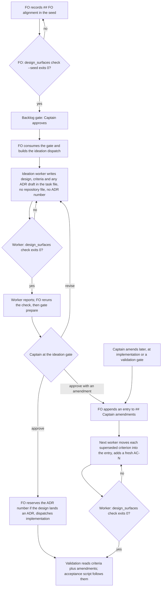

Four ideation-stage gaps from qnow dogfooding (2026-09-26..30) that each cost a worker round, a hand rewrite at a gate, or a drifting ADR number.

## Scope

Captain 2026-09-30, on the FO's split of batch C: 「可以」 — this task (issues #517, #518, #519, #529) first; #520 (whole-journey release re-review) waits for his journey-map alignment work; the package release waits for batch C.
Evidence (qnow and this repo): `dispatch build --stamp` succeeded for an entity with no `## FO alignment` section and the worker then held on `design_surfaces.py check`; after an approved ideation gate the Captain changed the direction, the superseded acceptance criteria stayed in force for `status --read --ac-scan`, and the FO rewrote the acceptance script by hand; `gate prepare` accepted a pilot ideation report with no `## FO alignment` section and the worker then held on `design_surfaces.py check`; after an approved ideation gate the Captain changed the direction, the superseded acceptance criteria stayed in force for `status --read --ac-scan`, and the FO rewrote the acceptance script by hand; `gate prepare` accepted a pilot ideation report with no `## Acceptance criteria` section; one ideation worker committed a draft ADR to a branch in the shared checkout and later designs kept ADR drafts inline with drifting numbers. Since then `number_guards.py reserve` (PR #533) reserves ADR numbers per task, and in this repo's last two tasks the FO recorded Captain amendments only in the gate reason and dispatch checklists.
Non-goals (ideation 2026-09-30): no Spacedock change and no upstream filing (0.27.2 has no dispatch-time or gate-prepare hook; a filing needs the Captain's word first); no check of the `Result:` line (whether alignment is "needed" is free text, so the worker's own stop rule stays the backstop); no ADR-number check inside design prose (a design may cite existing ADRs); no throwaway worktree for ideation; no script that moves acceptance criteria (a worker moves the blocks, the check only verifies); no adopter README re-sync in this task (a per-adopter three-way merge, the same follow-up review-cadence recorded; the package release waits for batch C); no rewrite of past tasks' acceptance criteria.

## Acceptance criteria

All evidence below is planned for implementation and validation unless it says "current". Numbers in Verified by are `design_surfaces.py` cases unless named otherwise.

**AC-1 — the FO learns the FO-alignment record is missing before it spawns the worker (#517).** `design_surfaces.py check --seed <task>` checks only what a seed owes before ideation is dispatched: the `## FO alignment` heading, a known `Surfaces:` value, a `Visible change:` line consistent with it. It exits 1 naming each defect. It does not ask for the artifacts a `ui` or `db` surface owes, which the worker authors. `workflow.md` `### backlog` says FO runs it before `gate prepare` on the five-stage route and holds the gate until it exits 0.
Verified by: (a) current, 0.27.2 in a `/tmp` workflow: `dispatch build --stamp` exit 0 for a seed with no `## FO alignment`, and the shipped `check` on a legitimate `Surfaces: ui` seed exits 1 for the missing `UI proposal:` and `Preview:`, so one mode cannot serve both moments. (b) `test_design_surfaces.py`: missing heading, missing `Surfaces:`, unknown value and contradictory `Visible change:` each exit 1 under `--seed`; a `ui` seed with no proposal exits 0 under `--seed` and 1 without it; mutations, one each, each failing its case: drop the heading rule from seed mode, and make seed mode run the artifact rules. (c) `test_sd_dispatch.py`: `dispatch show-stage-def --stage backlog`, built from the package `workflow.md` in a disposable repository, prints the step; a copy with the sentence deleted does not. Limit: an FO that skips the step still dispatches (the worker's check is the backstop that cost a round in #517); `Result:` is not checked.

**AC-2 — an ideation report cannot reach the gate without a usable `## Acceptance criteria` (#519).** `design_surfaces.py check <task>` (the command the worker and the FO already run before the gate) also exits 1 when the section is absent or declares no bold criterion (`AC-` plus an id between double asterisks), using the grammar Spacedock's `--ac-scan` reads: the first line that is exactly `## Acceptance criteria` (case-insensitive), to the next `## ` line, `**AC-<alphanumerics>[label]**` declarations. `skills/ideation/principles.md` states that grammar and the command.
Verified by: (a) current, 0.27.2: `gate prepare` exits 0 with `state=open` on a report whose task has no such section, and `--ac-scan` then exits 1 (`no ## Acceptance criteria section in this file`); on a plain `- AC-1:` list or an empty section `--ac-scan` exits 0 with no criterion at all, so its exit code alone cannot serve as the gate. (b) current, a `/tmp` prototype of the rule against the real 0.27.2 `--ac-scan` on 11 fixtures (absent, level-1 heading, plain list, empty, lowercase heading, trailing space, `**AC-1 (VALUE)**`, valid, and three amendment shapes): the two agree on "at least one criterion" in 11 of 11. (c) `test_sd_dispatch.py` runs a fixture list through the real `--ac-scan --json` and `design_surfaces.py check` and asserts they agree; `test_design_surfaces.py` covers each fixture; mutations, each failing a named case: accept `- AC-1:` as a declaration, drop the empty-section rule, match the heading case-sensitively.

**AC-3 — a Captain amendment has one supported record (#518).** `workflow.md` gains a `## Captain amendments` section that states the route. FO appends one entry per amendment to the task's `## Captain amendments` section (append-only): `### Amendment N — <date>, <gate or chat>`, `Captain:` his words verbatim with where he said them, `Supersedes:` the acceptance-criterion ids or `none`, optionally `Design:` the design paragraph it overrides. The next dispatched worker (implementation, or the repair worker on a feedback route) moves each superseded criterion's block verbatim into its entry, adds any replacement under a fresh id and never reuses an id. `design_surfaces.py check` exits 1 when an entry has no `Captain:` line or a superseded id is still declared in `## Acceptance criteria`.
Verified by: (a) current, 0.27.2: with a superseded criterion moved out of the section `--ac-scan` lists only the in-force ids; annotated in place (`**AC-2** (superseded ...)`) it still lists it as unevidenced; annotated in place plus one `- SKIPPED: AC-2 ...` bullet it lists it as evidenced with one citation. (b) `test_design_surfaces.py`: an entry without `Captain:` exits 1; a superseded id still declared exits 1 (this also refuses re-declaring the old id with new text); a relocated criterion, `Supersedes: none`, a task with no amendments and a task that shows an example record inside a fenced code block (this design does) exit 0, because the amendment rules skip fenced blocks; mutations: drop the disjointness rule, the `Captain:` rule, the fence skip (a `/tmp` prototype without the fence skip flagged this very design, 3 false findings). (c) `test_sd_dispatch.py`: the real `--ac-scan --json` lists no superseded id on the relocated fixture and lists it on the in-place fixture, and `check` agrees on both. Limit: the FO's record and the worker's move are prose steps; `check` refuses a state where the move was skipped, not a skipped record.

**AC-4 — the later stages and the Captain's acceptance script follow the amendment (#518).** `skills/implementation/principles.md` and `skills/validation/principles.md` each say: when the task has `## Captain amendments`, run `design_surfaces.py check <task>` (exit 1 is a repair finding through feedback), treat each `Supersedes:` criterion as withdrawn, read the amendments before the design, and derive evidence and the acceptance script from `## Acceptance criteria` plus the amendments, never from a superseded criterion or design paragraph.
Verified by: (a) `lint-skills.py` and `test_lint_skills.py` pass (text present; this is not proof of behaviour). (b) One live probe at validation, N=1 per arm, from a scratch task whose design still describes the old flow and whose amendment supersedes one criterion: a Sonnet worker asked for the minimal acceptance script with the candidate package loaded (isolated state, the snapshot method dispatch-and-report-hygiene's cycle 3 recorded), against the same task with the origin/main package. Pass: the candidate's script exercises the amended behaviour and none of the superseded one. If the origin/main arm passes too, the sentences change nothing and are removed (the without-it answer). Limit: N=1 per arm, one model.

**AC-5 — an ideation-time ADR draft lives in the task file with no number until FO reserves it (#529).** `skills/ideation/principles.md` says ideation writes no repository file, branch or commit; a design that lands an ADR names the ruling and the file's short title in its design, with no ADR number; FO reserves the number by `number_guards.py reserve --kind adr` when it dispatches implementation, and the implementation worker writes `docs/adr/<reserved number>-<short-title>.md`. `workflow.md` Number guards and Decision records say the same.
Verified by: (a) current: `number_guards.py reserve` needs no worktree: run from a `/tmp` checkout of origin/main 05b772b7 against the state directory it printed `ADR: 0005` (0004 is on that base) on 2026-09-30. (b) current, existing tests, run: `test_number_guards.py` cases `test_an_added_adr_number_the_task_did_not_reserve_is_refused` and `test_an_added_adr_number_already_on_the_base_is_refused` pass (17 tests, OK), so a drifted number cannot reach a candidate that runs `check`. (c) `lint-skills.py` and `test_lint_skills.py` pass. Limits: nothing in the package blocks an ideation worker from writing a file (ideation runs in the shared checkout by design, `worktree: false`); a wrong number in design prose is not detected; the sentence is the whole control for the no-file rule.

**AC-6 — the rules reach the FO, the worker and the adopter.** The FO steps (backlog check, amendment record, ADR reservation timing) live in `references/sd/workflow.md`; the worker rules live in the three stage `principles.md` files; `references/sd/adoption.md` says an adopter receives the FO steps by re-syncing its workflow README from `workflow.md`, and the worker rules and `design_surfaces.py` with the package. No new CI step: `test_design_surfaces.py` and `test_sd_dispatch.py` already run in `.github/workflows/kc-dev-flow-2-tests.yml`.
Verified by: `lint-skills.py` and `test_lint_skills.py` pass; `test_sd_dispatch.py` (AC-1(c)) proves the README text reaches a stage definition; `doc_impact.py <base> <candidate>` lists `README.md` of the package and each listed document carries `updated` or `unaffected: <reason>`.

**AC-7 — the ruling is an ADR.** One ADR for the Captain's ruling on the amendment route (his words verbatim, options considered: FO record plus worker move, FO applies the move itself, routed re-ideation), the seed and criteria checks, and the unnumbered ideation draft, `docs/adr/<reserved number>-<short-title>.md`, number reserved under `## Number guards` by FO at implementation dispatch (`reserve` printed 0005 on 2026-09-30; FO records what it prints then).
Verified by: `python3 <package>/scripts/adr_lint.py docs/adr --require <number>` exits 0; `number_guards.py check` exits 0.

## FO alignment

Needed at ideation: where the FO learns before spawning an ideation worker that the task lacks `## FO alignment`; where a missing `## Acceptance criteria` section is caught before an ideation gate opens; a supported way to record a Captain amendment that supersedes named acceptance criteria and that later stages, the acceptance script and `--ac-scan` respect; where ideation-time ADR drafts live and how their number relates to `number_guards.py reserve`.
Result: the FO delegates these questions to ideation, which decides each with its source and returns any ruling that needs the Captain.
Surfaces: none
Visible change: none

## Design (ideation, 2026-09-30)

### PRFAQ

**Proposition.** An ideation stage stops at the cheapest point that can catch each of the four gaps. The FO checks the seed before it dispatches a worker, the worker and the FO run one command that refuses a design without a usable acceptance-criteria section, a Captain amendment has one written place and a check that refuses a half-applied one, and an ADR draft stays in the task file with no number until the FO reserves one. Nothing changes in Spacedock.

**FAQ**

- *What does Spacedock 0.27.2 already offer for each gap?* Nothing that reads the task body. Checked in a `/tmp` workflow on the installed 0.27.2 binary and in a source extract of tag v0.27.2: `dispatch build --stamp` validates the request and that the entity's status equals the stage, then builds (exit 0 with no `## FO alignment`); the only mod hooks are `startup`, `idle` and `merge`; `context-sections` names sections of the workflow README, not of a task; `status --validate` reads frontmatter; `gate prepare` binds the artifact and exit 0 with no acceptance-criteria section; `--ac-scan` runs after prepare. v0.27.3 only adds release-tooling commits over v0.27.2. Upstream has related open issues (spacedock-dev/spacedock #765 the producer side of the heading grammar, #766 and #793 `--ac-scan` evidence edge cases), which the parity test in AC-2 would catch if they change the grammar.
- *Why not run `--ac-scan` before `gate prepare` and stop there for #519?* Its exit code covers only an absent or level-1 heading. A plain `- AC-1:` list and an empty section exit 0 with zero criteria (spike, 0.27.2). The new rule checks "at least one declared criterion", which is what the gate needs, and it rides on the command the worker and FO already run.
- *Why is `--seed` a second mode?* The first moment (FO, before the worker exists) owes only the FO-alignment record; the second (worker done, gate) owes the artifacts a `ui` or `db` surface names and the criteria. The shipped check on a valid `ui` seed exits 1 (spike), so one mode cannot serve both. The FO records `## FO alignment` before the backlog gate, so the backlog gate is the earliest point; the `Result:` line arrives after that gate and is not checked.
- *What happened to amendments in this repo?* dispatch-and-report-hygiene: at the validation gate the Captain added "every dispatch carries the absolute package root" (「准」 with the requirement in the gate reason); AC-1..AC-6 kept their text, the requirement lived in the reason and in the dispatch checklists. review-cadence: the ideation gate was approved 15:43 with two amendments in the reason; the FO's implementation checklist said "Update the design text, ACs and acceptance script to match both amendments"; the implementation worker's state commit 1f3c19f6 (15:53, nine minutes after dispatch) rewrote 65 lines, so AC-3 changed from "a declared maximum" to "defaults to 5 percent" and the wording the Captain approved survives only in git history. Both routes worked by luck of a careful checklist; neither leaves a reader able to tell which criteria are in force, what the Captain approved, and what he changed.
- *Why relocate a superseded criterion instead of annotating it?* Annotating in place leaves `--ac-scan` listing it as unevidenced; adding one `- SKIPPED: AC-2 superseded` bullet makes it "evidenced" (one citation) but the bullet must be repeated in every later stage report and the gate then shows a superseded criterion as covered. Relocation is one edit, keeps `## Acceptance criteria` meaning "in force", and needs nothing in the reports (all three measured, AC-3(a)).
- *Why does the FO record and a worker move?* Spacedock's FO write scope keeps a task body's design and criteria with dispatched workers, and this workflow's `### ideation` says an FO correction preserves acceptance criteria. The FO already writes two sections of the task (`## FO alignment`, `## Number guards`) by README grant; the amendment record is the same class (the Captain's words, nothing added), while moving and rewriting criteria is worker work. The alternatives are in Needs the Captain.
- *And an amendment while the ideation gate is still open?* Not an amendment: he calls `revise` and the ideation worker reworks the design (0.27.2: `gate record --decision revise` closes the attempt and leaves the status at `ideation`, spike). `## Captain amendments` is for a design he has accepted.
- *Why leave the ADR number to implementation dispatch, and not a throwaway worktree?* `reserve` prints one above the base tip and every task's `ADR:` lines; a number reserved at ideation would sit for the whole implementation and validation window while the base moves, so a late number is the fresher one, and a draft with no number cannot drift. A worktree for ideation would create a branch per task, most of which land no ADR, and the draft file would still need a number. `adr_lint.py` takes a directory, so a draft inside the task file is not linted until the implementation worker writes the file; validation lints it then, as today.
- *What does this cost per PR?* No new CI step or trigger: the two test files already run in `kc-dev-flow-2-tests.yml`. Duration not measured.

### Flow



Stops: the FO holds the backlog gate while `--seed` exits 1; the worker does not report while `check` exits 1; a `check` exit 1 after an amendment is a repair finding returned through feedback. Approvals stay the Captain's: the FO records his words and adds none.

### Chain check (what exists, where)

| Layer | Found | Consequence |
| --- | --- | --- |
| Spacedock 0.27.2 (binary and v0.27.2 source) | No dispatch, gate-prepare or task-body hook; `--ac-scan` grammar in `internal/status/gate_extract.go`; `gate record --decision revise` re-opens ideation; a consumed approval is spent and `status --set status=ideation` succeeds but is not a documented route | Package-side FO step plus script; no upstream change |
| `kc-dev-flow-2` on origin/main 05b772b7 | `design_surfaces.py check` (FO alignment, surfaces) run by worker and FO; `number_guards.py reserve` and `check` (R4, R5); ideation principles already stop the worker on a missing `## FO alignment`; #536 (review cadence, ADR 0004) is merged | Extend the existing check; reuse `reserve` unchanged |
| `kc-dev-flow` (v1) | `--ac-scan` used only by `poc-close-guard.py`; no amendment or seed-check convention (grep for amend and supersede: none relevant) | Nothing to borrow |
| Adopters: qnow and qnow-adopt-dev2 (dev2), subspace-relay and carlove (docs greps only) | Grep of each `docs/` for `Captain amend`, `## Amendments`, `Amended by`, `Supersedes: AC-`, `design_surfaces`, `number_guards`: no amendment convention in qnow, subspace-relay or carlove; the matches in subspace-v0 state files were not read | Nothing to borrow; dev2 adopters take the FO steps by README re-sync |

### Package change (implementation scope)

| File | Change |
| --- | --- |
| `scripts/design_surfaces.py` | `--seed` mode (FO-alignment rules only); default mode adds the acceptance-criteria rule and, when `## Captain amendments` exists, the `Captain:` and disjointness rules; about 40 lines |
| `scripts/test_design_surfaces.py`, `scripts/test_sd_dispatch.py` | Cases and mutations in AC-1..AC-3; the parity fixtures run against the real `--ac-scan` |
| `references/sd/workflow.md` | `### backlog` FO step; new `## Captain amendments` section (record format, who records, who moves); Number guards and Decision records: ideation drafts carry no number |
| `skills/ideation/principles.md` | Exact acceptance-criteria grammar; no repository file, branch or commit from ideation; ADR draft inline and unnumbered |
| `skills/implementation/principles.md`, `skills/validation/principles.md` | One sentence each (AC-4) |
| `references/sd/adoption.md`, package `README.md` | Delivery note (AC-6); affected-document entries |
| `docs/adr/<reserved>-<short-title>.md` | AC-7 |

Amendment record, as FO writes it (the worker's move adds the `Superseded text:` block):

```
## Captain amendments

### Amendment 1 — 2026-09-30, ideation gate approval
Captain: 「<his words, verbatim>」 (gate resolution reason, or chat with date)
Supersedes: AC-2
Design: the paragraph under "Flow" no longer applies
Superseded text:
**AC-2**: <the old block, verbatim, with its Verified by>
```

The replacement criterion is appended to `## Acceptance criteria` as a new `**AC-N**` line that says "Amended by Captain, amendment 1".

### Needs the Captain

1. **Who moves the criteria after an amendment** (material, changes who may edit accepted criteria). Recommended A: the FO records his words in `## Captain amendments`; the next dispatched worker moves the superseded block and writes the replacement. B: the FO also moves and rewrites (adds a new FO write to accepted criteria, which `### ideation` forbids today, and puts his intent through the FO's paraphrase). C: routed re-ideation for each amendment (`status --set status=ideation` after a spent approval is not a documented route, and costs a gate attempt and a worker round for text he has already stated). Under A the cost is that between the record and the worker's move the task shows both; nothing reads it then (the next `--ac-scan` and `check` run after the worker's report).
2. Optional, no ruling needed unless he wants it different: AC-4(b) is a live model probe (N=1 per arm) at validation; the earlier live check (dispatch-and-report-hygiene AC-6) took three validation cycles because of an installed-package confound. Recommended: keep it, since it is the only evidence that the worker sentences change behaviour; strike it at the gate to accept text-only evidence.

### Captain's minimal acceptance script (for the implementation candidate)

Set `PKG` to the candidate checkout's `kc-dev-flow-2` directory and `SD` to a Spacedock v0.27.2 source checkout.

1. `python3 $PKG/scripts/test_design_surfaces.py` prints `OK`; this covers the seed mode, the criteria rule and the amendment rules with their mutation cases.
2. `python3 $PKG/scripts/test_sd_dispatch.py --sd-plugin-root $SD` exits 0; its parity cases ran the real `spacedock status --read --ac-scan` on the fixtures.
3. In an empty directory, write a task with `## FO alignment` (`Surfaces: none`, `Visible change: none`) and no acceptance criteria; `python3 $PKG/scripts/design_surfaces.py check task.md` exits 1 and names `## Acceptance criteria`; add `## Acceptance criteria` with `**AC-1**: x`; it exits 0.
4. Add `## Captain amendments` with `### Amendment 1` holding `Captain: 「x」` and `Supersedes: AC-1`; `check` exits 1 saying AC-1 is superseded but still declared; move the block out of `## Acceptance criteria`, add `**AC-2**: y`; it exits 0.
5. `python3 $PKG/scripts/design_surfaces.py check --seed task.md` on a seed with `Surfaces: ui` and no `UI proposal:` exits 0.
Not covered: that an FO follows the steps (prose), that a worker's script follows an amendment (AC-4(b), one probe), and that ideation writes no repository file (no enforcement point).

## Stage Report: ideation

- DONE: (1) Where the FO learns before spawning an ideation worker that the task lacks `## FO alignment`, and what Spacedock 0.27.2 already offers
  AC-1: FO runs `design_surfaces.py check --seed` before the backlog `gate prepare`; Spacedock 0.27.2 has no task-body hook (`dispatch build --stamp` exit 0 with no section, hooks are startup/idle/merge only), current spike; the tests and mutations are planned, not run.
- DONE: (2) Where a missing `## Acceptance criteria` section is caught before an ideation gate opens
  AC-2: the default `check` (worker and FO already run it) gains the criteria rule; current: `gate prepare` exit 0 with no section, and a `/tmp` prototype agrees with the real `--ac-scan` on 11 of 11 fixtures; the shipped-script tests and mutations are planned.
- DONE: (3) A supported way to record a Captain amendment that later stages, the Captain acceptance script and `status --read --ac-scan` respect
  AC-3: `## Captain amendments` (FO records his words, next worker moves the superseded block, `check` refuses a half-applied state); AC-4: implementation and validation principles plus one N=1-per-arm probe; measured now: relocating drops the id from `--ac-scan`, annotating does not; probe not yet run.
- DONE: (4) Where ideation-time ADR drafts live and how their number relates to `number_guards.py reserve`
  AC-5: draft in the task file, no number, FO reserves at implementation dispatch (`reserve` printed `ADR: 0005` from a `/tmp` checkout of origin/main 05b772b7, run now); existing R4 and R5 tests pass (17 OK); the no-file rule has no enforcement point, stated as a limit.
- DONE: Check the chain first (spacedock dispatch build, gate prepare, status --read --ac-scan, feedback reflow; kc-dev-flow-2 on origin/main; kc-dev-flow and adopters)
  Chain-check table in the Design: v0.27.2 binary and source read, `revise` and `status --set` behaviour probed in a `/tmp` workflow, kc-dev-flow (v1) and adopters grepped; open Spacedock issues #765, #766, #793 noted; both earlier tasks' amendment history read from the state log (review-cadence commit 1f3c19f6).
- DONE: ACs with evidence plans — AC-6 (the rules reach the FO, the worker and the adopter), AC-7 (the ruling is an ADR)
  AC-6: not yet verified, planned `lint-skills.py`, `test_sd_dispatch.py` and `doc_impact.py`; AC-7: not yet verified, planned `adr_lint.py --require` and `number_guards.py check`; no new CI step, both test files already run in `kc-dev-flow-2-tests.yml`.
- DONE: Whether an ADR is needed (number by `number_guards.py reserve`, not assumed)
  Yes, one (AC-7); `reserve` printed `ADR: 0005` on 2026-09-30 against origin/main 05b772b7; not recorded here, FO reserves at implementation dispatch.
- DONE: What needs the Captain
  One ruling: who moves the criteria after an amendment (recommended: FO records, next worker moves); one optional strike: the live probe in AC-4.
- DONE: The Captain-run minimal acceptance script
  Five steps in the Design, each an exact command with its expected exit code, plus what it does not cover.
- DONE: Run `python3 <package>/scripts/design_surfaces.py check <task>` and cite its output
  `python3 <origin/main package>/scripts/design_surfaces.py check ideation-gaps.md` printed "ideation-gaps.md: design surfaces presentable", exit 0 (the rules AC-2 and AC-3 add do not exist in that script yet).

### Summary

Nothing needs a Spacedock change: 0.27.2 reads no task body at dispatch or gate prepare, so the design extends `design_surfaces.py` with a `--seed` mode, a criteria rule and an amendment rule, adds FO steps to `workflow.md`, and adds short worker rules. The amendment route rests on one measured fact (moving a superseded criterion out of the section is the only form `--ac-scan` respects without a per-stage bullet) and one Captain ruling (FO records, next worker moves). Throwaway checkouts under `/tmp` are removed.
