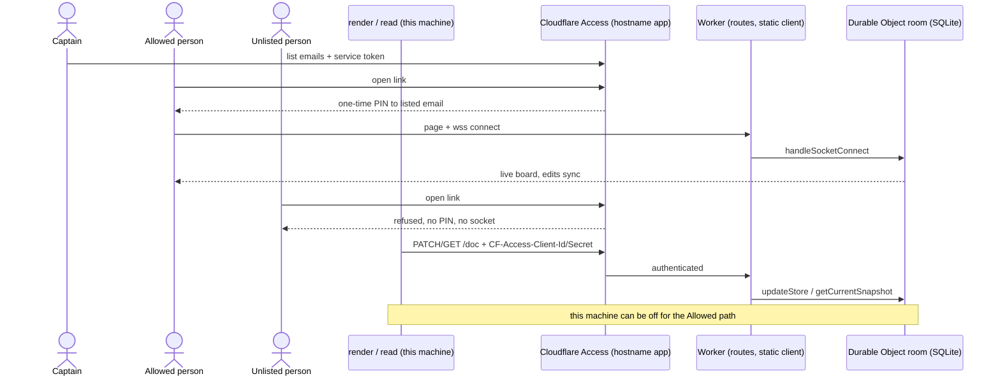

kc-journey-map's canvas is a tldraw 5.4 room synced over WebSocket by a local Node service (server/canvas-server.ts, @tldraw/sync 5.4.0); boards live on this machine and disappear from view when it is off. subspace-relay is hosted on Netlify, whose functions do not hold long-lived WebSocket connections, so relay's hosting does not carry over as is.

## Scope

Captain 2026-10-10: 「第二是畫布不是 host 在一個第三方，萬一關了就沒了，如果可以跟 relay 一樣 host 在某個服務會更好，也更容易分享」; then 「同意」 to the FO's proposal to open a proof-of-concept task first: stand a hosted sync server up (the FO named tldraw's Cloudflare sync template as the likely fit, not yet tried), and confirm sharing by link, persistence, and edit access limited to people the Captain allows, before deciding to move.
Non-goals: migrating existing rooms; changing the journey YAML format.
Budget and stop condition: to be set at ideation; the outcome is a decision with evidence, not a production move.

## Design

Read against `kc-journey-map` at origin/main 03045a47ea850266b46dad557229343bd56e1d04; every provider fact below was read on 2026-10-10 from the provider's own page or source, or is marked unverified. Ideation created no account or resource.

### PRFAQ

**Press release.** A journey canvas room lives on a hosted service. The Captain sends one link; the people the Captain allowed open the board, edit it and see each other live, with the Captain's machine switched off. Anyone else is turned away. The Captain's existing commands (`journey-render`, `journey-read`) keep writing and reading the same room from the Captain's machine.

**FAQ**

- *Why not host it like subspace-relay?* Relay runs on Netlify Functions, with sign-in through WorkOS (`netlify/lib/auth-handoff.ts`, `WORKOS_CLIENT_ID`) and no socket (a case-insensitive search of the repository for "websocket", excluding `node_modules`, finds nothing). Netlify's own limits page states a 60-second synchronous function limit and a 15-minute background limit with no response (docs.netlify.com/build/functions/optional-configuration, background-functions); no Netlify page read mentions WebSockets, and Netlify staff answered "no" in 2020-2021 forum posts (answers.netlify.com/t/does-netlify-support-websocket-proxying/11230). The canvas needs a socket held open for as long as a person has the board open, so Netlify can carry the page and not the sync. This is a reading of those limits, not a Netlify test.
- *Does tldraw host it for us?* Its hosted demo is for prototyping only: tldraw.dev/docs/sync says production needs self-hosting, and `useSyncDemo` documents rooms as "Deleted after a day or so" and "Publicly accessible to anyone who knows the room ID" (tldraw.dev/reference/sync/useSyncDemo).
- *What is the smallest change to the sync stack?* None to the sync engine. `server/rooms.ts` already builds `TLSocketRoom` on `SQLiteSyncStorage`; `@tldraw/sync-core` 5.4.0 ships `DurableObjectSqliteSyncWrapper` for the same class on Cloudflare, and `handleSocketConnect` takes `isReadonly`.
- *What changes for the people using it?* Today `canvas.md` says "There is no identity check on a shared board. Anyone holding the link can edit or clear it." The hosted room must not inherit that.

### Existing-code check

Boundary: the journey "draw a board, share it, others edit, I read it back". Working through the journey today: render, read and sync run end to end on loopback (`scripts/canvas-smoke.sh`); sharing off the machine works only through a tunnel to `npm run share` and ends when the machine sleeps; no identity check exists (stated in `canvas.md`). Two searches: (1) `git grep` for `fetch(` under `lib/` and `scripts/` finds five request sites in `lib/` (`render.mjs` x2, `read.mjs` x2, `journey-tldr.mjs`), all `${api}/doc?room=` with only a `Content-Type` header, so no credential can be sent; (2) `git grep` for `JOURNEY_API` finds one base-URL variable and no header or token variable. Need: the Captain's stated goal (machine-off sharing). Excluded from the search: other adopters' canvases; unknown: whether any consumer already points `JOURNEY_API` at a non-loopback host.

### Options compared

| Option | Holds the sync socket | Persistence | Access control | Cost (read 2026-10-10) | Distance from today's code |
|---|---|---|---|---|---|
| Cloudflare Workers + Durable Object (tldraw `templates/sync-cloudflare` at tag v5.4.0) | yes; one DO per room, WebSocket Hibernation | DO SQLite, same `SQLiteSyncStorage` | none in the template; docs say "authentication and authorization" are left to you. Cloudflare Access can sit in front | Workers Free plan allows SQLite-backed DOs (DO page); Paid plan has a $5 USD/month minimum (workers pricing page) | template has no `/doc` HTTP API (routes: `/api/connect`, `/api/uploads`, `/api/unfurl`), paths differ from the client's `/connect` and `/uploads`, uploads use POST where `canvasAssets` uses PUT, assets want R2 |
| Existing Node server (`canvas-server.ts`) on a container host with a volume, e.g. Fly Machines | yes; the same fastify + `@fastify/websocket` process | SQLite file on a volume | none; operator endpoints (`/save`, `/repo-doc`) live in the same process and must be split off; auth would be written or borrowed | Fly: shared-cpu-1x 512MB $3.69/month always on, volume $0.15/GB/month (fly.io/docs/about/pricing) | smallest: `/doc` GET/PUT/PATCH already exist, so local render/read run unchanged; bind moves off 127.0.0.1 |
| Netlify (where relay runs) | no (see FAQ) | n/a | n/a | n/a | can serve the static page only |
| tldraw hosted demo server | yes | about a day | none, open by room id | not stated | not usable for persistence |
| Status quo: local server + own tunnel | yes, while this machine runs | local disk | none | n/a | fails "machine off" by construction |

**Recommendation: Cloudflare Workers + Durable Object.** It is the path tldraw names "recommended" and runs on its own flagship app; it scales to zero; Cloudflare Access gives a real allowlist of people without writing sign-in. What gets worse: the POC has to add the `/doc` API inside the DO and align paths (the Node route is "free"), and Access-for-WebSocket carries a documented trap (below). Fly is the named fallback if the Cloudflare risks below fire.

### Access design

Cloudflare's Workers documentation states that worker-level Access policies do not support WebSockets: "WebSocket upgrade requests to a Worker protected by a worker-level Access policy will fail with a 403 error", and recommends a hostname-based Access application instead (developers.cloudflare.com/workers/configuration/cloudflare-access). The POC therefore uses a hostname-based self-hosted Access application on the Worker's `workers.dev` hostname with two policies: an Allow policy over an email list (one-time PIN to listed addresses) for people, and a Service Auth policy for the Captain's commands, which send `CF-Access-Client-Id` and `CF-Access-Client-Secret` (service-tokens page). Whether a WebSocket upgrade passes a hostname-based Access application is documented as the recommended route and is **not yet tested**; AC-3 is the test. The Zero Trust free seat count (50) comes from Cloudflare's 2021 "teams-plans" blog post, not a current pricing page, so it is unverified for today.

### What the POC builds (disposable, in a throwaway checkout, not the plugin)

The tldraw template at v5.4.0 with `tldraw`, `@tldraw/sync`, `@tldraw/sync-core` pinned to 5.4.0 (the template uses `workspace:*`; tldraw docs require client and server versions to match); the plugin's `App.tsx` front end built as static assets using the same-origin `/connect` URL; GET/PATCH/PUT `/doc` and `/health` routes added inside the DO; no `/save`, no `/repo-doc`, no image upload (the R2 bucket is out of the POC). The 5 `fetch` sites cannot send a header, so the POC runs `render`/`read` unmodified through a loopback forwarder that adds the two service-token headers; adding a first-class header variable to `lib/` is a go-decision follow-up, not POC scope.

### Budget and stop condition

Proposal, not measured: one working session to AC-1..AC-4 evidence on the Workers Free plan at $0. Stop and report (no third retry of the same approach) when any of these fires:
- a PATCH of the largest real journey file (1262 records, 958 KB, measured 2026-10-10 on a local `.tldr`) fails a Free-plan limit. Workers Free allows 10 ms CPU per HTTP request (limits page); Durable Object pages say per-invocation CPU is 30 s by default and "the same per invocation CPU limits as any Workers do", which conflicts on Free, so the number is unverified until the POC runs it. On this trigger, flip to Workers Paid ($5 USD/month minimum) only with the Captain's yes, or run the Fly fallback;
- a WebSocket upgrade does not pass the hostname-based Access application (AC-3), where the fallback is the Fly option with an in-process token check;
- the same step fails twice.

### Known limits (written down, not fixed)

- `pageLink` in `lib/records.mjs` hardcodes `http://localhost:3737`, so in-board page links will not resolve for a hosted viewer.
- The chapter popup (`/repo-doc`) and the Save button (`/save`) read this machine's checkouts and disk; the hosted viewer is the `vite.share.config.mts` surface, which already omits them.
- `GET /doc` creates an empty room if it is missing today (`SKILL.md`); the hosted `/doc` must not make a room on a read.
- Pasted images need R2 and are outside the POC.

### Obligations the Captain should see (pilot profile)

The hosted room adds a credential (service token), an always-reachable service and a license question. The pilot reference sends credentials, broad exposure and unattended operation back to profile selection; this POC is a disposable, access-gated trial with a teardown, and a move to a standing service would return to profile selection. tldraw's license (LICENSE.md at v5.4.0) defines a Production Environment as "any production deployment ... on servers, cloud platforms, web applications, or where the software is used to provide functionality to end users, customers, or the public", forbids it without a License Key, and offers a trial key; tldraw.dev/pricing lists a 100-day free trial (no card), a Hobby license for non-commercial projects by application, and Startup and Commercial licenses with undisclosed prices.

### Captain decisions

One per line, with the recommendation. Decision 3 depends on decision 1 (Access exists only on Cloudflare; on Fly the check is written in-process).

1. Provider for the POC: Cloudflare Workers + Durable Object (recommended) or the existing Node server on Fly.
2. Cost and account: run on the Workers Free plan at $0 in a Cloudflare account the Captain names (recommended); move to Workers Paid, $5 USD/month minimum, only if the CPU trigger in the stop condition fires and the Captain says yes.
3. How access is granted: one Access email list where every listed person can view and edit, plus one service token for the Captain's commands (recommended); the alternative, anyone with the link views and only the list edits, needs identity-based `isReadonly` and a public read route, which is a second design.
4. tldraw license for the hosted POC: the 100-day trial key (recommended, no card per tldraw.dev/pricing); or a Hobby application (non-commercial only); or a Commercial license (price undisclosed).
5. Profile: keep the POC at Pilot as a disposable, access-gated trial with teardown (recommended); a standing hosted service returns to profile selection.

## Acceptance criteria

**AC-1** A room on the hosted service opens from a link on a second device while this machine is off. Verified-by: with the local canvas server, share server and any tunnel stopped (`lsof -nP -iTCP:5858 -iTCP:3737 -iTCP:3738 -sTCP:LISTEN` prints nothing; `pgrep -x cloudflared; pgrep -x ngrok` print nothing) and this machine asleep or shut down, the Captain opens `https://<worker>.workers.dev/?room=<slug>` on a phone off the home network, signs in as an allowed email, and sees the rendered board; a second allowed person's edit appears within the same session. Machine-off is a human step; the automated half is the same open with the local processes stopped and `curl https://<worker>.workers.dev/health` returning the room count through the service token.

**AC-2** A room's content survives a restart of the hosted server. Verified-by: `curl -X PATCH` (through the forwarder) a unique marker note into a room, record `GET /doc` record count and clock, redeploy the Worker (`wrangler deploy` with a changed `/health` build id), confirm `/health` shows a newer `startedAt` for the room instance, then `GET /doc` again and compare: the marker record and the record count are identical.

**AC-3** Only people the Captain allows can read or edit the room, and the operator endpoints are not hosted. Verified-by: (a) `curl -s -o /dev/null -w '%{http_code}' https://<worker>.workers.dev/` with no credential is not `200`; (b) a Node `ws` connection to `wss://<worker>.workers.dev/api/connect/<room>?sessionId=x` with no credential is refused (no HTTP 101); (c) a listed email receives a one-time PIN, reaches the board and an edit syncs to a second listed browser; an unlisted email receives no PIN and cannot connect (human step, recorded with timestamps); (d) `/doc` with a wrong service-token secret returns 401 or 403; (e) `/save` and `/repo-doc` return 404 on the hosted host. This also tests the hostname-based Access application against the WebSocket upgrade.

**AC-4** The existing local render and read paths still write and read the hosted room. Verified-by: with `JOURNEY_API` pointing at the loopback forwarder for the hosted URL, `node lib/journey-render.mjs skills/kc-journey-map/references/journey.example.yaml <room> --pages story-map,journey-board,function-map` lands every shape, and `node lib/journey-read.mjs skills/kc-journey-map/references/journey.example.yaml <room>` prints zero drift, the same round trip `scripts/canvas-smoke.sh` checks locally; then the largest real journey file (1262 records) renders to a hosted room without a 413, 1102 or timeout.

## FO alignment

Release: none (package tooling).
Release review: not needed: no release.
Needed at ideation: the hosting options checked against the canvas's actual sync stack, the access-control question, and what a POC must prove.
Surfaces: none
Visible change: none

## Stage Report: ideation

- DONE: Design for a proof of concept that hosts a kc-journey-map canvas room, read against the canvas's actual sync stack at origin/main 03045a47ea850266b46dad557229343bd56e1d04 (kc-journey-map/server/canvas-server.ts, rooms.ts, save.ts, @tldraw/sync 5.4.0, the share front end vite.share.config.mts): the hosting options compared (including tldraw's own hosted-sync templates and why Netlify, where subspace-relay runs, does or does not hold the WebSocket sync), each checked against its own documentation or source, not assumed
  `## Design` options table: Cloudflare template read at tag v5.4.0 (wrangler.toml, worker.ts, TldrawDurableObject.ts), sync-core 5.4.0 source, tldraw sync docs and demo page, Netlify limits pages, Fly pricing page, all read 2026-10-10. Netlify is a reading of documented limits, not a test.
- DONE: What the POC must prove, as acceptance criteria with reproducible Verified-by clauses: a room reachable by a shared link with this machine off, persistence across a server restart, edit access limited to people the Captain allows, and the existing local render and read paths still able to write and read the hosted room
  `## Acceptance criteria` holds AC-1 to AC-4 as bold declarations; `design_surfaces.py check` printed "journey-canvas-hosted-poc.md: design surfaces presentable" (exit 0). No `Override:` lines in the state checkout and no ADR directory in docs/dev2.
- DONE: Captain decisions one per line with a recommendation, including the provider and its cost (stated only where measured or quoted from the provider's published pricing with the date read) and how access is granted
  `### Captain decisions` lists five lines (provider, cost and account, access, tldraw license, profile); costs are quoted from provider pages read 2026-10-10 and the Zero Trust 50-seat figure is flagged as a 2021 blog quote.
- DONE: AC-1 reachable by shared link with this machine off
  Not yet verified (future POC check); the machine-off step is human, the local-process-stopped half is scripted.
- DONE: AC-2 persistence across a server restart
  Not yet verified (future POC check); needs a `/health` startedAt that changes across `wrangler deploy`.
- DONE: AC-3 edit access limited to people the Captain allows
  Not yet verified (future POC check); includes the untested Access hostname application against a WebSocket upgrade, the main Cloudflare risk.
- DONE: AC-4 existing local render and read paths write and read the hosted room
  Not yet verified (future POC check); the 5 `fetch` sites in `lib/` cannot send a header, so the POC uses a loopback forwarder.

### Summary

The recommendation is Cloudflare Workers + Durable Object from tldraw's template, with a hostname-based Cloudflare Access app for the allowlist, because worker-level Access returns 403 on WebSocket upgrades per Cloudflare's docs. Netlify is ruled out for the sync by its documented function limits; the existing Node server on Fly is the named fallback and the smaller code delta. Unverified and treated as stop triggers: Free-plan CPU limit for a 1262-record PATCH, the Access-WebSocket pass, and the Zero Trust seat count.
