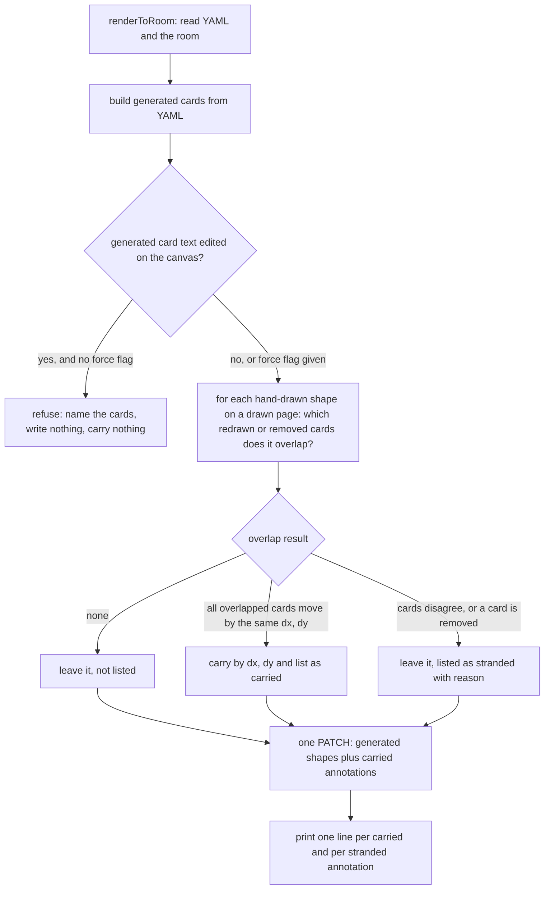

`renderToRoom` in `kc-journey-map/lib/render.mjs` recomputes generated card positions from the journey YAML and refuses only when a generated shape was hand-edited (`handEditedIds`); shapes without `meta.journey` — hand frames, sticky notes, and the `discuss-merged-*` / `discuss-halo-*` frames — keep their absolute position. When a release row gains stories, the cards below move and those annotations are left beside empty space, silently.

## Scope

Relayed by the peer session dhaka-32 on 2026-10-07 (not yet confirmed by the Captain in this session): the Captain asked for an upstream fix of this defect through this workflow, profile Pilot. Evidence it reported: team canvas room relay-spacedock-review-draft, 2026-10-06/07, kc-journey-map 1.5.0; two stories added to one release moved the cards below by +500 and another row by +2910; 7 annotations were stranded and repaired by hand (shift each by the delta of the card it overlapped before the render). Room snapshots (raw room records of relay-spacedock-review-draft, copied by dhaka-32 to a durable path): /Users/kent/conductor/workspaces/subspace-relay/dhaka/.context/journey-render-annotations/draft-room.json (before the stranding render, 2026-10-06 14:09), /Users/kent/conductor/workspaces/subspace-relay/dhaka/.context/journey-render-annotations/draft-before-frame-fix.json (stranded state, 2026-10-07), /Users/kent/conductor/workspaces/subspace-relay/dhaka/.context/journey-render-annotations/draft-after-fix.json (after the hand repair).
Wanted behaviour (relayed): on re-render, an annotation that overlapped a generated card moves with that card, or the render at least reports which annotations would be stranded instead of doing it silently; a test fails on today's renderer.
Non-goals: moving annotations that overlapped no generated card; changing the YAML-is-authority rule.

## Design

### PRFAQ

**Press release.** A journey-map re-render now keeps a hand-drawn frame or sticky note on the card it marked. When a release row gains stories and the cards below move down, any annotation that overlapped a moved card moves by the same distance, so the discussion frame is still around the card it was drawn around. An annotation the render cannot place with confidence stays where it is and is named in the render output. An annotation that overlapped no card is not touched. Nothing is silent: every carried and every unplaced annotation is printed.

**FAQ**

- *What happened?* On 2026-10-06/07 a re-render of a real team canvas moved cards by +500 (and one row by +2910). The 74 hand-drawn shapes stayed at absolute positions; 7 were left beside empty space and repaired by hand (shift each by the delta of the card it overlapped). Source: the three recorded room snapshots named in Scope.
- *Move or report?* Both are one function. The recorded repair was mechanical (7 of 7 annotations shifted by the delta of the card they overlapped, no annotation touched cards with different deltas), so the recommendation is to carry by default and report what cannot be placed. Report-only is the same function with the write step removed; it keeps today's guarantee. This choice changes what a human-drawn canvas is promised, so it is Decision 1 below.
- *Which rule?* An annotation is carried when its box overlaps, with positive area, a story/activity/question/answer card that this render redraws or removes, and every such card moves by the same (dx, dy). Different deltas (including one card staying) or a removed card: not moved, listed as stranded. No overlap: untouched, not listed.
- *Does the recorded incident support that rule?* Run on the three snapshots (prototype, `preview/probe-snapshots.mjs`): 8 of 74 annotations touch a card; the rule carries all 8; 7 land exactly where the hand repair put them; 66 touch no card and stay. The 8th is a dashed frame whose corner overlaps a card by 28px and that the hand repair left in place. Its geometry (252x304 = a 200x252 card plus 26px on every side) matches a card-sized box where no card sits before the render, so it was probably already off its card; the rule carries it by the card's +750, which keeps its offset to the card, but whether leaving it was deliberate is not recorded. The AC names it instead of calling the rule "the hand repair".
- *Why overlap and not centre-in-card?* Centre-in-card (or centre-in-frame) carries 6 of the 7 repaired shapes and misses the one sticky that only grazes two stacked cards (15px and 7px of overlap) yet was moved by hand; any positive overlap carries all 7 and adds the 28px frame. Neither rule matches the hand repair exactly; overlap fits the Captain's relayed wording ("an annotation that overlapped a generated card").
- *What does re-render guarantee afterwards?* Hand-drawn shapes survive every re-render (unchanged). "Never touched" becomes: touched only by moving with the generated card they overlap, never otherwise, and always reported. The sentence in `canvas.md` (section "Render is a reconcile") must change with the code.
- *What is not covered?* Shapes without a width and height prop (text, arrows, strokes) are neither carried nor reported; the recording holds one text shape and it touches no card. Annotations nested in a hand-drawn parent shape, rotated annotations, and flow/constraint boxes or legend notes as anchors have no recorded case and are out. The existing `--pages` scoping applies: a card on a page this call does not draw has no delta.

### Mermaid

### Existing-code check

Boundary: `renderToRoom` in `kc-journey-map/lib/render.mjs` and the CLI `lib/journey-render.mjs`. Completeness: generated shapes reconcile end to end (`staleRecordIds`, `handEditedIds`, `staleBoardPages`); hand-drawn shapes are preserved but nothing relates one to a card, so the stranding is silent. Need: the recorded incident (7 repaired by hand, 2026-10-06/07) is the falsifier; consumers are every `journey-render.mjs` run and `journey-progress.mjs --draw` (it calls `renderToRoom` and prints its result as JSON) on a canvas that carries annotations. Two bounded searches: (1) geometry helpers in `lib/*.mjs`, `server/*.ts`, `server/client` for overlap, bbox, contains, nearest: only `read.mjs` slot matching for hand-added questions (scores a note against columns and grid slots), not reusable for card-to-annotation anchoring and not touched; (2) mentions of annotation, sticky, hand-drawn, untagged in `lib`, `README.md`, `CHANGELOG.md`, `skills/**/references`: only `canvas.md` (the guarantee) and `read.mjs` (hand-added notes). Exclusions: no other plugin, script or doc in this checkout calls `renderToRoom` or `journey-render.mjs` (checked `kc-ship-flow`, `kc-dev-flow-2`, `docs`, `scripts`). Unknown: other adopters' canvases and any annotation type absent from the one recording. Conclusion: build the missing association (one pure function beside `handEditedIds`), reuse the existing single PATCH and result object; no new store, no new `meta` key (positions are recomputed from geometry each render, so a second render carries nothing: idempotent).

UI proposal: after a re-render that moves cards, a frame or sticky that overlapped a card sits on that card at its new place (same offset); the terminal prints one `carried <id> (dx, dy) with <card ids>` line per carried annotation and one `stranded <id>: <reason> <card ids>` line per annotation it could not place; an annotation touching no card stays and is not listed.

Preview: ./journey-render-keeps-annotations/preview/README.md

Profile fit: Pilot holds. No new persistence, credentials, migration or recurring operation; the change ships as an ordinary `feat(kc-journey-map)` release through release-please. Bite: 7 annotations stranded silently in one render. Consumer: every canvas render, including `journey-progress --draw`.

## Acceptance criteria

Rule under test (R): an annotation is a shape with no `meta.journey`, parented directly to a page. A card is a generated shape on that page with kind `story`, `activity`, `question` or `answer` that this render redraws or removes. An annotation is carried by (dx, dy) when its box overlaps, with positive area, at least one card and every overlapped card moves by the same (dx, dy). Overlapping cards that disagree, or a removed card, leave it in place and list it as stranded. Boxes: a note is 200 x (200 + growY) scaled by `props.scale`; any shape with `props.w` and `props.h` uses them.

**AC-1 (carry through the real `renderToRoom`; fails on today's renderer).** Verified-by: a new test in `kc-journey-map/lib/render.test.mjs` that serves a stub room over `node:http`, draws `fixtureModel` (or the packaged example) through `renderToRoom({ api })`, adds three hand-drawn shapes (a frame around one card, a sticky overlapping two cards that move together, a sticky touching no card), adds two stories to an earlier row of the same release, re-renders, and asserts the frame and the first sticky sit at their old position plus the overlapped card's delta and the third sticky is unchanged. Run `cd kc-journey-map && node --test lib/render.test.mjs`. Current evidence: `preview/probe-today.mjs` against today's `renderToRoom` shows the card 952 to 1452 while the frame stays at 926, the sticky at 1102 and the loose sticky at 3000; the test does not exist yet. Falsifier: deleting the carry step from `renderToRoom` makes the test fail.

**AC-2 (recorded incident, geometry only).** Verified-by: a test over a committed fixture derived from the three recorded snapshots: `currentRecords` is the before snapshot (`draft-room.json`) restricted to geometry (opaque id, type, x, y, parentId, `props.w`, `props.h`, `props.scale`, `props.growY`, `meta.journey.kind`, no text, no images, no names); `put` is the generated shapes of the stranded snapshot (`draft-before-frame-fix.json`); `remove` is the generated ids absent from it. Asserts R carries exactly 8 annotations, that 7 equal the positions in the hand-repaired snapshot (`draft-after-fix.json`), that the 8th is the 28px-overlap frame carried by +750 (named in the test as the one place R and the hand repair differ, asserted as R's behaviour, not as "correct"), and that the other 66 are returned unchanged. Current evidence: prototype run 2026-10-07, `preview/probe-snapshots.mjs`: put 1293, remove 16, carried 8, reported 0, 7 of 7 exact, 1 extra. Not yet verified as a committed test; the fixture file must pass a check that it contains no `richText` and no `assetId`.

**AC-3 (unplaceable annotations are listed, never moved).** Verified-by: unit tests of the pure function with small synthetic records: an annotation overlapping one card that stays and one that moves is not moved and is returned as `cards-disagree` with both card ids; an annotation overlapping a card in `remove` is returned as `card-removed`; an annotation overlapping no card appears in neither list. Current evidence: the prototype returned `cards-disagree` for the tall frame in the preview rooms (readout in `preview/README.md`); `card-removed` has no run (no recorded annotation touched one of the 16 removed cards). Not yet verified as committed tests.

**AC-4 (what a render does not touch).** Verified-by: tests in `render.test.mjs`: (a) with `selection: ['journey-board']` an annotation on the story-map page is not carried even though its card exists, because that page's cards are not redrawn; (b) a second render of the same YAML returns empty `carried` and `stranded` and PATCHes no annotation record; (c) a render refused by `handEditedIds` returns `refused` and sends no PATCH, so nothing is carried. Current evidence: none run; (b) follows from the rule recomputing from geometry, not yet exercised.

**AC-5 (real server accepts and keeps the move).** Verified-by: `kc-journey-map/scripts/canvas-smoke.sh` gains a step that draws the example into a throwaway room, PATCHes a hand-drawn note over a card, re-renders a copy of the example with two stories added to an earlier row, reads `/doc` and fails unless the note's `y` equals its old `y` plus the card's delta. Run `bash kc-journey-map/scripts/canvas-smoke.sh` (runs in `kc-journey-map-tests.yml`). Current evidence: the throwaway server on ports 5871/3871, 2026-10-07, accepted the moved records (PATCH 200) and the live editor read frame 926 to 1426, sticky 1100 to 1600, sticky 1020 to 1520, the tall frame and the loose sticky unchanged (`preview/README.md`); the smoke step is not written.

**AC-6 (nothing is silent).** Verified-by: `renderToRoom` returns `carried: [{ id, cards, dx, dy }]` and `stranded: [{ id, reason, cards }]`; `lib/journey-render.mjs` prints one line per entry and `journey-progress.mjs --draw` carries them in its JSON; a test runs the CLI against the stub room and matches those lines. Current evidence: prototype return values printed in the preview run; CLI lines and the progress JSON are not written.

**AC-7 (the guarantee text matches the behaviour).** Verified-by: review of the "Render is a reconcile" paragraph and the README against AC-1..AC-3: no remaining "never touched" for hand-drawn shapes, the carry rule and the stranded reason names stated, the shapes outside the rule (text, arrows, strokes, nested, rotated, boxes as anchors) named as not covered, each absolute ("always", "never") naming what enforces it. Not yet verified. Applies only if Decision 1 is answered "carry".

Non-goals, from Scope: annotations that overlapped no card are never moved; the YAML stays the authority for generated shapes.

## Unresolved decisions

1. **What a human-drawn canvas is guaranteed on re-render (Captain).** Carry or report. Recommendation: carry by default, list what cannot be placed. It reproduces the recorded hand repair on 7 of 7 and removes a manual step the workshop canvas otherwise needs at every release change; the cost is that `canvas.md` stops saying hand-drawn shapes are "never touched", and one recorded frame (28px overlap) is moved where the hand repair left it. Report-only keeps the old sentence and still lists the 8; choosing it drops AC-1's carry assertion, AC-2's position assertions, AC-5's position check and AC-7's carry wording, and AC-3, AC-4, AC-6 keep with `would-carry` in place of `carried`.

No other Captain decision. Recorded for the implementer, not decided here: refuse-and-block when annotations are stranded is not proposed (the render lists them and proceeds); the anchor kinds stay `story`, `activity`, `question`, `answer` until a recorded case needs flow/constraint boxes.

## FO alignment

Release review: not needed: plugin defect, not on a product journey release.
Needed at ideation: no Captain alignment before ideation; ideation chooses move-with-card versus report-only from the two snapshots, and returns the choice if it changes what a human-drawn canvas guarantees.
Surfaces: ui
Visible change: A re-render keeps a hand-drawn frame or sticky note on the card it marked instead of leaving it behind.

## Stage Report: ideation

- DONE: Design definition (PRFAQ with Mermaid) choosing move-with-card or report-stranded for annotations without meta.journey on re-render, derived from the three room snapshots, with a ui preview (before/after canvas renders) the Surfaces line owes
  Recommends move-with-card plus a stranded list (Decision 1, Captain's call). The snapshots show 74 hand-drawn shapes, 8 touching a card, 7 repaired by hand at the touched card's delta. Preview: `preview/README.md`, `today.png`, `carried.png`, run on a throwaway server (ports 5871/3871, own rooms dir), live-editor readout in the README, servers stopped by captured PID. `design_surfaces.py check` printed: "journey-render-keeps-annotations.md: design surfaces presentable".
- DONE: Acceptance criteria with reproducible Verified-by clauses, including a test that fails on today's renderToRoom using the recorded snapshots (or a fixture derived from them)
  AC-1 is the test that fails on today's `renderToRoom` (stub room, fictional fixture; `preview/probe-today.mjs` shows today's render leaving annotations behind). AC-2 is the recorded-snapshot fixture, geometry only; it exercises the pure function because the recording holds no journey YAML, so it cannot fail today's `renderToRoom` directly.
- DONE: Unresolved decisions for the Captain, one per line with a recommendation, especially any change to what a human-drawn canvas is guaranteed
  One decision: carry versus report, recommendation carry; it changes the `canvas.md` "never touched" sentence.

### Acceptance criteria status (current evidence per criterion)

- AC-1: probe on today's renderer shows annotations unmoved (frame 926, sticky 1102, loose 3000 while the card goes 952 to 1452); committed test not written.
- AC-2: prototype on the snapshots: 8 carried, 7 of 7 equal to the hand repair, 1 extra, 66 unchanged, 0 reported; committed fixture and test not written.
- AC-3: prototype returned `cards-disagree` in the preview run; `card-removed` not run; committed tests not written.
- AC-4: not verified; idempotence, `--pages` scope and the refused path are design consequences only.
- AC-5: real throwaway server accepted the moved records (PATCH 200), editor readout 926 to 1426, 1100 to 1600, 1020 to 1520, unchanged 760 and 400; smoke step not written.
- AC-6: prototype return values only; CLI lines and progress JSON not written.
- AC-7: not verified; applies only if Decision 1 is "carry".

### Summary

The renderer keeps hand-drawn shapes at absolute positions and has no association to cards, so a row that grows strands every annotation on the cards below; the recorded repair was a pure per-card delta, which a small function over overlap geometry reproduces. Two recorded disagreements are stated in the design rather than hidden: a 28px-overlap frame the rule carries and the hand repair left, and the sticky grazing two cards that a centre-in-card rule would miss. All preview material uses the packaged fictional journey; the personal-name snapshots stay outside the repository. Extra committed path beyond the entity: `journey-render-keeps-annotations/preview/` (README, two PNGs, four small scripts).

## Stage Report: implementation

- DONE: The approved carry rule built in kc-journey-map's render path: an annotation without meta.journey that overlaps (positive area) generated cards that all move by one delta moves by that delta; disagreeing deltas or a removed card leave it in place and listed; no-overlap annotations untouched; every carried and stranded annotation printed
  `carryAnnotations` in `kc-journey-map/lib/render.mjs`, called by `renderToRoom` after the `handEditedIds` refusal; carried records ride the one existing PATCH; CLI prints `carried <id> (dx, dy) with <cards>` / `stranded <id>: <reason> <cards>`. Candidate commits a70ef464 (fix), 41d6e0e3 (test).
- DONE: AC-1..AC-7 each run as written, AC-1 failing on today's renderToRoom and passing after, AC-2's snapshot-derived geometry fixture, and canvas.md's "never touched" sentence changed to match the code
  AC-1 test "a re-render moves a hand-drawn shape..." fails with the carry call replaced by empty lists (today's behaviour: frame y 926 vs expected 1426) and passes after. AC-2 fixture `lib/fixtures/render-annotation-geometry.json` (130 geometry-only records, opaque ids; hygiene asserted in the test): 8 carried, 7 equal the hand repair, the 8th is the 252x304 frame carried by +750, 66 untouched, 0 stranded. AC-3 unit tests (cards-disagree, card-removed, edge/flow/nested/text/other-page/stays in neither list). AC-4 a/b/c tests (`--pages journey-board` leaves a story-map shape; second render carries nothing and PATCHes no annotation; refused render sends no PATCH). AC-5 `scripts/canvas-smoke.sh` step run on a throwaway server: note moved 500 with its card; fails with carry removed. AC-6 CLI test matches the three lines; `progress.test.mjs` asserts `drawn.carried`/`drawn.stranded` in `journey-progress --draw` JSON. AC-7 `canvas.md` "Render is a reconcile" rewritten plus a new paragraph (rule, reasons, not-covered list, `staleRecordIds`/`carryAnnotations` named as enforcement); no other doc made the claim.
- DONE: kc-journey-map's own tests and lints green, sanitize-check clean for the plugin, recorded candidate SHA
  `node --test lib/*.test.mjs` 188/188, `npm run typecheck`, `npm run doctor`, `scripts/canvas-smoke.sh`, `scripts/skill-frontmatter-lint.sh` pass (npm ci in the worktree; timeouts 300-500s). Sanitize-check: REJECT and BLOCK patterns over the 56-file plugin tree, local-path WARN over the tree, and all WARN patterns (ticket, PR ref, email, path) over this diff's added lines: no hit. Candidate SHA 41d6e0e3 (branch spacedock-ensign/journey-render-keeps-annotations, base ca368cee); not pushed, no PR.

### Falsifiers (each mutation run on the real test file, then restored)

- carry call replaced by empty lists: AC-1 and CLI tests fail. `overlap > 0` to `>= 0`: AC-1, CLI, no-overlap, AC-2 fail. removed-card branch off: card-removed test fails. disagree branch off: AC-1, CLI, cards-disagree fail. zero-delta guard off: second-render and stays tests fail. moved records dropped from PATCH: AC-1 fails. `flow` added to anchor kinds: no-overlap test fails.

### Affected documents (doc_impact.py ca368cee HEAD)

- `kc-journey-map/skills/kc-journey-map/references/canvas.md`: updated
- `docs/journey/kc-journey-map/README.md`: unaffected: it only shows the unchanged `journey-render.mjs` invocation

### Comment ratio

`comment_ratio.py ca368cee HEAD`: code lines 240, comment lines 9, 3.8%; maximum 5% met (render.test.mjs 5/190, render.mjs 4/47).

### Limits and items for FO

- No ADR number was reserved for this task (no `## Number guards` section), so Decision 1 (carry) is recorded in `canvas.md` only; if FO wants an ADR for the guarantee change it needs a number.
- The AC-2 fixture is reduced to the 74 hand shapes plus generated shapes overlapping any of them (a dropped card overlaps no annotation, so R's result is unchanged); `carryAnnotations` run on the full recorded data outside the repo (put 1293, remove 16): 8 carried, 0 stranded, 7 equal to the hand repair, same as on the fixture; snapshots not copied.
- Geo shapes use `w`/`h` unscaled, as AC text says; no recorded hand geo has a scale other than 1. Shape rotation is ignored (unrotated box).
- The carry reports are printed even if the PATCH fails; the status line precedes them.
- `design_surfaces.py check` exit 0. Number guards, migrations: not applicable.

### Summary

The render now computes, from pre-render positions and inside the same call, which hand-drawn shapes sit on cards it moves, shifts them by the shared offset in the same PATCH, and lists every carried and stranded shape. The recorded incident reproduces: 8 carried, 7 identical to the hand repair, one extra frame named as the only place the rule and the hand repair differ. Candidate is 41d6e0e3, unpushed.
