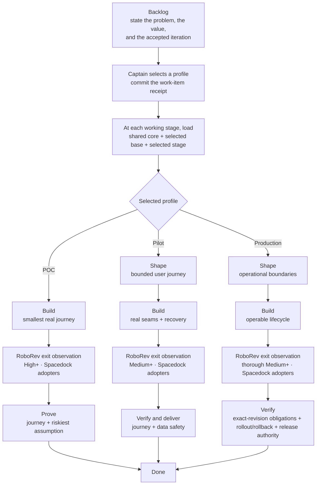

# KC Dev Flow

KC Dev Flow supplies one minimal authority core and three profile-native delivery
routes. A repository keeps its own tracker, iteration authority, workflow
runtime, and delivery provider. The [design rationale](./RATIONALE.md) records
the observed pain, trade-offs, directional evidence, and conditions that would
falsify this direction.

## Routes

| Profile | Working route | Intended result |
|---|---|---|
| POC / Exploration | `build -> prove` | One real journey and its riskiest assumption are observed; cleanup and unproved limits are recorded. |
| Pilot / Product slice | `shape -> build -> verify-deliver` | A bounded slice works for limited real use with appropriate persistence, diagnostics, recovery, and data safety. |
| Production | `shape -> build -> verify` | An operated capability has the applicable lifecycle, compatibility, recovery, observability, integrity, rollback, release, and ownership proof. |

An item leaves `backlog` only when it states what it is, why it is worth doing,
and the accepted iteration it is scheduled into.

Backlog and done are state boundaries, not working stages; a runtime may expose
the union of route states and skip inactive ones. The profile loader rejects a stage
outside the committed route, so POC does not pay for Production policy merely
because both ship in the package. The receipt belongs to the work item rather
than the repository: one project can run POC, Pilot, and Production items
concurrently, and each loader result hash-binds the exact item that selected its
route.

Each stage contract names a one-line **working perspective** — a cognitive cue,
not another agent, review, or gate.

## Seats and gates

- **Captain** owns scope, profile, irreversible actions, spend/permission, red
  residuals, and merge/release authorization.
- **First Officer** resolves authority, loads and dispatches the selected route,
  and applies declared gates.
- **Chief Engineer** gives bounded normal-delivery advice about the next smallest
  integrated step. It is not a mandatory reviewer.
- **Science Officer** gives independent assurance on a contested, high-risk,
  hard-to-reverse, or low-confidence technical claim. It is advisory. Both seats
  are trigger-based and stay unloaded on ordinary green transitions.
- **Deterministic checks and named accountable owners** hold scoped gates. No
  agent is a general-purpose gatekeeper.

## Skills

- `choose-work-profile` — recommend and ask for POC, Pilot, or Production before
  the first working stage.
- `continue-dev-flow` — load and advance only the selected route.
- `chief-engineer` — advise the next integrated delivery step when the route is
  unclear, blocked, or drifting.
- `science-officer` — provide bounded independent technical assurance.
- `science-officer-em` — legacy report-envelope compatibility only.
- `adopt-dev-flow` — bind or upgrade a brownfield repository without replacing
  its existing authorities.
- `setup-github-project-projection` — install a deterministic one-way Spacedock
  projection without making GitHub lifecycle authority.

## Selection and promotion

The Captain selects a profile through the host's structured Ask UI when
available, with plain chat as fallback. The authorized work-item actor commits a
`kc-dev-flow-work-profile/v2` receipt before the first working stage. Selection
is not deferred to ideation because POC has no ideation stage.

Promote POC to Pilot when accepted scope adds limited real users, persistent
valuable state, reused shortcuts, beyond-session operation, or retry/recovery
duty. Promote either lower profile to Production when production data or
credentials, destructive external mutation, irreversible migration, a
compatibility break that makes a consumer act, unattended operation, broad
exposure, SLO/support, or release/rollback ownership enters accepted scope.
That compatibility trigger is about the consumer's hands, not the publication:
a change an existing consumer absorbs by taking the new version is ordinary
Pilot delivery carrying a migration entry, while one that makes it edit its own
configuration or rewrite its own records is Production.

## Distribution and adoption

`scripts/profile-contract-loader.py` is the closed route and loading mechanism.
For a selected work item it emits exactly `references/kernel.md`, that profile's
`base.md`, and that stage's contract — the `build.md` one carrying the typed
implementation-exit observation.

At a route's first working stage, the loader also requires one non-empty
`sprint` and `sprint-readiness: ready` in work-item frontmatter. The iteration
authority and Captain still decide whether that named iteration is accepted;
the loader checks only the committed field values.

Everything else under `references/` is conditional. Selecting a profile
activates none of it; a reference link is not activation, and vendoring one adds
no ordinary-stage work.

| Reference | Loads when |
|---|---|
| `reverse-recovery-audit.md` | A POC `build` or Pilot/Production `shape` proposes an addition, replacement, removal, or missing claim in existing code. |
| `journey-slicing.md` | A Pilot or Production journey cannot be one integrated slice. |
| `retained-document-policy.md` | An accepted or observed retained-document change reaches the selected shape/build/verification stage. Adds no receipt. |
| `project-context-maintenance.md` | Accepted behavior, architecture, or a public contract may change a claim in bound project context. |
| `delivery-branch-base.md` | The work item is delivered through a review artifact, so its base branch must be chosen. Forge-neutral, and it loads even when a provider mod owns the ceremony. |
| `pr-delivery.md` | No adopter-owned mod, such as Spacedock `pr-merge`, already owns the forge-PR ceremony. |
| `roborev-implementation-exit.md` | The `build` observation names a provider and the repository meets its precondition — a Spacedock-registered state holder, which RoboRev needs for single-flight. Any other repository records the observation as out of scope once. |

Retained-document and project-context policy both carry a `build` obligation and
are independently rechecked at validation. An unavailable provider cannot
silently become a delivery failure.

`adopt-dev-flow` vendors these files and binds their local paths in the
workflow's `## Local Profile`. `continue-dev-flow` then reads that binding, the
exact work item and receipt, and invokes the local loader — not the full
workflow README, unselected profiles, or installed package fallback. An adopter
moving from an earlier vendored layout follows [MIGRATION.md](./MIGRATION.md).

Install through the `kc-claude-plugins` marketplace in Claude Code. Codex uses
the co-shipped `.codex-plugin` manifest and the same skill and contract files.

## Hermes Agent

KC Dev Flow ships both an [Agent Plugins v1](https://agent-plugins.org/)
`plugin.json` and a small native Hermes registration layer. Install the
`kc-dev-flow` subdirectory through `hermes plugins install`; Hermes keeps the
package disabled until an operator enables it. Once enabled, the native layer
exposes the package skills with stable names such as
`kc-dev-flow:choose-work-profile` and `kc-dev-flow:continue-dev-flow`.

The Hermes package is a distribution route, not a repository runtime fallback:
an adopter still vendors and binds its own selected contracts in `## Local
Profile`.
