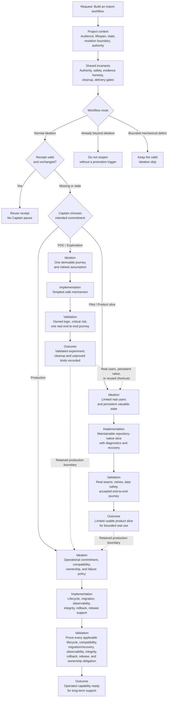

# KC Dev Flow

A small, versioned development-flow kernel for Claude Code and Codex. It lets a
repository keep its own tracker, sprint model, workflow runtime, and delivery
provider while sharing the same authority and evidence discipline.

## Skills

- `adopt-dev-flow` — audit, adopt, or upgrade the kernel without rebuilding an
  existing workflow.
- `continue-dev-flow` — resume an approved sprint and keep advancing committed
  work without unnecessary captain pauses.
- `choose-work-profile` — recommend a proportional POC, Pilot, or Production
  proof burden before normal ideation expands acceptance criteria.
- `promote-dev-flow` — review sanitized adopter field evidence at the canonical
  source without granting it task or policy authority.
- `science-officer-em` — provide independent engineering judgment through the
  canonical replacement for the former Ship-Flow skill, preserving its legacy
  report envelope while carrying the complete portable advisory record.
- `setup-github-project-projection` — plan, install, and audit a deterministic
  one-way projection from one Spacedock workflow into GitHub Issues and one
  GitHub Project without making GitHub lifecycle authority.

## Work profiles

Profiles use one workflow with different obligations, not three workflows. For
normal ideation, first analyze the audience, lifespan, state, mutation boundary,
and authority. Reuse a valid unchanged receipt. Only a missing or stale receipt
asks the Captain to choose the intended commitment before ideation expands
acceptance criteria. Every profile preserves the same authority, safety,
evidence honesty, cleanup, and delivery gates. Work already beyond ideation is
not reopened without a promotion trigger, and a bounded mechanical defect keeps
its valid ideation skip.

For the same import request, the practical difference is:

| Profile | Architecture and implementation | Validation | Outcome |
|---|---|---|---|
| POC / Exploration | One file-to-preview journey; a safe shell, CLI, library, or existing tool is enough. | Parser-owned logic, the riskiest input assumption, and one real import. | Experiment validated; cleanup and unproved limits recorded. |
| Pilot / Product slice | Limited users and persistent import state in a maintainable repository-native slice with diagnostics and recovery. | Integration seams, retry and duplicate handling, data safety, and the accepted journey. | Limited usable slice for bounded real use. |
| Production | Owned operation with compatibility, lifecycle, migration, observability, integrity, rollback, and release support. | Every applicable lifecycle, compatibility, migration/recovery, observability, integrity, rollback, release, and ownership obligation. | Operated capability ready for long-term support. |

Promotion is a new Captain decision in the same ideation workflow. Move from POC
to Pilot when real users, persistent value, or reused shortcuts enter scope;
move either lower profile directly to Production when a retained production
boundary such as production data, an SLO, public compatibility, or unattended
operation enters scope.

## Optional policy mods

- `engineering-judgment` — adjudicate reviewer conflict against governing
  contracts and primary behavior, synthesize risk and durable cost, and return
  an advisory `proceed | narrow | return | block | costly_no` recommendation
  without replacing gate or captain authority.
- `retained-document-policy` — keep retained documentation free of mutable state,
  duplicate live claims, and unverified checks.
- `project-context-maintenance` — keep approved product and architecture context
  aligned with delivered behavior.
- `reverse-recovery-audit` — recover existing brownfield seams before proposing
  greenfield work.
- `journey-slicing` — carve an accepted outcome along the journey rather than by
  layer, and keep the first slice demoable.
- `work-control-profile` — bind optional mechanical controls to local adapters
  and four-state receipts.

## Distribution

The plugin is not a tracker, scheduler, daemon, or merge bot. The kernel defines
portable semantics; each repository binds its existing authorities in a README
`Local Profile` and vendors the accepted kernel plus selected policy mods under
its workflow `_mods/` directory. Stage `Policy mods` lists decide which local
policies apply. There is no binding YAML, digest registry, or runtime package
fallback.

`adopt-dev-flow` owns initial vendoring and explicit upgrades. It replaces an
accepted canonical file byte-for-byte while local mechanisms and exceptions stay
in the workflow README. `continue-dev-flow` reads the vendored policy and never
installs or rewrites it. Optional controls remain off until individually declared.

Ordinary continuation resolves committed product work first and does not inspect
`_debriefs/` or `_improvements/`. Only an explicit request to harvest improvements
loads `references/improvement-harvesting.md`. That conditional path may derive at
most one repository-local or reusable kernel candidate from unseen immutable
debriefs, but it cannot create tasks, admit work to a sprint, schedule, merge, or
pause product work.

At normal ideation entry, a valid work-profile receipt skips the question and
full chooser load. A missing or stale receipt loads `choose-work-profile`; the
Captain chooses and the repository's existing authorized actor records and
re-reads the receipt before AC expansion. The chooser adds no workflow state or
delivery authority.

`reusable-kernel` is the version-1 transport label for a sanitized source
handoff, not a placement verdict. `promote-dev-flow` rechecks duplicates and
classifies rule, enforcement, local-instance, and no-change dispositions at the
canonical source. Its deterministic intake helper preserves distinct recurrence
and renders a captain-review-only proposal without writing repository or provider
state.

`science-officer-em` loads a stage-selected repository-local
`_mods/engineering-judgment.md` when active. An explicit direct invocation may
use the plugin-shipped reference for that answer only; it does not adopt the mod,
activate stage policy, satisfy a gate, or gain provider and workflow authority.
The skill returns `science_officer_em_upward_report` for compatibility and nests
the complete `engineering_judgment` advisory record inside it.

Install the plugin through the `kc-claude-plugins` marketplace in Claude Code.
Codex uses the co-shipped `.codex-plugin` manifest and the same skill files.
