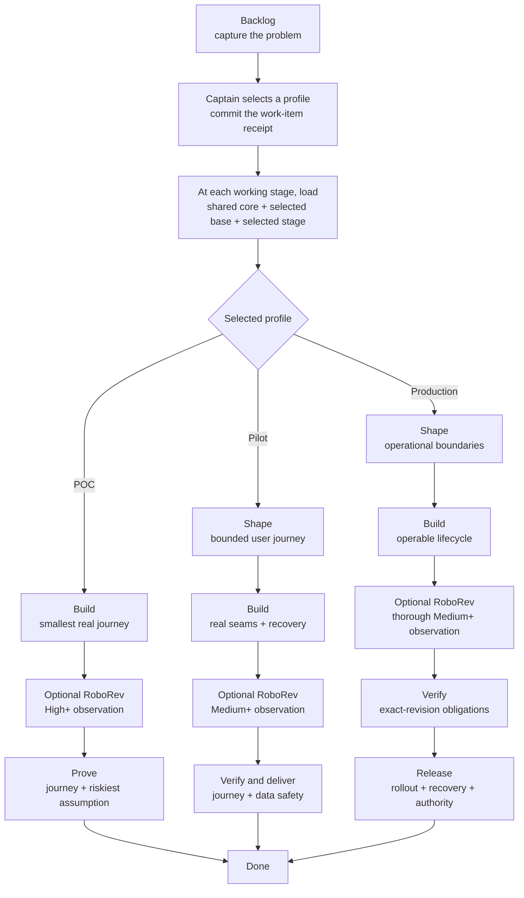

# KC Dev Flow

KC Dev Flow supplies one minimal authority core and three profile-native delivery
routes. A repository keeps its own tracker, iteration authority, workflow
runtime, and delivery provider.

## Breaking upgrade from 2.x

Profile-native loading changes the receipt schema, lifecycle routes, role
semantics, and required local loader. Existing adopters must complete the
[2.x migration](./MIGRATION.md) before updating the installed plugin used for
ordinary continuation; a partially upgraded adopter fails closed. The
[design rationale](./RATIONALE.md) records the observed pain, trade-offs,
directional evidence, and conditions that would falsify this direction.

## Routes

| Profile | Working route | Intended result |
|---|---|---|
| POC / Exploration | `build -> prove` | One real journey and its riskiest assumption are observed; cleanup and unproved limits are recorded. |
| Pilot / Product slice | `shape -> build -> verify-deliver` | A bounded slice works for limited real use with appropriate persistence, diagnostics, recovery, and data safety. |
| Production | `shape -> build -> verify -> release` | An operated capability has the applicable lifecycle, compatibility, recovery, observability, integrity, rollback, release, and ownership proof. |



Backlog and done are state boundaries, not working stages. A runtime may expose
the union of route states and skip inactive stages. The deterministic profile
loader emits only these policy contracts:

```text
shared core + selected profile base + selected current stage
```

The selected `build` contract also contains one typed implementation-exit
observation. It does not load another profile or stage.

It rejects a stage outside the committed profile route. POC therefore does not
pay for Production policy merely because both are available in the package.
The receipt belongs to the work item rather than the repository: one project can
run POC, Pilot, and Production items concurrently, and each loader result
hash-binds the exact item that selected its route.

Each stage contract also names a one-line **working perspective**. It is a
cognitive cue, not another agent, review, or gate; the mission and required
output remain the operative contract. Chief Engineer and Science Officer are
separate trigger-based seats and stay unloaded on ordinary green transitions.

## Seats and gates

- **Captain** owns scope, profile, irreversible actions, spend/permission, red
  residuals, and merge/release authorization.
- **First Officer** resolves authority, loads and dispatches the selected route,
  and applies declared gates.
- **Chief Engineer** gives bounded normal-delivery advice about the next smallest
  integrated step. It is not a mandatory reviewer.
- **Science Officer** gives independent assurance on a contested, high-risk,
  hard-to-reverse, or low-confidence technical claim. It is advisory.
- **Deterministic checks and named accountable owners** hold scoped gates. No
  agent is a general-purpose gatekeeper.

## Skills

- `choose-work-profile` — recommend and ask for POC, Pilot, or Production before
  the first working stage.
- `continue-dev-flow` — load and advance only the selected route.
- `chief-engineer` — advise the next integrated delivery step when the route is
  unclear, blocked, or drifting.
- `science-officer` — provide bounded independent technical assurance.
- `science-officer-em` — legacy report-envelope compatibility only.
- `adopt-dev-flow` — bind or upgrade a brownfield repository without replacing
  its existing authorities.
- `promote-dev-flow` — bring sanitized adopter evidence back for source review
  without granting it task or policy authority.
- `setup-github-project-projection` — install a deterministic one-way Spacedock
  projection without making GitHub lifecycle authority.

## Selection and promotion

The Captain selects a profile through the host's structured Ask UI when
available, with plain chat as fallback. The authorized work-item actor commits a
`kc-dev-flow-work-profile/v2` receipt before the first working stage. Selection
is not deferred to ideation because POC has no ideation stage.

Promote POC to Pilot when accepted scope adds limited real users, persistent
valuable state, reused shortcuts, beyond-session operation, or retry/recovery
duty. Promote either lower profile to Production when production data or
credentials, destructive external mutation, irreversible migration, public
compatibility, unattended operation, broad exposure, SLO/support, or
release/rollback ownership enters accepted scope.

## Distribution and adoption

The package source contains:

- `references/kernel.md` — the shared core;
- `references/profiles/<profile>/base.md` — one selected base contract;
- `references/profiles/<profile>/<stage>.md` — one selected role/stage contract,
  with its proportional exit observation in `build.md`;
- `references/reverse-recovery-audit.md` — conditional brownfield recovery
  method triggered by POC build or Pilot/Production shape;
- `references/journey-slicing.md` — conditional multi-slice guard triggered only
  by Pilot/Production shape;
- `scripts/profile-contract-loader.py` — the closed route and loading mechanism.

An adopter vendors these files and binds their local paths in the workflow's
`## Local Profile`. `continue-dev-flow` reads that small binding, the exact work
item and receipt, then invokes the local loader. It does not read the full
workflow README, unselected profiles, or installed package fallback.

Optional observations and conditional references load only on their named
stage trigger. A reference link is not activation, and vendoring it adds no
ordinary-stage work.
An unavailable provider cannot silently become a delivery failure. Improvement
harvesting also remains explicit and cannot create work, change sprint
membership, or interrupt the selected product route.

Profile selection does not activate standalone references. Reverse recovery
fires only for a proposed addition, replacement, removal, or missing claim in
existing code. The multi-slice guard fires only when a Pilot or Production
journey cannot be one integrated slice. Improvement harvesting remains explicit.
An adopter-owned runtime mod such as Spacedock `pr-merge` is orthogonal: any
profile may use it when PR delivery is selected, and none loads it merely by
selecting a profile.

Install through the `kc-claude-plugins` marketplace in Claude Code. Codex uses
the co-shipped `.codex-plugin` manifest and the same skill and contract files.
