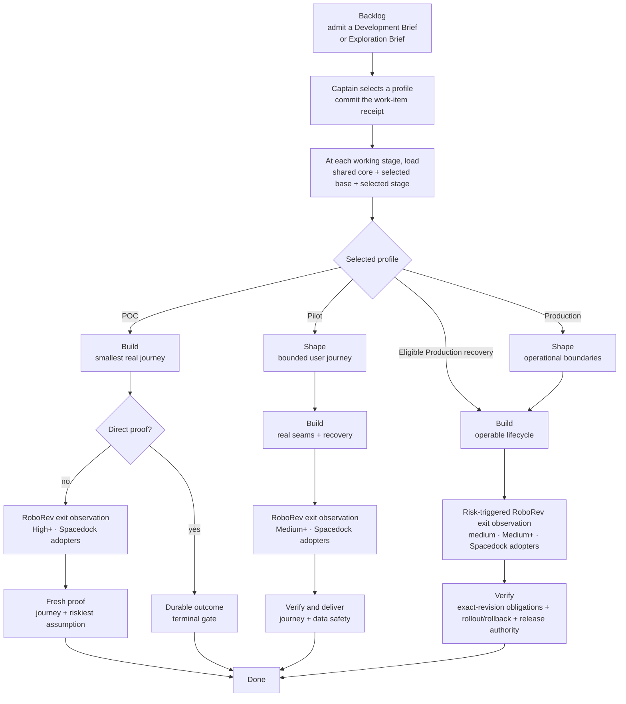

# KC Dev Flow

Load development constraints in proportion to work risk, so agent behavior is
just sufficient without losing verification or authority boundaries.

KC Dev Flow supplies one minimal authority core and three profile-native delivery
routes. A repository may bind a planning provider, while its workflow runtime
and delivery provider remain local. The [design rationale](./RATIONALE.md) records
the observed pain, trade-offs, directional evidence, and conditions that would
falsify this direction.

## Routes

| Profile | Working route | Intended result |
|---|---|---|
| POC — bounded exploration or technical proof | `build -> prove` | Evidence supports `proceed`, `stop`, or `change`; cleanup and limits are recorded, then the outcome returns to planning. |
| Pilot / Product slice | `shape -> build -> verify-deliver` | A bounded slice works for limited real use with appropriate persistence, diagnostics, recovery, and data safety. |
| Production | `shape -> build -> verify`; eligible recovery `build -> verify` | An operated capability has the applicable lifecycle, compatibility, recovery, observability, integrity, rollback, release, and ownership proof. |

An item leaves `backlog` only after its required brief is admitted. Scheduling
metadata is optional; it activates provider reconciliation when present.

Backlog and done are state boundaries, not working stages; a runtime may expose
the union of route states and skip inactive ones. The profile loader rejects a stage
outside the committed route, so POC does not pay for Production policy merely
because both ship in the package. The receipt belongs to the work item rather
than the repository: one project can run POC, Pilot, and Production items
concurrently, and each loader result hash-binds the exact item that selected its
route.

Recovery is an explicit v3 Production receipt for one known failure. Its four
fields make the ideation skip fail closed; changed premises require Captain
fallback to the full route, while `[none]` does not activate RoboRev.

Each stage contract names a one-line **working perspective** — a cognitive cue,
not another agent, review, or gate.

## Inputs

- **Development Brief** — required for Pilot and Production; contains the
  problem, accepted outcome, complete non-goal list, route-back conditions, and
  one canonical `## Acceptance criteria` section with concrete, unique,
  ascending `AC-N` bullets for new admission. Already-admitted prose is not
  migrated or rewritten.
- **Exploration Brief** — required for POC; uses the existing v3 decision,
  falsifier, budget, and stop-condition fields. New admissions also record an
  artifact class, safety boundary, and positive decision-ready minute limit;
  15 is the default and a different limit requires its reason.
- **Planning Receipt** — optional and complete or absent; the exact `source`,
  `planning-window`, and `planning-outcome` tuple activates the adopter's
  read-only provider reconcile. A partial tuple stops.

Without a Planning Receipt, the Captain-approved committed brief is the planning
authority. KC Dev Flow invokes no planning provider and invents no Cycle or
Release/Milestone. Feature and bug labels use the same engine; uncertainty,
risk, urgency, and the accepted commitment select the brief and profile.

## Seats and gates

- **Captain** owns scope, profile, irreversible actions, spend/permission, red
  residuals, and merge/release authorization.
- **First Officer** resolves authority, loads and dispatches the selected route,
  and applies declared gates.
- **Chief Engineer** gives bounded normal-delivery advice about the next smallest
  integrated step. It is not a mandatory reviewer.
- **Science Officer** gives independent assurance on a contested, high-risk,
  hard-to-reverse, or low-confidence technical claim. It is advisory. Both seats
  are trigger-based and stay unloaded on ordinary green transitions.
- **Deterministic checks and named accountable owners** hold scoped gates. No
  agent is a general-purpose gatekeeper.

## Skills

- `choose-work-profile` — recommend and ask for POC, Pilot, or Production before
  the first working stage.
- `continue-dev-flow` — load and advance only the selected route.
- `chief-engineer` — advise the next integrated delivery step when the route is
  unclear, blocked, or drifting.
- `science-officer` — provide bounded independent technical assurance.
- `science-officer-em` — legacy report-envelope compatibility only.
- `adopt-dev-flow` — bind or upgrade a brownfield repository without replacing
  its existing authorities.

## Selection and promotion

Explore is a use of POC, not a separate workflow, stage, or profile. Choose POC
when credible negative evidence could cancel or materially change the next
commitment this item asks the Captain to accept.

The Captain selects a profile through the host's structured Ask UI when
available, with plain chat as fallback. The authorized work-item actor commits a
`kc-dev-flow-work-profile/v3` receipt for every new choice before the first
working stage. Selection is not deferred to ideation because POC has no ideation
stage.

Promote POC to Pilot when accepted scope adds limited real users, persistent
valuable state, reused shortcuts, beyond-session operation, or retry/recovery
duty. Promote either lower profile to Production when production data or
credentials, destructive external mutation, irreversible migration, a
compatibility break that makes a consumer act, unattended operation, broad
exposure, SLO/support, or release/rollback ownership enters accepted scope.
That compatibility trigger is about the consumer's hands, not the publication:
a change an existing consumer absorbs by taking the new version is ordinary
Pilot delivery carrying a migration entry, while one that makes it edit its own
configuration or rewrite its own records is Production.

## Distribution and adoption

The script surface has four roles. Runtime helpers are the loader, POC close
guard, provider-backed comparator, and conditional PR handoff. `*.test.py`
files are package self-tests used by release proof; adopters vendor none of
them. Repository adapters and release gates stay outside the plugin directory.
The repository contract classifies every kc-dev-flow Python script into exactly
one of these roles, so an unowned script fails the gate.

### Release proof

Published mode enforces that a candidate receipt is valid only for its exact
tracked package snapshot. Run candidate mode on the clean release PR head after
all `kc-dev-flow` and marketplace changes have landed. If that snapshot changes
before the release tag is created, discard the receipt and rerun candidate mode
on the final release PR head. After release-please creates the tag, run
published mode against it with the retained receipt; local install sync waits
for that check to pass.

`scripts/profile-contract-loader.py` is the closed route and loading mechanism.
For a selected work item it emits exactly `references/kernel.md`, that profile's
`base.md`, and that stage's contract — the `build.md` one carrying the typed
implementation-exit observation.
Its explicit `--validate-admission` mode additionally validates the canonical
Development Brief and complete-or-absent Planning Receipt for a new Pilot or
Production admission. Default loading does not inspect acceptance headings.

Provider-backed adopters vendor `scripts/engage-reconcile.py` as their read-only
compare mechanism; standalone adopters install neither it nor a provider
adapter. It checks
ephemeral normalized admission and current Ready sets against the
caller-supplied expected source, window, and outcome, then compares accepted
goal and non-goals. A completed comparison returns `0` with a JSON
`status: clean` result, `1` with added/removed/changed/moved identities, or `2`
for invalid input. It invokes no provider or execution runtime. The
[design rationale](./RATIONALE.md) owns the planning/execution explanation.

At a route's first working stage, the loader also requires one non-empty
`sprint` and `sprint-readiness: ready` in work-item frontmatter for the packaged
Spacedock route. Those are local execution mechanics, not Planning Receipt
evidence. For a complete receipt, the planning provider owns the accepted window
and outcome. At every engage, the adopter's read-only planning reader normalizes
the provider's current Ready set and the admitted snapshot; that current set also
includes every still-Ready snapshot source outside the original window/outcome.
The vendored comparator classifies their difference. Any delta stops before new
dispatch or mutation until the Captain admits it. A standalone item skips this
provider path.
An adopter may bind one repository-local read-only admission command that owns
workspace authentication, current provider read, exact state snapshot,
comparator invocation, and success-only dispatch-envelope emission. That seam
adds no provider, persistence, synchronization, or launch authority to the
portable package.

Everything else under `references/` is conditional. Selecting a profile
activates none of it; a reference link is not activation, and vendoring one adds
no ordinary-stage work.

| Reference | Loads when |
|---|---|
| `reverse-recovery-audit.md` | A POC `build` or Pilot/Production `shape` proposes an addition, replacement, removal, or missing claim in existing code. |
| `journey-slicing.md` | A Pilot or Production journey cannot be one integrated slice. |
| `retained-document-policy.md` | An accepted or observed retained-document change reaches the selected shape/build/verification stage. Adds no receipt. |
| `project-context-maintenance.md` | Accepted behavior, architecture, or a public contract may change a claim in bound project context. |
| `delivery-branch-base.md` | The work item is delivered through a review artifact, so its base branch must be chosen. Forge-neutral, and it loads even when a provider mod owns the ceremony. |
| `pr-delivery.md` | No adopter-owned mod, such as Spacedock `pr-merge`, already owns the forge-PR ceremony. |
| `roborev-implementation-exit.md` | The `build` observation names a provider and the repository meets its precondition — a Spacedock-registered state holder, which RoboRev needs for single-flight. Any other repository records the observation as out of scope once. |

Retained-document and project-context policy both carry a `build` obligation and
are independently rechecked at validation. An unavailable provider cannot
silently become a delivery failure.

`adopt-dev-flow` vendors these files and binds their local paths in the
workflow's `## Local Profile`. `continue-dev-flow` then reads that binding, the
exact work item and receipt, and invokes the local loader — not the full
workflow README, unselected profiles, or installed package fallback. An adopter
moving from an earlier vendored layout follows [MIGRATION.md](./MIGRATION.md).

Install through the `kc-claude-plugins` marketplace in Claude Code. Codex uses
the co-shipped `.codex-plugin` manifest and the same skill and contract files.

## Hermes Agent

KC Dev Flow ships both an [Agent Plugins v1](https://agent-plugins.org/)
`plugin.json` and a small native Hermes registration layer. Install the
`kc-dev-flow` subdirectory through `hermes plugins install`; Hermes keeps the
package disabled until an operator enables it. Once enabled, the native layer
exposes the package skills with stable names such as
`kc-dev-flow:choose-work-profile` and `kc-dev-flow:continue-dev-flow`.

The Hermes package is a distribution route, not a repository runtime fallback:
an adopter still vendors and binds its own selected contracts in `## Local
Profile`.
