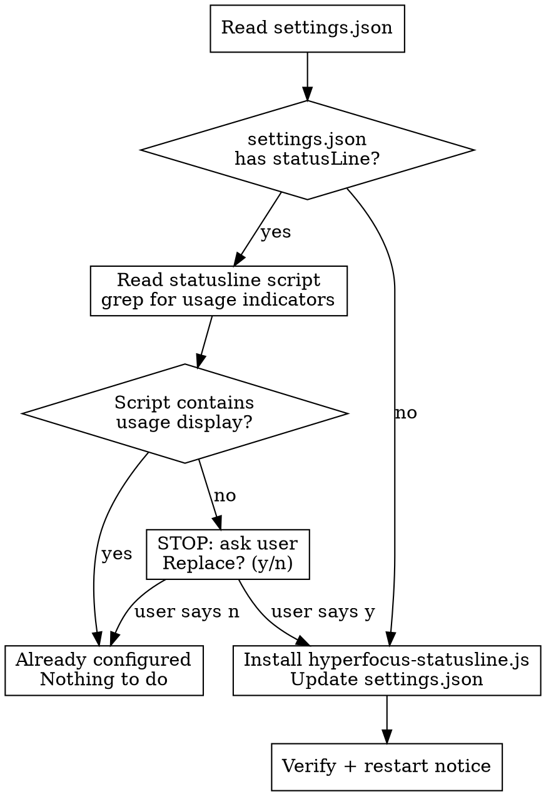

# Statusline Setup

Install a Claude Code statusline that shows model, git branch, context usage bar, and **Anthropic 5h/7d usage quota**.

## Flow



## Step 1: Read Current Config

```
Read → ~/.claude/settings.json
```

Look for the `"statusLine"` key. If no entry exists → go to Step 3.

If found, extract the script file path from the `command` field. The command is typically `node "/path/to/script.js"` — extract the quoted JS path after `node`.

If the referenced script file does not exist (dead reference) → treat as "no statusLine" → go to Step 3.

## Step 2: Check Existing Statusline

Read the extracted script file.

**Usage indicators** (any one = already configured):
- `getAnthropicUsage` function name
- `oauth/usage` API path
- `five_hour` or `seven_day` response field

If ANY indicator found:

```
Your statusline already displays Anthropic usage quota. Nothing to do.

Current: <command path>
```

→ DONE. Do not modify anything.

If NO indicator found:

```
Your statusline does not include Anthropic usage quota.

Current: <command path>

Replace with hyperfocus statusline? This includes:
  - Model display
  - Directory + git branch
  - Context usage bar (with bridge file for context pressure hooks)
  - Anthropic 5h/7d usage quota

Your current statusline script will NOT be deleted — only the settings.json
pointer changes. You can revert by pointing back to the old script.

Replace? (y/n)
```

**STOP here. Do not proceed to Step 3 until the user confirms with 'y'.** If the user declines or says anything other than explicit confirmation, respond "No changes made." and end.

## Step 3: Install

### 3a. Resolve script path

NEVER use `${CLAUDE_PLUGIN_ROOT}` in settings.json — it is NOT resolved at settings parse time.

Resolve to an absolute path. Try in order:

```bash
ls ~/.claude/plugins/local/kc-hyperfocus/hooks/scripts/hyperfocus-statusline.js 2>/dev/null
```

```bash
ls ~/.claude/plugins/cache/local/kc-hyperfocus/hooks/scripts/hyperfocus-statusline.js 2>/dev/null
```

```bash
find ~/.claude/plugins/cache/local/kc-hyperfocus -name "hyperfocus-statusline.js" 2>/dev/null | head -1
```

Use the first path that exists.

**If none found — STOP. Do not proceed to Step 4.** Output this error:

```
Error: hyperfocus-statusline.js not found in plugin paths.

Checked:
  ~/.claude/plugins/local/kc-hyperfocus/hooks/scripts/
  ~/.claude/plugins/cache/local/kc-hyperfocus/hooks/scripts/

The kc-hyperfocus plugin may not be synced to local.
Sync the plugin first, then retry /kc-statusline-setup.
```

→ DONE. Do not attempt to create the file or use alternative paths.

### 3b. Update settings.json

Edit `~/.claude/settings.json` — add or replace the `statusLine` entry:

```json
"statusLine": {
  "type": "command",
  "command": "node \"<RESOLVED_ABSOLUTE_PATH>\""
}
```

### 3c. Verify

```bash
echo '{}' | node "<resolved-path>" 2>&1
```

Should output a statusline string (may be minimal without real session data).

## Step 4: Report

```
Statusline installed.

Script: <resolved-path>
Features: model │ dir branch ██░░ used% │ 5h:N% 7d:N%

Restart your Claude Code session to activate.
To revert: edit ~/.claude/settings.json → change statusLine.command back.
```

## Rules

- **Never modify the user's existing statusline script** — only change the settings.json pointer
- **Never create the statusline script** — if the file doesn't exist, report error and stop
- **Always confirm before replacing** an existing statusline (Step 2) — STOP and wait
- **No statusLine entry = safe to install** without confirmation (Step 3)
- **NEVER use `${CLAUDE_PLUGIN_ROOT}` in settings.json** — resolve to absolute path at runtime
- **Context bridge file is critical** — the statusline writes `/tmp/claude-ctx-{session}.json` which the context-pressure-monitor hook depends on. Without this bridge, context pressure warnings stop working.
