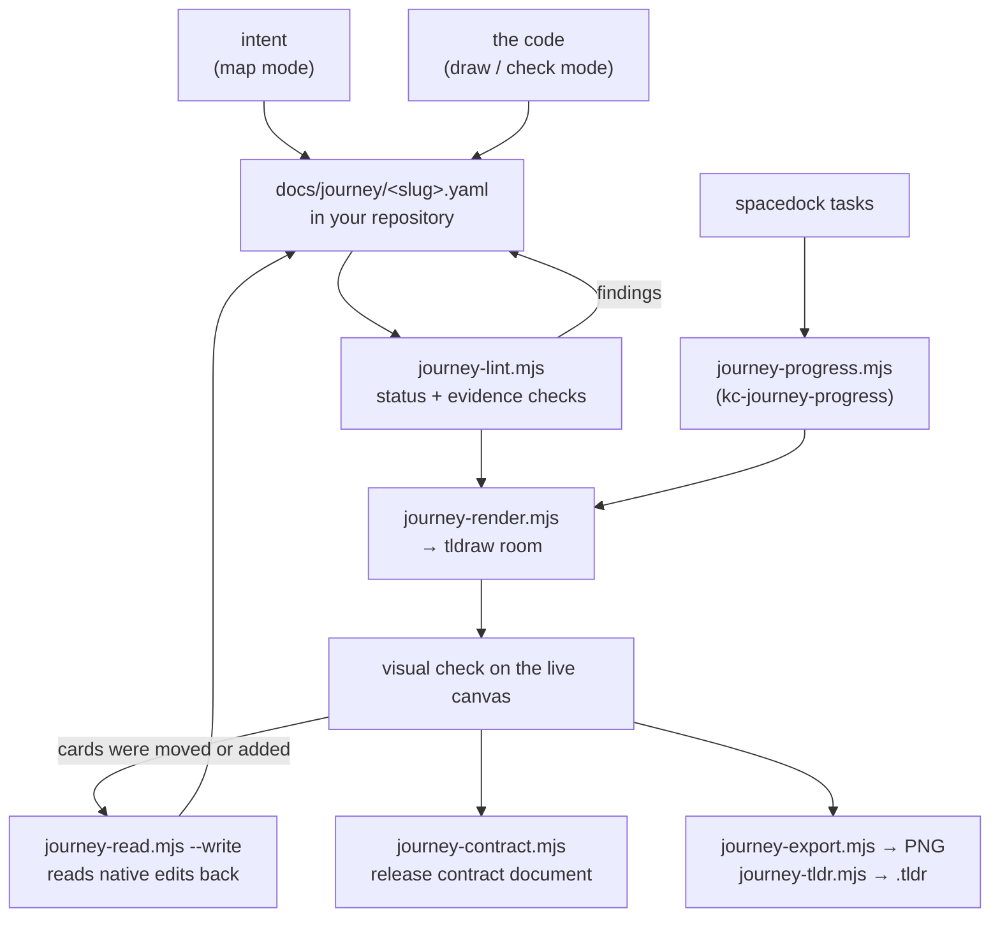

# kc-journey-map

Draw a user journey from what a codebase actually does, or check an existing journey board
against it. Every story carries a status — `gap`, `unverified` or `exists` — and an `exists`
story carries an evidence symbol that must still grep in the repository, so a board cannot
claim something is built without pointing at the thing that builds it.

The output is not the picture. The output is a YAML file in your repository that the board
renders from; the canvas is an editable tldraw room you can share, and the file is what
diffs and reviews.

## Install

```bash
/plugin install kc-journey-map@kc-claude-plugins
```

The canvas is a local Node service, not a hosted one, so its dependencies have to be
installed once. The skill does this from its own plugin root when installation or startup
is needed — you only run it by hand to use the CLI below directly:

```bash
cd ~/.claude/plugins/cache/kc-claude-plugins/kc-journey-map/<version>
npm ci
npm run doctor
```

## Prerequisites

**Required**

| Thing | Why |
|---|---|
| Node >= 22.13.0 | Rooms are stored in `node:sqlite`, which needed `--experimental-sqlite` before that version |
| `npm ci` in the plugin directory | The canvas server, the renderer and the tldraw client are npm dependencies |

`npm run doctor` checks both, plus whether either port is already answering, and names the
thing to go fix. `npm run canvas` runs it as a preflight and refuses to start if it fails.

**Optional — each one degrades to a stated fallback, never to silence**

| Thing | Unlocks | Without it |
|---|---|---|
| `agent-browser` on PATH | PNG export (`lib/journey-export.mjs`) and `.tldr` export (`lib/journey-tldr.mjs export`) | The live board and the YAML still work; there is no dependency-free image path |
| `spacedock` on PATH | Reading local task progress into release ratios (`kc-journey-progress`) | Authored `status`/`evidence` are untouched; drawing never required Spacedock |
| Figma MCP + a target file URL | Rendering to FigJam instead of the local canvas | The skill says so in one line and carries on with the canvas |

If the canvas will not run at all, the skill reports that and delivers the journey YAML with
its Markdown explanation rather than hand-drawing a board no file backs.

## Quick start

Ask in plain language — the skill is trigger-driven, not command-driven:

```
draw a journey map for this repo
check this journey board against the code
plan this release
```

What you get back: a live board link at `http://<host>:3737/?room=<slug>`, a journey file at
`docs/journey/<slug>.yaml` in your repository, and the lint output quoted rather than merely
claimed to have run.

## How a journey gets made



The loop that matters is `C → D → E → F → C`. The file is edited, the board is re-rendered,
the live canvas is looked at, and anything a person changed on the board comes back into the
file — a card someone added by hand returns as `unclaimed` and must be dispositioned, not
deleted to make a re-render clean.

## Modes

| Mode | Use when | Output |
|---|---|---|
| **map** | Nothing is built yet, or the question is what to build | A story map with releases, drawn from a conversation |
| **plan-release** | Planning or resuming an existing board, or preparing a selected release for development | A reviewed Development Brief, or a draft naming the missing decision |
| **draw** | No journey exists yet and you want one from the code | The board, derived from entry points |
| **check** | A journey already exists — board, screenshot, or a list of cards | The mismatch table first, then the corrected board |
| **sequence companion** | Actors, handoffs or branches need explaining alongside a journey | An editable Mermaid sequence page rendered from a repository `.mmd` |

Map mode asserts intent, so it cites nothing and badges nothing. Draw and check mode are
evidence modes: no cell from memory, and a recalled fact from a previous session is a
hypothesis to re-read.

In check mode the mismatches are the deliverable. The skill quotes your card, states the code
fact, and names the verdict — `matches`, `superseded`, `missing` or `not built` — instead of
quietly redrawing your board into the right answer.

## Projections

Selected per render call with `--pages`; the story map is the default.

| Surface | Kind | Answers |
|---|---|---|
| **Story map** (`story-map`) | Canvas, one page | What should we build, what is the smallest useful slice, which stories exist today |
| **Journey board** (`journey-board`) | Canvas, one page per release | Given we want *this* release, what does the system do today and what is missing |
| **Function map** (`function-map`) | Canvas, one page | What does each step decide, and what becomes true when it does |
| **Release contract** | Generated document, not canvas | Authored story status, evidence and shared rule ids for one release |

The release contract is generated, never authored — `lib/release-contract.mjs` reads the
stories in a release and prints their status, evidence symbol and rule ids.

Positions are never written to the journey file. Layout is computed from the model's order by
the renderer, which is what makes a reordered board a one-line diff instead of a rewritten
file.

## Commands

Run from the plugin directory. Paths are relative to your repository.

```bash
node lib/journey-render.mjs   docs/journey/<slug>.yaml [roomId] [--pages story-map,journey-board,function-map]
node lib/journey-lint.mjs     docs/journey/<slug>.yaml [repoRoot]
node lib/journey-contract.mjs docs/journey/<slug>.yaml <releaseId> [--out <path>]
node lib/journey-read.mjs     docs/journey/<slug>.yaml <roomId> [--write] [--out <path>]
node lib/journey-export.mjs   <roomId> <out.png> [pageId]
node lib/journey-tldr.mjs     export <roomId> <out.tldr>
node lib/journey-tldr.mjs     import <in.tldr> <roomId>
node lib/journey-progress.mjs docs/journey/<slug>.yaml --workflow-dir <dir> [--draw <room> --pages …]
```

`journey-tldr.mjs import` replaces the entire target document, including manually drawn
content — import into a fresh room unless you mean to overwrite.

## The four evidence lints

`lib/journey-lint.mjs` checks the file, not the board. The rules live in `lib/lint.mjs`:

| Lint | Fires on |
|---|---|
| `no-status` | A story with no `status` field at all, including a bare-string story, which cannot carry one |
| `invalid-status` | A status outside `gap`, `unverified`, `exists` |
| `exists-without-evidence` | A story marked `exists` with no `evidence` symbol |
| `evidence-not-found` | An `evidence` symbol that no longer greps anywhere in the repository outside the journey file itself |

`evidence-not-found` uses `git grep`, so it only sees tracked content: a symbol added in the
same uncommitted change as the story citing it needs `git add` before the lint can see it.

## Where the journey file lives

Paths are relative to your repository root.

| Repository scope | Journey source |
|---|---|
| Single repository or single-product monorepo | `docs/journey/<journey>.yaml` |
| Multi-product monorepo | `docs/journey/<product>/<journey>.yaml` |

Organize by user journey and product — one source spans frontend, API and shared packages.
Do not duplicate it per technical package, and reuse an existing canonical source instead of
creating a competing copy.

Room databases (`.rooms/*.db`) are local runtime data and stay out of git. `server/rooms.ts`
reads `JOURNEY_ROOMS_DIR`, defaulting to `./.rooms` relative to the service working directory.

## Skills

| Skill | Does |
|---|---|
| `kc-journey-map` | Map, plan-release, draw, check, and the optional sequence companion. The entrypoint for everything above |
| `kc-journey-progress` | Refreshes release story progress once from local Spacedock tasks and optionally draws that observation. Its derived display leaves authored status and evidence intact |

`kc-journey-progress` needs each opted-in task to carry scalar `journey`,
`journey-release` and `journey-story` matching explicit ids in the journey file, with one
member task carrying the complete `journey-required-tasks` declaration. `lib/progress.mjs`
reports anything partial, conflicting or drifted as unverified rather than as progress.

## References

Packaged with the skill, under `skills/kc-journey-map/references/`:

| File | Covers |
|---|---|
| `cell-contract.md` | What each evidence lane may assert, and the three status meanings. Read before filling any cell |
| `canvas.md` | Canvas startup, projection selection, native editing, export and safe readback |
| `map-from-conversation.md` | Map mode and plan-release mode |
| `release-slicing.md` | Proposing release boundaries and preparing a development handoff |
| `sequence.md` | The optional Mermaid sequence companion |
| `journey.example.yaml` + `example/` | A worked fictional book-pickup fixture |

A development handoff that fails the recorded slice checks is refused by
`lib/journey-handoff.mjs`; drawing a broad map stays allowed.

This plugin's own ongoing product plan lives in the marketplace repository at
`docs/journey/kc-journey-map/`, alongside its evidence README and a native snapshot.
Installed-plugin examples do not depend on it.

## Where this fails

If a journey crosses repositories — a client in one, a server in another — each side must be
cited separately, naming which repo was read. A board that mixes two repositories' facts
without saying so is the most expensive mistake this skill can make, because every cell still
looks right.

## Tests

```bash
node --test lib/*.test.mjs
```

## License

MIT
