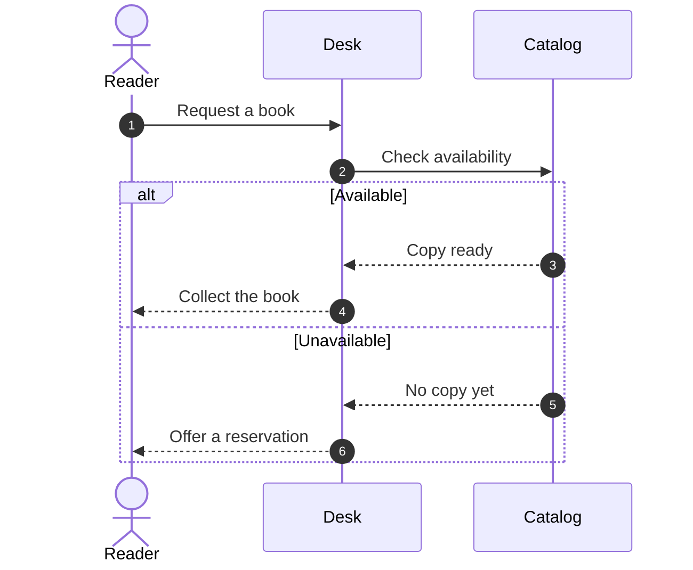

# Native sequence companion

Use when a sequence is requested or accepted to clarify a journey's actors,
handoffs, or branches. Keep the main journey and release pages. This is a companion,
not another story-status model. Both Claude and Codex follow this reference.

## Source and rendering

Keep the Mermaid source beside the consuming repository's journey YAML, for example
`docs/journey/book-pickup-sequence.mmd`. YAML remains the journey authority; `.mmd`
is the sequence authority. Use `autonumber` in new sources by default; omit or change
it when the user requests different numbering. The helper renders the supplied source
without adding numbering or rewriting the file.



Use [canvas.md](canvas.md) for service provenance, startup, and native export.
The canvas needs the packaged `@tldraw/mermaid` version, pinned to the canvas's
tldraw version. Do not install a different converter into an active service or
modify installed plugin caches. If the running frontend lacks `addSequencePage`,
report the missing capability and use a suitable frontend within the user's scope.

Before adding/updating, read the existing source and canvas edits and preserve a
native `.tldr` backup. `window.serializeTldrawJson()` returns the complete native
document; write that returned string to a file using the host's filesystem tool.
Then read the `.mmd` with that tool and pass its contents as a JSON string to this
browser entrypoint (for example through `agent-browser eval --stdin`):

```javascript
await window.addSequencePage({
  source: "sequenceDiagram\n    autonumber\n    Alice->>Bob: Review the proposal\n",
  sourcePath: "docs/journey/proposal-sequence.mmd",
  name: "Proposal — sequence"
})
```

`sourcePath` is a provenance label, not a browser file read. Pass the actual file
contents as `source`; do not shell-interpolate Mermaid into executable JavaScript.
The helper first converts in a separate temporary editor, then adds a new native
page. A malformed sequence leaves the live document alone. Repeated names gain
`(2)`, `(3)`, etc.; an explicit version suffix is also useful. Rerendering adds a
comparison page, retaining earlier pages and their manual shapes. It does not
replace an existing page. Auxiliary shapes carry no `meta.journey` tag, so journey
redraw retains them. Journey readback can still list their nonempty geo/note text as
`unclaimed`. Use the returned `pageId`, each shape's page ancestry, and that page's
`meta.sequence.source` to disposition these as known auxiliary content. Do not copy
them into story YAML or delete them merely to make readback appear clean.

Inspect the live page: message numbering, participants, branch labels, and native
editable text/arrows. A successful conversion is not proof of exact Mermaid layout
or support for every sequence feature. Preserve the `.mmd` and report any unsupported
construct or visual mismatch; do not claim a bitmap is an editable native page.

## Updating after canvas edits

Read back the page's native records and inspect its visible changes before updating.
Preserve the native backup and previous source, then have the agent reconcile the
meaningful actor/message/branch edits into `.mmd`. Check that source against the
intended flow, render a new comparison page, and inspect it. Keep older pages until
their differences and unclaimed manual shapes have been handled; ordinary cleanup
follows the user's existing authorization.

This is agent-assisted reconciliation. It is not automatic reverse synchronization
or a lossless native-to-Mermaid exporter. Coordinates, styling, arbitrary shapes,
and some native edits may have no Mermaid equivalent; preserve them in the backup
and make any unresolved differences explicit.
