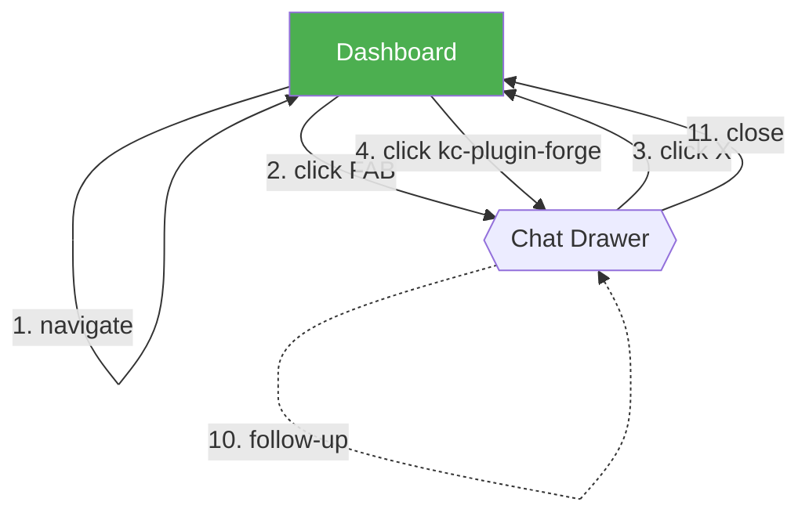
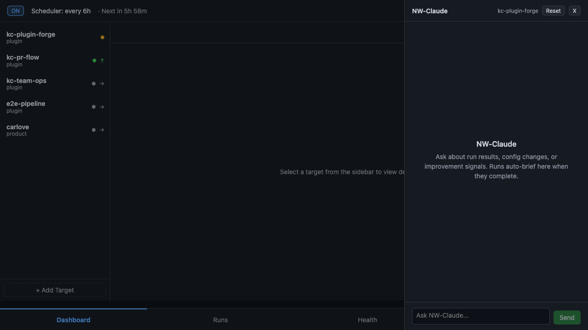
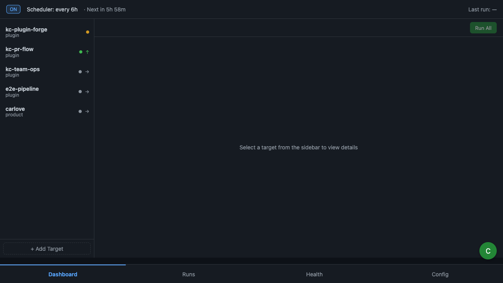
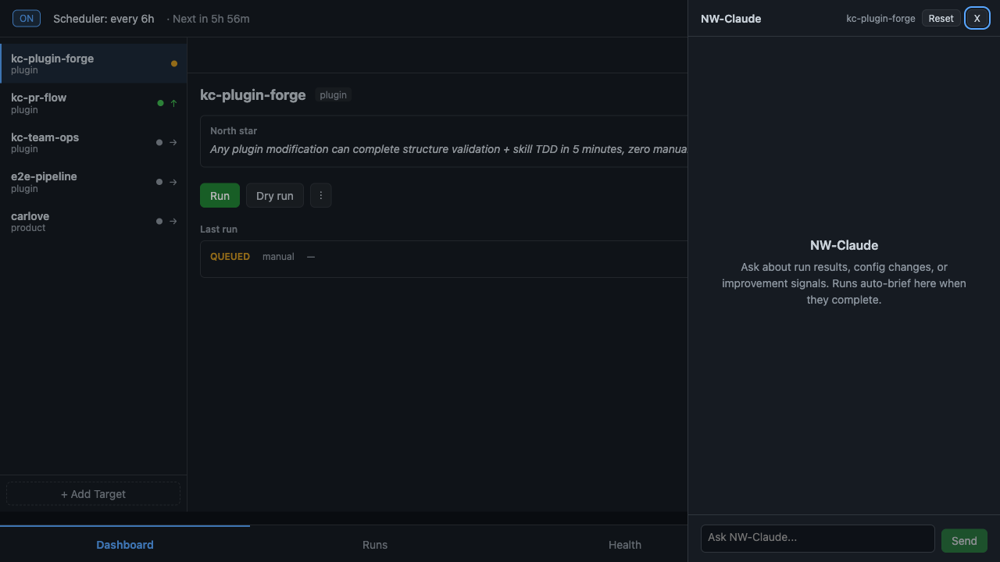
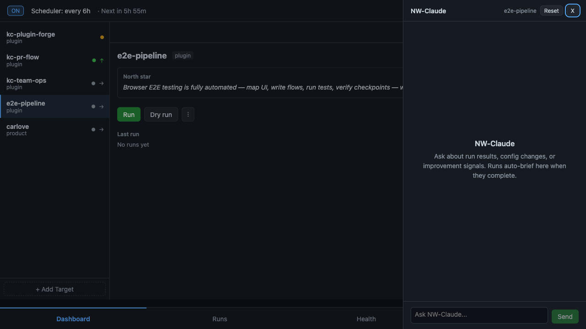
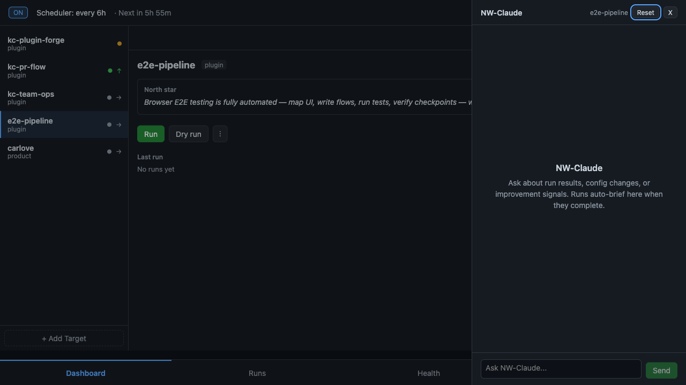
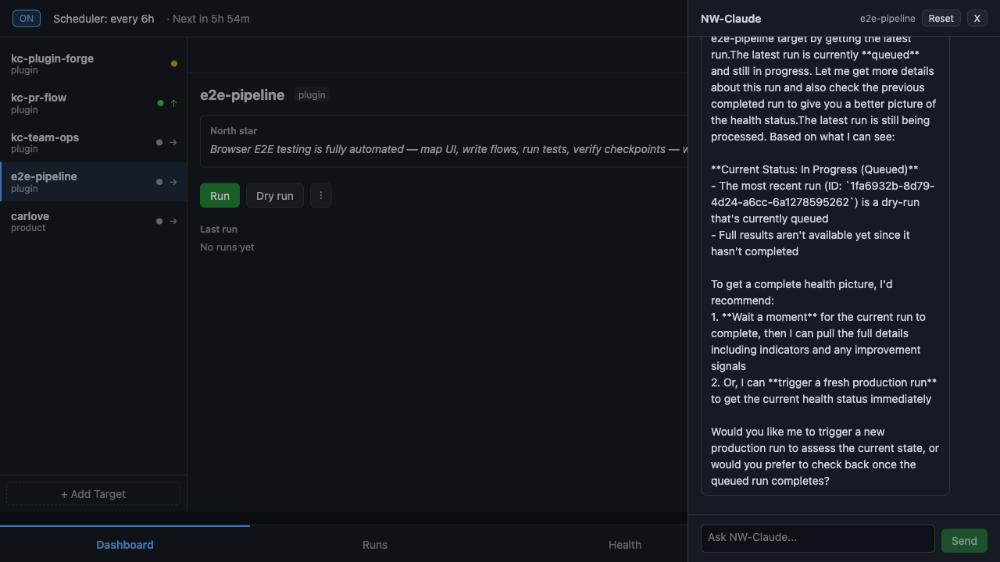
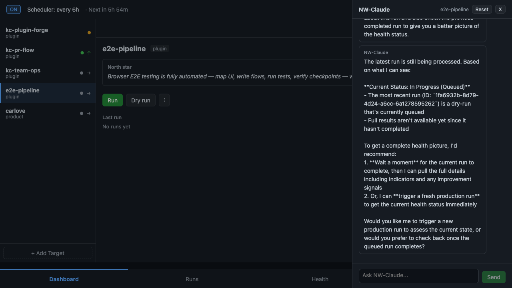
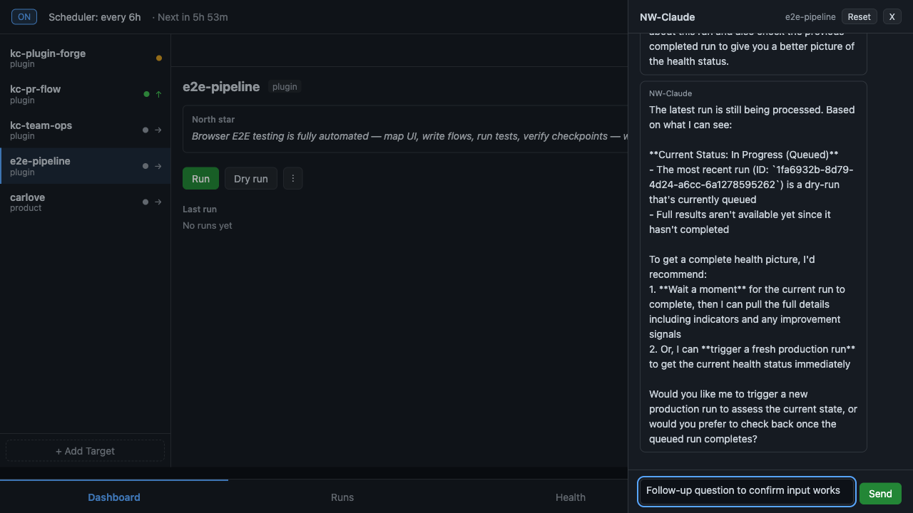
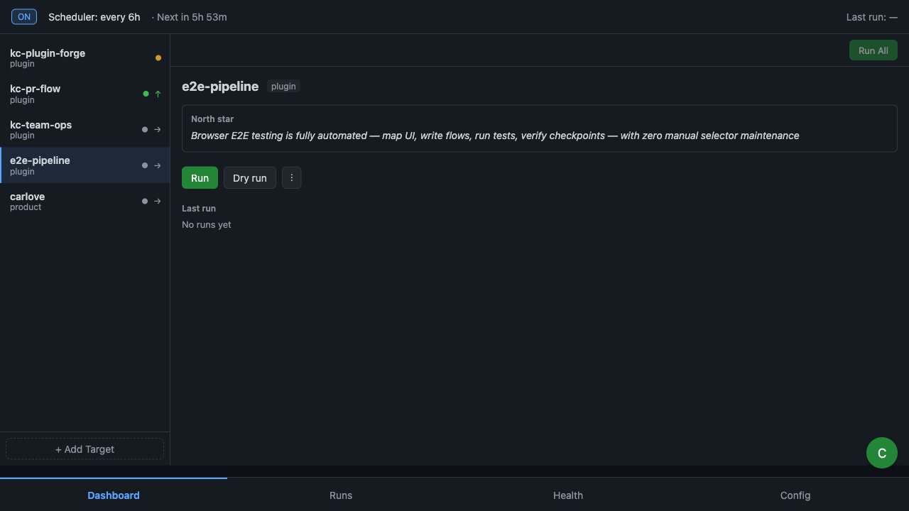

## E2E Verification: chat-fixes

✅ **PASS** — 11 steps, 2 corrections applied

Verified all chat drawer bug fixes: open/close via FAB and X button, sidebar target selection opens chat with correct target, target switching updates header, reset button always clickable, send shows AI response, and input/send recover after completion.

### Flowchart

### Steps

| # | Step | Screenshot | Result | Detail |
|---|------|-----------|--------|--------|
| 1 | Navigate to dashboard |  | PASS | |
| 2 | Open chat via FAB |  | PASS | |
| 3 | Close chat via X |  | PASS | |
| 4 | Sidebar opens chat (forge) |  | PASS | |
| 5 | Switch target (e2e-pipeline) |  | PASS | |
| 6 | Reset conversation |  | PASS | |
| 7 | Type message | — | PASS | |
| 8 | Send message |  | PASS | |
| 9 | Wait for AI response |  | PASS | |
| 10 | Follow-up input |  | PASS | |
| 11 | Close chat final |  | PASS | |

### Corrections

| Change | Type | Detail |
|--------|------|--------|
| fix step 3 | enrich | `chat_dialog not visible` -> `chat_fab visible` + URL check (drawer CSS transform) |
| fix step 11 | enrich | Same as step 3 — drawer slide-out `is visible` quirk |

### Health

| Check | Result |
|-------|--------|
| API failures | 0 |
| Console errors | 0 |
| Trace | Clean |

---

> **Replay:** `/e2e-test chat-fixes` | **Trace:** `npx playwright show-trace e2e-reports/20260319-212314-chat-fixes/trace.zip`
> Generated by `/e2e-flow` · [e2e-pipeline](https://github.com/iamcxa/kc-claude-plugins/tree/main/e2e-pipeline)
