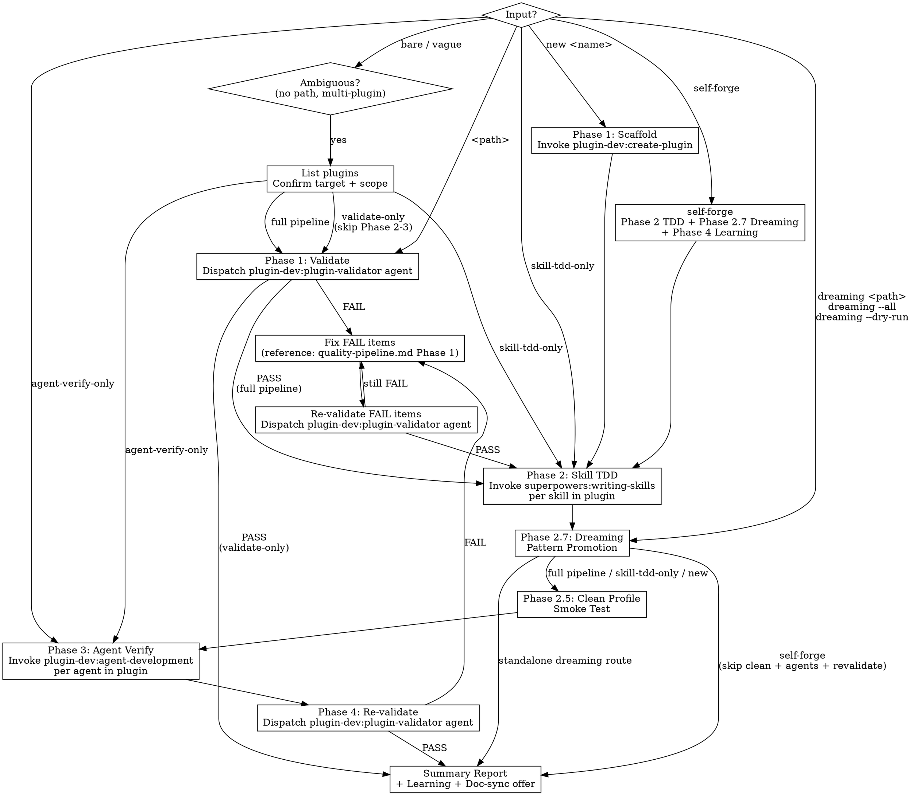

# Plugin Forge

One-command plugin development and quality pipeline. Orchestrates marketplace skills to scaffold, test, validate, and improve Claude Code plugins.

**Prerequisites**: `superpowers` + `plugin-dev` marketplace plugins must be installed. Optional: `claude-md-management` for self-improvement loop.

Read references before starting any phase:

```
Read → ${CLAUDE_PLUGIN_ROOT}/reference/quality-pipeline.md
Read → ${CLAUDE_PLUGIN_ROOT}/reference/learned-patterns.md
```

## Routing



### Route Selection Rules

- **`new <name>`** → Phase 1 scaffold → full pipeline
- **`<path>`** → Phase 1 validate → full pipeline (Phase 1→2→3→4). A path always triggers Phase 1 first — no exceptions, even if user claims prior validation.
- **`validate-only`** → Phase 1 validate → report (skip Phase 2 and 3)
- **`skill-tdd-only`** → Phase 2 + 2.5. Assumes structure was validated separately. Do NOT use this to bypass Phase 1 on a path-based invocation.
- **`agent-verify-only`** → Phase 3 only
- **`self-forge`** → Forge audits itself. Target is always `${CLAUDE_PLUGIN_ROOT}`. Runs Phase 2 TDD (pressure test SKILL.md via `superpowers:writing-skills`) + Phase 2.7 Dreaming (scan forge's own `learned-patterns.md` → promote to `quality-pipeline.md`, `skill-evolution.md`, or SKILL.md Rules) + Phase 4 Learning. Skips Phase 1 (own structure is stable), Phase 1.5 (forge's evolution is pre-established), and Phase 3 (no agents). Use when: periodic self-audit, after editing references, or to check for SKILL.md drift. Self-forge uses a dedicated Detection signal table:

| Hard Signal | Source | Example |
|-------------|--------|---------|
| Phase 2 TDD RED failure mode | SKILL.md weakness under pressure | Pressure scenario showed agent skipping Phase 1.5 despite rules |
| Phase 2 REFACTOR rationalization discovered | New anti-pattern in forge's own behavior | Agent reframed "skip" as "obvious intent" to avoid user prompt |
| Fix attempt > 1 (same issue fixed more than once) | Non-obvious self-referential problem | Edited same rule twice because first fix introduced new ambiguity |
| Workaround used (bypass instead of direct fix) | Forge's own process limitation | Used ad-hoc note instead of proper Detection → Capture flow |
| Reference file inconsistency found | File content contradicts SKILL.md or other references | skill-evolution.md Applicability table lists levels that SKILL.md Phase 1.5 doesn't offer; quality-pipeline.md gotcha contradicts a Rule |
| Dreaming promotion to `skill_rule` | Pattern mature enough to become a forge Rule | Pattern about fix-loop escalation promoted from learned-patterns.md to SKILL.md Rules |

- **`dreaming <path>`** → Phase 2.7 only + commit + PR offer + report. Pure knowledge curation — does NOT run Phase 1/2/2.5/3/4.
- **`dreaming --all`** → Multi-plugin discovery + Phase 2.7 per plugin + commit + PR offer + report. Discovery order: `$KC_WORKSPACE` → `~/.claude/plugins/local/` → manual fallback.
- **`dreaming --dry-run`** → Phase 2.7 analysis only, no changes applied. Combinable with `<path>` or `--all`.
- **Bare or vague input** (no path, no keyword, or ambiguous scope) → **DISAMBIGUATE**: list available plugins, confirm target + scope (full pipeline vs. validate-only) before proceeding. Never infer a default plugin.
- **Phase 1.5 C follows Phase 1.5 B** on routes that include Phase 1.5 (`<path>`, `new <name>`). Phase 1.5 C skipped on `self-forge`, `skill-tdd-only`, `agent-verify-only`, `validate-only`, and plugins with no agents.
- **Phase 2.7 follows Phase 2** on all routes that include Phase 2 (`<path>`, `skill-tdd-only`, `self-forge`; also `new <name>` but skipped via entry gate — new plugins have 0 patterns). **Phase 2.5 follows Phase 2.7** on routes that include Phase 2.5 (`<path>`, `skill-tdd-only`, `new <name>`). Phase 2.5 skipped on `self-forge`, `validate-only`, `agent-verify-only`.

## Phase 1: Structure

**New plugin** (`new <name>`):
1. Invoke `Skill: "plugin-dev:create-plugin"` with plugin name
2. After scaffold, proceed to Phase 1.5 (Autonomy Decision)

**Existing plugin** (`<path>`):
1. Dispatch `plugin-dev:plugin-validator` agent with plugin path
2. Fix any FAIL items — consult `quality-pipeline.md` Phase 1 for known gotchas
3. **Re-validate after fix** — dispatch validator again on FAIL items only. Do NOT proceed to Phase 2 until all FAIL items are PASS.
4. WARN items: document in README, fix if quick
5. Proceed to Phase 1.5 (Autonomy Decision)

## Phase 1.5: Autonomy Decision

Determine autonomy capabilities for the target plugin. Two dimensions: A (Self-Learning) and B (Doc Self-Iteration). Runs after Phase 1, before Phase 2.

**Skip when**: `self-forge` route (forge's own evolution is pre-established), `skill-tdd-only` route, `agent-verify-only` route.

### A — Intent Detection

Analyze plugin description + planned skill types:

| Detection Signal | Classification |
|-----------------|---------------|
| Description contains: review, analyze, audit, triage, check, evaluate, assess | analysis |
| Description contains: sync, bump, scaffold, generate, compile, convert | utility |
| Description contains: create, build, new, init | scaffold |
| Mixed or ambiguous | mixed |

Intent classification only sets the `Recommended:` field — it never bypasses the user prompt. Even when classification is unambiguous, present the full choice and wait for input.

### A — User Choice

Present the following prompt:

```
Self-improvement capability for <plugin-name>:

  1. Full (D1 + D2) — learned-patterns.md + project CLAUDE.md writes
     Best for: plugins that review, analyze, or assess
  2. D1 only — learned-patterns.md only, no project-specific writes
     Best for: plugins that process data and may discover general patterns
  3. Skip — no self-improvement scaffolding
     Best for: pure utility (sync, convert, scaffold)

  Detected intent: <analysis/utility/scaffold/mixed>
  Recommended: <1/2/3>

  Your choice:
```

### A — Scaffold Actions

| Choice | Actions |
|--------|---------|
| **1 (Full D1+D2)** | Create `reference/learned-patterns.md`; add Full Learning step template to each skill; add `Read → learned-patterns.md` to setup; add D1 auto-append + D2 gated write to rules |
| **2 (D1 only)** | Create `reference/learned-patterns.md`; add D1-only Learning step template to each skill; add `Read → learned-patterns.md` to setup; add D1 auto-append to rules |
| **3 (Skip)** | No `learned-patterns.md`; no Learning step; Phase 4 report notes "Evolution: skipped (user choice)" |

Templates for Learning steps: see `${CLAUDE_PLUGIN_ROOT}/reference/skill-evolution.md` Integration Pattern → Level-specific scaffolding.

### A — Existing Plugin Retrofit

When forging an existing plugin (not `new`):
- Plugin already has `reference/learned-patterns.md` → verify evolution setup matches existing level in Phase 2 step 6
- Plugin has no `reference/learned-patterns.md` → present the same three choices above (retrofit or confirm skip)

### B. Doc Self-Iteration

Determine documentation self-sync capability for the target plugin. Runs alongside A (Self-Learning) in Phase 1.5.

**Skip when**: `self-forge` route, `skill-tdd-only` route, `agent-verify-only` route, `validate-only` route.

### B — Auto-Derivation

| Signal | → Full | → Light | → Skip |
|--------|--------|---------|--------|
| `docs/` dir with ≥3 files | ✓ | | |
| `docs/` with <3 files | | ✓ | |
| README.md only | | ✓ | |
| No documentation at all | | | ✓ |
| ≥3 skills | ✓ | | |
| Agent-only plugin (no skills) | | ✓ | |
| Mixed signals | suggest Full, user confirms | | |

### B — User Choice

Present after A (Self-Learning) choice:

```
Doc self-iteration for <plugin-name>:

  1. Full — doc-sync skill + doc-probe agent + reference
     Live behavioral probes verify doc accuracy
  2. Light — doc-sync skill + reference only
     Static scan + history enrichment, no live probing
  3. Skip — no doc-sync capability

  Detected: <Full/Light/Skip based on signals>
  Recommended: <1/2/3>

  Your choice:
```

### B — Scaffold Actions

| Choice | Actions |
|--------|---------|
| **1 (Full)** | Create `skills/{{PLUGIN_NAME}}-doc-sync/SKILL.md` from Full template; Create `agents/doc-probe.md` from agent template; Generate `reference/doc-sync-context.md` by scanning plugin (Source Map, Doc Structure, Probe Config via safety heuristic, Style Guide) |
| **2 (Light)** | Create `skills/{{PLUGIN_NAME}}-doc-sync/SKILL.md` from Light template (Phase 4 disabled); Generate `reference/doc-sync-context.md` without Probe Config section |
| **3 (Skip)** | No doc-sync components created. Phase 4 report notes "Doc sync: skipped (user choice)" |

Templates: see `${CLAUDE_PLUGIN_ROOT}/reference/doc-sync-templates.md`.

### B — Existing Plugin Retrofit

When forging an existing plugin (not `new`):
- Plugin already has `skills/*-doc-sync/` → verify setup matches level, skip scaffold
- Plugin has `agents/doc-probe.md` but no doc-sync skill → warn: orphan agent
- Plugin has neither → present the three choices above

### B — Context Generation

When scaffolding `reference/doc-sync-context.md`:

1. **Source Map**: For each `skills/*/SKILL.md` and `agents/*.md`, infer doc target:
   - If `docs/commands.md` exists → skill flags/modes map there
   - If `docs/architecture.md` exists → agent descriptions map there
   - If no matching doc → leave Doc Target as `(new doc needed)`

2. **Probe Config**: For each skill, apply Probe Safety Heuristic (see `doc-sync-templates.md`):
   - Read SKILL.md content, search for skip signals (browser, base_url, mcp__, deploy/publish)
   - Skills with `--check` or `--dry-run` modes → `cli` using that safe mode
   - Default → `cli` (optimistic, self-corrects via env_dependent)

3. **Doc Structure**: Scan `docs/*.md` + `README.md`, infer auto-sync level:
   - File contains only tables/lists derived from source → `yes`
   - File contains narrative/tutorial content → `partial`
   - Default → `partial` (safe: preserves hand-written content)

## Phase 1.5 C: Agent Teams Capability Decision

Determine Agent Teams support for the target plugin. Runs after B (Doc Self-Iteration), before Phase 2.

**Skip when**: `self-forge` route, `skill-tdd-only` route, `agent-verify-only` route, `validate-only` route, plugin has no agents.

### C — Auto-Detection

| Signal | → Full Teams | → Skip |
|--------|-------------|--------|
| Plugin has browser-operating agents (tools include Bash) | ✓ | |
| Plugin has multi-agent dispatch (skill dispatches 2+ agents) | ✓ | |
| Plugin has only analysis agents (Read/Grep only) | | ✓ |
| Plugin has no agents | | ✓ |

### C — User Choice

```
Agent Teams capability for <plugin-name>:

  1. Full — Teams protocol + fallback + per-agent Team Mode section
     Best for: browser-operating agents, multi-agent orchestration
  2. Skip — no Teams support (pure subagent mode)
     Best for: analysis-only agents, single-agent plugins

  Detected: <Full/Skip based on signals>
  Recommended: <1/2>

  Your choice:
```

### C — Scaffold Actions

| Choice | Actions |
|--------|---------|
| **1 (Full)** | Create `references/agent-teams.md` from template in `agent-teams-quality.md`; add Team Mode Protocol section to each browser-operating agent; add Teams mode detection + `--no-teams` flag + fallback path to dispatch skills |
| **2 (Skip)** | No Teams components created. Phase 4 report notes "Teams: skipped (user choice)" |

Templates: see `${CLAUDE_PLUGIN_ROOT}/reference/agent-teams-quality.md`.

### C — Existing Plugin Retrofit

When forging an existing plugin (not `new`):
- Plugin already has `references/agent-teams.md` → verify setup matches in Phase 3 step 6
- Plugin has agents with `## Team Mode Protocol` but no shared reference → warn: missing shared protocol
- Plugin has neither → present the two choices above

## Phase 2: Skill TDD

For EACH skill in the plugin's `skills/` directory:

1. **Invoke `Skill: "superpowers:writing-skills"`** — follow its RED/GREEN/REFACTOR cycle
2. **RED**: Design 3-4 pressure scenarios, run with general-purpose subagents
3. **GREEN**: Write or refine skill content addressing baseline failures
4. **REFACTOR**: Find new rationalizations, plug loopholes, add discipline guards
5. **Verify token budget**: aim for <800 words; extract heavy content to `reference/`
6. **Verify Evolution Setup** (if applicable):
   - **Determining level** (priority order): (a) Phase 1.5 choice from this session → use it. (b) Phase 1.5 did not run (e.g., `skill-tdd-only`) → auto-detect: plugin has `reference/learned-patterns.md` + skills have D2 gates → Full; has `learned-patterns.md` + D1 only → D1; no `learned-patterns.md` → Skip. (c) `self-forge` route → verify forge's own Full D1+D2 setup is intact.
   - **Full or D1**: Learning step present at end of skill? Setup reads `learned-patterns.md`? Rules include appropriate D1/D2 entries? "Nothing novel is valid" explicitly stated?
   - **Skip**: note in report, move on.
   - Reference: `${CLAUDE_PLUGIN_ROOT}/reference/skill-evolution.md`.
7. **Verify Teams Setup** (if applicable):
   - **Determining level**: (a) Phase 1.5 C choice from this session → use it. (b) Phase 1.5 C did not run → auto-detect: plugin has `references/agent-teams.md` + agents have Team Mode Protocol → Full; neither → Skip.
   - **Full**: For each skill that dispatches agents: Teams mode detection present? `--no-teams` flag documented? Fallback path explicit? Error handling covers TeamCreate failure? Add Teams-specific pressure scenarios (T1-T4 from `agent-teams-quality.md`) to the RED phase.
   - **Skip**: note in report, move on.
   - Reference: `${CLAUDE_PLUGIN_ROOT}/reference/agent-teams-quality.md`.

Skip if plugin has no skills.

## Phase 2.5: Clean Profile Smoke Test

Runs after Phase 2 TDD passes. Verifies skill works without user-specific context (no MEMORY.md, no user CLAUDE.md, no other plugin hooks).

For EACH skill that passed Phase 2:

1. **Load smoke definition**: `${TARGET_PLUGIN}/smoke-tests/<skill-name>.smoke.yaml` if exists, else auto-generate from SKILL.md:
   - **Trigger**: extract from `description:` "Use when [triggers]" → first clause as prompt. Fallback if no "Use when": use `"/<skill-name>"` as prompt (slash prefix signals invocation intent — bare skill name produces topic summaries in `--bare` mode).
   - **Assertions**: Phase/Step names → `contains:`, tool invocations → `contains:`, fixed: `not_contains: "MEMORY.md"`, `not_contains: "previous session"`. Limit: 3-7 (fallback: 2-3 fixed only).
   - Auto-generated smoke is ephemeral (not saved).
   - **Timeout**: 90s default for auto-generated smoke tests.
   - **Skip auto-generate** for skills whose SKILL.md contains `AskUserQuestion` without a non-interactive path.
2. **Run smoke test**: `${CLAUDE_PLUGIN_ROOT}/reference/clean-profile-test.sh <plugin-dir> <trigger> <timeout> [assertions...]`
   - The script auto-resolves `ANTHROPIC_API_KEY`: (1) env var already set → use it, (2) read `~/.claude/kc-plugins-config/forge.yaml` → `api_key_file` path → source it, (3) neither → exit 2.
   - Exit 0 = pass (with metrics), exit 1 = assertion failure (with metrics), exit 2 (execution error) → treat as `(clean profile unavailable)`.
   - **Metrics**: The script outputs `cost=$N.NNNN duration=NNNNms tokens=NNNin+NNNout key_source=<env|path>` on both PASS and FAIL. Parse and accumulate for the Phase 4 report. Show `key_source` in the report's Clean Profile section.
3. **Compare results**:
   The Phase 2 TDD pass result (from the current session) serves as the polluted baseline — it passed with user-specific context present.
   - Both pass → `(verified: clean)` in report
   - Polluted pass + clean fail → WARNING with failing assertions listed. Skill depends on external context.
   - Clean unavailable → `(clean profile unavailable)` in report
4. Clean profile WARNING does not block Phase 3 — it is reported in Phase 4
5. Any context-dependent warning → downgrades Overall verdict from PASS to CONDITIONAL PASS (advisory, does not block shipping)

Skip when: `self-forge` route, `validate-only` route, `agent-verify-only` route.

## Phase 2.7: Dreaming — Pattern Promotion

Analyzes mature patterns in `learned-patterns.md` and promotes them into structured reference files. Runs after Phase 2 TDD on all routes that include Phase 2.

**Skip when**: `new <name>` route (no patterns yet), `validate-only` route, `agent-verify-only` route.

### Entry Gate

```
dated_patterns = [h for h in "##" and "###" headings if heading contains "(YYYY-MM-DD)" or "[YYYY-MM-DD]" suffix]
if len(dated_patterns) < 5:
    log "Dreaming: skipped (only {N} dated patterns, minimum 5)"
    → in-pipeline: proceed to next phase (Phase 2.5 or Phase 3)
    → standalone: report "skipped" and move to next plugin (or exit)
```

Age filter: among dated patterns, only those **≥ 7 days old** become candidates. If zero candidates after age filter → skip with log.

Note: The spec's entry gate pseudocode shows only `"##"` headings. This implementation intentionally scans both `##` and `###` to support structured-format plugins (e.g., kc-team-ops uses `## Section` with potential `### Pattern (date)` sub-entries).

### Pattern Boundary Detection

Two `learned-patterns.md` formats exist. Detection is **date-suffix-based**, not heading-level-based:

1. Scan all `##` and `###` headings
2. Headings with `(YYYY-MM-DD)` or `[YYYY-MM-DD]` suffix = **dated pattern entries** (regardless of level)
3. Headings without date suffix = organizational sections (ignored as candidates)
4. Pattern content = text from dated heading to next heading of same or higher level

### Step 2.7.1: Inventory

For each dated heading in `learned-patterns.md`:
- Extract: title, date, full content
- Apply age filter (≥ 7 days)
- Build candidate list

Note: If Phase 2 TDD's Learning step just wrote a new D1 pattern, its age is 0 days → excluded by age filter. No special handling needed.

### Step 2.7.2: Duplicate Detection

For each candidate, check against all reference files in `{plugin}/reference/*.md` (excluding `learned-patterns.md` itself):

- **Batch for efficiency**: group all candidate summaries against one reference file per LLM call (reduces calls from `N_candidates × N_files` to `N_files`)
- LLM judge: "Does this reference file already contain a rule/heuristic covering the same insight?"
- `already-covered` → auto-cleanup: delete from `learned-patterns.md`, notify user
- `not-covered` → proceed to Step 2.7.3

Cleanup is **automatic** (low-risk). Does NOT count toward max promotions limit.

### Step 2.7.3: Placement Analysis

For each not-covered candidate, LLM determines promotion target:

**Input:**
- Pattern content (full text)
- Target plugin's reference files: section headings + full content of the most likely target section (needed to match style and detect conflicts). Self-forge targets: `quality-pipeline.md`, `skill-evolution.md`; other reference files are valid only if semantically appropriate.
- SKILL.md Rules section

**Output per pattern:**
- `target_file`, `target_section`
- `promotion_type`: `new_entry` | `enhance_existing` | `new_section` | `skill_rule`
- `conflict_detected`: boolean
- `draft_content`: adapted to target section's style

**Promotion types:**

| Type | Meaning |
|------|---------|
| `new_entry` | Add entry to existing section |
| `enhance_existing` | Strengthen an existing entry's description |
| `new_section` | Create new section in target file |
| `skill_rule` | Promote to target plugin's SKILL.md Rules section |

`skill_rule` targets the plugin being dreamed about (not forge, unless self-forge). Multi-target patterns: LLM may return multiple targets; user approves subset. Pattern removed from `learned-patterns.md` once promoted to ≥1 target — unapproved targets are not revisited (user's conscious decision).

### Step 2.7.4: Confirm & Execute

Present plan:

```
## Dreaming — <plugin-name> (N candidates, M already covered)

Cleanup (auto):
  - "pattern title" → already in <file> §<section>

Promotions (need approval):
| # | Pattern | → Target | Section | Type |
|---|---------|----------|---------|------|
| 1 | "..." | reference-file.md | §Section | new_entry |

Apply which? [all / <numbers> / none]
```

`skill_rule` items require **per-item confirmation** even in batch `all`.

**Conflict handling**: If `conflict_detected`, present both sides, ask user to: update old rule / discard pattern / merge.

After approval:

**Step A — Apply locally:**
1. Edit target reference files (insert draft_content)
2. Delete promoted patterns from `learned-patterns.md`

**In-pipeline**: Step A edits remain as working-tree changes — do NOT commit. Phase 4 report records the dreaming results. Commit is handled by the user or the pipeline's own commit flow.

**Step B — Offer PR** (standalone `dreaming` route only, skip in-pipeline):
3. Plugin repo has remote → offer PR branch: `kc-plugin-forge/dreaming-YYYY-MM-DD`
4. Commit message: `docs(dreaming): promote N patterns to reference files`
5. No remote → "changes are local only"

### Safety Boundaries

| Limit | Value |
|-------|-------|
| Max promotions per plugin per run | 5 (oldest first if exceeded) |
| Max `skill_rule` promotions per plugin | 2 |
| Min pattern age | 7 days |
| Min dated pattern count (entry gate) | 5 |
| Conflict | Block + ask user |
| Cleanup | Unlimited (auto, no cap) |
| `skill_rule` target | Target plugin's SKILL.md, never forge's (unless self-forge) |

### Standalone `dreaming` Route

When invoked as `dreaming <path>`, `dreaming --all`, or `dreaming --dry-run`:

**Discovery for `--all`** (first successful strategy wins):
1. `$KC_WORKSPACE` env var set → `find "$KC_WORKSPACE" -path "*/reference/learned-patterns.md" -maxdepth 5`
2. `~/.claude/plugins/local/` exists → find + readlink to resolve source paths
3. Fallback → ask user for explicit paths

**`--dry-run`**: Run Steps 2.7.1–2.7.3, present the confirmation table, then stop:
`[DRY-RUN] No changes applied. Re-run without --dry-run to execute.`

**Standalone report format:**

```
Dreaming Report
───────────────
Plugins scanned: N
  plugin-a: X promoted, Y cleanup, PR #NN
  plugin-b: 0 candidates (no dated patterns)

Total: X promoted, Y cleanup
```

**Edge cases:**
- Plugin has `learned-patterns.md` but zero other reference files → report advisory ("Consider creating reference files via forge Phase 1.5"), skip
- Plugin's `learned-patterns.md` has no dated patterns → skip with "no dated patterns"

### Read Instruction Stability

Skills that read `learned-patterns.md` (e.g., kc-pr-review Step 5a-k) do NOT need modification after dreaming. The `Read → learned-patterns.md` instruction remains — the file just gets leaner. Promoted patterns are now in reference files that the skill already reads. Do NOT add Read instructions to other plugins' skills as part of dreaming.

## Phase 3: Agent Verify

For EACH agent in the plugin's `agents/` directory:

1. **Invoke `Skill: "plugin-dev:agent-development"`** — use as validation checklist
2. Verify: name format, description with `<example>` blocks, model choice, color, tools restriction
3. Verify: system prompt in 2nd person, input/output contract, rules + anti-patterns
4. Verify: reference paths use `${CLAUDE_PLUGIN_ROOT}`
5. Run 1 dispatch test: simulate a scenario matching the agent's trigger — must verify the agent produces a meaningful response (not just "starts without error"). For simple wrapper agents, verify it correctly invokes its target tool/skill.
6. **Verify Agent Teams Readiness** (if applicable):
   - **Determining level**: same as Phase 2 step 7.
   - **Full**: For each agent, run checklist A1-A4 from `agent-teams-quality.md`. For plugin-level, run P1-P3. For each dispatch skill, verify S1-S5.
   - **Skip**: note in report, move on.
   - Reference: `${CLAUDE_PLUGIN_ROOT}/reference/agent-teams-quality.md`.

Skip if plugin has no agents.

## Phase 4: Re-validate + Report

1. Dispatch `plugin-dev:plugin-validator` agent — expect all previous FAIL items resolved
2. Generate summary:

```
Plugin Forge Report: <plugin-name>
─────────────────────────────────
Structure:  PASS/FAIL (N items fixed)
Skills:     N skills tested (M scenarios, K passed)
Clean Profile: N skills verified (K clean-pass, J context-dependent)
               Mode: clean / unavailable
               Key source: <env | path-to-file>
               Cost: $N.NNNN | Duration: NNNNms | Tokens: NNNin+NNNout
Dreaming:   N candidates → M promoted, K cleanup
            Promoted: <file> §<section>, ...
            Cleanup: K patterns already covered
Agents:     N agents verified
Teams:      Full (N agents Teams-ready, M skills with fallback) / Skipped
Evolution:  N skills with self-improvement
            Level: Full (D1+D2) / D1 only / Skipped
            This run: M new patterns captured, K "nothing novel"
Overall:    PASS / CONDITIONAL PASS / FAIL
```

3. **Learning — Detection** (mandatory): Scan this forge run for hard signals:

| Hard Signal | Source |
|-------------|--------|
| Phase 1 FAIL item fixed | Structural problem = potential new gotcha |
| Phase 2 TDD RED failure mode | Skill weakness = potential pattern |
| Phase 2 REFACTOR rationalization discovered | New anti-pattern |
| Phase 3 agent verification failure | Agent design issue |
| Fix attempt > 1 (same issue fixed more than once) | Non-obvious problem |
| Workaround used (bypass instead of direct fix) | Tool/process limitation |

   This is a closed list. For `self-forge` runs, use the self-forge-specific subset (see Route Selection Rules).

   Do not pre-judge signal coverage — even if you already know a signal is documented, execute the comparison in step 4 regardless. Pre-knowledge does not excuse the comparison step.

   - Hard signals found → proceed to step 4 (Capture)
   - No hard signals → proceed to step 5 (Light Reflection)

4. **Learning — Capture** (conditional on hard signals): For each signal:
   a. Compare against existing knowledge base (forge: both `learned-patterns.md` + `quality-pipeline.md`; generated plugins: `learned-patterns.md` only) — already covered?
   b. Already covered → skip (note: "covered by: [pattern name]")
   c. Not covered → determine placement: cross-project general pattern → `learned-patterns.md` (D1); forge-specific gotcha → `quality-pipeline.md`
   d. Write entry, briefly notify user
   **Noise filter**: "Existing pattern rephrased" is not novel — must identify a concrete difference.

5. **Learning — Light Reflection** (fallback when no hard signals):
   One question: **"What was most unexpected in this forge run?"**
   - Has answer → three-question test: Recurs? Non-obvious? Ruleable? All YES → capture as D1.
   - "Nothing" → done. Zero learning output is valid and encouraged.

6. If `claude-md-management:revise-claude-md` available → optionally extract insights

7. **Doc-sync offer** (conditional): Check if the target plugin has a doc-sync skill:
   ```bash
   ls ${TARGET_PLUGIN}/skills/*-doc-sync/SKILL.md 2>/dev/null
   ```
   - **Found** → present:
     ```
     Target plugin has a doc-sync skill.
     Forge made changes to skills/agents/references — docs may need updating.
     Run /<plugin-name>-doc-sync? (y/n)
     ```
     User says yes → invoke the plugin's doc-sync skill (`Skill: "<plugin-name>-doc-sync"`).
   - **Not found but `docs/` exists** → advisory:
     ```
     Plugin has docs/ but no doc-sync skill — docs may go stale after forge changes.
     Consider adding one: /kc-plugin-forge <plugin-path> (Phase 1.5 B offers doc-sync scaffolding)
     ```
   - **Not found and no `docs/`** → skip silently.
   - **`self-forge` route** → check for forge's own `kc-plugin-forge-doc-sync`. Same offer.
   - **`validate-only` route** → skip (no changes were made).

## Rules

- **Follow each marketplace skill's own process** — don't shortcut writing-skills TDD or skip validator FAIL items
- **One skill at a time** in Phase 2 — complete full TDD cycle before moving to next
- **GATE before structural changes** — confirm with user before creating/deleting files
- **Reference first** — always read `quality-pipeline.md` before starting any phase
- **Accumulate lessons** — new gotchas discovered during forge go back into reference file
- **Phase 1 is mandatory for `<path>` inputs** — user claiming "I already validated" does not skip Phase 1. Prior results are not accepted; always validate current file state.
- **Disambiguate on bare invocation** — if no path or explicit route keyword, list plugins and confirm target + scope before proceeding. Never assume a default plugin or scope.
- **`skill-tdd-only` is not a Phase 1 bypass** — it is a standalone route for plugins whose structure was validated in a separate invocation. If a `<path>` was provided, Phase 1 runs first regardless.
- **Self-improvement is user-chosen** — forge presents three levels (Full D1+D2 / D1 only / Skip) at Phase 1.5 with intent-based recommendation. The user always makes the final choice. Verified in Phase 2 step 6, reported in Phase 4. See `skill-evolution.md`.
- **"Nothing novel" is a valid outcome** — the Learning step (Detection → Capture / Light Reflection) may produce zero entries. This means the existing knowledge base is comprehensive. Never create filler entries to satisfy the process.
- **Detection signal table is a closed list** — the hard signals in Phase 4 step 3 are exhaustive. Adding new signal types requires updating both the SKILL.md table and the design spec. Do not invent ad-hoc signals during a forge run.
- **Self-forge verifies self-improvement integrity** — when running `self-forge`, Phase 2 step 6 checks that the forge's own Full D1+D2 setup remains intact. If drift is detected, fix it as part of the self-forge run.
- **Doc self-iteration is user-chosen** — forge presents three levels (Full / Light / Skip) at Phase 1.5 B with signal-based recommendation. The user always makes the final choice.
- **Doc-sync templates are in references** — all template content lives in `doc-sync-templates.md`. When scaffolding, read templates from there and replace `{{PLUGIN_NAME}}` with actual plugin name.
- **Clean profile is progressive enhancement** — requires `ANTHROPIC_API_KEY` env var. Without it, Phase 2.5 silently degrades to `(clean profile unavailable)` and does not affect the Overall verdict. The script uses `claude --bare --effort low` which strips all user context (MEMORY.md, CLAUDE.md, hooks) while loading only the target plugin via `--plugin-dir`. `--effort low` reduces cost ~77% and time ~50% without affecting assertion reliability. Do NOT downgrade to haiku — it fabricates prior context, defeating the smoke test's purpose.
- **Smoke test directory convention** — hand-written smoke files go in `${TARGET_PLUGIN}/smoke-tests/<skill-name>.smoke.yaml`. This directory name avoids collision with generic `tests/`.
- **Dreaming respects entry gate** — fewer than 5 dated patterns or all patterns younger than 7 days → skip Phase 2.7 silently. Do not prompt user or suggest workarounds.
- **Cleanup is automatic, promotion needs approval** — removing already-covered patterns from `learned-patterns.md` is low-risk and auto-executed. Promoting to reference files changes skill behavior and requires user confirmation. `skill_rule` promotions require per-item confirmation even in batch mode.
- **No new reference files in dreaming** — if a plugin has no reference files to promote into, report an advisory and skip. Creating reference files is Phase 1.5's responsibility.
- **Standalone dreaming is independent** — `dreaming <path>` and `dreaming --all` do not run Phase 1/2/2.5/3/4. They are pure knowledge curation operations with their own commit + PR flow.
- **Discovery falls through gracefully** — `dreaming --all` tries `$KC_WORKSPACE` → `~/.claude/plugins/local/` → manual. If no strategy succeeds, ask user for explicit paths. Never silently skip discovery failure.
- **Agent Teams is progressive enhancement** — Teams support is optional and must never break subagent mode. Phase 1.5 C presents Full/Skip choice. Phase 2 step 7 adds Teams-specific pressure scenarios (T1-T4). Phase 3 step 6 verifies agent + skill + plugin-level Teams readiness. All checks reference `agent-teams-quality.md`. When Teams is skipped, report notes "Teams: skipped" and no Teams checks run.
- **Teams fallback is the critical path** — the most important Teams verification is not "does it work with Teams" but "does it survive without Teams." T1 (TeamCreate unavailable) and T3 (--no-teams) are higher priority than T2 (teammate crash). A skill that hangs when TeamCreate is missing is worse than a skill with imperfect Teams orchestration.
