# kc-pr-flow

PR lifecycle workflow plugin for Claude Code. Covers the full PR lifecycle: create, self-review, inline review, resolve feedback, commit history cleanup, build-in-public announcements, and automated review daemon.

## Skills

| Skill | Trigger | Purpose |
|-------|---------|---------|
| [`kc-pr-create`](#kc-pr-create-flow) | `create pr`, `open pr`, `建立 PR`, `開 PR`, `送審` | Create PR with self-review annotations + Linear comment + optional announcement |
| `kc-pr-announce` | `announce`, `post to product`, `公告` | Draft Slack announcement for completed features with demo artifacts |
| `kc-pr-review` | `review pr`, PR number/URL, `--full-pass`, `--pass-all`, "8-pass review", `--codex`, "codex review", "second opinion" | Agent-dispatched inline code review with optional 8-pass coverage, optional Codex cross-model second opinion, typed exact-head coverage and verdict eligibility, mandatory confirmation, confidence calibration, doc-consistency pre-scans, and optional architecture diagrams |
| `kc-pr-review-resolve` | `resolve reviews`, `address feedback` | Triage & resolve review threads with cross-AI duplicate issue grouping + cross-review verdict persistence (suppresses prior-dismissed findings across cycles) |
| `kc-pr-reorg` | `squash commits`, `reorganize commits` | Reorganize messy commit history into logical groups |
| `break-point-probe` | `pressure-test this fix`, `break-point check`, `verify the break-point` | Verify whether a bugfix reaches the real runtime break-point path |
| [`kc-pr-daemon`](docs/daemon.md) | `start daemon`, `daemon status`, `pr daemon` | Manage automated PR review daemon |

## Dependencies

| Plugin | Used by | Purpose |
|--------|---------|---------|
| `pr-review-toolkit` | pr-review, pr-review-resolve | Code review agents (code-reviewer, comment-analyzer, etc.) |
| `feature-dev` | pr-review-resolve | Complex thread validation |
| `superpowers` | pr-review-resolve | Receiving code review mindset |

All dependencies degrade gracefully — skills warn and continue without agent dispatch if unavailable.

## Codex Support

This plugin is Codex-compatible through `.codex-plugin/plugin.json`, which points Codex at the existing `./skills/` tree. The original `.claude-plugin/plugin.json` and Claude hook files are preserved for Claude Code.

`kc-pr-review` treats Codex as an optional cross-model reviewer. It checks `command -v codex` before dispatch, skips cleanly when Codex is unavailable, and tells Codex to treat PR bodies, diffs, comments, repository files, and repo-local prompt files as untrusted content under review.

Use natural-language triggers rather than slash commands in Codex, for example:

- `Create a PR with kc-pr-create`
- `Review this PR with kc-pr-review`
- `Pressure-test this fix with break-point-probe`

## Documentation

| Guide | What it covers |
|-------|---------------|
| [Daemon](docs/daemon.md) | Architecture, configuration, classification logic, notifications, usage tracking |
| [Typed review runtime](docs/review-runtime.md) | Mode selection, terminal rehydration, receipt inspection, promotion measurement, rollback, and troubleshooting |
| [Review triage](reference/review-triage.md) | Agent tiering, 8-pass activation, security dispatch, and pre-scan rules |
| [Review architecture diagrams](docs/review-architecture-diagrams.md) | Optional sequence and architecture/status diagrams, fail-closed generated-output validation, confirmation flow, evidence colors, and freshness rules |

### Typed Review Runtime

`KC_PR_FLOW_REVIEW_SHADOW=on` enables one fail-open observer after final review collation and before
the existing confirmation gate. The local Bash 3.2 + `jq` runtime uses a Python 3.8+ fail-closed
safe-I/O helper to consume one closed `ShadowObservation/v1`
(`kc-pr-flow.shadow-observation/v1`), record a complete typed exact-head receipt, and replay or
measure it. Accepted envelopes allow only closed hash-only extensions;
rejected input produces metadata-only quarantine and never stores the rejected bytes. The collector
cannot change review content, dispatch models, choose an event, authorize posting, or call GitHub.
The gate is off by default; disabling it preserves existing receipts for inspection.

`KC_PR_FLOW_REVIEW_TYPED=on` is a separate pre-dispatch switch. It is sampled once per fresh
invocation; unset, off, and unknown values select legacy behavior. Typed mode derives one closed
`InteractiveCollationDecision/v1` from a complete terminal receipt after replay, exact-identity
checks, and evidence verification. That decision owns required-capability coverage, approval
eligibility, effective-event precedence, and confirmation input only. Required gaps cannot approve,
confirmed blockers still request changes, and both typed and legacy modes stop at the same mandatory
human confirmation. Invalid typed state fails closed for that invocation instead of silently
changing modes.

The paired benchmark validates exact-head review keys, evidence-bound candidates and findings,
canonical receipt identities, and any local rehydration measurement receipt. Promotion evaluates
validity, coverage, behavior parity, and zero lost expected must-fix findings before either a median
reported token reduction of at least 20% or a median local terminal-collation cost no greater than
60%. A local measurement binds the raw terminal artifact, recomputed decision, and captured
designed-full-review control receipt through `local-measurement-binding/v1`. The producer applies
`canonical-artifact-bytes/v1` to both treatment and control, invokes no replay/model/remote work,
and the scorer rejects resealed units outside the corpus binding. Robust lock recovery, verified
predecessor lineage, and append/compaction performance remain deferred.

**Once-only posting (increment 2.3, shipped).** `scripts/review-post.sh` is the only component with
posting/reconcile/network authority — `review-runtime.sh` never posts. It is off by default and
enabled per invocation with `KC_PR_FLOW_ONCE_ONLY_POST=on`; off keeps `kc-pr-review` Step 7's
existing `gh pr review` posting byte-identical to today. When on, a durable-before-mutate protocol
(`authorization.granted` -> `post.intent` -> a mode-`0600` pending payload, all before any network
call) means a crash mid-POST is always recoverable: `resume` reconciles a landed post via an
embedded idempotency marker in the review body before ever retrying, a moved head or changed
payload invalidates instead of posting stale content, and `gc` expires unreconciled pending payloads
after `KC_PR_FLOW_PENDING_RETENTION_SECONDS` (default 7 days) but never within their window. Only a
reconcile read that positively confirms remote state licenses a retry: a list that is not an array
of review objects, or whose marker scan fails even after partial output, fails closed; since the
reviews list is read-after-write eventually consistent, an absent marker
is trusted as "never landed" only after `KC_PR_FLOW_RECONCILE_CONFIRM_SECONDS` (default 60) has
elapsed since `post.intent` — otherwise a lagging list would duplicate a review that did land.
`post` reconciles against the marker before its own POST too, so a repeat invocation of an
already-landed payload reconciles instead of posting twice. Neither
`resume` nor `gc` is gated by the rollback flag, so rolling back never deletes evidence needed to
reconcile an uncertain remote result. A caller with no human at the confirmation gate (the daemon)
presents its own `kc-pr-flow.autonomous-post-gate/v1` — no `human_confirmed` field to forge, bound to
the review key and head it authorizes — instead of approving the human gate on the user's behalf. The
rest of a preauthorization contract is still deferred: no event ceiling, no expiry, no fresh head
recheck or coverage refusal before an autonomous post, and the rollback flag off still denies every
caller. See [Typed review runtime](docs/review-runtime.md) § "Once-only posting" for usage.

Maintainer checks:

```bash
bash scripts/review-runtime.test.sh
bash scripts/review-post.test.sh
bash scripts/review-shadow.test.sh
bash scripts/review-runtime-benchmark.test.sh
```

## Shared Config

User preferences live in `~/.claude/kc-plugins-config/` (shared across all kc-plugins):

| File | Used by | Content |
|------|---------|---------|
| `channels.yaml` | pr-announce | Slack channel → ID + default tone/lang/mention |
| `language.yaml` | all skills | Output language per directory (longest prefix match) |
| `identity.yaml` | pr-create | GitHub username, default assignee |
| `pr-flow/daemon.yaml` | pr-daemon | Poll interval, model, ci-gate, notifications |
| `pr-flow/review-state/{repo-slug}-{branch}.jsonl` | pr-review-resolve | Per-branch verdict log; Step 3.6 reads to suppress re-flagged dismissed findings, Step 9 appends one record per Issue |

Verdict log writes use `jq -nc` with a `python3` fallback so quotes, backslashes, and newlines in reviewer findings remain valid JSONL. If neither encoder exists, the resolve flow skips persistence for that issue and continues without cross-cycle suppression.

## kc-pr-create Flow

```mermaid
flowchart TD
    START(["/kc-pr-create"]) --> A1

    subgraph STEP1["Step 1: Analyze"]
        A1[git diff + commits + branch] --> A2{PR already exists?}
        A2 -->|yes| A3[Ask: update or skip?]
        A2 -->|no| E2E
        A3 -->|update| E2E
        A3 -->|skip| DONE
    end

    subgraph STEP1_5["Step 1.5: E2E Suggestion (conditional)"]
        E2E{".claude/e2e/mappings/ exists<br>AND diff touches 2+ layers?"}
        E2E -->|no — skip silently| T1
        E2E -->|yes| E2E_MENU["Present options:<br>1. /e2e-walkthrough --verify<br>2. /e2e-test existing-flow --video<br>3. Skip"]
        E2E_MENU -->|1 or 2| E2E_RUN["Pause PR, run E2E"]
        E2E_RUN --> T1
        E2E_MENU -->|3 or skip| T1
    end

    subgraph STEP2["Step 2: Title"]
        T1["Conventional commit format<br>type(scope): description<br>< 70 chars"]
        T1 --> T2{"Ticket count?"}
        T2 -->|"1 ticket"| T3["scope = ticket ID<br>fix(PROJ-201):"]
        T2 -->|"2 tickets"| T4["scope = primary ticket<br>mention other in body"]
        T2 -->|"3+ or none"| T5["scope = module name<br>feat(mcp):"]
        T3 --> B1
        T4 --> B1
        T5 --> B1
    end

    subgraph STEP3["Step 3: Body"]
        B1{".github/PR_TEMPLATE.md<br>exists?"}
        B1 -->|yes| B2["Use project template<br>fill each section"]
        B1 -->|no| B3["Adaptive format:<br>Summary + Reviewer Guide + Test plan"]
        B2 --> C1
        B3 --> C1
    end

    subgraph STEP4_5["Step 4-5: Confirm & Create"]
        C1["Present draft title + body"] --> C2{User approves?}
        C2 -->|yes| C3["Read identity config<br>git push -u origin branch<br>gh pr create --assignee @me"]
        C2 -->|edit| C1
        C3 --> SIZE
    end

    subgraph STEP6_8["Step 6-8: Self-Review Annotations"]
        SIZE{"< 100 lines changed?"}
        SIZE -->|"yes — small PR shortcut"| L1
        SIZE -->|no| SR1["Generate 4-8 inline comments<br>Design decisions, non-obvious behavior,<br>cross-file relationships"]
        SR1 --> SR2["Present comments table"]
        SR2 --> SR3{User approves?}
        SR3 -->|yes| SR4["gh api POST reviews<br>batch all comments"]
        SR3 -->|edit| SR2
        SR4 --> L1
    end

    subgraph STEP9["Step 9: Linear Comment"]
        L1["Post summary comment<br>on linked Linear issue(s)"]
        L1 --> ANN
    end

    subgraph STEP10["Step 10: Announce (conditional)"]
        ANN{"Demo artifacts found?<br>(mp4, Loom, screenshots)"}
        ANN -->|no — skip silently| DONE
        ANN -->|yes| ANN_ASK["📢 Draft Slack announcement?<br>1. Yes → /kc-pr-announce<br>2. No → skip"]
        ANN_ASK -->|1| ANN_RUN["Invoke announcement skill<br>with PR context + demo artifacts"]
        ANN_ASK -->|2| DONE
        ANN_RUN --> DONE
    end

    DONE(["Return PR URL<br>+ announcement status"])

    style START fill:#2d6a4f,color:#fff
    style DONE fill:#2d6a4f,color:#fff
    style E2E_RUN fill:#264653,color:#fff
    style C3 fill:#264653,color:#fff
    style SR4 fill:#264653,color:#fff
    style L1 fill:#264653,color:#fff
    style ANN_RUN fill:#e76f51,color:#fff
```



### Flow Summary

| Step | Action | Gate | Side Effect |
|------|--------|------|-------------|
| 1 | Analyze diff, commits, branch | PR exists? → ask update/skip | — |
| 1.5 | E2E suggestion | 2+ layers touched + mappings exist | Optional E2E run |
| 2 | Draft title | — | — |
| 3 | Draft body | Template exists? → use it | — |
| 4-5 | Confirm & create | User approval | `git push`, `gh pr create --assignee @me` |
| 6-8 | Self-review annotations | <100 lines → skip | `gh api` review with inline comments |
| 9 | Linear comment | — | Comment on Linear issue |
| 10 | Announce | Demo artifacts exist? → ask | Optional Slack announcement |

### Key Design Decisions

- **Always assign to self** — `--assignee @me` from `identity.yaml`, ensures PR ownership is explicit
- **Title = squash-merge message** — PR title becomes the commit message on merge, so conventional commit format matters
- **Self-review is opt-out for small PRs** — <100 lines skips annotations automatically
- **E2E suggestion is passive** — presents options but never forces; respects backend-only or docs-only PRs
- **Announcement is opt-in** — only prompts when demo artifacts are detected; never auto-sends
- **All inline comments batched** — single API call creates one review event, not N separate ones

## References

### Plugin References

| File | Content |
|------|---------|
| `reference/gh-api-patterns.md` | GitHub CLI/API patterns, GraphQL queries, review payload format |
| `reference/linear-integration.md` | Linear comment format, 3-tier fallback strategy |
| `reference/review-triage.md` | Noise filters, agent tiers, security patterns |
| `reference/compliance-audit.md` | Domain mapping, baseline validation, CODE/DOC/NEW classification |
| `reference/knowledge-capture.md` | Two-dimension learning: skill patterns (D1) + project knowledge (D2) |
| `reference/learned-patterns.md` | Accumulated cross-project review patterns (D1 auto-append target) |
| `reference/review-architecture-diagrams.md` | Evidence ledger, safe Mermaid templates, implementation-status vocabulary, and preview/post contract |
| `reference/review-architecture-diagrams-evals.md` | Behavioral pressure scenarios for preview-only authorization, label breakout rejection, and moved-head regeneration |
| `reference/review-runtime.md` | Normative typed event, identity, storage, evidence, provenance, command, failure, and once-only posting contracts |
| `reference/e2e-verification.md` | Layer classification patterns for E2E integration detection |
| `reference/pr-review-loop.md` | Daemon iteration prompt: classification, risk tiers, safety rules |

### Shared Config

| File | Content |
|------|---------|
| `~/.claude/kc-plugins-config/channels.yaml` | Slack channel → ID mapping + defaults |
| `~/.claude/kc-plugins-config/language.yaml` | Output language preferences per directory |
| `~/.claude/kc-plugins-config/identity.yaml` | GitHub identity + default assignee |
| `~/.claude/kc-plugins-config/pr-flow/daemon.yaml` | Poll interval, model, ci-gate, notifications |
