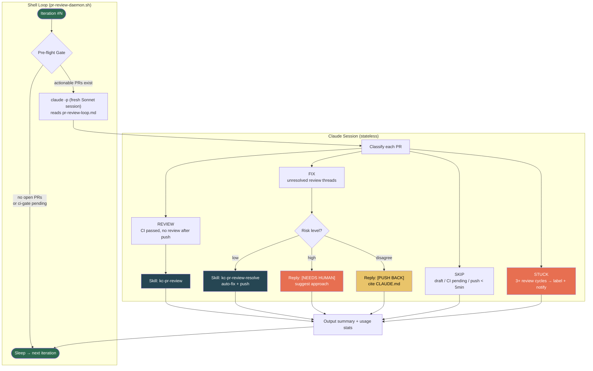
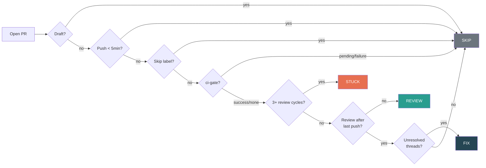

# PR Review Daemon

Automated PR review closed-loop: the daemon polls open PRs, classifies them, invokes review/fix skills, and notifies when human intervention is needed.

## Architecture



## How It Works

Each iteration is a **fresh Claude session** — zero accumulated context, runs indefinitely.

| Step | What happens | Cost |
|------|-------------|------|
| 1. Pre-flight gate | Shell checks: open non-draft PRs + ci-gate status | ~200ms (gh API) |
| 2. Classify | Claude reads PR list, determines action | ~$0.30 (idle) |
| 3. Execute | Invoke review/fix skill if actionable | ~$0.30–$1.50 |
| 4. Report | Output summary, persist usage log | free |
| 5. Sleep | Wait for next poll interval | configurable |

## Configuration

Config file: `~/.claude/kc-plugins-config/pr-flow/daemon.yaml`

```yaml
plugin_dir: ""            # absolute path to kc-pr-flow plugin (required for wrapper)
poll_interval: 300        # seconds between iterations (default: 5 min)
model: sonnet             # claude -p model (subagents inherit)
max_turns: 30             # pipe-mode safety valve
ci_gate_context: ci-gate  # commit status context ("none" to skip)
commit_scope: review      # → fix(review): <description>
slack_webhook: ""         # Slack notification URL (empty = disabled)
gate_script: ""           # custom pre-flight gate script path
```

Environment variables override config values:
- `POLL_INTERVAL` → `poll_interval`
- `PR_DAEMON_SLACK_WEBHOOK` → `slack_webhook`
- `PR_DAEMON_GATE` → `gate_script`

Note: `plugin_dir` is read from config only (no env var override). `bot_pattern` is defined in the review prompt (`reference/pr-review-loop.md`), not in daemon config.

## Review-State Persistence

`kc-pr-review-resolve` writes per-branch verdict records to `~/.claude/kc-plugins-config/pr-flow/review-state/{repo-slug}-{branch}.jsonl`. The daemon relies on those records across cycles to avoid re-surfacing issues the user already dismissed as `wont_fix` or `false_positive` when the referenced file has not changed.

Records must be emitted through a JSON encoder, not string-formatted `printf`, because reviewer findings can contain quotes, backslashes, or newlines. The skill uses `jq -nc` when available and falls back to `python3`; if neither exists, persistence degrades gracefully and the next daemon cycle simply loses that suppression hint.

## Quick Start

### With project wrapper (recommended for teams)

Projects ship a thin wrapper at `.claude/scripts/pr-review-daemon.sh` that reads `plugin_dir` from config and `exec`s the plugin script. This keeps `mprocs.yaml` portable — no user-specific paths in the repo.

```yaml
# mprocs.yaml (checked into repo)
pr-daemon:
  cmd: ["bash", ".claude/scripts/pr-review-daemon.sh"]
  autostart: false
  env:
    POLL_INTERVAL: "300"
```

Each user sets their plugin path once:

```yaml
# ~/.claude/kc-plugins-config/pr-flow/daemon.yaml
plugin_dir: /path/to/kc-pr-flow
```

Start in mprocs: select `pr-daemon` → press `s`.

### Standalone (direct)

```bash
cd /path/to/your/repo
bash /path/to/kc-pr-flow/scripts/pr-review-daemon.sh
```

### In Claude Code

```
/kc-pr-daemon start     # show startup command
/kc-pr-daemon status    # usage stats from log
/kc-pr-daemon config    # show current config
```

## PR Classification



## Risk Classification (FIX action)

| Risk | Examples | Action |
|------|----------|--------|
| **Low** | Typo, null check, import order, type annotation | Auto-fix → commit → push → reply |
| **High** | Logic change, new dependency, security, schema | Reply with `[NEEDS HUMAN]` suggestion |
| **Push back** | Contradicts CLAUDE.md, false positive | Reply with `[PUSH BACK]` + reasoning |

## Notifications

When daemon encounters `NEEDS HUMAN`, `STUCK`, `PUSH BACK`, or `BLOCKED`:

| Channel | Behavior |
|---------|----------|
| **macOS** (terminal-notifier) | Click notification → opens PR in browser |
| **macOS** (osascript fallback) | Notification + URL logged to console |
| **Slack** (webhook) | Message with `View PR` link |

Requires: `terminal-notifier` (brew install) for click-to-open. Falls back to `osascript`.

## Usage Tracking

Every iteration appends to `~/.claude/audit/pr-daemon-usage.jsonl`:

```jsonl
{"ts":"2026-03-15T03:54:48Z","iter":1,"cost":0.3116,"in":6,"out":938,"cache_read":184078,"cache_create":64620,"turns":5,"duration_ms":26411,"action":"Action taken: NONE (all skipped)"}
{"ts":"2026-03-15T05:22:44Z","iter":14,"cost":0.6259,"in":11,"out":9554,"turns":10,"duration_ms":180093,"action":"Action taken: FIX #410 (high-risk reply to 2 threads)"}
```

Query examples:

```bash
# Monthly cost
jq -s 'group_by(.ts[:7]) | .[] | {month: .[0].ts[:7], cost: ([.[].cost] | add | . * 100 | round / 100), iters: length}' ~/.claude/audit/pr-daemon-usage.jsonl

# Actions taken (non-idle)
jq 'select(.action | test("REVIEW|FIX"))' ~/.claude/audit/pr-daemon-usage.jsonl

# Average cost per iteration
jq -s '{avg_cost: ([.[].cost] | add / length | . * 10000 | round / 10000), total: length}' ~/.claude/audit/pr-daemon-usage.jsonl
```

## Custom Gate Scripts

The pre-flight gate is pluggable. Set `gate_script` in config or `PR_DAEMON_GATE` env var.

**Contract**: exit 0 = proceed, exit 1 = skip. Stdout message is logged.

```bash
#!/bin/bash
# Example: only process PRs with a specific label
count=$(gh pr list --state open --label "daemon-review" --json number --jq 'length')
if [[ "$count" == "0" ]]; then
  echo "No PRs with daemon-review label"
  exit 1
fi
echo "$count PR(s) ready"
exit 0
```

```bash
#!/bin/bash
# Example: only run during work hours
hour=$(date +%H)
if [[ $hour -lt 9 || $hour -gt 18 ]]; then
  echo "Outside working hours"
  exit 1
fi
exit 0
```

## Safety Guardrails

| Rule | Enforcement |
|------|-------------|
| No merge | Prompt prohibits `gh pr merge` |
| No force push | Prompt + PreToolUse hook blocks `--force` |
| Scope = PR diff only | Prompt checks `gh pr diff --name-only` |
| Max 3 review cycles | STUCK classification + `daemon-stuck` label |
| High-risk = suggest only | Risk classification in prompt |
| Audit trail | PostToolUse hook logs all Bash commands |
| One PR per iteration | Concurrency policy in prompt |

## Limitations

1. **Machine must be running** — daemon is local, not cloud. GitHub Actions CI review serves as fallback.
2. **Same GitHub identity** — daemon posts as your `gh` auth user. Cannot approve your own PRs (GitHub restriction).
3. **No merge** — daemon reviews and fixes, but never merges. Human makes the final call.
4. **Sequential** — one PR per iteration. Multiple active PRs queue across iterations.
