# Typed Review Runtime

The review runtime lets maintainers collect exact-head receipts and lets interactive review derive typed coverage, approval eligibility, event precedence, and confirmation input from one terminal receipt. It never bypasses human confirmation or posts to GitHub.

It does not adapt lane scheduling, route models, choose findings, post reviews, resume interrupted execution, or garbage-collect state.

## Prerequisites

- Bash 3.2 or newer
- `jq`
- Python 3.8 or newer with `O_NOFOLLOW` and `O_CLOEXEC`
- `shasum` or `sha256sum`
- Git for local `git_blob` evidence verification
- a writable user-local state directory

The runtime itself does not call models, the network, or GitHub. Python provides fail-closed safe I/O: every runtime file is read from one no-follow regular-file descriptor into a bounded private snapshot only when its file identity remains stable. Missing support, symlinks, path replacement, concurrent mutation, oversize data, duplicate JSON keys, unsafe integers, or impossible UTC dates stop runtime collection before accepted-state mutation. Duplicate-key checks are batched one JSONL stream per validation pass, and the UTC calendar check runs in the shell, so a recorded event costs a bounded number of interpreter launches rather than one per line. The review skill retains mandatory confirmation and all posting authority.

Run the CLI examples below from the `kc-pr-flow` plugin root.

## Enable shadow observation

Enable the single post-collation observer seam for the current process:

```bash
export KC_PR_FLOW_REVIEW_SHADOW=on
```

Only the exact value `on` enables it. Unset, empty, and unknown values are off. The seam runs after the legacy review body, comments, event modifiers, and confirmation options are final, but before the existing user confirmation gate.

When enabled, the skill performs a fresh read-only exact-head check. A moved head, failed check, invalid receipt, or local runtime failure skips observation and leaves the legacy review byte-identical. Shadow success also cannot change the review.

The seam serializes exactly one closed `ShadowObservation/v1` (`kc-pr-flow.shadow-observation/v1`) after the legacy body, inline comments, event, options, confirmation input, and GitHub-call log are frozen. It contains only exact-head identity, six hashes of those frozen artifacts, typed lane/candidate observations, evidence pointers and hashes, synthesis, uncertainty, and usage provenance. Unknown fields, excerpts, prompts, diffs, comments, rationale, provider raw text, and other opaque values are rejected. The collector reports `observed` only after it emits and replays a complete lane/candidate/synthesis/`run.finished` lifecycle; all other outcomes are typed `not_observed` diagnostics. If collection fails after `run.started`, an incomplete diagnostic run may remain, but it is never observed or authoritative; increment 2.3 owns recovery.

## Select typed interactive mode

Enable typed authority for a fresh invocation:

```bash
export KC_PR_FLOW_REVIEW_TYPED=on
```

Only the exact value `on` enables it. The skill samples the value once before dispatch. Unset, empty, `off`, and unknown values select the legacy path. Changing the variable mid-run has no effect.

Typed mode consumes a closed `InteractiveCollationDecision/v1` derived from one complete terminal receipt. Required capabilities must end with typed terminal evidence. One transient failure permits one retry; a remaining required gap needs an evidence-bound manual fallback or stays incomplete. Incomplete required coverage cannot approve and selects COMMENT unless a confirmed blocker requires REQUEST_CHANGES. The existing human confirmation gate remains mandatory.

If typed state is invalid, incomplete, stale, or unsupported after dispatch, the current invocation fails closed to explicit non-approval. It does not silently switch to legacy mode. Disable typed behavior before starting a new invocation to roll back.

State defaults to `${XDG_STATE_HOME:-$HOME/.local/state}/kc-pr-flow`. To isolate an evaluation:

```bash
export KC_PR_FLOW_STATE_DIR="$PWD/.tmp/kc-pr-flow-state"
```

Use a private, unshared directory and do not commit it.

## Inspect a receipt

First inventory candidate receipts for one PR. This procedure follows the runtime's state-root
precedence, refuses an unsafe root, does not follow directory symlinks, handles spaces in paths, and
prints identity from `show` without selecting a receipt. Run it from the plugin root after replacing
the PR number:

```bash
PR_NUMBER='<positive-pr-number>'

if ! [[ "$PR_NUMBER" =~ ^[1-9][0-9]*$ ]]; then
  printf 'invalid PR number\n' >&2
  exit 2
fi

if [ -n "${KC_PR_FLOW_STATE_DIR:-}" ]; then
  STATE_ROOT="$KC_PR_FLOW_STATE_DIR"
elif [ -n "${XDG_STATE_HOME:-}" ]; then
  STATE_ROOT="$XDG_STATE_HOME/kc-pr-flow"
else
  if [ -z "${HOME:-}" ]; then
    printf 'HOME is required to resolve the default state root\n' >&2
    exit 2
  fi
  STATE_ROOT="$HOME/.local/state/kc-pr-flow"
fi

if [ ! -d "$STATE_ROOT" ] || [ -L "$STATE_ROOT" ]; then
  printf 'unsafe or missing state root: %s\n' "$STATE_ROOT" >&2
  exit 2
fi

FOUND=0
while IFS= read -r -d '' EVENT_FILE; do
  RUN_DIR="${EVENT_FILE%/events.jsonl}"
  PR_DIR="${RUN_DIR%/*}"
  REPOSITORY_DIR="${PR_DIR%/*}"
  REPOSITORY_KEY="${REPOSITORY_DIR##*/}"

  if ! [[ "$REPOSITORY_KEY" =~ ^[0-9a-f]{64}$ ]] ||
    [ ! -d "$REPOSITORY_DIR" ] || [ -L "$REPOSITORY_DIR" ] ||
    [ ! -d "$PR_DIR" ] || [ -L "$PR_DIR" ] ||
    [ ! -d "$RUN_DIR" ] || [ -L "$RUN_DIR" ] ||
    [ ! -f "$EVENT_FILE" ] || [ -L "$EVENT_FILE" ]; then
    continue
  fi

  if ! SHOW_OUTPUT="$(bash scripts/review-runtime.sh show --event-file "$EVENT_FILE")"; then
    printf 'invalid receipt: %q\n' "$EVENT_FILE" >&2
    continue
  fi

  RUN_ID="$(printf '%s' "$SHOW_OUTPUT" | jq -r '.run.run_id')" || continue
  HEAD_SHA="$(printf '%s' "$SHOW_OUTPUT" | jq -r '.run.head_sha')" || continue
  REVIEW_KEY="$(printf '%s' "$SHOW_OUTPUT" | jq -r '.run.review_key')" || continue
  printf 'run_id=%s\nhead_sha=%s\nreview_key=%s\npath=%q\n\n' \
    "$RUN_ID" "$HEAD_SHA" "$REVIEW_KEY" "$EVENT_FILE"
  FOUND=$((FOUND + 1))
done < <(find "$STATE_ROOT" -mindepth 4 -maxdepth 4 -type f \
  -path "*/pr-$PR_NUMBER/run-*/events.jsonl" -print0)

if [ "$FOUND" -eq 0 ]; then
  printf 'no valid receipts found for PR %s\n' "$PR_NUMBER" >&2
fi
```

Choose only an entry whose `head_sha` and `review_key` match the exact final review inputs. When the
collector returned a `run_id`, require that match too. If more than one entry still matches, stop and
obtain the intended run ID; do not guess the newest by path, modification time, or lexical order.

After identifying the exact managed event log, use its printed path below:

```bash
EVENT_FILE="<state-root>/<repository-key>/pr-<number>/run-<id>/events.jsonl"

bash scripts/review-runtime.sh validate --event-file "$EVENT_FILE"
bash scripts/review-runtime.sh show --event-file "$EVENT_FILE" | jq .
```

`validate` checks each envelope and hash independently; passing it does not prove cross-event lifecycle validity. `show` additionally validates authoritative chronological relationships and returns exact-head identity plus aggregate counts. Use `replay` when lane, candidate, finding, uncertainty, and usage objects are needed:

```bash
bash scripts/review-runtime.sh replay --event-file "$EVENT_FILE" | jq .
```

For a read-only exact-head observation:

```bash
bash scripts/review-runtime.sh observe \
  --event-file "$EVENT_FILE" \
  --expected-head "<40-character-reviewed-head>" \
  --expected-review-key "<64-character-review-key>"
```

## Rehydrate a terminal interactive decision

After selecting one complete receipt whose exact identity matches the fresh review inputs, rebuild the collator decision locally:

```bash
bash scripts/review-runtime.sh rehydrate-interactive \
  --event-file "$EVENT_FILE" \
  --policy-file "<closed-capability-policy.json>" \
  --repo-worktree "<matching-local-worktree>" \
  --repo "<owner/repository>" \
  --pr "<positive-pr-number>" \
  --base "<40-character-base-sha>" \
  --head "<40-character-reviewed-head>" \
  --config-hash "<64-character-config-hash>" \
  --review-key "<64-character-review-key>" \
  --run-id "<terminal-run-id>" | jq .
```

The command validates replay, complete lifecycle state, full identity, capability policy, retry and fallback rules, and every evidence pointer and content hash. Its only output is the in-memory decision. It does not append, repair, resume, recover locks, dispatch a model, contact GitHub, retain state, authorize a payload, or post.

Do not edit accepted JSONL by hand. The event envelope and every event payload are closed. The only same-major extension is a closed hash-only record containing namespace, key, value SHA-256, and byte count; it cannot affect replay. Rejected append input creates metadata-only quarantine containing its reason, input SHA-256, byte count, and timestamp, never the rejected bytes. Read-only validation or replay of an already-invalid receipt is not quarantined. Unsafe storage or inconsistent accepted state fails closed.

## Build an exact configuration hash

The skill computes this automatically. For a reproducible local probe:

```bash
CONFIG_HASH="$(bash scripts/review-runtime.sh config-hash \
  --agent-tier standard \
  --pr-archetype bugfix \
  --full-pass false \
  --probe-required true \
  --cross-model false \
  --noise-filter false \
  --capabilities correctness,tests)"
printf '%s\n' "$CONFIG_HASH"
```

Capabilities are sorted and deduplicated. Use only effective normalized settings; never hash prompts, diffs, bodies, comments, or model output.

## Verify evidence and usage

Evidence is stored as typed pointers and hashes, not excerpts. Verify a `git_blob` pointer against a matching local GitHub repository:

```bash
bash scripts/review-runtime.sh verify-evidence \
  --pointer-json "<sanitized-pointer.json>" \
  --repo "<local-worktree>" | jq .
```

Other pointer kinds currently return typed unavailable status.

Compare two usage observations with:

```bash
bash scripts/review-runtime.sh compare-usage \
  --left-json "<baseline-usage.json>" \
  --right-json "<shadow-usage.json>" | jq .
```

A comparison is available only when both sides are complete provider-reported measurements from the same provider family and scope. Estimated, unavailable, cross-provider, cross-scope, partial, or null usage is unavailable, never zero.

## Score paired runs

The repository fixture demonstrates the closed sanitized corpus schema. Score a corpus locally:

```bash
bash scripts/review-runtime-benchmark.sh score \
  --corpus test/fixtures/review-runtime/paired-runs.jsonl | jq .
```

Before scoring, the benchmark recomputes the exact-head review key, every candidate fingerprint and run-bound candidate ID, and each arm's canonical receipt authority:

```text
content_sha256 = sha256(canonical behavior, lanes, candidates, findings, uncertain candidate refs, and usage)
receipt_id = sha256(run_id|review_key|content_sha256)
```

Expected and observed findings must resolve through a canonical candidate carrying the same evidence hash. A removed candidate, drifted evidence hash, or stale receipt hash makes the corpus invalid rather than inflating recall. The deterministic report then presents measures in this order:

1. Evidence recall against explicit expected finding IDs. Model silence is not truth.
2. Expected capability coverage and each lane's terminal status.
3. External behavior parity through body, event, and payload hashes.
4. Finding and candidate stability, including disagreements and uncertain candidates.
5. Usage comparability under the provenance rule above.

The report also contains an ordered promotion verdict:

1. G1: valid bound inputs.
2. G2: complete required capability coverage.
3. G3: external behavior parity.
4. G4: zero lost expected must-fix findings.
5. G5: either median complete same-provider/scope reported token reduction of at least 20%, or median local terminal-collation cost no greater than 60% of a full review rerun.

For the local branch, first capture one closed `full-review-rerun-control/v1` receipt from the designed full rerun. It records the exact review identity, the sanitized full-review artifact hash, and that artifact's `canonical-artifact-bytes/v1` units. Add its hash, the raw terminal artifact hash, the expected decision hash, both unit values, and their canonical binding hash to the pair's `local-measurement-binding/v1`.

Run the executable producer with `measure-local --runtime ... --target ... --event-file ... --control-file ... --policy-file ... --repo-worktree ...`, then pass its receipt through `--local-costs`. The producer safe-snapshots both artifacts, invokes only fresh `rehydrate-interactive`, counts the canonical decision bytes with the same counter, and requires every measured value to equal the target binding. The scorer rechecks decision, producer, measurement-binding, run, review, receipt, raw-event, and control hashes against the paired corpus. Unbound or caller-resealed numbers, copied identities, replay-output controls, tampered decisions, and later efficiency evidence cannot produce a passing verdict.

## Once-only posting

`scripts/review-post.sh` posts the confirmed review at most once, even across a crash mid-POST. It
is disabled by default; enable it per invocation with `KC_PR_FLOW_ONCE_ONLY_POST=on`:

```bash
KC_PR_FLOW_ONCE_ONLY_POST=on bash scripts/review-post.sh post \
  --request-file request.json --gate-file gate.json
```

`request.json` carries the repo/PR/base/head/config identity plus the exact `commit_id`, `event`,
`body`, and `comments` to post; `gate.json` is the existing `kc-pr-flow.interactive-post-gate/v1`
receipt. A clean POST records `post.result{outcome: posted}` and removes the pending payload. An
ambiguous outcome (timeout, dropped response, 5xx) leaves a mode-`0600` pending payload durable and
posts nothing further; resume it with:

```bash
bash scripts/review-post.sh resume --repo OWNER/REPO --pr NUMBER --self BOT_LOGIN --run-id RUN_ID
```

Resume reconciles against `GET .../reviews` before ever retrying — if the earlier POST already
landed, it records `post.result{outcome: posted_reconciled}` and posts nothing; only a marker-absent,
head-unchanged pending payload gets one bounded retry. That retry additionally requires a reconcile
read that positively confirms remote state, so resume can report `ambiguous` twice for reasons other
than the original POST. `post` applies the same rule to its own pre-POST read and emits the same
`reconcile_unavailable`, so both commands share this table:

| `reason` | Meaning | What to do |
|----------|---------|-----------|
| `reconcile_unavailable` | The `list` response was not a reviews array of objects, or its marker scan failed (including after partial id output), so neither "marker absent" nor "marker found" was established. | Fix transport/API access, then resume again. Pending is kept and no further POST or retry occurs. |
| `reconcile_unconfirmed` | Marker absent, but less than `KC_PR_FLOW_RECONCILE_CONFIRM_SECONDS` (default 60) has elapsed since `post.intent`. The reviews list is read-after-write eventually consistent, so an absent marker here may just be lag. | Resume again after the window; retrying now could duplicate a review that did land. |

`post` performs the same marker reconcile *before* its own POST, so re-running `post` for a payload
that already landed reports `posted_reconciled` instead of posting a second review. When that read
has unusable elements or a failed marker scan, `post` refuses rather than proceeding — the local
intent check it used to rely on goes
blind once the state directory is wiped or the caller moves machines. The refusal comes *after* that
local check, so a prior run that definitively posted still reports `posted_reconciled` and an
unsettled one still reports `prior_attempt_unsettled`. A pending payload
past `KC_PR_FLOW_PENDING_RETENTION_SECONDS` (default 604800 / 7 days) is swept with `gc`, which never
removes a within-window unreconciled payload and rejects a non-numeric `--now-epoch` rather than
risk expiring evidence early.

## Deferred capabilities

This increment deliberately stops at terminal interactive collation and measurement; the once-only
posting protocol above is the increment-2.3 capability that was originally deferred here.
Crash-safe lock recovery and PID-reuse handling, verified predecessor lineage, and append/compaction
performance remain deferred.

An autonomous caller (the daemon) now has an authorization of its own rather than approving the human
gate on the user's behalf: `kc-pr-flow.autonomous-post-gate/v1`, which has no `human_confirmed` field
to forge and is bound to the `review_key` and `head_sha` it authorizes, refused on mismatch. What is
still deferred is the rest of a preauthorization contract — **no event ceiling, no expiry**, no fresh
head recheck immediately before the post, and no refusal when the typed decision reports required
coverage gaps. `KC_PR_FLOW_ONCE_ONLY_POST` off still denies every caller. Do not interpret a receipt,
decision, reserved event name, or successor hint as authority for any of those still-deferred actions.

## Roll back

Disable future observation without deleting evidence:

```bash
unset KC_PR_FLOW_REVIEW_SHADOW
unset KC_PR_FLOW_REVIEW_TYPED
unset KC_PR_FLOW_ONCE_ONLY_POST
```

You may also set any variable to any value other than `on`. The change affects only a fresh
invocation. Existing receipts, pending payloads, and posting-lifecycle events remain available for
validation, reconciliation, and paired analysis. Keeping them makes rollback reversible and
preserves evidence for debugging — `review-post.sh resume`/`gc` are never gated by
`KC_PR_FLOW_ONCE_ONLY_POST`, so an uncertain remote result from a prior POST stays reconcilable
after rollback.

## Troubleshooting

| Symptom | Meaning and action |
|---|---|
| No receipt appears | Confirm the gate is exactly `on`; Python 3.8+, `jq`, and a SHA-256 tool are available; the state root is writable; and the final review reached the shadow seam. Inspect the typed `not_observed` reason. The review itself should still continue. |
| `exact_head_mismatch` | The PR moved after review collation. Do not reuse the receipt; refresh and review the unseen delta or rewritten head. |
| `review_key_mismatch` | Repository, PR, base, head, or effective configuration differs. Recompute the canonical configuration and use the matching run. |
| `invalid_receipt` | Run `validate` for envelope diagnostics and `show` or `replay` for lifecycle diagnostics. Inspect metadata-only quarantine only when the invalid record came through rejected append input; read-only inspection does not create quarantine, and rejected bytes are intentionally unavailable. |
| append reports `blocked` | Another live owner holds the run reservation, storage is unsafe, the accepted log is inconsistent, or a size limit was reached. Preserve state and investigate; do not bypass the lock. |
| usage is unavailable | One side is missing, estimated, incomplete, cross-provider, or cross-scope. Collect comparable provider-reported data rather than substituting zero. |
| evidence is unavailable or mismatched | Confirm the local GitHub repository identity, object and path, blob type, and content hash. A mismatch cannot support a finding. |
| typed mode returns COMMENT unexpectedly | Inspect required capability terminals, retry count, fallback evidence, exact identity, and evidence hashes. Typed failure cannot fall through to legacy for the current invocation. |
| local efficiency branch is ineligible | Confirm the measurement receipt binds the paired terminal run, review key, receipt ID/content hash, and recomputed decision, and records a fresh collator-only operation with zero model and remote calls. |

For schemas, identities, storage rules, command contracts, and failure semantics, see the [normative runtime reference](../reference/review-runtime.md).

## Opt-in profiled Lite review

```mermaid
flowchart LR
  intake[Exact-head shape and explicit goals] --> plan[Required-question plan]
  plan --> evidence[Selected evidence and tests] --> files[Frozen request and schema files]
  files --> calls[Host-native Read-only workers]
  calls --> collect[Serial raw-response validation] --> reviewer[Existing review agent judgment]
  reviewer --> receipt[Existing receipt projection] --> decision[Existing typed decision]
  decision --> confirm[Human confirmation] --> posting[Existing posting owner]
```



Both typed and profiled flags must be exactly `on` for the new adapter. Use a
private, invocation-scoped run directory: it contains selected source material,
provider reports (including exact stdout in `provider-*.raw`) and a
non-authoritative audit, not only runtime metadata. Do
not publish these artifacts or copy them into the durable event log. Normal
confirmation/posting retention remains owned by the existing runtime.

Run `python3 scripts/review-capability.py --help` for the exact-head entry point.
Pass the host's existing normalized classification through `--pr-archetype`.
`PRArchetype` in the schema uses the existing runtime vocabulary; omitted input
retains `mixed` for compatibility. `prepare` validates the value and passes it
to the runtime configuration-hash owner; `requests` rechecks the frozen plan
and identity binding. Finalization uses that frozen classification, ignoring
new intake flags. This binds the reported classification, not its correctness;
supervised admission still requires each arm's independent classification.
Supply a `GoalInputs` array with `--goal-material-file`: each record binds the
intake identity, source class (`pr_body`, `issue`, `review_comment`), locator and
substantive original text already acquired by the host. The adapter does not
fetch or authenticate those sources. It checks their identity/content binding
and revision continuity; these are not Git-only runtime evidence pointers.
No supplied goal, blank text or a locator alone leaves goal alignment incomplete.

Use `--prepare-only` on the managed-host route, without `--model`. It returns
`pending_dispatch`, `request_files` entries (`capability`, `request_file`), a shared
`result_schema_file` path, and the unchanged 120-second worker deadline.
The schema file contains only the result definition's reachable contracts.
Each request view has `request` metadata and a `materials` map keyed by evidence
ID. Joining each array without a separator restores its original `material`
string in the existing `CapabilityRequest`; chunks are not source line breaks.
Pretty-printed, bounded chunks support paged Read access without long source
strings being truncated. The installed `review-capability-worker` receives
its capability and the two paths, not parent-reproduced source/schema, through
the host's native agent interface. No independent Claude CLI login is needed;
omitting `--prepare-only` retains the optional authenticated CLI backend.
Project `CLAUDE.md` is permitted shared background, pinned equally across
comparison arms, not a substitute for assigned evidence. Native workers have
only Read and inherit the host model. Read-only is not single-file isolation:
assigned-file use is an instruction, not an enforced path sandbox. Workers
read both files to completion or return JSON null. Collection compares exported
bytes with frozen request/schema definitions and rejects missing, changed or
symlinked files; this does not prove which files a live model actually read.

Each authorized mechanical command keeps its explicit `timeout_seconds`, from
1 through 240, independently of the 120-second worker deadline. Nonzero exits
and timeouts remain evidence of unsuccessful tests, not waived or retried passes.
Failed, timed-out and unavailable observations include optional `diagnostics`:
stdout/stderr excerpts (at most 4096 characters each) and a `truncated` flag.
`failure_diagnostics` masks common credential-bearing lines and private-key
blocks before retaining the excerpt; it is not an arbitrary-secret detector.
Long excerpts retain their beginning and end with a visible truncation marker.
Native file views chunk diagnostic stdout/stderr into arrays like source
material; joining each array without a separator restores the typed string.
These excerpts share the observation/bundle hash binding and private artifact
retention; original stream hashes remain, but original test output is not saved.
Successes keep digest-only observations, and older observations without the
optional member need no migration. A failing test is evidence to investigate,
not proof of a particular code defect when the excerpt is inconclusive.

`validate_result` accepts IDs from the selected request's `material` and
`test_observations` in an answer's `evidence_refs`. Code evidence remains
required, as does goal evidence where declared. A contribution's `evidence_ref`
must still point to supplied code material and be listed by its answer; test
observations can support the explanation but cannot supply an inline location.
Unknown references or observation-only answers remain invalid. Result
`status: succeeded` means the capability produced its supported answer, not that
tests passed. The worker explicitly checks this required member; the collector
rejects omissions without repairing the response. These instructions need live
revalidation before claiming reliable model compliance.

For operator-managed checkouts, hand off the absolute verified toolchain binary
and process-local PATH prefix, not "the installed path". Verify that exact binary
before prepare; inability to resolve it is not proof that the tool is uninstalled.
Fetch sufficient target history before mechanical tests; a shallow base/head-only
checkout can break tests referencing older commits. Pin the selected base/head
without rebasing onto current main, and record unavailable history as an
environment limitation. Do not repair a sealed run or claim an environmental
failure without the necessary independent evidence. These are handoff checks,
not a new setup workflow, installation permission or paid-run authorization.

The host, not Python, enforces native deadlines, cancels timed-out work and
honors the already-authorized total budget. Without those controls, record
unavailable work instead of launching it. Preserve unedited worker response
bytes and collect one attempt at a time with `--collect-dir RUN_DIR --capability
CAPABILITY --attempt ORDINAL --attempt-result succeeded --response-file FILE`.
The native collector accepts pure JSON or one complete `json` Markdown fence
with no surrounding prose. `native_response` unwraps only that presentation
before the unchanged duplicate-key, schema, identity, question and evidence
checks; the `.raw` artifact retains the supplied bytes. It does not rewrite
JSON or extract an object from arbitrary prose. Extra text, multiple objects,
wrong-language fences and invalid content remain failed attempts. Workers still
request JSON-only output; this compatibility decoder does not guarantee model
compliance. The optional CLI provider decoder is unchanged.
The host may report `terminal_failure` or `unavailable` without a response;
use `transient_failure` only when one authorized retry will actually run.
The second transient failure is terminal. Never collect concurrently or start
an unassigned/third attempt. The skill contains the dispatch/collection sequence.

Private `host-progress.json` is replaceable in-flight state. Once all assignments
are terminal, collection creates `dispatched.json` and hands off to judgment.
These files add no runtime event types, recovery, storage-integrity guarantee
or release authority. Partial-write recovery and live host cancellation/budget
enforcement are not verified by local fake-response tests. Stop an interrupted
invocation rather than editing its progress or silently launching another run.

Preparation/collection can also return legacy routing, an explicit RunTerminal, or
`pending_finalization` with a `ReviewerRequest`. The existing outer review agent
returns a `ReviewerJudgment`, then invokes `--finalize-dir RUN_DIR
--reviewer-judgment-file FILE` to obtain the bound decision and confirmation.
The schema defines each contribution's accept/reject/unresolved disposition,
reason and evidence references; decision validation retains confirmed severity
and requires a judgment for completed coverage. Raw accepted/rejected/advisory
contributions remain in the private decision input. Never treat an absent result as clean.
No executable evidence expansion is available. A manual fallback may satisfy a
failed attempt only with bound clean/not-applicable evidence; manual findings
remain unconfirmed notes and required coverage stays incomplete.
Read-only posting projections bind the reviewed repository, base, head and
configuration but retain the posting owner's independent run ID; posting events
cannot extend the sealed review receipt. An absent terminal outcome stays absent.

Completed dispatch writes `dispatched.json` and pauses for the outer reviewer;
it does not return approval. For an existing interactive human fallback, record
a bound `ManualFallback` array and refresh the reviewer request using
`--finalize-dir RUN_DIR --defer-confirmation --fallbacks-file FILE`. Judge this
new packet and finalize with both `--fallbacks-file FILE` and
`--reviewer-judgment-file FILE`. Finalization never re-dispatches or re-samples route flags,
and a sealed receipt cannot be finalized twice. Do not use this pause in a
supervised blind run; a request for mid-review help fails that sample.

Runtime policy validation separates invocation success from coverage completion:
a reviewer may keep a successful reply or valid fallback incomplete. Candidate
references must still resolve to retained findings. Required gaps disallow
approval; confirmed High/Critical findings still require REQUEST_CHANGES even
with a gap in the same question. The event vocabulary and posting owner are unchanged.

Ambiguous repeated quote anchors stay in the review body without an invented
inline line. Known audit clocks remain Python integer nanoseconds without a
floating point safe-integer bound; they describe local work, not the acceptance
interval. Native invocation clocks stay null because collection did not observe
execution. Worker-authored usage stays in raw reports but is normalized to null
in accepted results; only the host's actual provider telemetry can supply usage.

Lite acceptance uses the operator-supervised start-message to completed-review
end-message interval defined in the [protocol spec](../../docs/superpowers/specs/2026-09-05-kc-pr-review-capability-protocol-v1.md#blind-evaluation-and-promotion).
The operator retains observed endpoints and complete outputs, freezes versions,
inputs and run conditions, and applies independent blind quality scoring before
comparing times. Required coverage and all five-pair quality/time thresholds
remain in that spec. Missing provider usage is unknown; the operator must obtain
a separate fixed budget before any model-based experiment.

The branch-added automatic Pilot commands and comparator are withdrawn. The
original ablation tool remains independently testable with
`bash scripts/review-ablation.test.sh`; protocol regressions use
`python3 scripts/review-capability.test.py`. Historical Pilot results and the
unresolved record-integrity failure retain their original meaning; withdrawal
does not repair that failure. Neither those results nor synthetic fixture times
certify the supervised comparison or establish review-speed improvement.
