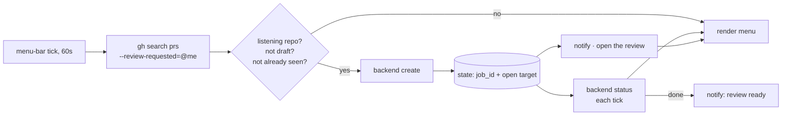

# Review-Request Listener (menu bar)

Watches GitHub for pull requests where you are a requested reviewer, starts a
review for each new one, and reports it in the macOS menu bar. It never merges and
never approves.

## Shape



There is no daemon: the plugin's refresh interval *is* the poll interval, and the
menu-bar host's own enable/disable is the outermost off switch.

## Install

```bash
brew install --cask swiftbar          # or xbar / BitBar — same plugin format
scripts/reviewer-listen-install.sh --backend conductor
```

Idempotent, so re-run it on a new machine or to change the backend. It prints the
two steps it cannot do itself: granting the plugin folder in the menu-bar app's
first-run dialog, and clicking **Resume listening** — a fresh install starts
paused, because an install script must not dispatch an unattended review.

## Files

| Path | Role |
|------|------|
| `scripts/pr-reviewer-listen.sh` | listener + menu renderer, backend-agnostic |
| `scripts/backends/CONTRACT.md` | the two-verb backend contract |
| `scripts/backends/conductor.sh` | the shipped backend: one Conductor cloud workspace per PR |
| `scripts/backends/conformance.sh` | contract check for a new backend |
| `scripts/backends/conductor-token.sh` | hidden-input token entry for a second organization |
| `reference/reviewer-dispatch-prompt.md` | opening message for a dispatched review |
| `~/.claude/kc-plugins-config/pr-flow/reviewer-listen.config.json` | **intent**: the listening switch, backend, notification channel, per-repo switches |
| `~/.claude/kc-plugins-config/pr-flow/reviewer-listen.state.json` | **derived**: seen PRs, job ids, open targets, last poll |
| `~/.claude/audit/pr-reviewer-listen.log` | dispatch log |

Config and state are split so config can be kept in a dotfiles repo and state can be
rebuilt. Delete state only when nothing is in flight: a completed review is
recoverable from GitHub, but a review still running is only known here, so wiping
that record can start a second one. A rebuilt config comes back paused, like a fresh
install. Neither lives inside this repository, so
nothing about your organizations, repositories, or branches can be committed here
by accident.

## Menu

- **The badge counts what wants attention**, not what GitHub still lists. A review request stays open on GitHub until a review is submitted, which can be long after this has reviewed that commit, so a reviewed row is not counted; drafts are not either.
- **Review requests** — one row per open PR awaiting you. The row opens the review environment; **open PR on GitHub** is one item below it. A row with no environment yet opens the pull request and omits the duplicate. `⏳` running, `✅` reviewed, `❌` failed with the backend's reason and a **retry**, `○` not dispatched yet.
- **Finished reviews** — the six most recent completed reviews, kept for thirty days. They are a record, not the source of truth: GitHub answers "was this commit reviewed", so an expired row changes nothing. Unfinished rows are never pruned. This section exists because a reviewed PR *disappears* from the request list: GitHub drops it from review-requested the moment a review is submitted.
- **Listening repos** — every repo that has appeared, click to toggle. New repos start **on**, so a request in a new repo needs no configuration.
- **Pause / Resume listening** — polling and completion checks continue; only dispatch stops.
- **Start at login** — toggles whether the menu-bar host is launched at login. The host's own preference is not scriptable, so this drives the login-item list, which needs Automation permission for System Events; the row reads `unknown` if that is refused. Use one mechanism or the other, not both.

## Behaviour worth knowing

- **One dispatch per tick.** A backlog drains one PR per minute instead of creating a burst of review environments.
- **The seen key is claimed before the backend call**, and the backend does not run if that claim cannot be written — an unwritten claim is no claim, and the next tick would create a second review. A failed create retries on later ticks up to three attempts, then holds until you press retry.
- **An ambiguous dispatch waits for a person, it does not retry.** A record stuck mid-dispatch, or a backend that reports a side effect it could not finish (exit code 3), may already have created the review — retrying from age alone would duplicate it. Those rows turn `⚠️` with the reason and a retry action.
- **An unanswerable question is never an answer.** A failed GitHub review lookup, an unreadable session transcript, and "no review found" are three different outcomes; only the third lets work proceed. The other two skip the tick and are asked again.
- **A lock is reaped only when its owner is gone.** The lock records the holding process; age cannot tell a dead owner from a slow one, and evicting a live one is worse — its exit would then release the next owner's lock. A tick that cannot take the lock does nothing rather than running concurrently.
- **A fork head is refused, loudly.** The backend checks out a branch of the repository the project belongs to; a fork's head may be missing there, or worse, collide with a same-named local branch and review the wrong code.
- **What counts as reviewed is a commit, not a pull request.** Each poll reads the PR's head SHA. A local record matching that SHA is a skip; a re-request after a new push therefore runs again, and a re-request without one does not. The review skill always covers the head it finds, so if the head moves mid-review the local record is discarded and GitHub — which records the commit each review actually covered — is asked again.
- **GitHub holds the durable record.** With no local record for the current head, the listener asks whether this account has already submitted a review of exactly that commit, and adopts the answer. Deleting the state file, or moving to another machine, therefore does not re-review anything.
- **Idle is not finished.** Conductor reports a session idle between turns and during a long tool call, so completion also requires the transcript to have stopped growing between two observations. Reading idle alone once marked a review complete seven minutes before it was, which then let its own follow-up commit look like new code.
- **A commit this account pushed is part of the review it came from.** When the head moves to a commit authored by the reviewing account, the record adopts it rather than dispatching. Without that, a review that applies its own fix reviews that fix again in a fresh environment.
- **Completion comes from the backend, never from silence.** A backend that cannot determine a job's state exits non-zero, which the listener reads as *still running* — an unreachable API can therefore never fabricate a completion.
- **Notifications go through `terminal-notifier` when it is installed** — its banner opens the review on click, and it is sent with `-ignoreDnD` so a review landing during Do Not Disturb is not the one you miss. The fallback is `osascript`, which carries no click action and obeys Focus. Which channel is permitted to post is per-machine, so the menu toggles between them; if neither appears, the app needs permission in System Settings → Notifications, and Do Not Disturb needs it under Focus → Allowed Notifications.
- **`|` in a PR title is rewritten** before it reaches a menu line, where a literal pipe would truncate the row.

## Backends

Where a review runs is one executable answering `create` and `status` —
`scripts/backends/CONTRACT.md` is normative, and `conformance.sh` checks a new one
before you wire it in. Switching backends is one config key; polling,
de-duplication, notification, and rendering are untouched.

### The Conductor backend

One cloud workspace per PR, checked out at the PR head branch, with the review
prompt as the first session message. `job_id` is the session id and the open target
is the session-scoped deep link, so a click lands on the review itself.

Two facts shape its credentials:

- **A token is scoped to one organization** and the CLI takes no organization argument. The keychain token from `conductor auth login` serves its own organization; a repo in another organization needs `scripts/backends/conductor-token.sh <github-org>`, which reads the token from a hidden prompt, verifies it before writing, and stores it 0600 at `orgs/<org>.env`. Absent a file, the keychain token stands — so the common single-organization case needs no file at all.
- **The review skill has to be present before the session starts.** Installing from
  inside a running session does *not* work — it lands in the CLI, not in that
  session's skill registry. Whatever provisions the cloud environment must carry the
  plugin already. Verified on this fleet: a freshly created cloud workspace reports
  `kc-pr-flow@kc-claude-plugins` installed at user scope and lists
  `kc-pr-flow:kc-pr-review` among its available skills, with the repository's
  dependencies already built. The dispatch prompt therefore installs nothing; if the
  skill is missing it says so on its first line, so a broken environment surfaces as
  a finding instead of a quietly improvised review.

## Prerequisites

`gh` (authenticated), `jq`, a menu-bar host (SwiftBar, xbar, or BitBar), and
whatever the chosen backend requires — for Conductor, `conductor auth login`.
