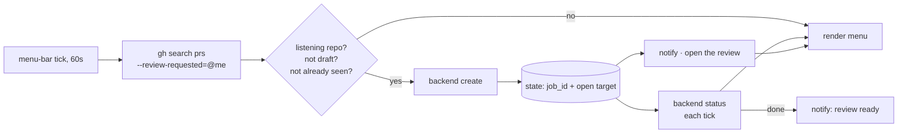

# Review-Request Listener (menu bar)

Watches GitHub for pull requests where you are a requested reviewer, starts a
review for each new one, and reports it in the macOS menu bar. It never merges and
never approves.

## Shape



There is no daemon: the plugin's refresh interval *is* the poll interval, and the
menu-bar host's own enable/disable is the outermost off switch.

## Install

```bash
brew install --cask swiftbar          # or xbar / BitBar — same plugin format
scripts/reviewer-listen-install.sh --backend conductor
```

Idempotent, so re-run it on a new machine or to change the backend. It prints the
two steps it cannot do itself: granting the plugin folder in the menu-bar app's
first-run dialog, and clicking **Resume listening** — a fresh install starts
paused, because an install script must not dispatch an unattended review.

## Files

| Path | Role |
|------|------|
| `scripts/pr-reviewer-listen.sh` | listener + menu renderer, backend-agnostic |
| `scripts/backends/CONTRACT.md` | the two-verb backend contract |
| `scripts/backends/conductor.sh` | the shipped backend: one Conductor cloud workspace per PR |
| `scripts/backends/conformance.sh` | contract check for a new backend |
| `scripts/backends/conductor-token.sh` | hidden-input token entry for a second organization |
| `reference/reviewer-dispatch-prompt.md` | opening message for a dispatched review |
| `~/.claude/kc-plugins-config/pr-flow/reviewer-listen.config.json` | **intent**: master switch, backend, notification channel, per-repo switches |
| `~/.claude/kc-plugins-config/pr-flow/reviewer-listen.state.json` | **derived**: seen PRs, job ids, open targets, last poll |
| `~/.claude/audit/pr-reviewer-listen.log` | dispatch log |

Config and state are split so state can be deleted without losing intent, and so
config can be kept in a dotfiles repo. Neither lives inside this repository, so
nothing about your organizations, repositories, or branches can be committed here
by accident.

## Menu

- **Review requests** — one row per open PR awaiting you. `⏳` running, `✅` reviewed, `❌` failed with the backend's reason and a **retry**, `○` not dispatched yet.
- **Finished reviews** — the last six completed reviews. This section exists because a reviewed PR *disappears* from the request list: GitHub drops it from review-requested the moment a review is submitted.
- **Listening repos** — every repo that has appeared, click to toggle. New repos start **on**, so a request in a new repo needs no configuration.
- **Pause / Resume listening** — polling and completion checks continue; only dispatch stops.

## Behaviour worth knowing

- **One dispatch per tick.** A backlog drains one PR per minute instead of creating a burst of review environments.
- **The seen key is claimed before the backend call**, so a crash mid-create cannot produce two reviews for one PR. A failed create retries on later ticks up to three attempts, then holds until you press retry.
- **The seen key is `repo#number`**, so a PR is reviewed once; a new push does not re-trigger.
- **Completion comes from the backend, never from silence.** A backend that cannot determine a job's state exits non-zero, which the listener reads as *still running* — an unreachable API can therefore never fabricate a completion.
- **`|` in a PR title is rewritten** before it reaches a menu line, where a literal pipe would truncate the row.

## Backends

Where a review runs is one executable answering `create` and `status` —
`scripts/backends/CONTRACT.md` is normative, and `conformance.sh` checks a new one
before you wire it in. Switching backends is one config key; polling,
de-duplication, notification, and rendering are untouched.

### The Conductor backend

One cloud workspace per PR, checked out at the PR head branch, with the review
prompt as the first session message. `job_id` is the session id and the open target
is the session-scoped deep link, so a click lands on the review itself.

Two facts shape its credentials:

- **A token is scoped to one organization** and the CLI takes no organization argument. The keychain token from `conductor auth login` serves its own organization; a repo in another organization needs `scripts/backends/conductor-token.sh <github-org>`, which reads the token from a hidden prompt, verifies it before writing, and stores it 0600 at `orgs/<org>.env`. Absent a file, the keychain token stands — so the common single-organization case needs no file at all.
- **A cloud sandbox has none of your local plugins.** For the dispatched session to run the review skill rather than improvise, the plugin has to be installed before the agent starts — that means the repository's Conductor setup script, guarded on `CONDUCTOR_IS_LOCAL` so the local path is unaffected:

  ```bash
  if [ "${CONDUCTOR_IS_LOCAL:-1}" = "0" ]; then
    claude plugin marketplace add iamcxa/kc-claude-plugins
    claude plugin install kc-pr-flow@kc-claude-plugins
    exit 0
  fi
  ```

  Installing from inside the running session does *not* work: it lands in the CLI, not in that session's skill registry.

## Prerequisites

`gh` (authenticated), `jq`, a menu-bar host (SwiftBar, xbar, or BitBar), and
whatever the chosen backend requires — for Conductor, `conductor auth login`.
