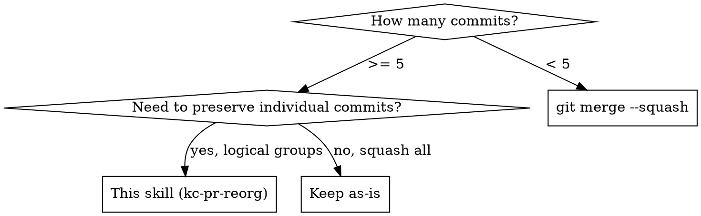

# Commit Reorganization

Non-interactive technique for reorganizing N commits into M logical groups without `git rebase -i`.

## When to Use

- Feature branch with 5+ commits needing logical grouping
- Commits interleaved by concern (feat mixed with test mixed with fix)
- Agent environment where interactive rebase is unavailable
- PR reviewer needs clean, reviewable history

## Technique

### 1. Backup (BLOCKING — never skip)

```bash
git branch backup/<branch>-pre-reorg
```

### 2. Analyze

```bash
git log --oneline main..HEAD
```

List all commits. Categorize each by concern (feat, test, refactor, docs, chore). Note original chronological order — you will need it in step 4.

### 3. Plan Groups

Present a numbered grouping plan to the user. Recommended ordering:

1. docs/design (context first)
2. refactor (prep work)
3. feat (core implementation)
4. test (validates feat)
5. chore (tooling, config)

Each group becomes one commit. Commit message descriptions follow the unified language preference — see plugin CLAUDE.md.

**Get user approval before proceeding.**

### 4. Reset and Rebuild

```bash
# Detach from current history
git reset --soft main        # All changes staged
git reset HEAD -- .          # Unstage all
git reset --hard main        # Clean working tree
git clean -fd                # Remove untracked files (reset --hard misses these!)
```

Then for each group, cherry-pick its commits **in original chronological order** within the group:

```bash
git cherry-pick --no-commit <commit1> <commit2> ...
git commit -s -m "feat(scope): description"  # description follows unified language preference; prefix stays English
```

Repeat per group.

### 5. Verify (BLOCKING — never skip)

```bash
git diff backup/<branch>-pre-reorg
```

**Must be empty.** If not, something was lost — investigate before force pushing.

### 6. Force Push

```bash
WORKTREE=$(git rev-parse --show-toplevel) || exit $?
"$CLAUDE_PLUGIN_ROOT/scripts/github-repo-write.sh" push \
  --worktree "$WORKTREE" --remote origin --tracked --force-with-lease || exit $?
```

The adapter validates the effective push destination immediately before it owns the force push and
resolves exactly one configured upstream ref instead of synthesizing a same-name remote branch or
honoring broad `push.default=matching` behavior. It
refuses a stale transferred-repository remote (including `pushurl`) and prints, but never executes,
the explicit repair command. Resolve any later PR mutation from that PR's target repository
separately; a fork's push destination is not its PR target.

## Common Mistakes

| Mistake | Fix |
|---------|-----|
| Skip `git clean -fd` after reset | New files from old commits remain, break builds |
| Cherry-pick conflicts cascade | Stop. `git reset --hard main`, re-plan group boundaries |
| Group by type ignoring time order | Within each group, preserve original commit order |
| Skip backup branch | Unrecoverable if something goes wrong |
| Skip `git diff` verification | Silent data loss — always verify zero diff |
| Use `git add -p` for splitting | Too slow, error-prone. Cherry-pick whole commits into groups |

## Recovery

If rebuild goes wrong at any point:

```bash
git reset --hard backup/<branch>-pre-reorg
```

Start over from step 2 with revised grouping plan.

## Decision: Reorg vs Simpler Alternatives


