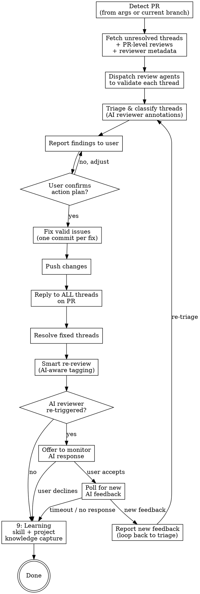

All text output follows unified language preference. See plugin CLAUDE.md for query flow.

**REQUIRED SUB-SKILL:** Use `superpowers:receiving-code-review` for evaluation mindset — verify before implementing, push back on incorrect suggestions, no performative agreement. This skill handles mechanics; that skill governs judgment.

## Process Flow



## Step 1: Detect PR

If user provides a PR number or URL, use it directly. Otherwise detect from current branch. Extract `OWNER/REPO` dynamically from git remote (never hardcode).

`Read → ${CLAUDE_PLUGIN_ROOT}/reference/gh-api-patterns.md` § "PR Detection"

## Step 2: Fetch Feedback

Fetch **both** types of PR feedback in parallel:

### Inline Threads

Query the GitHub GraphQL API for unresolved review threads on the PR.

`Read → ${CLAUDE_PLUGIN_ROOT}/reference/gh-api-patterns.md` § "GraphQL Queries"

### PR-Level Reviews

Query the REST API for reviews with substantive body text. These are top-level review summaries (e.g., ducker-agent summary reviews, Copilot overview comments) that do NOT appear in `reviewThreads`.

`Read → ${CLAUDE_PLUGIN_ROOT}/reference/gh-api-patterns.md` § "PR-Level Reviews"

Filter criteria:
- **Include**: reviews with non-empty `body` (more than just whitespace)
- **Exclude**: reviews where ALL points have already been addressed in resolved inline threads (avoid double-counting)
- **Exclude**: pure approval reviews with no actionable content (e.g., body is just "LGTM")

### Stop Condition

If zero unresolved inline threads AND zero actionable PR-level reviews → report "no feedback to address" and stop. Do NOT stop on zero threads alone — PR-level reviews may contain actionable feedback.

### Reviewer Metadata (parallel)

In parallel with fetching threads and reviews, query the PR timeline to build a **reviewer map**:

`Read → ${CLAUDE_PLUGIN_ROOT}/reference/gh-api-patterns.md` § "Review Request Timeline"

For each reviewer who left unresolved threads, record:
- `reviewer`: GitHub username
- `is_ai`: boolean (Bot type, `[bot]` suffix, or known AI reviewer)
- `requested_by`: human who requested this reviewer (from timeline `actor`)

If `requested_by` is itself a bot or unknown, fall back to the PR author.

This map is used in Step 4 (annotations) and Step 7 (smart tagging).

## Step 3: Validate Threads

Read `${CLAUDE_PLUGIN_ROOT}/reference/learned-patterns.md` for accumulated cross-project patterns that help identify common false-positive feedback and validation heuristics.

Evaluate every comment on **technical merit alone** — not on who said it.

- **Do NOT guess reviewer identity or role** (co-founder, team lead, junior dev, bot). Use only the GitHub username shown in the thread.
- **Do NOT assign authority weight** based on username, org membership, or perceived seniority. A valid point from a bot deserves the same fix as one from a human; a wrong suggestion from a senior reviewer still needs pushback.
- **Validate every comment equally**: read the referenced code, check if the suggestion is technically correct for this codebase, classify it.

For threads that reference code:

- **Simple/obvious threads** (typos, clear bugs, straightforward questions): Read the code yourself and assess directly
- **Complex/ambiguous threads** (architectural suggestions, performance concerns, multi-file impacts): Dispatch `pr-review-toolkit:code-reviewer` or `feature-dev:code-reviewer` agent for independent assessment

For each thread, determine:
- **Read the code** referenced by each thread (file + line range)
- **Assess validity**: Is this a real issue? Reproducible? Correct analysis?
- **Classify**: bug, suggestion, question, false positive

Do NOT blindly trust any reviewer — automated or human. Verify first.

**Two anti-patterns to avoid:**
1. **Auto-accepting** because "a reviewer flagged it" (human or AI) — verify the suggestion is correct for this codebase first
2. **Auto-dismissing** because "it's just a bot" — evaluate the technical content, not the author identity

When a suggestion contradicts an established codebase convention, classify it as "false positive" with an explanation citing the convention. This applies equally to human and AI suggestions.

> **AI detection vs. validation**: The reviewer map from Step 2 is used ONLY for re-review routing (Step 7) — determining who to notify and how to re-trigger reviews. It does NOT affect validation here. All comments are evaluated on technical merit regardless of whether the author is human or AI.

## Step 4: Triage & Report

Present a structured report to the user:

```
## PR #377 Review Triage

### AI Reviewers
| Reviewer | Type | Requested by |
|----------|------|--------------|
| copilot  | AI   | @kentwelcome |

### Inline Threads
| # | Author | File:Line | Category | Action |
|---|--------|-----------|----------|--------|
| 1 | sentry-io | ProCRUDList.tsx:1050 | Valid Bug | Fix: use controlledPagination.total |
| 2 | greptile | ProCRUDList.tsx:1050 | Valid Bug (dup of #1) | Same fix |
| 3 | copilot [AI] | pagination.ts:15 | Informational | Reply: explain design intent |
| 4 | copilot [AI] | data-provider.ts:400 | Pre-existing | Reply: out of scope |

### PR-Level Reviews
| # | Author | Review State | Category | Action |
|---|--------|-------------|----------|--------|
| 5 | ducker-agent [AI] | COMMENTED | Valid — docs gap | Fix: update CLAUDE.md |

Proposed: Fix 2 code issues + 1 docs gap, reply to all 5 items.
Re-review: tag @kentwelcome (requested copilot) + offer to re-trigger copilot review.
```

When AI reviewers are present, annotate the Author column with `[AI]` and add the "AI Reviewers" section showing the human-to-AI mapping. This gives the user visibility into the re-review routing before they confirm.

**GATE — Wait for user confirmation before proceeding.** User may reclassify threads or skip fixes.

## Step 5: Fix Valid Issues

For each confirmed fix:

1. Edit the file
2. Run quality checks (type-check / lint for the affected app)
3. Commit with format: `fix(SC-###): address review - <description>`
4. One commit per logical fix (related threads can share a commit)

## Step 6: Push & Reply

Push all commits, then reply to each item in-place — never batch replies into a single comment.

### Inline threads
Use GraphQL thread reply mutation. Resolve threads that were fixed; leave unfixed threads unresolved with an explanation reply.

`Read → ${CLAUDE_PLUGIN_ROOT}/reference/gh-api-patterns.md` § "GraphQL Mutations"

### PR-level reviews
Reply using `gh pr comment` quoting the original review's key point. PR-level reviews cannot be "resolved" — the reply itself serves as acknowledgment.

`Read → ${CLAUDE_PLUGIN_ROOT}/reference/gh-api-patterns.md` § "GraphQL Mutations" → "Reply to a PR-level comment"

## Step 7: Request Re-review

After all threads are replied to individually, request re-review with **AI-aware tagging**.

### Build the tag list

1. Collect unique reviewers from threads that required code changes or substantive responses
2. For each reviewer, check the reviewer map from Step 2:
   - **Human reviewer** → tag directly in summary comment
   - **AI reviewer** → tag the **human who requested the AI review** instead (from `requested_by`)
3. Deduplicate: if the same human appears both as a direct reviewer and as an AI requester, tag them once
4. Always append `@claude` to trigger Claude re-review via `claude-review.yaml`

### AI reviewer re-review decision

When AI reviewers were detected, present options to the user before posting:

```
AI Reviewers with addressed threads:
- copilot (requested by @kentwelcome) — 2 threads addressed

Re-review options:
1. Tag @kentwelcome only (human reviews the fixes)
2. Tag @kentwelcome + re-request copilot review
3. Skip AI re-review
```

**GATE — Wait for user's choice before posting.**

### Post summary comment

Tag only **humans** in the comment body. Use `gh pr edit` to re-request AI reviews separately.

```bash
# ✅ CORRECT — humans in comment, API for AI re-request
gh pr comment PR_NUM --body "All review feedback addressed — please see individual thread replies for details.

@kentwelcome @senior-dev @claude"

# If user chose to re-trigger AI review:
gh pr edit PR_NUM --add-reviewer copilot
```

### Anti-pattern: NEVER @mention AI bots in comments

Some AI bots (notably Copilot) interpret @mentions in PR comments as new action requests, producing unwanted side effects (duplicate reviews, spurious PRs).

`Read → ${CLAUDE_PLUGIN_ROOT}/reference/gh-api-patterns.md` § "Re-request AI review safely"

```bash
# ❌ WRONG — @mentioning bot triggers unwanted bot actions
gh pr comment PR_NUM --body "All feedback addressed.
@copilot-pull-request-reviewer @claude"

# ✅ CORRECT — comment tags humans only, API re-requests bot separately
gh pr comment PR_NUM --body "All feedback addressed.
@kentwelcome @claude"
gh pr edit PR_NUM --add-reviewer copilot
```

### Summary comment format

Keep the summary **brief** — do NOT repeat per-thread details (those are already in each thread's reply).

```bash
# ❌ Wrong — re-lists what's already in thread replies
gh pr comment PR_NUM --body "Addressed all feedback:
- Threads 1, 2: Fixed in abc1234
- Thread 3: Explained design choice
Ready for re-review."
```

## Step 8: AI Response Monitoring (conditional)

This step activates **only when AI reviewers were re-triggered** in Step 7 (user chose option 2 or equivalent).

### Offer to monitor

After posting the re-review comment and re-requesting AI review, proactively ask the user:

```
AI reviewer re-triggered (Copilot). Would you like me to monitor for their response?
- Yes — I'll poll every 30s for up to 3 minutes and report back
- No — you can check manually or re-run /kc-pr-review-resolve later
```

**GATE — Wait for user's choice.**

### Monitor implementation

If user accepts:

1. **Record baseline** — capture the current timestamp and count of existing reviews/threads from the AI reviewer
2. **Poll in background** — every 30 seconds, check for:
   - New PR-level reviews from the AI reviewer (REST: `submitted_at` after baseline)
   - New unresolved threads from the AI reviewer (GraphQL: `createdAt` after baseline)
3. **Timeout** — stop after 6 rounds (3 minutes). AI reviewers typically respond within 1-2 minutes
4. **On new feedback detected**:
   - Report to user: "Copilot posted N new comments"
   - Offer to re-run triage (loop back to Step 2 with the same PR)

```bash
# Polling pattern (background)
for i in $(seq 1 6); do
  sleep 30
  # Check new PR-level reviews
  NEW_REVIEWS=$(gh api repos/OWNER/REPO/pulls/PR_NUM/reviews \
    --jq "[.[] | select(.user.login == \"AI_BOT_LOGIN\" and .submitted_at > \"BASELINE_TS\")] | length")
  # Check new unresolved thread comments
  NEW_THREADS=$(gh api graphql -f query='...' \
    --jq "[... | select(.author.login == \"AI_BOT\" and .createdAt > \"BASELINE_TS\")] | length")
  if [[ "$NEW_REVIEWS" -gt "0" ]] || [[ "$NEW_THREADS" -gt "0" ]]; then
    echo "NEW AI RESPONSE DETECTED"
    break
  fi
done
```

### On timeout (no response)

Report cleanly: "No new response from Copilot after 3 minutes. They may respond later — re-run `/kc-pr-review-resolve` to check."

### Anti-patterns

- **Don't auto-triage** — always report new feedback to the user first, let them decide whether to re-triage
- **Don't poll indefinitely** — hard cap at 3 minutes to avoid blocking the user's session
- **Don't skip the offer** — even if it seems obvious, always ask. The user may want to context-switch to other work

## Step 9: Learning (MANDATORY — run immediately after Step 7/8)

**BLOCKING**: Do NOT respond to other user requests between Step 7/8 and Step 9. Complete learning evaluation first, then address any pending requests. Mid-flow interruptions (e.g., user asks to fix something else, switch tasks) must queue until Step 9 finishes.

After all threads are resolved and re-review is complete, evaluate what the review feedback revealed.

**Dimension 1 (skill-level)**: General patterns about review feedback structure, resolve triage heuristics, or validation anti-patterns → auto-append to `${CLAUDE_PLUGIN_ROOT}/reference/learned-patterns.md`.

**Dimension 2 (project-level)**: The reviewer's feedback reveals a project-specific pattern. Apply write threshold: "This feedback points to a recurring issue — should it become a CLAUDE.md rule to catch it earlier?"

**Skip when**: All threads were trivial (typos, style) or all patterns already documented.

Read → ${CLAUDE_PLUGIN_ROOT}/reference/knowledge-capture.md

## Rules

- **Fetch both layers** — inline threads (`reviewThreads` GraphQL) AND PR-level reviews (`pulls/reviews` REST). Threads-only misses summary reviews (e.g., ducker-agent, Claude review summaries)
- **Validate before fixing** — dispatch agents to assess, don't blindly trust automated comments
- **Report before acting** — always show triage to user and wait for confirmation
- **Reply to ALL threads** — not just the ones you fix; unexplained threads frustrate reviewers
- **Reply in-place** — inline threads get thread replies, PR comments get quoted replies. Never dump all responses into one summary comment
- **Summary is brief** — final re-review comment just says "addressed, see thread replies". Don't repeat details already in each thread
- **One commit per logical fix** — keep changes atomic and traceable
- **Escape GraphQL strings** — avoid single quotes and backticks in mutation body
- **Dynamic repo detection** — use `gh repo view`, never hardcode owner/repo
- **Conventional commits** — `fix(SC-###): address review - <description>`
- **AI reviewer detection** — identify bot reviewers via timeline API, trace back to the human who requested them
- **Never @mention AI bots in comments** — use `gh pr edit --add-reviewer` to re-request AI reviews; @mentions trigger unwanted bot actions (duplicate reviews, spurious PRs)
- **Human accountability** — when an AI reviewer's feedback is addressed, notify the human who requested the AI review, not the bot
- **AI detection does not affect validation** — Step 3 evaluates all comments on technical merit regardless of author identity; AI detection only affects Step 7 notification routing
- **Offer AI monitoring after re-trigger** — when AI reviewers are re-requested in Step 7, always offer to monitor for their response. Don't assume the user wants it or doesn't — ask every time
- **D1 auto-append** — skill-level patterns are appended to learned-patterns.md without gate; briefly notify user
- **D2 gated write** — project-level patterns require write threshold (severity gate + three-question test) + user confirmation
- **Reviewer feedback is D2 input** — when a reviewer catches something the author should have known, that's a D2 candidate: "Should this be in CLAUDE.md so it's caught during development?"
- **Separate knowledge commit** — D2 writes get their own commit, never bundled with fix commits
- **Step 9 is not deferrable** — "user asked something else" is NOT a reason to skip Learning. Queue the user's request, complete Step 9 (typically <30s), then address it. The rationalization "I'll come back to it" never materializes after context switch
