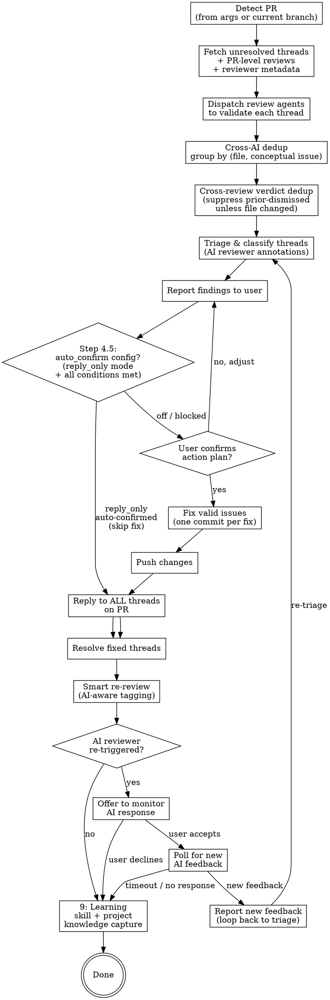

All text output follows unified language preference. See plugin CLAUDE.md for query flow.

**REQUIRED SUB-SKILL:** Use `superpowers:receiving-code-review` for evaluation mindset — verify before implementing, push back on incorrect suggestions, no performative agreement. This skill handles mechanics; that skill governs judgment.

## Configuration

This skill respects `pr_review_resolve.auto_confirm` in the adopter's workflow config (project CLAUDE.md or workflow README):

| Value | Behavior |
|-------|----------|
| `off` (default) | Always wait for user confirmation at Step 4 GATE (current behavior, no change for adopters who don't set the flag) |
| `reply_only` | Skip confirmation gate when ALL conditions hold: (a) every inline issue verdict ∈ {`False Positive`, `Pre-existing`, `Informational`}, (b) every PR-level review action is reply-only (no `Fix:`), (c) total reply count ≤ 10. See **Step 4.5: Auto-Confirm Check** for full logic. |
| `preapproved` | Skip confirmation gate only when the user explicitly directs autonomous resolution in the current request (for example, "fix all review issues" / "address every valid review comment"). Validation still runs first; invalid or risky feedback is replied to with evidence, not blindly fixed. |

Rationale: `reply_only` mode addresses the daily-pain segment "captain must confirm action plan even when all findings are nits/FP" without granting the skill authority to push controversial fixes. Any issue requiring code change still gates on captain confirmation.

Future extension (separate entity): `trivial_fix` mode for single-line typo / null-check / unused-import auto-fixes. Out of scope for this revision.

## Process Flow



## Step 1: Detect PR

If user provides a PR number or URL, use it directly. Otherwise detect from current branch. Extract `OWNER/REPO` dynamically from git remote (never hardcode).

`Read → ${CLAUDE_PLUGIN_ROOT}/reference/gh-api-patterns.md` § "PR Detection"

## Step 2: Fetch Feedback

Fetch **both** types of PR feedback in parallel:

### Inline Threads

Query the GitHub GraphQL API for unresolved review threads on the PR.

`Read → ${CLAUDE_PLUGIN_ROOT}/reference/gh-api-patterns.md` § "GraphQL Queries"

### PR-Level Reviews

Query the REST API for reviews with substantive body text. These are top-level review summaries (e.g., ducker-agent summary reviews, Copilot overview comments) that do NOT appear in `reviewThreads`.

`Read → ${CLAUDE_PLUGIN_ROOT}/reference/gh-api-patterns.md` § "PR-Level Reviews"

Filter criteria:
- **Include**: reviews with non-empty `body` (more than just whitespace)
- **Exclude**: reviews where ALL points have already been addressed in resolved inline threads (avoid double-counting)
- **Exclude**: pure approval reviews with no actionable content (e.g., body is just "LGTM")

### Stop Condition

If zero unresolved inline threads AND zero actionable PR-level reviews → report "no feedback to address" and stop. Do NOT stop on zero threads alone — PR-level reviews may contain actionable feedback.

### Reviewer Metadata (parallel)

In parallel with fetching threads and reviews, query the PR timeline to build a **reviewer map**:

`Read → ${CLAUDE_PLUGIN_ROOT}/reference/gh-api-patterns.md` § "Review Request Timeline"

For each reviewer who left unresolved threads, record:
- `reviewer`: GitHub username
- `is_ai`: boolean (Bot type, `[bot]` suffix, or known AI reviewer)
- `requested_by`: human who requested this reviewer (from timeline `actor`)

If `requested_by` is itself a bot or unknown, fall back to the PR author.

This map is used in Step 4 (annotations) and Step 7 (smart tagging).

## Step 3: Validate Threads

Read `${CLAUDE_PLUGIN_ROOT}/reference/learned-patterns.md` for accumulated cross-project patterns that help identify common false-positive feedback and validation heuristics.

Evaluate every comment on **technical merit alone** — not on who said it.

- **Do NOT guess reviewer identity or role** (co-founder, team lead, junior dev, bot). Use only the GitHub username shown in the thread.
- **Do NOT assign authority weight** based on username, org membership, or perceived seniority. A valid point from a bot deserves the same fix as one from a human; a wrong suggestion from a senior reviewer still needs pushback.
- **Validate every comment equally**: read the referenced code, check if the suggestion is technically correct for this codebase, classify it.

For threads that reference code:

- **Simple/obvious threads** (typos, clear bugs, straightforward questions): Read the code yourself and assess directly
- **Complex/ambiguous threads** (architectural suggestions, performance concerns, multi-file impacts): Dispatch `pr-review-toolkit:code-reviewer` or `feature-dev:code-reviewer` agent for independent assessment

For each thread, determine:
- **Read the code** referenced by each thread (file + line range)
- **Assess validity**: Is this a real issue? Reproducible? Correct analysis?
- **Classify**: bug, suggestion, question, false positive

Do NOT blindly trust any reviewer — automated or human. Verify first.

**Two anti-patterns to avoid:**
1. **Auto-accepting** because "a reviewer flagged it" (human or AI) — verify the suggestion is correct for this codebase first
2. **Auto-dismissing** because "it's just a bot" — evaluate the technical content, not the author identity

When a suggestion contradicts an established codebase convention, classify it as "false positive" with an explanation citing the convention. This applies equally to human and AI suggestions.

> **AI detection vs. validation**: The reviewer map from Step 2 is used ONLY for re-review routing (Step 7) — determining who to notify and how to re-trigger reviews. It does NOT affect validation here. All comments are evaluated on technical merit regardless of whether the author is human or AI.

## Step 3.5: Cross-AI Thread Dedup

When multiple AI reviewers (e.g., `copilot` + `<custom-bot>` + Sentry) review the same PR, they reliably duplicate coverage on high-signal items. Presenting each thread as its own row inflates the work estimate and invites duplicate fix commits.

**Group threads by `(file, conceptual_issue)`** — NOT by `(file, line, author)`. Two threads collapse to one issue when:

- They reference the same file with overlapping line ranges (±5 lines tolerance), AND
- Their **Step 3 validation summary** (root cause / suggested fix, not raw thread text) describes the same conceptual issue, regardless of reviewer voice

Use the Step 3 validated analysis as the `conceptual_issue` axis. Raw thread text varies by reviewer style (`copilot` writes terse English; an AI bot may write multi-paragraph rationale; Sentry posts stack trace excerpts) — those surface differences don't change whether they're the same issue.

### Issue grouping output

After dedup, produce an `Issues` array. Each entry has:

| Field | Description |
|-------|-------------|
| `issue_id` | `I1`, `I2`, ... (sequential) |
| `file` | Primary file (most-referenced when threads span multiple) |
| `line_range` | Smallest enclosing range across grouped threads |
| `conceptual_issue` | One-line description from Step 3 validation |
| `threads` | List of `thread_id` + author pairs (T1@copilot, T2@sentry-io, ...) |
| `verdict` | Group-level classification (Valid Bug / Suggestion / False Positive / Pre-existing / Informational) |
| `fix` | Single proposed action |

Groups with one thread = singleton issue (no behavioral change vs prior triage). Groups with ≥2 threads = real dedup — surface the parallel-agreement signal in the verdict (e.g., `Valid Bug (2 reviewers)`).

### When reviewers disagree

If two threads on the same `(file, line_range)` validate to **different** conceptual issues or contradicting fixes, do **NOT** group them. Present as separate rows in Step 4 and flag the contradiction in the Action column (e.g., `⚠ contradicts I1 — needs decision`). Reviewer disagreement is rare and high-signal; collapsing it loses information.

### Reply discipline (preserved)

Grouping affects the **triage report** (Step 4) and the **fix commit count** (Step 5 — one commit may close multiple grouped threads), but does **NOT** affect reply behavior. Reply to each thread **individually** in Step 6 — reviewers don't see cross-thread acknowledgment, and per-thread replies keep the action plan auditable. Step 6's "never batch replies" rule still holds.

Reference: `reference/learned-patterns.md` "Cross-AI-reviewer thread deduplication — same issue, two voices (2026-04-23)" for origin pattern and field-tested examples.

## Step 3.6: Cross-Review Verdict Persistence (suppress re-flagged dismissed findings)

Iterative review cycles (and especially daemon mode) re-surface the same Copilot / Sentry / AI-bot comments on every poll. After the user has dismissed an Issue as `wont_fix` / `false_positive` in a prior cycle, suppress it from the current triage as long as the underlying file hasn't changed.

**State file**: `~/.claude/kc-plugins-config/pr-flow/review-state/{repo-slug}-{branch}.jsonl`

`repo-slug` is `basename(git-toplevel)` lowercased; `branch` is the current branch with `/` replaced by `__`.

Each line is one verdict record (JSONL):

```json
{"ts": "2026-05-13T12:00:00Z", "commit_sha": "abc1234", "fingerprint": "<sha256>", "file": "path/to/file", "line_range": "42-47", "conceptual_issue": "stale TODO from 2024", "action": "wont_fix"}
```

`fingerprint = sha256(file + "|" + normalized_conceptual_issue)`, where `normalized_conceptual_issue` is the Step 3.5 `conceptual_issue` lowercased + whitespace-collapsed. This makes the fingerprint stable across reviewer voices (Copilot vs Sentry vs custom-bot phrasing for the same conceptual issue).

**Suppress when ALL of**:

1. Issue's `fingerprint` matches a prior record with `action: "wont_fix" | "false_positive"`
2. The Issue's `file` has NOT changed between the prior record's `commit_sha` and `HEAD`:
   ```bash
   git diff --name-only <prior_commit_sha> HEAD | grep -Fxq "<file>"   # exits 0 → file changed → DO NOT suppress
   ```
3. (Collision guard) The prior record's `conceptual_issue` matches the current one when both are normalized — protects against rare hash collisions

**Do NOT suppress** records with `action: "fixed"`. Fixes can regress and must be re-validated on each review.

**Output a one-line suppression summary** in the Step 4 report header:

> `Suppressed N issues from prior reviews (previously dismissed by user, file unchanged since <short-sha>)`

If `N == 0` or the state file does not exist, skip the summary silently.

**Persist new verdicts**: After Step 4 triage and Step 5 fix decisions, append one record per Issue to the state file with its final `action` (`fixed` / `wont_fix` / `false_positive` / `skipped`). Persistence happens in Step 9 (Learning) alongside D1/D2 capture — see Step 9 for write-time code.

**State-file lifecycle**:
- Created on first review cycle for a branch
- Appended on every cycle (one line per Issue verdict)
- Not auto-pruned; the file is bounded by `review_cycles × issues_per_cycle` so growth stays manageable. Manual cleanup is acceptable when a branch is deleted

Reference: `reference/learned-patterns.md` "Cross-review verdict persistence (2026-05-13)" for the broader D1 class. Adapted from gstack `/review` Step 5.0 (cross-review finding dedup, originally applied to self-review findings) to incoming AI-reviewer feedback in kc-pr-review-resolve.

## Step 4: Triage & Report

Present a structured report to the user:

```
## PR #377 Review Triage

### AI Reviewers
| Reviewer | Type | Requested by |
|----------|------|--------------|
| copilot  | AI   | @kentwelcome |

### Inline Issues (after Step 3.5 dedup)

| Issue | Threads | File:Line | Verdict | Action |
|-------|---------|-----------|---------|--------|
| I1 | T1@sentry-io, T2@greptile | ProCRUDList.tsx:1050 | Valid Bug (2 reviewers) | Fix: use controlledPagination.total |
| I2 | T3@copilot [AI] | pagination.ts:15 | Informational | Reply: explain design intent |
| I3 | T4@copilot [AI] | data-provider.ts:400 | Pre-existing | Reply: out of scope |

Singleton issues (one thread) display as a single `T#@author` cell. Grouped issues (≥2 threads) show all threads + reviewers; the `(N reviewers)` annotation in Verdict surfaces parallel-agreement strength.

### PR-Level Reviews
| # | Author | Review State | Category | Action |
|---|--------|-------------|----------|--------|
| 5 | ducker-agent [AI] | COMMENTED | Valid — docs gap | Fix: update CLAUDE.md |

Proposed: Fix 1 code issue (I1, closes 2 threads) + 1 docs gap (PR-level), reply to all 5 threads.
Re-review: tag @kentwelcome (requested copilot) + offer to re-trigger copilot review.
```

When AI reviewers are present, annotate the Author column with `[AI]` and add the "AI Reviewers" section showing the human-to-AI mapping. This gives the user visibility into the re-review routing before they confirm.

**GATE — Wait for user confirmation before proceeding** (unless Step 4.5 auto-confirms). User may reclassify threads or skip fixes.

## Step 4.5: Auto-Confirm Check (conditional, runs before GATE)

Read `pr_review_resolve.auto_confirm` from the adopter's workflow config (see **Configuration** section above). Resolution order: workflow README frontmatter → project CLAUDE.md `pr_review_resolve:` block → unset (treat as `off`).

### When `auto_confirm: off` (default)

Skip Step 4.5 entirely. Proceed to GATE as today. No log line.

### When `auto_confirm: reply_only`

Evaluate the three auto-confirm conditions against the triage report from Step 4:

1. **All inline issue verdicts are reply-only**: every row in the "Inline Issues" table has `Verdict ∈ {False Positive, Pre-existing, Informational}`. ANY `Valid Bug` / `Suggestion` row → fail condition 1.
2. **All PR-level reviews are reply-only**: every row in the "PR-Level Reviews" table has Action prefixed `Reply` / `Acknowledge` (no `Fix:` prefix). ANY `Fix:` action → fail condition 2.
3. **Reply count sanity cap**: total replies ≤ 10. Formula: `total = (inline review threads requiring reply) + (PR-level reviews requiring reply)`. Both surfaces count because both produce a thread reply (inline) or a PR comment (PR-level review reply) at Step 6. More than 10 → fail condition 3 (likely a noisy / wrong-batch situation worth captain eyeballing).

### When all three hold

Log a single line (visible to captain):

```
AUTO-CONFIRMED (reply_only): N replies, 0 fixes — skipping confirmation gate per pr_review_resolve.auto_confirm=reply_only
```

Skip the GATE. Skip Step 5 (no fixes to apply since all verdicts are reply-only). Proceed directly to **Step 6: Push & Reply** (Push step is a no-op when there are no fix commits — proceed to the reply phase).

### When any condition fails

Log which condition blocked + fall through to GATE as today:

```
auto-confirm blocked: <condition-1|2|3> — <one-line reason, e.g., "1 Valid Bug issue requires fix">
```

This makes it audit-clear to captain why their `reply_only` flag did not engage on this PR, so they can decide whether to override at the gate or refine the flag's coverage criteria in a future revision.

### When `auto_confirm: preapproved`

This mode activates only when the user's current message explicitly delegates the full loop, e.g. "fix all review issues", "address every valid review comment", or "resolve all reviewer feedback". Do not infer preapproval from prior habits or project ownership.

Validation is still mandatory:

1. Complete Steps 2–4 and classify every thread/review on technical merit.
2. Fix only `Valid Bug` / accepted `Suggestion` items that are low-to-medium risk and have a clear local patch.
3. For false positives, pre-existing issues, risky architectural changes, or ambiguous requests, reply with the validation evidence instead of changing code.
4. If a fix would change public API, data migration semantics, auth/security policy, or production operations, stop at the GATE and ask for explicit approval.

Log the mode before acting:

```
AUTO-CONFIRMED (preapproved): explicit user directive detected — validated issues will be fixed, risky/invalid items will receive evidence replies
```

## Step 5: Fix Valid Issues

For each confirmed or preapproved fix, group work by surface before editing:

- **Code/runtime**: product logic, API handlers, workflow scripts, generated clients
- **Tests/evals**: unit tests, fixtures, eval scenarios, CI assertions
- **Docs/runbooks/SQL examples**: markdown, operational steps, smoke-test snippets, comments

Dispatch or sequence fixes by surface group so code changes, verification changes, and documentation corrections do not blur into one patch. Keep one commit per logical fix; a grouped issue with multiple reviewer threads can share a commit when it addresses the same root cause.

1. Edit the file
2. Run quality checks (type-check / lint for the affected app)
3. Run targeted verification for the exact surface changed (related tests for code, eval/scenario check for tests, command or syntax smoke for SQL/shell snippets when available)
4. Commit with format: `fix(SC-###): address review - <description>`

## Step 6: Push & Reply

Push all commits, then reply to each item in-place — never batch replies into a single comment. The completion order is fixed:

1. Validate feedback (Steps 2–4)
2. Fix confirmed/preapproved issues (Step 5)
3. Run targeted verification for each changed surface
4. Push commits
5. Reply to every inline thread / PR-level review
6. Resolve fixed inline threads via GraphQL
7. Re-query unresolved threads and assert `unresolved=[]` for fixed/resolved items

### Inline threads
Use GraphQL thread reply mutation. Resolve threads that were fixed; leave unfixed threads unresolved with an explanation reply.

`Read → ${CLAUDE_PLUGIN_ROOT}/reference/gh-api-patterns.md` § "GraphQL Mutations"

### PR-level reviews
Reply using `gh pr comment` quoting the original review's key point. PR-level reviews cannot be "resolved" — the reply itself serves as acknowledgment.

`Read → ${CLAUDE_PLUGIN_ROOT}/reference/gh-api-patterns.md` § "GraphQL Mutations" → "Reply to a PR-level comment"

### Completion assertion

After GraphQL resolve mutations, re-query the PR's unresolved review threads. Completion requires the expected fixed threads to be absent from the unresolved set. If any fixed thread remains unresolved, retry the resolve mutation once; if it still remains, report the thread ID and do not claim completion.

## Step 7: Request Re-review

After all threads are replied to individually, request re-review with **AI-aware tagging**.

### Build the tag list

1. Collect unique reviewers from threads that required code changes or substantive responses
2. For each reviewer, check the reviewer map from Step 2:
   - **Human reviewer** → tag directly in summary comment
   - **AI reviewer** → tag the **human who requested the AI review** instead (from `requested_by`)
3. Deduplicate: if the same human appears both as a direct reviewer and as an AI requester, tag them once
4. Always append `@claude` to trigger Claude re-review via `claude-review.yaml`

### AI reviewer re-review decision

When AI reviewers were detected, present options to the user before posting:

```
AI Reviewers with addressed threads:
- copilot (requested by @kentwelcome) — 2 threads addressed

Re-review options:
1. Tag @kentwelcome only (human reviews the fixes)
2. Tag @kentwelcome + re-request copilot review
3. Skip AI re-review
```

**GATE — Wait for user's choice before posting.**

### Post summary comment

Tag only **humans** in the comment body. Use `gh pr edit` to re-request AI reviews separately.

```bash
# ✅ CORRECT — humans in comment, API for AI re-request
gh pr comment PR_NUM --body "All review feedback addressed — please see individual thread replies for details.

@kentwelcome @senior-dev @claude"

# If user chose to re-trigger AI review:
# - Collaborator bots (Claude, Coderabbit paid): gh pr edit --add-reviewer <bot>
# - Copilot: requires direct API with [bot] suffix (gh CLI silently no-ops)
gh api -X POST repos/OWNER/REPO/pulls/PR_NUM/requested_reviewers \
  -f 'reviewers[]=copilot-pull-request-reviewer[bot]'
```

### Anti-pattern: NEVER @mention AI bots in comments

Some AI bots (notably Copilot) interpret @mentions in PR comments as new action requests, producing unwanted side effects (duplicate reviews, spurious PRs).

`Read → ${CLAUDE_PLUGIN_ROOT}/reference/gh-api-patterns.md` § "Re-request AI review safely"

```bash
# ❌ WRONG — @mentioning bot triggers unwanted bot actions
gh pr comment PR_NUM --body "All feedback addressed.
@copilot-pull-request-reviewer @claude"

# ✅ CORRECT — comment tags humans only, API re-requests bot separately
gh pr comment PR_NUM --body "All feedback addressed.
@kentwelcome @claude"
# For Copilot specifically: gh pr edit --add-reviewer silently no-ops; use direct API
gh api -X POST repos/OWNER/REPO/pulls/PR_NUM/requested_reviewers \
  -f 'reviewers[]=copilot-pull-request-reviewer[bot]'
```

### Summary comment format

Keep the summary **brief** — do NOT repeat per-thread details (those are already in each thread's reply).

```bash
# ❌ Wrong — re-lists what's already in thread replies
gh pr comment PR_NUM --body "Addressed all feedback:
- Threads 1, 2: Fixed in abc1234
- Thread 3: Explained design choice
Ready for re-review."
```

## Step 8: AI Response Monitoring (conditional)

This step activates **only when AI reviewers were re-triggered** in Step 7 (user chose option 2 or equivalent).

### Offer to monitor

After posting the re-review comment and re-requesting AI review, proactively ask the user:

```
AI reviewer re-triggered (Copilot). Would you like me to monitor for their response?
- Yes — I'll poll every 30s for up to 3 minutes and report back
- No — you can check manually or re-run /kc-pr-review-resolve later
```

**GATE — Wait for user's choice.**

### Monitor implementation

If user accepts:

1. **Record baseline** — capture the current timestamp and count of existing reviews/threads from the AI reviewer
2. **Poll in background** — every 30 seconds, check for:
   - New PR-level reviews from the AI reviewer (REST: `submitted_at` after baseline)
   - New unresolved threads from the AI reviewer (GraphQL: `createdAt` after baseline)
3. **Timeout** — stop after 6 rounds (3 minutes). AI reviewers typically respond within 1-2 minutes
4. **On new feedback detected**:
   - Report to user: "Copilot posted N new comments"
   - Offer to re-run triage (loop back to Step 2 with the same PR)

```bash
# Polling pattern (background)
for i in $(seq 1 6); do
  sleep 30
  # Check new PR-level reviews
  NEW_REVIEWS=$(gh api repos/OWNER/REPO/pulls/PR_NUM/reviews \
    --jq "[.[] | select(.user.login == \"AI_BOT_LOGIN\" and .submitted_at > \"BASELINE_TS\")] | length")
  # Check new unresolved thread comments
  NEW_THREADS=$(gh api graphql -f query='...' \
    --jq "[... | select(.author.login == \"AI_BOT\" and .createdAt > \"BASELINE_TS\")] | length")
  if [[ "$NEW_REVIEWS" -gt "0" ]] || [[ "$NEW_THREADS" -gt "0" ]]; then
    echo "NEW AI RESPONSE DETECTED"
    break
  fi
done
```

### On timeout (no response)

Report cleanly: "No new response from Copilot after 3 minutes. They may respond later — re-run `/kc-pr-review-resolve` to check."

### Anti-patterns

- **Don't auto-triage** — always report new feedback to the user first, let them decide whether to re-triage
- **Don't poll indefinitely** — hard cap at 3 minutes to avoid blocking the user's session
- **Don't skip the offer** — even if it seems obvious, always ask. The user may want to context-switch to other work

## Step 9: Learning (MANDATORY — run immediately after Step 7/8)

**BLOCKING**: Do NOT respond to other user requests between Step 7/8 and Step 9. Complete learning evaluation first, then address any pending requests. Mid-flow interruptions (e.g., user asks to fix something else, switch tasks) must queue until Step 9 finishes.

After all threads are resolved and re-review is complete, evaluate what the review feedback revealed.

**Dimension 1 (skill-level)**: General patterns about review feedback structure, resolve triage heuristics, or validation anti-patterns → auto-append to `${CLAUDE_PLUGIN_ROOT}/reference/learned-patterns.md`.

**Dimension 2 (project-level)**: The reviewer's feedback reveals a project-specific pattern. Apply write threshold: "This feedback points to a recurring issue — should it become a CLAUDE.md rule to catch it earlier?"

**Skip when**: All threads were trivial (typos, style) or all patterns already documented.

**Cross-review verdict persistence (from Step 3.6)**: Append one record per Issue to `~/.claude/kc-plugins-config/pr-flow/review-state/{repo-slug}-{branch}.jsonl` with the final user-decided action. Create the directory and file on first write if they don't exist.

```bash
STATE_DIR="$HOME/.claude/kc-plugins-config/pr-flow/review-state"
mkdir -p "$STATE_DIR"
REPO_SLUG=$(basename "$(git rev-parse --show-toplevel)" | tr '[:upper:]' '[:lower:]')
BRANCH_SAFE=$(git branch --show-current | tr '/' '__')
STATE_FILE="$STATE_DIR/${REPO_SLUG}-${BRANCH_SAFE}.jsonl"
HEAD_SHA=$(git rev-parse --short=10 HEAD)
TS=$(date -u +%Y-%m-%dT%H:%M:%SZ)
# For each Issue from Step 3.5/Step 4:
#   FINGERPRINT=$(printf '%s|%s' "$FILE" "$NORMALIZED_CONCEPTUAL_ISSUE" | shasum -a 256 | cut -d' ' -f1)
#   # Persist with a proper JSON encoder — conceptual_issue may contain quotes,
#   # backslashes, or newlines that would break printf-formatted JSON. jq is
#   # preferred when available; python3 is the fallback (stock macOS and minimal
#   # Linux containers often lack jq, but ship python3).
#   if command -v jq >/dev/null 2>&1; then
#     jq -nc \
#       --arg ts "$TS" \
#       --arg commit_sha "$HEAD_SHA" \
#       --arg fingerprint "$FINGERPRINT" \
#       --arg file "$FILE" \
#       --arg line_range "$LINE_RANGE" \
#       --arg conceptual_issue "$CONCEPTUAL_ISSUE" \
#       --arg action "$ACTION" \
#       '{ts:$ts,commit_sha:$commit_sha,fingerprint:$fingerprint,file:$file,line_range:$line_range,conceptual_issue:$conceptual_issue,action:$action}' \
#       >> "$STATE_FILE"
#   elif command -v python3 >/dev/null 2>&1; then
#     python3 -c 'import json, sys
# keys = ["ts","commit_sha","fingerprint","file","line_range","conceptual_issue","action"]
# sys.stdout.write(json.dumps(dict(zip(keys, sys.argv[1:])), ensure_ascii=False) + "\n")' \
#       "$TS" "$HEAD_SHA" "$FINGERPRINT" "$FILE" "$LINE_RANGE" "$CONCEPTUAL_ISSUE" "$ACTION" \
#       >> "$STATE_FILE"
#   else
#     printf 'ERROR: neither jq nor python3 available; cannot persist verdict for %s\n' "$FILE" >&2
#     # Step 3.6 dedup degrades gracefully — missing records simply mean no
#     # suppression on the next cycle, not a hard failure.
#   fi
```

Persistence writes happen **after** the user-confirmed verdict on each Issue, regardless of whether learning capture (D1/D2) fires. Even trivial issues get verdict records — that's what powers Step 3.6's dedup on the next cycle.

Read → ${CLAUDE_PLUGIN_ROOT}/reference/knowledge-capture.md

## Rules

- **Fetch both layers** — inline threads (`reviewThreads` GraphQL) AND PR-level reviews (`pulls/reviews` REST). Threads-only misses summary reviews (e.g., ducker-agent, Claude review summaries)
- **Validate before fixing** — dispatch agents to assess, don't blindly trust automated comments
- **Report before acting** — always show triage to user and wait for confirmation
- **Reply to ALL threads** — not just the ones you fix; unexplained threads frustrate reviewers
- **Reply in-place** — inline threads get thread replies, PR comments get quoted replies. Never dump all responses into one summary comment
- **Summary is brief** — final re-review comment just says "addressed, see thread replies". Don't repeat details already in each thread
- **One commit per logical fix** — keep changes atomic and traceable
- **Escape GraphQL strings** — avoid single quotes and backticks in mutation body
- **Dynamic repo detection** — use `gh repo view`, never hardcode owner/repo
- **Conventional commits** — `fix(SC-###): address review - <description>`
- **AI reviewer detection** — identify bot reviewers via timeline API, trace back to the human who requested them
- **Never @mention AI bots in comments** — re-request AI review via the API instead (collaborator bots: `gh pr edit --add-reviewer <bot>`; Copilot: direct API with `[bot]` suffix). @mentions trigger unwanted bot actions (duplicate reviews, spurious PRs)
- **Human accountability** — when an AI reviewer's feedback is addressed, notify the human who requested the AI review, not the bot
- **AI detection does not affect validation** — Step 3 evaluates all comments on technical merit regardless of author identity; AI detection only affects Step 7 notification routing
- **Offer AI monitoring after re-trigger** — when AI reviewers are re-requested in Step 7, always offer to monitor for their response. Don't assume the user wants it or doesn't — ask every time
- **D1 auto-append** — skill-level patterns are appended to learned-patterns.md without gate; briefly notify user
- **D2 gated write** — project-level patterns require write threshold (severity gate + three-question test) + user confirmation
- **Reviewer feedback is D2 input** — when a reviewer catches something the author should have known, that's a D2 candidate: "Should this be in CLAUDE.md so it's caught during development?"
- **Separate knowledge commit** — D2 writes get their own commit, never bundled with fix commits
- **Step 9 is not deferrable** — "user asked something else" is NOT a reason to skip Learning. Queue the user's request, complete Step 9 (typically <30s), then address it. The rationalization "I'll come back to it" never materializes after context switch
