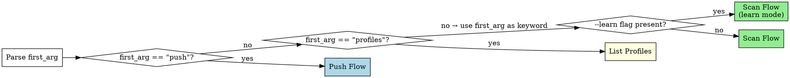

# kc-sentry-insight — Sentry Error Insight

Scan Sentry for production errors using per-project profiles, track issue diffs across runs, and optionally push findings to Linear.

**Core principle:** Profiles encode domain knowledge (what matters, what's noise) so scans improve over time. Every run refines the profile.

## Command Routing

Parse arguments from the invocation `/kc-sentry-insight [args]`:

| Pattern | Route |
|---------|-------|
| `<keyword>` | Scan Flow |
| `<keyword> --learn` | Scan Flow (learn mode) |
| `push <keyword> --issues N,N,N [--report YYYY-MM-DD]` | Push Flow |
| `profiles` | List Profiles |

Extract:
- `first_arg` — the first positional argument (or empty string if none)
- `keyword` — the domain keyword identifying the profile (e.g., `mcp`, `checkout`, `api`)
- `learn_mode` — `true` if `--learn` flag is present, otherwise `false`
- `push_issue_ids` — comma-separated issue numbers after `--issues` (Push Flow only)
- `report_date` — date string after `--report` (Push Flow only, optional)

Route based on `first_arg`:



**Routing rules:**
- `first_arg == "push"` → extract `keyword` from second positional arg, `push_issue_ids` from `--issues`, `report_date` from `--report` → Push Flow
- `first_arg == "profiles"` → List Profiles
- Otherwise → treat `first_arg` as `keyword` → check for `--learn` → Scan Flow

**Missing keyword:** If `first_arg` is empty (no arguments), print usage and stop:

```
Usage: /kc-sentry-insight <keyword>              — scan for errors
       /kc-sentry-insight <keyword> --learn      — scan + update profile knowledge
       /kc-sentry-insight push <keyword> --issues N,N,N [--report YYYY-MM-DD]
       /kc-sentry-insight profiles               — list all profiles
```

---

## Profile Resolution

Resolve the project root by using the current working directory (`$PWD`) as `${project}`.

Profile path: `${project}/.claude/insight/sentry/profiles/<keyword>.yaml`

### Step 1: Ensure Directories

Run Bash to create the required directories:

```bash
mkdir -p ${project}/.claude/insight/sentry/profiles
mkdir -p ${project}/.claude/insight/sentry/reports
```

### Step 2: Read Profile

Attempt to Read the profile file at `${project}/.claude/insight/sentry/profiles/<keyword>.yaml`.

### Step 3: Route on Profile Existence

**If the file exists:**
- Parse the YAML content into `profile` object
- Extract fields: `sentry_org`, `projects`, `strategy`, `structured_config`, `keywords`, `noise_patterns`, `known_issue_ids`, `linear_config`
- Proceed to Scan Flow (or Push Flow, depending on routing from Command Routing section above)

**If the file does not exist:**
- Enter Bootstrap Flow (see Bootstrap Flow section below)

---

## Bootstrap Flow

Triggered when no profile exists for the given `keyword`. Goal: auto-detect Sentry configuration from the repo, confirm with the user, and write a profile YAML.

### Step B1 — Scan repo for Sentry config

Use the following tools to discover Sentry configuration in the codebase:

1. **Find DSN** — Grep for the DSN URL pattern:
   - Pattern: `https://.*@o\d+\.ingest\.sentry\.io/`
2. **Find SDK init calls** — Grep for:
   - `sentry_sdk.init(`
   - `Sentry.init(`
3. **Find nightwatch config** — Glob for:
   - `**/nightwatch-targets.yaml`

**Org slug resolution (IMPORTANT):** The DSN URL contains only a numeric org ID (e.g., `o1081482`), NOT the human-readable org slug (e.g., `datarecce`). Resolve the org slug using this priority order:

1. **First try**: Extract from nightwatch config if present — look for the `sentry_org` field
2. **Fallback**: Use the `find_projects` Sentry MCP tool — call it and look at the organization info returned
3. **Last resort**: Ask the user

Do NOT attempt to parse the org slug from the DSN URL directly — it only contains a numeric ID.

Aggregate all findings into a candidate list of Sentry configurations (project slug, DSN source file, org slug).

### Step B2 — Handle multiple projects (monorepo)

If more than 1 DSN or project is detected:

- Present a numbered list to the user
- User can multi-select (each selected project becomes a sub-entry in `sentry.projects`)

Example display:

```
Detected 2 Sentry configurations:
1. recce-python (from recce/event/SENTRY_DNS) — backend
2. recce-frontend (from js/sentry.config.ts) — frontend
Which to include? (comma-separated numbers, e.g., 1,2)
```

Wait for user response before proceeding.

### Step B3 — Infer strategy

Determine the analysis strategy based on the codebase:

- If `keyword` matches a known native integration (e.g., `keyword == "mcp"`) AND the project has MCP SDK dependency → propose `structured`
  - Check for `MCPIntegration` or `wrapMcpServerWithSentry` imports in the codebase using Grep
- Otherwise → default to `keyword`

### Step B4 — Present inferences and confirm

Show all detected values to the user for confirmation before writing the profile:

```
Detected:
- Sentry org: datarecce (from nightwatch config)
- Projects: recce-python (backend)
- Strategy: structured (MCP SDK detected)

Confirm? Anything to adjust?
```

If inference is incomplete (any field is unknown), ask for missing fields one at a time — not all at once. Wait for user confirmation before proceeding to Step B5.

### Step B5 — Write profile YAML

Use the Write tool to create the profile at:

```
${project}/.claude/insight/sentry/profiles/<keyword>.yaml
```

Write the full profile schema:

```yaml
name: <keyword>
strategy: <inferred strategy>
created_at: <today YYYY-MM-DD>

sentry:
  org: <detected org>
  projects:
    - slug: <project slug>
      label: <label>
      dsn_source: <file where DSN was found>

  structured:           # only if strategy == structured
    span_op: "mcp.server"
    focus:
      - most_failing_tools
      - slowest_tools
      - silent_jsonrpc_errors
      - session_error_patterns

  # keywords:           # only if strategy == keyword
  #   primary: [<keyword terms>]
  #   secondary: [<related terms>]

linear:
  team_id: null
  default_labels: []

noise_patterns: []
severity_overrides: []

last_scan:
  timestamp: null
  known_issue_ids: []
  report_path: null

issue_history: []
```

After writing, confirm to the user:

```
Profile created at `<path>`. Proceeding to scan...
```

Then transition: return to the Scan Flow section — the profile now exists and the scan can proceed normally.

---

## Scan Flow

### Agent Dispatch

After profile is loaded, dispatch the `sentry-analyzer` agent:

1. Build prompt from profile fields:
   - `strategy` (from profile)
   - `sentry_org` (from `profile.sentry.org`)
   - `projects` (from `profile.sentry.projects` — list of `{slug, label}`)
   - If `strategy == structured`: include structured config (`span_op`, `focus`)
   - If `strategy == keyword`: include keywords config (`primary`, `secondary`)
   - `noise_patterns` (from profile)
   - `known_issue_ids` (from `profile.last_scan.known_issue_ids`)
   - If `learn_mode == true`: add `learn_mode: true`

2. Use Agent tool with `subagent_type: "kc-sentry-insight:sentry-analyzer"` and `model: sonnet`

3. Agent returns YAML string. Parse the result to extract:
   - `issues` list
   - `noise_filtered_ids` list
   - `projects_scanned` list

4. If agent returns a `warning` field → display warning to user, skip to state update (no report).

---

### Diff & Classify

For each issue in the agent's `issues` list, assign a delta label by comparing against `profile.last_scan.known_issue_ids`:

| Label | Condition |
|-------|-----------|
| `NEW` | sentry_id NOT in known_issue_ids |
| `WORSENED` | in known_issue_ids AND events_trend > +50% |
| `RECURRING` | in known_issue_ids AND (events_trend <= +50% OR events_trend is null) |
| `RESOLVED` | in known_issue_ids AND NOT in agent issues AND NOT in noise_filtered_ids |

**Important rules:**
- If sentry_id is in `noise_filtered_ids` → skip entirely (don't label as RESOLVED)
- If `events_trend` is null → default to RECURRING, not WORSENED
- Sort: NEW + WORSENED first, then RECURRING, then RESOLVED

---

### Report Generation

Generate a markdown report. Write to: `${project}/.claude/insight/sentry/reports/<keyword>/YYYY-MM-DD.md`

Create the reports subdirectory first:

```bash
mkdir -p ${project}/.claude/insight/sentry/reports/<keyword>
```

Report format:

```markdown
# Sentry Insight: <keyword> — YYYY-MM-DD

**Strategy:** structured (span.op: mcp.server) | keyword
**Projects:** <project slugs with labels> | **Org:** <org>
**Scan period:** <7d window> → <today> (vs last scan: <last_scan.timestamp or "first scan">)

## Summary
- N new issues
- N worsened
- N recurring (stable)
- N resolved since last scan

## Issues

### #1 [NEW] `<title>`
- **Sentry ID:** <sentry_id>
- **Project:** <project> [<label>]
- **First seen:** <first_seen>
- **Events (7d):** <events_7d>
- **Events trend:** <events_trend> vs prior 7d
- **Tool:** <tool> ← ONLY for structured strategy, omit for keyword
- **Impact:** <impact_hint>
- **Stack:** <stack_summary>

(... more issues ...)

---
**Pushed to Linear:** (none yet)
```

After writing the report, display a summary to the user in the conversation:
- Total issues found
- Count by delta label (new, worsened, recurring, resolved)
- Report path
- Brief list of top issues (just titles with delta labels)

---

### Profile Iteration Proposals

After report generation, check for iteration opportunities:

1. **Noise proposal:** `issue_history` entries with `seen_count >= 2` and `last_pushed: null` → propose adding to `noise_patterns`
2. **Focus proposal (structured only):** New tool names appearing in issues that aren't in `structured.focus` → propose adding
3. **Cleanup proposal:** Known issues resolved for 3+ consecutive scans → propose removal from `known_issue_ids`
4. **Learn mode enhancements:** If `learn_mode == true`:
   - Lower noise threshold to `seen_count >= 1`
   - Use the agent's `error_distribution` data (if present) to suggest keyword/focus adjustments
   - Be more proactive with proposals

Present each proposal individually to the user (not all at once). User confirms yes/no. Apply confirmed changes to the profile object (in memory — the file write happens in state update).

---

### Scan State Update

After proposals are handled, update the profile:

1. `last_scan.timestamp` = current ISO 8601 datetime
2. `last_scan.known_issue_ids` = list of all sentry_ids from current agent output (`issues` list only — NOT `noise_filtered`)
3. `last_scan.report_path` = path to the report just written

4. Update `issue_history`:
   - For each issue in agent's `issues` list:
     - If sentry_id exists in `issue_history` → increment `seen_count`
     - If sentry_id NOT in `issue_history` → append new entry: `{sentry_id, seen_count: 1, first_scan: today, last_pushed: null}`
   - Issues in `noise_filtered_ids` → do NOT increment `seen_count`, do NOT create new entries
   - Entries not in agent output AND not in `noise_filtered_ids` → leave as-is (resolved issues keep history)

5. Write updated profile YAML back to disk using Write tool

Display: "Profile updated. Next scan will track N known issues."

---

## Push Flow

Handles `/kc-sentry-insight push <keyword> --issues 1,3,5 [--report YYYY-MM-DD]`.

### Step P1: Load Profile

Resolve profile path: `${project}/.claude/insight/sentry/profiles/<keyword>.yaml`

Read the profile using the Read tool. If the file does not exist, stop with:

```
Error: No profile for keyword '<keyword>'. Run `/kc-sentry-insight <keyword>` first.
```

### Step P2: Discover Linear MCP Tool Prefix

**Do NOT hardcode Linear MCP tool names.** Tool name prefixes vary by installation. Always discover dynamically:

1. Use `ToolSearch` with query `"+linear save"` (max_results: 3)
2. Extract the prefix from the returned tool name (e.g., `mcp__claude_ai_Linear__` from `mcp__claude_ai_Linear__save_issue`, or `mcp__plugin_linear_linear__` from `mcp__plugin_linear_linear__save_issue`)
3. Cache the prefix for this session as `linear_prefix`
4. If no Linear tools found → display warning and stop:

```
Warning: Linear MCP not connected. Cannot push issues.
Connect the Linear MCP server and retry.
```

### Step P3: Resolve Report

Determine which report to load:

- If `--report YYYY-MM-DD` flag is present → load `${project}/.claude/insight/sentry/reports/<keyword>/YYYY-MM-DD.md`
- If no flag → load from `profile.last_scan.report_path` (the latest report path stored in the profile)
- If the resolved path does not exist or `report_path` is empty → stop with:

```
Error: No report found. Run `/kc-sentry-insight <keyword>` first.
```

### Step P4: Parse Report

Parse the loaded markdown report to extract issue data for the selected `#N` numbers (from `push_issue_ids`).

Each issue in the report follows the heading format:

```
### #N [DELTA] `<title>`
- **Sentry ID:** <sentry_id>
- **Project:** <project> [<label>]
- **First seen:** <first_seen>
- **Events (7d):** <events_7d>
- **Events trend:** <events_trend> vs prior 7d
- **Tool:** <tool>        ← only present for structured strategy
- **Impact:** <impact_hint>
- **Stack:** <stack_summary>
```

For each requested issue number N:
- Extract all fields from the `### #N` section
- If an issue number is not found in the report → stop with:

```
Error: Issue #N not found in report. Available issues: 1, 2, 3, ...
```

Validate all requested issue numbers exist before proceeding.

### Step P5: Resolve Linear Target

Determine the Linear team and labels:

1. **Team ID:**
   - If `profile.linear.team_id` is set → use it
   - If not set → ask: "Which Linear team ID should issues be created in?" → save the answer to `profile.linear.team_id`

2. **Labels:**
   - If `profile.linear.default_labels` is non-empty → use the list as-is
   - If empty → ask: "Which labels should be applied? (e.g., Bug, Sentry)" → parse the answer into a list → save to `profile.linear.default_labels`

Save any updates to the profile YAML using the Write tool before proceeding.

### Step P6: Create Linear Issues

For each selected issue number, in order:

**1. Build title:**
- structured strategy: `[Sentry] <tool_name> — <error summary from title>`
- keyword strategy: `[Sentry] <error summary from title>`

**2. Build description** using this template:

```markdown
## Source
- Sentry Issue: <sentry_id>
- First seen: <first_seen>
- Events (7d): <events_7d>
- Delta: <delta label>

## Impact
<impact_hint>

## Stack Trace
<stack_summary>

## Context
Detected by `/kc-sentry-insight <keyword>` scan on <scan date from report filename or last_scan.timestamp>.
Tool: <tool> | Strategy: <strategy>

## Suggested Action
<initial suggestion based on error type — e.g., "Investigate why <tool> returns <error>", "Add error handling for <condition>", etc.>
```

Notes:
- Omit the `Tool:` line entirely for keyword strategy (it is not present in those issues)
- `<scan date>` = date portion of the report filename (YYYY-MM-DD) or `profile.last_scan.timestamp`

**3. Confirm with user:**

Show the title and description for EACH issue and ask for confirmation BEFORE creating:

```
Issue #N ready to push:
Title: [Sentry] <title>
---
<description>
---
Create this Linear issue? (yes/no/skip)
```

Wait for user response before proceeding to the next issue. "skip" skips this issue, "no" aborts the entire push.

**4. Create the issue:**

Use `{linear_prefix}save_issue` with:
- `title`: the built title
- `description`: the built description (markdown)
- `teamId`: `profile.linear.team_id`
- `labelIds` (if labels are set): resolve label names to IDs using `{linear_prefix}list_issue_labels`, then pass the matching IDs

**5. Record the result:**

After successful creation, capture the returned Linear issue identifier (e.g., `LIN-123`) for use in Step P7.

### Step P7: Update Artifacts

After all issues are processed:

**1. Update the report file:**

Find the footer line in the report:
```
**Pushed to Linear:** (none yet)
```

Replace it with the actual push results:
```
**Pushed to Linear:** #1 → LIN-123, #3 → LIN-456
```

If issues were previously pushed (the line already contains entries), append the new entries rather than overwriting.

Use the Edit tool to update the report file in-place.

**2. Update the profile:**

For each successfully pushed issue, set:
```yaml
issue_history:
  <sentry_id>:
    last_pushed: <today YYYY-MM-DD>
```

Write the updated profile YAML back to disk using the Write tool.

**3. Display summary:**

```
Pushed N issues to Linear:
  #1 → LIN-123 — [Sentry] <title>
  #3 → LIN-456 — [Sentry] <title>

Report updated: <report_path>
Profile updated: <profile_path>
```

---

## Profiles List

Handles `/kc-sentry-insight profiles`.

**1. Discover profile files:**

Use Glob to find all profile YAML files:
```
${project}/.claude/insight/sentry/profiles/*.yaml
```

**2. If no files found**, display:

```
No profiles found for this project. Run `/kc-sentry-insight <keyword>` to create one.
```

Stop here.

**3. For each profile file found**, use the Read tool to load it and extract:
- `name` — the filename stem (e.g., `mcp` from `mcp.yaml`)
- `strategy` — value of `strategy` field (`structured` or `keyword`)
- `projects` — list of project slugs from `sentry.projects[]` (join with `, `)
- `last_scan` — date portion of `last_scan.timestamp` (YYYY-MM-DD), or `(never)` if null/empty
- `known_issues` — count of entries in `issue_history` (number of tracked sentry IDs)

**4. Display as a table:**

```
| Profile | Strategy | Projects | Last Scan | Known Issues |
|---------|----------|----------|-----------|--------------|
| mcp | structured | recce-python | 2026-03-19 | 5 |
| checkout | keyword | my-app-web | 2026-03-18 | 3 |
```

Sort rows by `last_scan` descending (most recently scanned first). Profiles that have never been scanned appear last.
