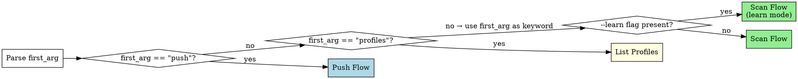

# kc-sentry-insight — Sentry Error Insight

Scan Sentry for production errors using per-project profiles, track issue diffs across runs, and optionally push findings to Linear.

**Core principle:** Profiles encode domain knowledge (what matters, what's noise) so scans improve over time. Every run refines the profile.

## Command Routing

Parse arguments from the invocation `/kc-sentry-insight [args]`:

| Pattern | Route |
|---------|-------|
| `<keyword>` | Scan Flow |
| `<keyword> --learn` | Scan Flow (learn mode) |
| `push <keyword> --issues N,N,N [--report YYYY-MM-DD]` | Push Flow |
| `profiles` | List Profiles |

Extract:
- `first_arg` — the first positional argument (or empty string if none)
- `keyword` — the domain keyword identifying the profile (e.g., `mcp`, `checkout`, `api`)
- `learn_mode` — `true` if `--learn` flag is present, otherwise `false`
- `push_issue_ids` — comma-separated issue numbers after `--issues` (Push Flow only)
- `report_date` — date string after `--report` (Push Flow only, optional)

Route based on `first_arg`:



**Routing rules:**
- `first_arg == "push"` → extract `keyword` from second positional arg, `push_issue_ids` from `--issues`, `report_date` from `--report` → Push Flow
- `first_arg == "profiles"` → List Profiles
- Otherwise → treat `first_arg` as `keyword` → check for `--learn` → Scan Flow

**Missing keyword:** If `first_arg` is empty (no arguments), print usage and stop:

```
Usage: /kc-sentry-insight <keyword>              — scan for errors
       /kc-sentry-insight <keyword> --learn      — scan + update profile knowledge
       /kc-sentry-insight push <keyword> --issues N,N,N [--report YYYY-MM-DD]
       /kc-sentry-insight profiles               — list all profiles
```

---

## Profile Resolution

Resolve the project root by using the current working directory (`$PWD`) as `${project}`.

Profile path: `${project}/.claude/insight/sentry/profiles/<keyword>.yaml`

### Step 1: Ensure Directories

Run Bash to create the required directories:

```bash
mkdir -p ${project}/.claude/insight/sentry/profiles
mkdir -p ${project}/.claude/insight/sentry/reports
```

### Step 2: Read Profile

Attempt to Read the profile file at `${project}/.claude/insight/sentry/profiles/<keyword>.yaml`.

### Step 3: Route on Profile Existence

**If the file exists:**
- Parse the YAML content into `profile` object
- Extract fields: `sentry_org`, `projects`, `strategy`, `structured_config`, `keywords`, `noise_patterns`, `known_issue_ids`, `linear_config`
- Proceed to Scan Flow (or Push Flow, depending on routing from Command Routing section above)

**If the file does not exist:**
- Enter Bootstrap Flow (see Bootstrap Flow section below)

---

## Bootstrap Flow

<!-- Task 5 will add bootstrap flow here -->

---

## Scan Flow

<!-- Task 6 will add scan flow here -->

---

## Push Flow

<!-- Task 7 will add push flow here -->

---

## Profiles List

<!-- Task 7 will add profiles list here -->
