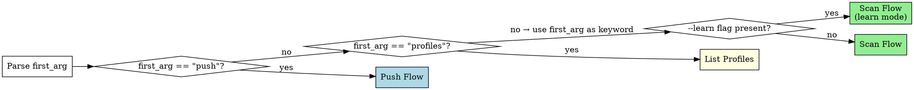

# kc-sentry-insight — Sentry Error Insight

Scan Sentry for production errors using per-project profiles, track issue diffs across runs, and optionally push findings to Linear.

**Core principle:** Profiles encode domain knowledge (what matters, what's noise) so scans improve over time. Every run refines the profile.

## Command Routing

Parse arguments from the invocation `/kc-sentry-insight [args]`:

| Pattern | Route |
|---------|-------|
| `<keyword>` | Scan Flow |
| `<keyword> --learn` | Scan Flow (learn mode) |
| `push <keyword> --issues N,N,N [--report YYYY-MM-DD]` | Push Flow |
| `profiles` | List Profiles |

Extract:
- `first_arg` — the first positional argument (or empty string if none)
- `keyword` — the domain keyword identifying the profile (e.g., `mcp`, `checkout`, `api`)
- `learn_mode` — `true` if `--learn` flag is present, otherwise `false`
- `push_issue_ids` — comma-separated issue numbers after `--issues` (Push Flow only)
- `report_date` — date string after `--report` (Push Flow only, optional)

Route based on `first_arg`:



**Routing rules:**
- `first_arg == "push"` → extract `keyword` from second positional arg, `push_issue_ids` from `--issues`, `report_date` from `--report` → Push Flow
- `first_arg == "profiles"` → List Profiles
- Otherwise → treat `first_arg` as `keyword` → check for `--learn` → Scan Flow

**Missing keyword:** If `first_arg` is empty (no arguments), print usage and stop:

```
Usage: /kc-sentry-insight <keyword>              — scan for errors
       /kc-sentry-insight <keyword> --learn      — scan + update profile knowledge
       /kc-sentry-insight push <keyword> --issues N,N,N [--report YYYY-MM-DD]
       /kc-sentry-insight profiles               — list all profiles
```

---

## Profile Resolution

Resolve the project root by using the current working directory (`$PWD`) as `${project}`.

Profile path: `${project}/.claude/insight/sentry/profiles/<keyword>.yaml`

### Step 1: Ensure Directories

Run Bash to create the required directories:

```bash
mkdir -p ${project}/.claude/insight/sentry/profiles
mkdir -p ${project}/.claude/insight/sentry/reports
```

### Step 2: Read Profile

Attempt to Read the profile file at `${project}/.claude/insight/sentry/profiles/<keyword>.yaml`.

### Step 3: Route on Profile Existence

**If the file exists:**
- Parse the YAML content into `profile` object
- Extract fields: `sentry_org`, `projects`, `strategy`, `structured_config`, `keywords`, `noise_patterns`, `known_issue_ids`, `linear_config`
- Proceed to Scan Flow (or Push Flow, depending on routing from Command Routing section above)

**If the file does not exist:**
- Enter Bootstrap Flow (see Bootstrap Flow section below)

---

## Bootstrap Flow

Triggered when no profile exists for the given `keyword`. Goal: auto-detect Sentry configuration from the repo, confirm with the user, and write a profile YAML.

### Step B1 — Scan repo for Sentry config

Use the following tools to discover Sentry configuration in the codebase:

1. **Find DSN** — Grep for the DSN URL pattern:
   - Pattern: `https://.*@o\d+\.ingest\.sentry\.io/`
2. **Find SDK init calls** — Grep for:
   - `sentry_sdk.init(`
   - `Sentry.init(`
3. **Find nightwatch config** — Glob for:
   - `**/nightwatch-targets.yaml`

**Org slug resolution (IMPORTANT):** The DSN URL contains only a numeric org ID (e.g., `o1081482`), NOT the human-readable org slug (e.g., `datarecce`). Resolve the org slug using this priority order:

1. **First try**: Extract from nightwatch config if present — look for the `sentry_org` field
2. **Fallback**: Use the `find_projects` Sentry MCP tool — call it and look at the organization info returned
3. **Last resort**: Ask the user

Do NOT attempt to parse the org slug from the DSN URL directly — it only contains a numeric ID.

Aggregate all findings into a candidate list of Sentry configurations (project slug, DSN source file, org slug).

### Step B2 — Handle multiple projects (monorepo)

If more than 1 DSN or project is detected:

- Present a numbered list to the user
- User can multi-select (each selected project becomes a sub-entry in `sentry.projects`)

Example display:

```
Detected 2 Sentry configurations:
1. recce-python (from recce/event/SENTRY_DNS) — backend
2. recce-frontend (from js/sentry.config.ts) — frontend
Which to include? (comma-separated numbers, e.g., 1,2)
```

Wait for user response before proceeding.

### Step B3 — Infer strategy

Determine the analysis strategy based on the codebase:

- If `keyword` matches a known native integration (e.g., `keyword == "mcp"`) AND the project has MCP SDK dependency → propose `structured`
  - Check for `MCPIntegration` or `wrapMcpServerWithSentry` imports in the codebase using Grep
- Otherwise → default to `keyword`

### Step B4 — Present inferences and confirm

Show all detected values to the user for confirmation before writing the profile:

```
Detected:
- Sentry org: datarecce (from nightwatch config)
- Projects: recce-python (backend)
- Strategy: structured (MCP SDK detected)

Confirm? Anything to adjust?
```

If inference is incomplete (any field is unknown), ask for missing fields one at a time — not all at once. Wait for user confirmation before proceeding to Step B5.

### Step B5 — Write profile YAML

Use the Write tool to create the profile at:

```
${project}/.claude/insight/sentry/profiles/<keyword>.yaml
```

Write the full profile schema:

```yaml
name: <keyword>
strategy: <inferred strategy>
created_at: <today YYYY-MM-DD>

sentry:
  org: <detected org>
  projects:
    - slug: <project slug>
      label: <label>
      dsn_source: <file where DSN was found>

  structured:           # only if strategy == structured
    span_op: "mcp.server"
    focus:
      - most_failing_tools
      - slowest_tools
      - silent_jsonrpc_errors
      - session_error_patterns

  # keywords:           # only if strategy == keyword
  #   primary: [<keyword terms>]
  #   secondary: [<related terms>]

linear:
  team_id: null
  default_labels: []

noise_patterns: []
severity_overrides: []

last_scan:
  timestamp: null
  known_issue_ids: []
  report_path: null

issue_history: []
```

After writing, confirm to the user:

```
Profile created at `<path>`. Proceeding to scan...
```

Then transition: return to the Scan Flow section — the profile now exists and the scan can proceed normally.

---

## Scan Flow

<!-- Task 6 will add scan flow here -->

---

## Push Flow

<!-- Task 7 will add push flow here -->

---

## Profiles List

<!-- Task 7 will add profiles list here -->
