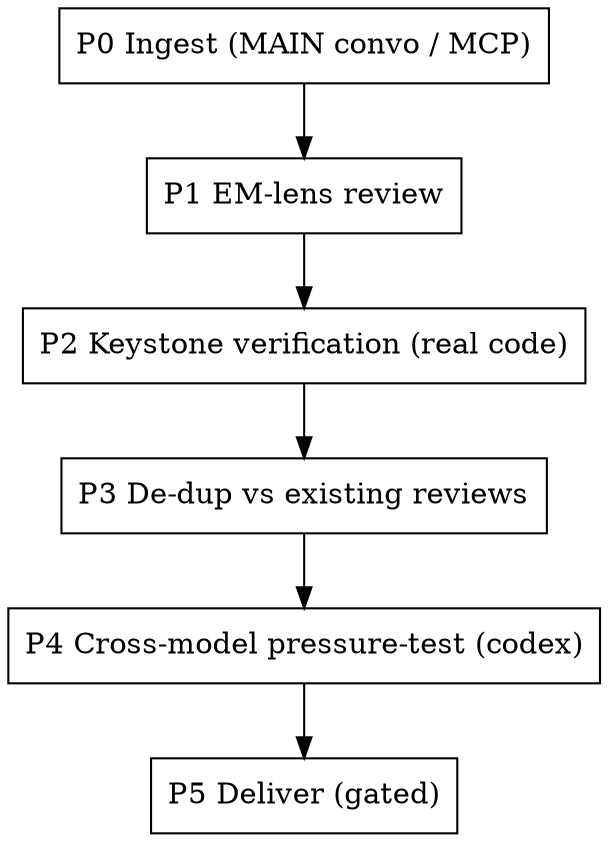

# EM Plan Review

Review a teammate's plan BEFORE build starts, as the EM. The goal is not to list correct-sounding risks — it is to **change the outcome**: convert the load-bearing assumption from inherited to verified, find the blocker that would silently fail, and hand back a calibrated, actionable message.

**Source of truth for the lenses = the user's current `~/.claude/CLAUDE.md`** (Conviction Calibration, Escalation Mantra, E2E-First Acceptance). This skill embeds a compact checklist; read `${CLAUDE_PLUGIN_ROOT}/reference/em-plan-review-lens.md` for the full rubric and `${CLAUDE_PLUGIN_ROOT}/reference/venue-format-rules.md` for delivery.

## Pipeline (run in order)



### P0 — Ingest & context  (MAIN CONVERSATION ONLY)
MCP tools cannot run inside a subagent — do P0 in the main conversation.
- Pull the plan source **in full**:
  - Linear project → `get_project` (+ milestones, members) + `list_issues` + `list_milestones` + `get_issue(includeRelations)` on key issues to capture the **dependency graph**.
  - Also handle: a single Linear issue, a Slack thread, a design doc, a PR.
- **Also pull the originating discussion + any existing reviews/comments** (e.g. the Slack thread that spawned the project, prior Linear comments). This input is what makes P3 possible — skip it and you will duplicate a teammate.
- **If you cannot retrieve the actual plan source** (wrong Linear workspace, missing access, dead link, MCP pointed elsewhere), **STOP and report it** — never review an imagined plan reconstructed from the request summary. A review anchored to assumptions instead of the real artifact is theater, and it manufactures false confidence at exactly the wrong moment.

### P1 — EM-lens review
Apply the lenses (full rubric + probes in `em-plan-review-lens.md`):
- **Idiot Index / Loss Function** — ceremony vs user-visible progress. Is the invisible plumbing Urgent while the visible payload is "nice-to-have"? Sequence by what's on stage.
- **Bad-news-early** — is the riskiest, least-controlled thing validated LAST? Buffer? Bus-factor = 1? Go/no-go checkpoint?
- **E2E-first acceptance** — is "done" a human end-to-end loop, or just unit ACs?
- **break-point-probe** — unit-green ≠ runtime-verified.
- **Conviction-calibration** — named "MVP/spike" but quietly building a platform?

Output three sections: **Successful designs** / **Likely failure points** (rank 🔴🟠🟡) / **Concrete actionable recommendations**.

### P2 — Keystone verification  ⭐ (MANDATORY when a codebase is reachable)
Identify the **single load-bearing assumption** the whole plan hinges on (the one that, if wrong, kills it).
- Trace it **end-to-end through real code** (Read/Grep/Bash) on the **failure path**, not the happy path.
- Convert "inherited from the plan author" → "verified fact with `file:line`".
- Emit an **honesty ledger**: verified-fact / inherited-assumption / heuristic, kept separate. Correct any misconception you find.
- If verification changes the picture, **recalibrate the P1 severity**.
- If you genuinely cannot reach the codebase, **say so explicitly** — never present an inherited assumption as verified. Silently skipping P2 is a failure of this skill.

### P3 — De-dup & complement  (only if P0 found existing reviews)
- List what teammates already covered.
- Route YOUR findings to the **complementary altitude** — do not repeat theirs.
- +1 or elevate their parked / "flexible" items where the evidence warrants.
- Credit teammates by name.

### P4 — Cross-model pressure-test  (MANDATORY)
Always get an independent read before delivering. Build a self-contained challenge prompt from the plan + your P1–P3 findings + the keystone verdict, then:
```bash
# write the prompt to a tempfile first (avoids shell-escaping)
cd /tmp && timeout 480 codex exec --skip-git-repo-check "$(cat /tmp/empr-challenge.txt)" \
  -s read-only -c 'model_reasoning_effort="high"' < /dev/null
```
- Present codex output **verbatim**.
- Note convergence / divergence, then **always** add: *"two LLMs agreeing is itself a mild homogenized-lens risk — the human with domain context is the decider."*
- If codex is unavailable (not installed / no auth), **report that**; do not silently skip.

### P5 — Deliver  (venue-adaptive)
Detect venue from the source and format accordingly (rules in `venue-format-rules.md`):
- **Slack thread** → Slack reply; convert `@name` → real `<@USERID>` mentions.
- **Linear** → comment under the WAF-safe rules (prose-ify `file:line`, no `$VAR`/`${VAR}`, ~3KB cap).
- **else** → inline to the user.

Review language: **English** (matches the PR-review convention). Use severity dots. Calibrate severity honestly (don't cry wolf). Frame contestable claims as **experiments**, not declarations. Apply message-design judgment (separate follow-up vs append).

<HARD-GATE>
Never post to Slack / Linear / any external venue without the user's explicit go for THIS message. Produce a paste-ready draft, show it, ask, and post only on approval. One approval does not carry to a different message or venue.
</HARD-GATE>

## Learning (D1 + D2)
After a review, if a reusable review pattern emerged:
- **D1 (general):** append to LOCAL `~/.claude/kc-plugins-config/learned-patterns-local/kc-team-ops.md` under a "Plan Review Patterns" heading (create from the public template if absent). Notify the user; promote to public via `/kc-plugin-forge dreaming kc-team-ops` when generalizable.
- **D2 (project-specific):** gated write to the project's `CLAUDE.md`.

"Nothing novel" is a valid outcome — never write filler.
