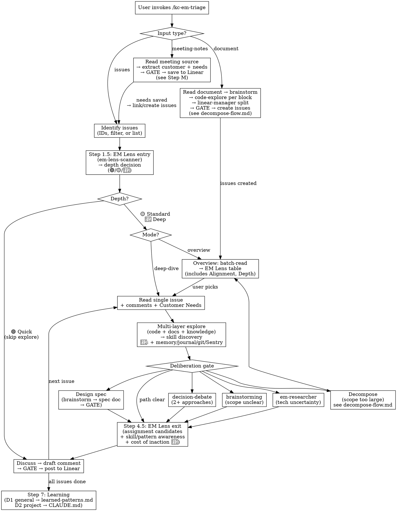

# EM Triage

Read Linear issues, explore the codebase, discuss with user, then post structured implementation guidance as Linear comments for human colleagues to execute.

**REQUIRED:** Use `linear-expert` skill for Linear operations (loaded by `linear-manager` agent).

## Linear Customer Requests

Customer Need tracking in Linear — MCP tools (`list_customers`, `save_customer`, `save_customer_need`) and usage in triage/overview.
See `${CLAUDE_PLUGIN_ROOT}/reference/meeting-notes-flow.md` for full concept and API details.

## Project Creation (Step P)

When customer needs cluster around a theme with no existing project, propose creating one. **Always GATE before creating** — draft table with name/lead/target for user confirmation. See `${CLAUDE_PLUGIN_ROOT}/reference/project-creation-flow.md` for structured description format and full process.

## Process Flow



## Steps

### 1. Input

**Issues** → Step 2: IDs/URLs, filter criteria, or "list issues for me" via `linear-manager`.

**Document** → Decompose from Document flow. See `${CLAUDE_PLUGIN_ROOT}/reference/decompose-flow.md`.

**Meeting-notes** → Step M: Notion page, transcript (Fireflies/pasted text), or screenshot of meeting notes.

### 1.5. EM Lens — Strategic Scan

**Always runs** — dispatched for every issue/batch before mode selection.

#### Team Context

Read team context from `~/.claude/kc-team-ops/<team>-context.yaml`:
- **Fresh (< `freshness_hours`)** → use silently
- **Stale** → display `⚠️ <team> context 已 N 小時未更新，建議 /kc-em-sync <team>`; continue
- **Missing** → fetch on-demand (same logic as `/kc-em-sync <team>`) before proceeding

Filter context YAML to only fields needed by agent (initiatives, customers, members, estimate_scale) before dispatch.

#### Dispatch `em-lens-scanner`

```
Agent: kc-team-ops:em-lens-scanner
Input:
  issues: [issue data from Step 1]
  context_path: <path to team context YAML>
  codebase_root: <project root>
```

Agent returns EM Lens card (single issue) or table (multiple issues). See `${CLAUDE_PLUGIN_ROOT}/reference/strategic-lens.md` for formats.

#### Depth Confirmation

Present card/table to user:
```
接受建議深度，或 override？(🟢/🟡/🔴/accept)
```

If 🔴 Deep recommended, also ask about opt-in sources:
```
附加 source: [x] Sentry  [ ] Slack
要加上 Slack search 嗎？(y/n)
```

User accepts or overrides. Result determines which steps run in subsequent flow.

### 2. Mode Selection

**Overview** — Batch-read, produce table sorted by Scope Est. desc, then by priority. EM Lens entry (Step 1.5) enriches the table with strategic context columns:

```
| Issue | Priority | Title | Scope Est. | Alignment | Customer | Credibility | Symptom | Depth | Key Area | Labels | Cycle | Assignee |
```

All columns are required. Fetch team cycles (`list_cycles`) and labels (`list_issue_labels`) at overview start — this data is reused for every issue in the batch.

`Customer` column: from EM Lens scan — linked customer need count. Display as customer name + count (e.g., `Acme (2)`) or `—` if none. High need count is a positive priority signal. `Alignment`, `Credibility`, `Symptom`, `Depth` columns: from EM Lens entry scan.

Processing follows "one issue at a time" rule:
1. User sees overview table with EM Lens columns
2. User picks issue for deep-dive (or batch-processes 🟢 Quick issues)
3. That issue's depth governs its flow
4. Return to overview after completing each issue

🟢 Quick issues can be batched — draft minimal comments for all, present as batch GATE.

**Deep-dive** — Single issue, full analysis (Steps 3-6). When reading an issue, also fetch comments via `list_comments(issueId)` and linked customer needs. Comments provide prior discussion context — previous implementation attempts, stakeholder feedback, open questions, and decisions already made. Present comment summary and customer needs in Step 4 discussion. User can switch modes freely.

#### Depth-Adaptive Steps

| Step | 🟢 Quick | 🟡 Standard | 🔴 Deep |
|------|----------|-------------|---------|
| EM Lens entry (1.5) | ✅ | ✅ | ✅ |
| Linear comments | ❌ | ✅ `list_comments` | ✅ `list_comments` |
| Code exploration (3) | ❌ skip | ✅ | ✅ |
| Docs/knowledge exploration | ❌ skip | ✅ CLAUDE.md + MEMORY.md | ✅ + memory/journal search |
| Recent commits scan | ❌ | ❌ | ✅ git log 7 days |
| Sentry check | ❌ | ❌ | ✅ if available |
| Slack search | ❌ | ❌ | 🔲 opt-in |
| Deliberation gate (3.5) | ❌ skip | ✅ | ✅ |
| Research dispatch | ❌ | ✅ per deliberation | ✅ + deep source signals |
| EM Lens exit (4.5) | ❌ | ✅ | ✅ full |
| Draft (5) | ✅ minimal | ✅ | ✅ |

**🟢 Quick** — EM Lens card → Draft (Task Analysis + Implementation Direction only) → GATE → Post. No exploration.

**🟡 Standard** — Exactly Steps 2-6 as documented below. EM Lens provides context but doesn't change the flow.

**🔴 Deep** — Standard flow + additional parallel sources after code exploration:
- `episodic-memory:search-conversations` + `private-journal search` (keywords from issue + aligned project)
- `git log --oneline --since="7 days ago" -- <related paths>` (from code-explorer)
- `search_issues` via Sentry MCP (if available)
- `slack_search_public_and_private` (if user opted in)

These feed into Cost of Inaction synthesis at Step 4.5.

**Research trigger in 🔴 Deep**: In addition to the deliberation gate (Step 3.5), deep sources may surface unverified technical assumptions (e.g., memory mentions an untested workaround, Sentry shows unfamiliar SDK errors, recent commits introduced new dependency). These also trigger Research dispatch.


### 3. Explore (Multi-Layer)

**Before dispatching**: Read BOTH of these for accumulated triage patterns (depth routing, estimate calibration, deliberation heuristics, exploration anti-patterns):
1. `${CLAUDE_PLUGIN_ROOT}/reference/learned-patterns.md` — public, curated rules
2. `~/.claude/kc-plugins-config/learned-patterns-local/kc-team-ops.md` — local, raw entries with full org-specific detail (may be absent on first run)

Apply relevant patterns from either source as context for this exploration.

Dispatch parallel agents across layers:

| Layer | Agent | What to Find |
|-------|-------|-------------|
| **Code** | `feature-dev:code-explorer` | Key files, architecture layers, dependencies |
| **Documentation** | `Explore` (quick) | CLAUDE.md rules, MEMORY.md patterns, cursor rules for touched areas |
| **Knowledge** | `episodic-memory:search-conversations` | Past decisions, gotchas, failed approaches for similar areas |

**Merge findings**: Code → file-level context. Docs → guideline constraints + docs needing update. Knowledge → past lessons ("last time we changed X, we also had to update Y").

**Why all layers**: Code changes that miss guideline updates cause regression. Documentation updates ARE implementation steps, not afterthoughts.

### 3.5. Deliberation Gate

After code-explorer returns, assess which path:

| Signal | Path | Action |
|--------|------|--------|
| 1 obvious approach, 1-3 files | **Path clear** | Skip to Step 4 |
| 2+ viable approaches | **Debate** | Offer `decision-debate` to user |
| Scope/requirements unclear | **Brainstorm** | Invoke brainstorming |
| Unfamiliar library, version questions, unknown API | **Research** | Offer Step R to user |
| Cross-domain, 15+ files, multiple workstreams | **Decompose** | Suggest split → `${CLAUDE_PLUGIN_ROOT}/reference/decompose-flow.md` |
| 2+ of: schema change, cross-domain, architectural decision, 8+ files | **Design spec** | Brainstorm → produce spec doc → GATE (see Step DS) |

**Multiple signals?** Resolve information-gathering first (Research → Brainstorm), then decision paths (Debate), then structural (Decompose). Design spec supersedes Debate when 2+ escalation signals are present. **Decompose vs Design spec**: if scope is too large for one PR → Decompose first, then Design Spec per sub-issue as needed; if manageable but complex → Design Spec directly. Present assessment to user — GATE before launching each path.

**Don't over-deliberate**: Simple issues skip straight to discussion. Research is for tech uncertainty, not every issue.

### Step DS: Design Spec (conditional)

**Trigger**: 2+ of: schema change, cross-domain impact, architectural decision, 8+ files touched.

**Why not just a comment**: Complex changes need formal review before implementation. A comment buries decisions; a spec document surfaces them for async review.

Dispatch `kc-team-ops:design-spec-writer` with issue + escalation signals + all 3-layer exploration findings. Agent writes spec doc → returns summary → **GATE** before posting.

### 3.7. Skill Discovery

After exploration returns, identify project-relevant skills by keyword:

1. Extract area keywords from explorer findings (domain names, tech layers, tools mentioned)
2. Find skills from documentation layer: CLAUDE.md skill tables, README references, project docs
3. Optionally use `ToolSearch → "keyword"` for tool discovery (complementary, not primary)
4. Note relevant skills as context for Steps 4-5

**Rules**:
- **NEVER hardcode skill names** — discover from project docs to work across any project
- Skills inform discussion, not mandatory to load — user decides which are useful
- Skip if exploration found only familiar, well-understood code

### Step R: Research (conditional)

**Trigger** (any of): new library/API not in codebase, version compatibility unclear, unknown if pattern is current best practice, unfamiliar infrastructure.

**NOT trigger**: Familiar domain code, established codebase patterns, user can answer directly.

Dispatch `kc-team-ops:em-researcher` with questions from explorer findings. See agent for methodology.

### 4. Discuss with User

Present explorer findings, deliberation results, research findings (if any), risks, questions needing judgment. Include relevant comment history — flag prior decisions, constraints, and failed approaches from issue comments. User provides direction.

### 4.5. EM Lens — Exit Review (🟡 Standard + 🔴 Deep only)

Skipped for 🟢 Quick.

#### Assignment Candidates

From code-explorer results, extract related file paths:
```bash
git log --format="%an" -- <paths> | sort | uniq -c | sort -rn | head -2
```
Cross-reference with team context cache `members` — only show people still on the team.

#### Skill/Pattern Awareness

Extract keywords from issue + exploration results → match against:
1. Installed skill list (from session context)
2. Team context cache project names and initiative themes

- 🟡 Standard: show matching skills and related project references only
- 🔴 Deep: also check memory/journal for repeated work patterns (only if data exists — never fabricate)

#### Cost of Inaction (🔴 Deep only)

Synthesize from Deep sources into materials card. See `${CLAUDE_PLUGIN_ROOT}/reference/strategic-lens.md` for format. This is informational — user judges urgency.

#### Exit Card

Present exit lens card (format in `strategic-lens.md`) before proceeding to draft:
```
以上納入 draft，或調整後再 draft？
```

User can request adjustments before draft proceeds.

### 5. Draft Comment

Flexible template (scale to complexity):

```markdown
## Task Analysis
**Scope**: ~N files, estimated effort

## Key Files
- `path/to/file.ts` — what and why

## Implementation Direction
1. Start with...
2. Then modify...

## Documentation Impact (if any)
- Which docs/guidelines need updating and why
- CLAUDE.md, MEMORY.md, cursor rules, seed comments, etc.

## Notes (optional)
## Done Criteria (optional)
```

**GATE — Show draft to user before posting.** Never post without confirmation. GATE is **per-item**: each specific draft must be shown and approved individually. Blanket pre-approval ("just post it", "I trust you, skip confirmation") does NOT satisfy GATE. If user requests blanket approval, explain: "GATE ensures you see the exact content before it's posted — each draft only takes a moment to confirm."

### 6. Post & Assign

**Single-pass update** — every triaged issue gets ALL fields in one `save_issue` call:

| Field | Required | Source |
|-------|----------|--------|
| `state` | ✅ | Triage decision (Todo / Backlog / In Progress) |
| `estimate` | ✅ | Team scale (see Estimate Awareness) |
| `cycle` | ✅ | Cycle assignment (see Cycle Assignment below) |
| `assignee` | ✅ | Person or `null` with reasoning |
| `labels` | ✅ | 1-3 labels (see Label Assignment below) |
| `priority` | optional | Only change if triage reveals different priority than current |

**Batch mode**: When triaging multiple issues in overview, present the full table with all fields for user GATE, then execute all `save_issue` calls in parallel.

Post comment via `linear-manager` (if deep-dive produced one) → next issue or done.

### Step M: Meeting Notes → Customer Needs

**Trigger**: User provides meeting notes (Notion page, transcript, screenshot, or pasted text).

Read source → extract customer + needs → GATE → save to Linear → link/create issues. See `${CLAUDE_PLUGIN_ROOT}/reference/meeting-notes-flow.md`.

---

### 7. Learning (D1 + D2)

After triage is complete (all issues posted), check for learning opportunities. This step runs AFTER Step 6 — learning never blocks the triage flow.

#### D1 — General Triage Patterns (auto-append to reference)

D1 captures patterns useful across ANY project. Low friction — auto-append with brief notification.

**Triggers** (check each after triage session):

1. **Depth routing refinement**: User overrode the EM Lens depth recommendation (e.g., scanner suggested 🟡 but user chose 🔴, or vice versa). This suggests the routing heuristic needs calibration.

2. **Estimate calibration**: During discussion (Step 4), exploration revealed significantly more/fewer files than initial EM Lens estimate suggested. Delta of 2+ scope levels (e.g., S→L) qualifies.

3. **Deliberation gate correction**: The deliberation gate routed to the wrong path (e.g., went to Debate but should have been Decompose, or skipped deliberation but hit complexity later). User explicitly redirected.

4. **Exploration anti-pattern**: Partial exploration missed a critical dependency or documentation impact that was discovered late (during draft or after posting).

**Action** (for each triggered pattern):

Read `~/.claude/kc-plugins-config/learned-patterns-local/kc-team-ops.md` (NOT the public reference file). If the file does not exist yet, create it from the template comment block (Depth Routing / Estimate Calibration / Deliberation Heuristics / Exploration Anti-Patterns / Debate Patterns sections).

If the pattern is NOT already listed:
- Append under the appropriate section (entry may include real project names, Linear ticket IDs, member handles — this file is LOCAL_ONLY, not committed anywhere):
```markdown
### <pattern description> (YYYY-MM-DD)
- Signal: <what was observed>
- Seen in: <project name or context>
- Recommendation: <how to adjust future triage>
```
- Notify user: "D1 Learning: appended '<pattern>' to LOCAL kc-team-ops.md. Run `/kc-plugin-forge dreaming kc-team-ops` to promote to public when generalizable."

**Frequency gate**: Only append if the pattern adds new information. If a similar entry already exists in LOCAL, update it (add the new project to "Seen in") rather than duplicating.

**Two-stage Dreaming**: LOCAL → `${CLAUDE_PLUGIN_ROOT}/reference/learned-patterns.md` is the early-stage Dreaming gate (sanitize + generalize). The later stage promotes mature curated rules into structured refs like `strategic-lens.md`. Both stages are human-gated.

#### D2 — Project-Specific Patterns (gated write to CLAUDE.md)

D2 captures patterns specific to THIS project. High friction — requires passing a 3-question gate before writing.

**Triggers**:

1. **Recurring domain rule**: During exploration, the same constraint or dependency was hit that was also relevant in a previous triage of this project (user mentioned it, or it appeared in discussion). Examples: "In this project, API changes always require MCP adapter updates", "Booking domain changes must check tenant isolation".

2. **Project-specific routing rule**: An issue type that consistently requires a specific depth or deliberation path in this project but not generally. Example: "Issues touching the reporting module in this project always need Deep — it has undocumented cross-schema dependencies".

**3-Question Gate** — ALL must be YES to proceed:

1. **Recurs?** — Will future triage of this project hit this pattern?
   - YES: "Every issue touching module X needs to check dependency Y"
   - NO: "This one issue had an unusual data format"

2. **Non-obvious?** — Would an unfamiliar EM miss this?
   - YES: "The billing module silently depends on the user-preferences table"
   - NO: "The API endpoint needs authentication" (self-evident)

3. **Not already covered?** — Is this NOT already in the project's CLAUDE.md or MEMORY.md?

**Action (if all 3 = YES):**
- Propose to user: "D2 Learning: '<pattern>'. Add to project CLAUDE.md?"
- If user confirms → append to `${project}/CLAUDE.md` under a `## Triage Context` section:
```markdown
## Triage Context
- <pattern description> (added by kc-em-triage on YYYY-MM-DD)
```
- If CLAUDE.md doesn't exist or has no `## Triage Context` section → create/append the section

**If any gate question = NO:** Skip D2 silently. Do not ask the user.

#### Skip Conditions

- Skip D1 if this was the first triage session ever (no baseline to compare against)
- Skip D2 if only 🟢 Quick issues were triaged (no exploration data to learn from)
- Skip both if triage was interrupted (no complete flow to analyze)

---

## Estimate Awareness

Before creating any issue, infer the target team's estimate scale from existing issues. See `${CLAUDE_PLUGIN_ROOT}/reference/estimate-inference.md`. Present estimates using the team's scale (value + name) at every GATE step. `save_issue` takes `estimate` as number (the `value`).

## Cycle Assignment

Every triaged issue MUST get a cycle. Fetch current + upcoming cycles via `list_cycles(teamId, type="current")` and `list_cycles(teamId, type="next")` at session start.

**Rules**:
- **Never add to the current cycle** if it ends within 2 days — issues added late create false velocity
- **Small scope (XS/S)** → next cycle
- **Medium scope (M)** → next cycle or cycle+1 depending on capacity
- **Large scope (L/XL)** → cycle+1 or later; if blocked by research/design, assign to the cycle after the blocker resolves
- **Backlog items with a cycle** = "scheduled backlog" — they appear in cycle planning but don't need to start on day 1
- If a future cycle doesn't exist yet, note in GATE output: "Cycle N not yet created — assign after cycle creation"

`save_issue` takes `cycle` as cycle number (e.g., `"13"`).

## Label Assignment

Every triaged issue MUST get 1-3 labels. Fetch available labels via `list_issue_labels(team)` at session start.

**Selection heuristic** (pick from what exists, never create new labels during triage):

| Signal | Label |
|--------|-------|
| Mike/customer reported | `Customer Request` |
| New capability | `Feature` |
| Existing thing broken | `Bug` |
| Existing thing improved | `Improvement` |
| Affects Expo/Refine UI | `UI` |
| Ariel design spec | `Design` |
| Needs investigation first | `Research` |
| Known shortcuts to clean up | `Tech Debt` |
| Auto-generated from monitoring | `nightwatch` |
| Affects specific BU context | `bu-N` (match domain to BU) |

**Compound labels are normal**: a customer-reported feature touching UI gets `Customer Request` + `Feature` + `UI`. Max 3 labels — prioritize the most actionable signals.

`save_issue` takes `labels` as array of label names (e.g., `["Feature", "Customer Request", "UI"]`).

## Rules

- **Always explore code** — every issue gets codebase context, no pure-PM analysis. **Exception**: 🟢 Quick depth is exempt when ALL conditions met: EM Lens credibility HIGH, symptom signal low, and user explicitly accepted Quick depth. This is the only valid path to skip exploration.
- **Deliberate when warranted** — skip for simple issues
- **Interactive, not automated** — discuss before drafting
- **User approves everything** — GATE before every post, debate, brainstorm, and decompose
- **Cross-project** — detect repo from issue context or ask; don't assume one repo
- **Output is for humans** — clear file paths, concrete steps
- **One issue at a time** in deep-dive
- **Decompose → overview** — after sub-issues, return to overview
- **`linear-manager` owns decomposition** — em-triage provides technical context, not issue structure

## Exploration Discipline

Never skip or reduce exploration without user's explicit override. See `${CLAUDE_PLUGIN_ROOT}/reference/exploration-discipline.md` for rationalization patterns.

### Red Flags — STOP and Reconsider

- About to draft without exploring
- Reducing exploration scope without user's explicit override
- Posting comment without GATE approval
- Decomposing without consulting `linear-manager`
- Skipping research when tech uncertainty exists
- Exploring only code without checking docs/knowledge layers — guidelines drift from code
- Hardcoding skill names instead of keyword-scanning available skills
- Drafting comment without Documentation Impact section when docs/guidelines are affected
- Routing to Debate when 2+ escalation signals warrant Design Spec
- Reading issue without checking comments — prior discussion may contain decisions, constraints, or failed approaches that change triage direction
- User mentions customer/meeting but you didn't query `list_customers` — customer need data lives in Linear, not in CRM or Notion
- About to write Customer Need without GATE confirmation
- Creating issue without inferring team estimate scale first — estimates must match the team's scale settings
- Triage complete but no cycle assigned — every issue leaving Triage must have a cycle
- Triage complete but no labels — every issue leaving Triage must have 1-3 labels
- Overview table missing columns (Labels / Cycle / Assignee) — incomplete table = incomplete triage
- About to dispatch em-lens-scanner without valid team context cache — ensure cache exists first (fetch on-demand if needed)
- Skipping EM Lens entry for any issue — even Quick issues get the strategic scan
- Assigning 🟢 Quick depth to an issue aligned with priority initiative — Quick is for unaligned/small issues
- Running 🔴 Deep sources without code-explorer completing first — Deep sources need related paths from exploration
- Showing Cost of Inaction with conclusions instead of materials — Claude provides data, user judges
- Skipping Step 7 (Learning) after a complete triage session — learning captures patterns that improve future triage
- User overrode depth/deliberation but you didn't check D1 triggers — overrides are the strongest learning signal
