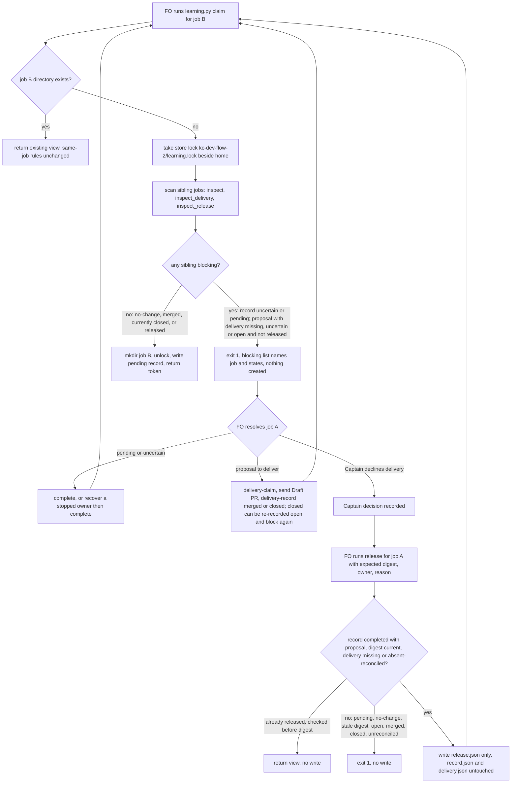

---
id:
title: serialize learning evaluation while another learning job is in flight
status: validation
variant: kc-dev-flow-2
profile: pilot
merge: pr
worktree: .worktrees/spacedock-ensign-learning-serialize-evaluation
pr: pr-merge:473
gates:
    version: 1
    records:
        - id: gate:learning-serialize-evaluation:backlog
          stage: backlog
          attempts:
            - id: gate-attempt:learning-serialize-evaluation-backlog-1
              briefing:
                id: briefing:learning-serialize-evaluation:backlog:attempt-1:revision-1
                digest: sha256:aaa127818701563086ee037152e348e01ea2fd87b8527128c67be950df131025
                room-ref: ./learning-serialize-evaluation/review/backlog/briefing-1
              resolution:
                type: Resolution
                id: resolution:spacedock:learning-serialize-evaluation:backlog:1
                briefing: briefing:learning-serialize-evaluation:backlog:attempt-1:revision-1
                by: person:captain
                at: "2026-09-17T03:23:25.509686Z"
                decision: approve
                reason: Captain approved profile pilot and the admission record's outcome, scope, non-goals and stop condition.
              application:
                target-stage: ideation
                state: consumed
        - id: gate:learning-serialize-evaluation:ideation
          stage: ideation
          attempts:
            - id: gate-attempt:learning-serialize-evaluation-ideation-1
              briefing:
                id: briefing:learning-serialize-evaluation:ideation:attempt-1:revision-1
                digest: sha256:fe077286c1fdf80c18ef3ae3fa25218b5b68e93a9ffd3292ceb2de1e76aeaf6c
                room-ref: ./learning-serialize-evaluation/review/ideation/briefing-1
              resolution:
                type: Resolution
                id: resolution:spacedock:learning-serialize-evaluation:ideation:1
                briefing: briefing:learning-serialize-evaluation:ideation:attempt-1:revision-1
                by: person:captain
                at: "2026-09-17T03:50:39.896371Z"
                decision: approve
                reason: Captain approved the design at 7ea6a081 with AC-4 amended and D1, D2, D3 as recommended.
              application:
                target-stage: implementation
                state: consumed
        - id: gate:learning-serialize-evaluation:validation
          stage: validation
          attempts:
            - id: gate-attempt:learning-serialize-evaluation-validation-1
              briefing:
                id: briefing:learning-serialize-evaluation:validation:attempt-1:revision-1
                digest: sha256:d612ab81afaae47a2098d8bfac86a02668e080cfede3ae4c86b839e108a4f771
                room-ref: ./learning-serialize-evaluation/review/validation/briefing-1
              resolution:
                type: Resolution
                id: resolution:spacedock:learning-serialize-evaluation:validation:1
                briefing: briefing:learning-serialize-evaluation:validation:attempt-1:revision-1
                by: person:captain
                at: "2026-09-17T08:06:22.406894Z"
                decision: approve
                reason: Captain approved validation attempt 3 PASSED at candidate 93258e23 with the recorded limits.
              application:
                target-stage: done
                state: pending
started: 2026-09-17T03:23:59Z
---

Two closed tasks were evaluated for learning while neither learning PR had merged.
Both evaluations pinned the same root `learning.md` basis. The first PR (#469)
landed and moved that basis; the second proposal (#470) was then an add/add conflict
judged against a file that no longer existed. `kc-dev-flow-2/skills/learn/SKILL.md`
already says "Drift, conflicting concurrent proposals or an already-applied change
requires review", but `kc-dev-flow-2/scripts/learning.py` offers that review no
operation: `claim` refuses changed evidence ("existing task evidence differs; no
automatic re-evaluation") and `recover` refuses completed jobs ("completed results
are immutable"). The re-evaluation ran outside the recorder and its delivery record
still names candidate `638b82a2` while the merged head was `112f66ed`.

Source: Captain ruling 2026-09-17 in the FO session — option 1, serialize learning
evaluation, chosen over adding a re-evaluation operation.

## Scope

In scope: `kc-dev-flow-2/scripts/learning.py`, `kc-dev-flow-2/scripts/test_learning.py`,
and the learn skill / README wording that describes when a claim holds.

`claim` for a new job holds while another job in the same local learning store is
still in flight: its evaluation is pending, or it completed with a proposal whose
delivery is not settled. A job the Captain declines to deliver needs an explicit,
recorded release so it cannot block later jobs indefinitely.

Non-goals: no re-evaluation or supersede operation; no change to `job_key`, to
completed-record immutability, or to delivery identity rules; no coordination across
clones or machines (the README already lists cross-clone deduplication as future
work); no handling of `learning.md` drift that does not come from another learning
job.

Stop condition: if the hold cannot be expressed without changing completed-record
immutability or delivery identity rules, stop and return the design to the Captain.

## Acceptance criteria

**AC-1**: A new job's `claim` is refused, with no directory or record created for it,
while another job is in flight; the refusal names the blocking job and its state.
Verified by: `python3 kc-dev-flow-2/scripts/test_learning.py` cases for each in-flight
state (pending; completed with proposal and delivery missing, uncertain or open),
each shown to fail when the hold is removed.

**AC-2**: A job stops blocking once its evaluation completed with no proposal, its
delivery is merged or closed, or it carries the explicit release record.
Verified by: `test_learning.py` cases for each releasing state, each followed by a
successful claim of another job.

**AC-3**: The release is explicit and recorded: it requires a reason, refuses a job
whose delivery is open or merged, and cannot be undone through the CLI.
Verified by: `test_learning.py` cases for each refusal.

**AC-4**: Re-claiming the same job with identical evidence still returns its existing
view, and every existing `test_learning.py` case still passes.
Verified by: the full `test_learning.py` run on the candidate revision.

Amended 2026-09-17 on the Captain's ruling: an existing test whose setup depends on
claiming a second job while an earlier one is unsettled may have that setup changed
so each earlier job is settled or isolated first; its assertions stay unchanged.
Validation compares each such test's assertions against `32cd8890`.

## Design (ideation, pilot)

Design read at code revision `32cd8890` (`origin/main`, checked out detached in the
dev2-adoption worktree). The Captain's option 1 ruling is settled: serialize,
add no re-evaluation or supersede operation.

### Existing-code capability check

- Journey: `learn` skill -> `learning.py claim` for job B while job A is unsettled.
- Completeness: no hold exists. `operate` (claim branch) creates `home/<job_key>`
  and a pending record after looking only at its own directory; `locked` is a
  per-job flock, so nothing spans jobs.
- Observation (2026-09-17, disposable repo under `/tmp`, CLI at `32cd8890`):
  claim job t1, `complete` it with an `add` decision, then claim job t2 ->
  exit 0, `claimed: true`, while t1 has a proposal and delivery `missing`.
  This is the #469/#470 shape reproduced locally.
- Need: the conflict already happened once (#470 judged against a moved
  `learning.md` basis). Nothing to reuse: `recover` refuses completed results and
  `delivery-recover` binds one job's own PR; neither looks across jobs.
- Live store (read-only `notices --all`, 2026-09-17): both jobs `a22107a3…`
  (#470) and `efee0619…` (#469) are completed with proposal and delivery `merged`,
  so under the hold below neither blocks a new claim; adoption strands nothing.

### PRFAQ

**Press release.** When a learning job's proposal is still unsettled, `learning.py
claim` for any other job in the same clone's learning store now refuses, names the
blocking job and why, and creates nothing. The FO then finishes that job — completes
its evaluation, delivers and records the PR as merged or closed (a closed PR recorded
open again blocks again) — or, when the Captain
declines to deliver a proposal that was never sent, records an explicit `release`
with a reason. The next job therefore always evaluates against a `learning.md` basis
that no other local proposal is about to move.

**FAQ**

- *Why not re-evaluate the second job?* Settled by the Captain (option 1). Completed
  results stay immutable; the hold prevents the second evaluation instead.
- *Does the same job re-claim still work?* Yes. A claim whose job directory already
  exists never runs the hold and returns the existing view as today.
- *Why a new `release.json` rather than a field?* `record.json` of a completed job is
  immutable (`recover` refuses completed), and `observation` requires a PR identity for
  `closed`, so a never-sent proposal cannot be recorded as a closed delivery. A separate
  sidecar leaves both files and all their rules unchanged.
- *Can a release be undone?* Not through the CLI: no command removes or rewrites
  `release.json`; a repeated `release` returns the current view and writes nothing.
- *Other clones or machines?* Not covered; README keeps cross-clone deduplication as
  future work. Linked worktrees share the Git common dir, so they are covered.

### Hold predicate (exact recorder states)

Evaluated for every sibling directory `home/<64-hex>` other than the claimed job's own
key, using the existing readers `inspect` (record), `inspect_delivery` (delivery,
bound to the record digest) and a new `inspect_release` (sidecar, same strict style).

| Sibling record (`inspect`) | Delivery (`inspect_delivery`) | Release | Blocks? |
| --- | --- | --- | --- |
| directory exists, record missing/torn/invalid (`uncertain`) | any | any | **blocks** (decision D1) |
| `pending` | any | any | **blocks** |
| `completed`, `proposal` null | any | any | releases |
| `completed` with proposal | `merged` | any | releases (sticky: regression refused) |
| `completed` with proposal | `closed` | any | releases while closed (not sticky, see below) |
| `completed` with proposal | `missing` (no `delivery.json`) | none/invalid | **blocks** |
| `completed` with proposal | `missing` | valid | releases |
| `completed` with proposal | `uncertain`, observation `absent` | valid | releases (decision D2) |
| `completed` with proposal | `uncertain`, observation null/`unknown`, or torn | any | **blocks** |
| `completed` with proposal | `open` | any | **blocks** (a provider fact outranks a release) |

Correctness without locking siblings. Three releasing states cannot be undone: a
completed no-change record (`recover` refuses completed), delivery `merged` (the only
state `delivery-record`/`delivery-recover` guard against regression) and a release (no
command removes it). **`closed` is not sticky:** `delivery-record` only refuses leaving
`merged`, so it can move a delivery from `closed` back to `open` with the same PR
(the engineering reviewer reproduced this with exit 0 in a `/tmp` repo). That path is
pre-existing and this design leaves it unchanged. Under the hold it fails closed: a
scan that saw `closed` let one new claim through, and the next scan after the PR is
recorded `open` blocks again. The residual — a claim admitted in the window before a
re-open is recorded — is the same as a PR re-opened on GitHub and not yet observed,
which no local lock can see. A sibling seen mid-transition (`pending`, or a directory
created but not yet written) reads as blocking. `atomic_write` means no half-written
file is read as valid.

Where it runs: in `operate`'s claim branch, only when the job directory does not
already exist, and after the pack, eligibility and `--owner` checks (so invalid or
ineligible input still creates nothing). New order: `home.mkdir` -> take a store lock
at `<git-common-dir>/kc-dev-flow-2/learning.lock`, a sibling of `home`, not inside it
(blocking `flock`, held only for scan + `directory.mkdir()`) -> re-check existence ->
scan siblings -> refuse or `mkdir` -> release store lock -> existing per-job `locked`
+ pending write. Outside `home` the lock file does not change listings of `home`
(`test_linked_worktree_multiprocess_claim_race` counts `home.iterdir()`; with the lock
inside `home` that assertion failed `2 != 1` in the prototype below), and `notices`
already filters `home` to 64-hex directories either way. The store lock closes the race
where two *different* new jobs scan at the same time. Per-job operations never take the
store lock, so there is no lock-order inversion.

**Dependency on D1.** The lock may stop before the pending record write only because a
directory without a readable record counts as `uncertain` and blocks (D1 = block). If
the Captain rules D1 the other way, a racing claim could see job B's directory before
its record exists and pass; the store lock must then also cover the pending record
write.

Refusal: exit 1, existing error shape plus a structured field:
`{"state": "error", "error": "learning job in flight; …", "blocking": [{"job": JOB, "record": STATE, "delivery": STATE, "released": BOOL}]}`
listing every blocking sibling. No job directory or record is created.

### Explicit release

`learning.py --repo R release --job JOB --expected NOTICE_DIGEST --owner SESSION --reason REASON`

Check order, under the job's `locked`:
1. refuse: job id invalid or directory missing; `--reason` or `--owner` blank;
2. refuse: record is not `completed` with a proposal (pending, uncertain and no-change
   are refused — no-change never blocks);
3. **already released:** a valid `release.json` exists -> return the current notice view
   and write nothing. This runs **before** the staleness check, because the release
   itself changes `notice_digest`, so a retry carrying the pre-release digest must see
   the existing release rather than a stale-digest error;
4. refuse: `--expected` differs from the current `notice_digest`;
5. refuse: delivery is `open`, `merged` or `closed`; delivery is torn or `uncertain`
   without an `absent` observation (reconcile via `delivery-recover` first).

Writes only `release.json` via `atomic_write`:
`{"schema_version": 1, "owner", "reason", "result_digest", "delivery_digest", "authority": "caller attestation"}`,
binding the record and delivery bytes it saw. It never touches `record.json`,
`delivery.json`, `job_key`, the plan/observation validators, PR non-replacement or the
merged non-regression rules. The CLI cannot verify that the Captain declined; the learn
skill states the release is run only after the Captain's recorded decision.

A released job gains no send authority: `delivery-claim` refuses a released job, and
`delivery-recover` refuses an `absent` observation on a released job (an `open`,
`merged` or `closed` observation is still recorded, because it is a provider fact; an
`open` one makes the job block again).

**Stop-condition check:** the hold and release need no change to completed-record
immutability, `job_key` or delivery identity rules. The two new delivery refusals on
a released job restrict send authority only; they change no binding. Stop condition
not triggered.

### Interaction with existing behaviour

- **Same-job re-claim:** directory exists -> hold skipped -> existing view (identical
  evidence) or the existing "evidence differs" refusal. Unchanged.
- **`recover`:** requires the directory to exist, so it is never held and cannot bypass
  the hold for a new job; it remains the route that turns a sibling's `uncertain` or
  stale `pending` record back into a completable claim (which then releases on
  no-change or proceeds to delivery).
- **`complete`, `delivery-claim`, `delivery-record`:** unchanged except the released-job
  refusal on `delivery-claim` above.
- **`delivery-recover`:** unchanged except refusing `absent` on a released job.
- **`notices` / `ack`:** `notice` adds a `release` field when present, and
  `notice_digest` becomes `sha256(encoded([record, delivery, release]))` only when a
  release exists; without one it stays `sha256(encoded([record, delivery]))`, so already
  acknowledged jobs are not re-notified. A release therefore marks the job unread and a
  pre-release `ack` digest is rejected as stale.
- **Docs:** learn SKILL.md "Existing claims/results are read, not automatically
  retried" gains the hold and its three exits; README "duplicate triggers observe it
  rather than launch another job" gains store serialization and `release`. README's
  cross-clone future-work sentence is unchanged.

### Sequence

### Acceptance evidence

All in `python3 kc-dev-flow-2/scripts/test_learning.py`; each test is paired with the
mutation that must make it fail.

- **AC-1** `test_new_claim_held_by_in_flight_sibling` — subtests: sibling `pending`;
  sibling record torn (if D1 holds); proposal + delivery missing; proposal + delivery
  `uncertain` (claimed, no observation); proposal + delivery `open`; released job whose
  delivery is then recorded `open`. Each asserts exit 1, `blocking` names the sibling
  job and its record/delivery state, and job B's directory does not exist.
  Mutations: remove the hold call from `operate` (all fail); drop each blocking row
  from the predicate (its subtest fails); let a release outrank `open` (last fails).
- **AC-1 race** `test_distinct_jobs_cannot_both_claim` — two processes claim different
  jobs while a harness (the `os.replace`-patch style of
  `test_process_crash_during_publication_preserves_uncertainty_or_prior_record`) sleeps
  between scan and `mkdir`; asserts exactly one job directory. Mutation: remove the
  store lock (deterministically two directories, because of the injected sleep).
- **AC-2** `test_settled_sibling_releases_hold` — subtests: no-change completion;
  delivery `merged`; delivery `closed`; release with delivery missing; release after
  `delivery-recover` to `absent` (if D2 holds). Each is followed by a successful claim
  of another job (`claimed: true`). Mutations: treat every existing sibling as
  blocking; remove `merged`/`closed` from the settled set; ignore `release.json`.
- **AC-3** `test_release_refusals_and_irreversibility` — refuses blank reason, pending
  record, no-change record, stale `--expected`, delivery `open`, `merged`, `closed`,
  delivery uncertain without absent observation; a second `release` carrying the
  **pre-release** `--expected` digest returns the view and writes nothing
  (`release.json` bytes equal, exit 0 — proves the already-released check precedes the
  staleness check); `record.json` and `delivery.json` bytes unchanged by
  release; `delivery-claim` and `absent` `delivery-recover` refused on a released job;
  `release` then `notices` shows it unread and a pre-release `ack` digest is rejected.
  Mutations: delete each refusal check (its assertion fails); move the staleness check
  before the already-released check (the second release exits 1); write the release into
  `record.json` (byte check fails); omit release from `notice_digest` (stale-ack
  check fails).
- **AC-4** `test_same_job_reclaim_ignores_hold` — with a blocking sibling present,
  re-claiming job A's identical evidence returns its view without `token`. Mutation:
  run the hold before the existence check (refused). Plus the full existing suite on
  the candidate revision, and a no-release notice asserting
  `notice_digest == sha256(encoded([record_digest, delivery_digest]))`. Mutation:
  always fold a release digest in (fails).
- **AC-4 existing suite under the hold.** Prototype run 2026-09-17 in a `/tmp` copy of
  `learning.py`/`test_learning.py` at `32cd8890` (minimal hold: pending/uncertain block,
  proposal blocks unless delivery merged/closed; lock beside `home`), whole suite, 14
  tests: 12 pass unchanged, 2 fail. With the two fixture edits below, 14/14 pass. Lock
  inside `home` additionally failed `test_linked_worktree_multiprocess_claim_race`
  (`2 != 1`).
  - `test_three_outcomes_and_mixed_preserve_project_files` — iterations 2-4 were refused
    (iteration 1 left a completed proposal with no delivery, which blocks every later
    new claim). Minimal change: isolate each iteration by removing the disposable
    repo's `.git/kc-dev-flow-2` store after its assertions. All original assertions,
    including root `learning.md`/`AGENTS.md` bytes, are unchanged.
  - `test_torn_and_missing_record_are_uncertain_not_automatic_retries` — the second
    iteration's new claim was refused by the first iteration's recovered `pending` job.
    Minimal change: at the end of each iteration, `complete` the renewed claim with a
    no-change decision (settling it). The existing assertion that the old token is
    refused runs before that and is unchanged.
  - No other existing test creates two distinct jobs whose earlier one is unsettled:
    `test_no_change_and_mismatched_plan_cannot_claim_delivery` claims a second job after
    a no-change sibling, which releases.

**AC-4 amendment needed:** the FO is asking the Captain whether these fixture edits,
which keep each test's original assertions, satisfy AC-4's "every existing
`test_learning.py` case still passes".

Not yet verified: all of the above are future implementation checks.

### Unresolved decisions for the Captain

- **D1 — a sibling whose record is `uncertain` (directory exists, record torn or
  missing).** Scope names only pending and unsettled deliveries. Recommendation: block,
  because a claim that crashed mid-write looks exactly like this and the store lock
  relies on it; the exit is the existing `recover` then `complete`. What gets worse: a
  crash leaves every other job held until someone recovers it.
- **D2 — release when delivery was claimed but reconciled to a confirmed absent PR.**
  AC-3 names only open/merged refusals. Recommendation: allow release only for delivery
  missing or `uncertain` with an `absent` observation; refuse unreconciled `uncertain`
  (a PR may exist) and `closed` (already releases). What gets worse: a job with a torn
  delivery must go through `delivery-recover` before it can be released.
- **D3 — send authority after release.** Recommendation: `delivery-claim` refuses a
  released job and `delivery-recover` refuses `absent` on it, so a released proposal
  cannot quietly become a PR. What gets worse: a released proposal can never be
  delivered through the recorder, since the same task maps to the same `job_key`.

### Profile reminder

Pilot: one local-store hold plus one recorded release, tested on real files and
processes; no cross-clone lock, no re-evaluation, no new obligation that changes the
profile.

## Stage Report: ideation

- DONE: The hold is defined over exact recorder states: which record and delivery states block a new claim, which release it, and where each is read in learning.py
  Hold predicate table over `inspect` / `inspect_delivery` / new `inspect_release`, run in `operate` claim branch under `home/.store.lock` before `mkdir`.
- DONE: The explicit release is specified: its CLI shape, what it writes, its refusals, and why it leaves completed evaluation records and delivery identity rules unchanged
  `release --job --expected --owner --reason`; writes only `release.json`; refusal list; sidecar rationale in Explicit release.
- DONE: The Captain's option 1 ruling (serialize, no re-evaluation operation) is treated as settled, not re-argued
  Stated as settled at the top of Design and in the FAQ.
- DONE: PRFAQ and Mermaid present with matching actors, states, refusals and release
  PRFAQ and flowchart share FO, Captain, claim/scan/refuse, resolve routes and release refusals; Mermaid rendered with @mermaid-js/mermaid-cli (exit 0).
- DONE: Acceptance evidence named per AC, each test paired with the mutation that must make it fail
  AC-1 (plus race), AC-2, AC-3, AC-4 each name a test and mutations; none run yet (future implementation checks).
- DONE: Interaction with existing behaviours named: same-job re-claim, recover, delivery-recover, notices and ack
  Interaction section covers each, incl. notice_digest compatibility for acknowledged jobs.
- DONE: The stop condition is checked: if the hold needs changes to completed-record immutability or delivery identity, say so and stop
  Not triggered: record.json, job_key and delivery bindings untouched; new refusals restrict send authority only.
- DONE: Unresolved decisions identified for the Captain rather than decided by the worker
  D1 uncertain sibling record, D2 release after absent reconciliation, D3 send authority after release, each with recommendation and cost.

### Summary

Designed a local-store hold in `claim` (sibling scan under a store lock, before any directory is created) and an explicit, non-reversible `release` sidecar for proposals the Captain declines to deliver, with no change to completed records or delivery identity. A disposable-repo run at `32cd8890` reproduced the gap (second job claimed while the first had an undelivered proposal); both live jobs are merged, so adoption strands nothing. Three decisions (D1-D3) are left for the Captain.

Correction round 1.

- DONE: AC-4 conflict with existing tests — whole suite checked by prototype in `/tmp`: exactly two tests break; fixture changes named per test; "AC-4 amendment needed" line added. Landed in Acceptance evidence, "AC-4 existing suite under the hold".
- DONE: Store lock moved out of `home` to `kc-dev-flow-2/learning.lock`; prototype showed lock-in-home fails the race test's `iterdir` count. Landed in Hold predicate, "Where it runs", and Sequence.
- DONE: Monotonicity corrected — only `merged` is regression-guarded; `closed` not sticky, pre-existing, fails closed on the next scan. Landed in the table (split `merged`/`closed` rows), the correctness paragraph, PRFAQ and Sequence.
- DONE: Lock not covering the record write now stated as dependent on D1 = block, with the alternative. Landed in "Dependency on D1".
- DONE: `release` check order pinned (already-released before staleness) and added to the AC-3 test and its mutation. Landed in Explicit release and AC-3.
- DONE: Header corrected: `32cd8890` is `origin/main`.
- D1-D3 left open; Scope, AC, profile and option 1 unchanged. Mermaid re-rendered with @mermaid-js/mermaid-cli (exit 0).

## Stage Report: implementation

- DONE: Exact delivered artifact recorded: the files changed and nothing beyond the approved scope (learning.py, test_learning.py, learn SKILL.md and README wording)
  `git diff 32cd8890..HEAD --stat`: kc-dev-flow-2/scripts/learning.py, kc-dev-flow-2/scripts/test_learning.py, kc-dev-flow-2/skills/learn/SKILL.md, kc-dev-flow-2/README.md; commits ffa53f9b, 45696554, 78e167e3, b2984a12.
- DONE: Claim hold and release implemented as the approved design at state commit 7ea6a081 with D1, D2 and D3 as recommended; any deviation stated with its reason
  `sibling_status`/`blocking_siblings` implement the hold predicate table (D1: a directory with no readable record blocks); `release_operation` implements the explicit sidecar and its refusal/already-released/staleness order (D2: release allowed only for delivery missing or `absent`-reconciled); `delivery_operation`'s `delivery-claim` and `delivery-recover` refuse a released job per D3. No deviation.
- DONE: AC-1 through AC-4 each proven by its named test, and each named mutation actually run and shown to fail, with the command and result recorded
  AC-1: `test_new_claim_held_by_in_flight_sibling` (6 subtests: pending, record-torn/D1, proposal+delivery-missing, proposal+delivery-uncertain, proposal+delivery-open, released-then-reopened) and `test_distinct_jobs_cannot_both_claim` (store-lock race). Mutations run via `timeout 40 python3 kc-dev-flow-2/scripts/test_learning.py LearningTests.<name>` after hand-editing a committed-clean `learning.py` then `git checkout --` to restore: removing the hold call -> 6/6 subtests fail; dropping the "open blocks" row -> 2 subtests fail; letting release outrank an open PR -> the released-reopen subtest fails; removing the store lock (after fixing the race test's sleep-seam evaluation order, commit b2984a12) -> race test fails 2 != 1 winners.
  AC-2: `test_settled_sibling_releases_hold` (5 subtests: no-change, merged, closed, release-with-missing-delivery, release-after-absent-reconciliation). Mutations: treating every sibling as blocking -> 5/5 fail; removing merged/closed from the settled set -> 2 fail; making `release_valid` always False -> 2 fail.
  AC-3: `test_release_refusals_and_irreversibility`. Mutations: deleting the already-released short-circuit -> replay assertion fails ("notice changed since presentation"); moving the staleness check before it -> same failure, confirming the check order is load-bearing; writing the release into `record.json` -> fails (schema rejects the extra field, proving immutability is enforced); omitting the release digest from `notice_digest` -> the post-release `ack` refusal assertion fails.
  AC-4: `test_same_job_reclaim_ignores_hold` plus a standalone fixture (`/tmp/ac4_seam.py`, not committed) that directly constructs two coexisting pending job directories on disk — a state the CLI's own hold makes unreachable through legitimate `claim` calls, since a second job can never become pending while the first is pending. Baseline: reclaiming job A returns its view (exit 0, no `token`) despite job Z independently pending. Mutation (hold runs before the reclaim's existence check): reclaiming A is wrongly refused (exit 1, blocked by Z). Separately, always folding the release digest into `notice_digest` (even with no release) breaks the no-release digest assertion in `test_same_job_reclaim_ignores_hold`.
- DONE: The two existing tests with changed setup listed; each shown to keep every original assertion unchanged against 32cd8890
  `test_three_outcomes_and_mixed_preserve_project_files` (adds a `shutil.rmtree` of the store between iterations) and `test_torn_and_missing_record_are_uncertain_not_automatic_retries` (adds a settling `complete` at the end of each iteration). `git diff 32cd8890 -- kc-dev-flow-2/scripts/test_learning.py | grep -E '^-[^-]'` returns nothing — zero lines removed, every original assertion byte-unchanged; only additions.
- DONE: Full test_learning.py run on the candidate revision recorded, plus python3 kc-dev-flow-2/scripts/lint-skills.py
  `timeout 110 python3 kc-dev-flow-2/scripts/test_learning.py`: 19 tests, OK. `timeout 60 python3 kc-dev-flow-2/scripts/lint-skills.py`: PASS.
- DONE: Completed-record immutability, job_key and delivery identity validators unchanged, shown by diff of those functions
  `git diff 32cd8890 -- kc-dev-flow-2/scripts/learning.py | grep -E '^-[^-]'` shows exactly 6 removed lines, none inside `job_key`, `inspect`, `delivery_plan`, `observation` or `inspect_delivery` — only the `notice_digest` line (now release-aware), the claim-branch mkdir (now store-lock-guarded) and the error-print line (now `Blocked`-aware) changed.
- DONE: The live learning store in this clone is never written; experiments use temporary repositories only
  Every test and standalone fixture (`/tmp/racecheck.py`, `/tmp/ac4_seam.py`) initializes its own disposable `git init` repo under `tempfile`/`mkdtemp`; `learning.py` was never invoked with `--repo` pointed at this checkout.
- DONE: Pilot seams named: real files, flock and processes exercised versus reasoned about; material limits recorded
  Exercised on real files/processes: the store `flock` under concurrent `subprocess.Popen` (`test_linked_worktree_multiprocess_claim_race`, `test_distinct_jobs_cannot_both_claim`), `os.replace`/crash injection, and linked-worktree sharing of the Git common dir. Reasoned about, not exercised: cross-clone/cross-machine coordination (explicitly out of scope). Material limits carried into docs: the `closed`->`open` delivery re-record window is pre-existing and unchanged; a claim admitted in the gap before a re-open is recorded is the same residual as an unobserved GitHub re-open, which no local lock can see.

### Summary

Implemented the approved hold (`sibling_status`/`blocking_siblings` under a store-wide `flock`, sibling of `home`) and the explicit, irreversible `release` sidecar, wired D1-D3 exactly as recommended. AC-1 through AC-4 are each covered by a named test; every mutation named in the design's Acceptance evidence was run against a hand-edited, git-restored copy of the committed code and shown to fail, including one (AC-4's hold-ordering mutation) verified through direct on-disk state construction because the coexisting-siblings state it targets is unreachable through the CLI's own invariant. One test bug was found and fixed in-flight: the race test's sleep-seam evaluated `time.sleep` before the patched function it wrapped, which silently passed under the "remove the store lock" mutation until corrected (commit b2984a12).

## Stage Report: validation

- DONE: Independent verdict on commit b2984a12, with the primary evidence that decided it
  Recommend PASSED. Worktree HEAD b2984a12 clean. Scratch copy `/tmp/val-lse` (learning.py + test_learning.py): `timeout 120 python3 test_learning.py` 19 tests OK (21s). Deciding evidence: own CLI journey `/tmp/val-lse/journey.py` reproduced #469/#470 (t1 completed `add`, t2 claim exit 1 `blocking=[{t1, completed, missing, released:false}]`, store still 1 dir), then `release` with expected digest -> t2 `claimed: true`.
- DONE: Each AC checked by your own method against the delivered code, not only by re-running the implementation's tests
  journey.py (CLI only, disposable repo): AC-1 refusal + nothing created; AC-2 release unblocks; AC-3 blank reason exit 1, re-release exit 0 with `release.json` bytes equal, `record.json` bytes unchanged, `delivery.json` absent; AC-4 same-job re-claim while a *different* job (t4) is pending returns t3's view, exit 0, no token. Extra scratch test `d3check.py`: released job refuses `absent` delivery-recover (delivery.json bytes unchanged) and delivery-claim.
- DONE: At least one named mutation per AC re-run by you, with command and result, on a scratch copy; HEAD unchanged afterwards
  `python3 /tmp/val-lse/mutate.py NAME OLD NEW TEST` (copies into `/tmp/val-lse/m-NAME`). AC-1 pending row returns non-blocking -> held test `state='pending'` FAIL. AC-1 race: delete store `LOCK_EX` -> `test_distinct_jobs_cannot_both_claim` FAIL 2 != 1, 3 of 3 runs. AC-2 `("merged","closed")`->`("merged",)` -> `delivery-closed` subtest FAIL. AC-3 staleness before already-released -> FAIL "notice changed since presentation"; delete the whole delivery-refusal block -> open/merged/closed/uncertain FAIL. AC-4 scan inserted before the existence check -> full suite still OK (finding F1); journey.py catches it (t3 re-claim exit 1). HEAD b2984a12 and clean status after.
- DONE: AC-4 amendment checked: the two tests with changed setup keep every assertion from 32cd8890, and the setup change does not weaken what they prove
  `rtk proxy git diff 32cd8890..b2984a12 -- test_learning.py | grep -c '^-[^-]'` = 0. The 32cd8890 test file run against candidate learning.py fails exactly those two tests (three_outcomes subtests 2-4, torn), so both edits are needed. `rmtree` of the store only drops coexistence of 4 jobs, which no assertion checked; root learning.md/AGENTS.md bytes are still checked. The torn test adds one `complete(renewed)` exit-0 call after the old-token refusal: an added check, not a weakened one.
- DONE: Completed-record immutability, job_key and delivery identity rules unchanged in effect, not just in removed lines
  Removed lines are only notice_digest, claim mkdir and error print; job_key/inspect/delivery_plan/observation/inspect_delivery untouched. In effect: journey `recover` on completed -> "completed results are immutable"; identical input maps to the same job. Removing the immutability require -> `test_invalid_completion_keeps_token_repairable_and_success_immutable` FAIL; removing the merged non-regression in delivery-record -> `test_delivery_recovery_and_observation_boundaries` FAIL.
- DONE: Docs in learn SKILL.md and README match the delivered behaviour, with no absolute claim lacking its enforcement point
  Behaviour matches. Findings F3 and F4 below: README "irreversible" is unbounded, and SKILL.md gives no exact `release` command. lint-skills.py PASS.
- DONE: Pilot seams: real flock, processes and files exercised named, separated from what was only reasoned about; every implementation claim you could not confirm listed
  Exercised: real store flock with two `Popen` claimers plus a 0.3s seam (lock removal fails deterministically); 24-process linked-worktree race test; real `atomic_write` files and byte comparisons; real `git init` repos. Reasoned only: `LOCK_EX` has no timeout, so a claimer frozen mid-scan holds every new claim until it exits; a torn `release.json` makes release a no-op while the hold still blocks (manual repair only; atomic_write makes this unlikely); cross-clone out of scope. Not confirmed / contradicted: the implementation said the AC-4 two-sibling state is "unreachable through legitimate claim calls". That is false: no-change t3, then pending t4, then re-claim t3 reaches it via CLI.
- DONE: This clone's real learning store not written; no push, no PR
  Every run used disposable repos. Real store `/Users/kent/Project/kc-claude-workspace/kc-claude-plugins/.git/kc-dev-flow-2/` has no `learning.lock` and job dirs last changed 09:56, before this stage. No code push or PR. Only this report was pushed to the state branch.

### Findings (four-field classification left to FO)

- F1 Deferred risk: the AC-4 falsifier named in the design ("hold before existence check") is not caught by the committed suite. `test_same_job_reclaim_ignores_hold` has no other job, so it cannot see the mutation. The implementation covered it only with an uncommitted `/tmp/ac4_seam.py`. Behaviour is correct today. Trigger: a refactor that moves the scan.
- F2 Deferred risk: nothing in the committed suite checks D3's `absent` delivery-recover refusal on a released job. Removing it keeps 19/19 OK. Behaviour was confirmed by scratch `d3check.py`, which fails under that mutation.
- F3 Polish: README says "explicit, irreversible `release`" and "cannot hold later jobs indefinitely". Neither names an enforcement point. Also, a released job re-recorded `open` blocks again. SKILL.md bounds the claim correctly ("through the CLI").
- F4 Polish: SKILL.md gives exact command lines for delivery-claim/recover but none for `release --job --expected --owner --reason`, and does not describe the `blocking` refusal shape.
- F5 Polish: the store-lock comment says `notices` relies on `home.iterdir()` counts, but `notices` filters to 64-hex names. The comment in `test_three_outcomes...` says "settle", but the code isolates the store. Error output switched to `ensure_ascii=False`, which is harmless.

### Summary

Candidate b2984a12 delivers the hold, store lock and release as designed, with D1-D3 as recommended. Each AC holds under my own CLI journey, and one mutation per AC fails the relevant check. The AC-4 amendment removes no assertion. Recommend PASSED. Two test-coverage gaps (F1, F2) and three doc/comment Polish items go to FO disposition. No repair was made.

## FO disposition — validation attempt 1

Candidate `b2984a12`. Validation recommended PASSED with findings F1–F5. Captain ruled
2026-09-17 to return the candidate to implementation for one correction round.

- **F1 — Material, owned, fix authorized.** Released user and workflow: FO running
  `learn` for a second task while an earlier job is settled but another is pending.
  Harm: a regression that runs the hold before the existing-job check passes CI.
  Boundary: `value-ac[AC-4]` names this mutation as one its test must catch.
  Trigger: validation removed the ordering and the committed suite stayed 19/19; FO
  confirmed `test_same_job_reclaim_ignores_hold` holds only one job, and the hold
  excludes the claimed job's own key. The uncommitted `/tmp/ac4_seam.py` is not
  committed evidence, and the "unreachable" claim is refuted by CLI-only construction.
- **F2 — Material, owned, fix authorized.** Released workflow: Captain declines a
  proposal, FO releases it. Harm: removing the `delivery-recover` refusal of `absent`
  on a released job passes CI, reopening a send path the Captain closed.
  Boundary: `value-ac[AC-3]` lists that refusal; `captain-ruling[2026-09-17]` D3.
  Trigger: validation removed the check and the suite stayed 19/19.
- **F3 — Polish, fix authorized.** README calls `release` irreversible without naming
  its enforcement point (`contract[CLAUDE.md#commit--pr-conventions-per-user-preferences]`
  absolute-claim rule), and omits that a released job re-observed `open` blocks again.
- **F4 — Polish, fix authorized.** learn SKILL.md gives no exact `release` invocation or
  refusal shape.
- **F5 — Polish.** Fix authorized for the store-lock comment that says `notices` depends
  on the directory count and the test comment saying "settle" where the code wipes the
  store. Declined: `ensure_ascii=False` in error output, harmless.
- **Recorded limits, not repaired:** the store lock has no timeout, so a frozen claimer
  holds new claims until it exits; a corrupted `release.json` leaves the job blocking
  with manual repair as the only exit; cross-clone coordination stays out of scope.

Assignment: add committed tests for F1 and F2, each shown to fail under its mutation
with the command and result recorded; apply F3, F4 and the F5 fixes; change nothing
else. Then fresh independent validation.

The `gate record --round` recorder is not run: this workflow keeps no validation
briefing room (`briefing.json`, `briefing.review.jsonl`) before a gate is prepared.

## Stage Report: implementation

Correction round 1.

Candidate before this round: b2984a12. FO disposition (validation attempt 1) authorized
fix for F1, F2, F3, F4, F5; declined F5's `ensure_ascii=False` item (unchanged).

- DONE: F1 — committed test for AC-4's "hold before existence check" mutation, reached by CLI calls only
  Added `test_reclaim_settled_job_bypasses_hold_despite_pending_sibling` (job A settled no-change, job B pending, re-claim A -> existing view, no token). Commit 6b511198. Mutation (hold moved before the `if not directory.is_dir()` reclaim guard, run via `timeout 110 python3 kc-dev-flow-2/scripts/test_learning.py`): FAILED, 2 failures — the new test refuses the legitimate reclaim, and `test_distinct_jobs_cannot_both_claim` also breaks (2 != 1 winners) because this textual mutation also pulled the sibling scan out of the store lock. Restored via `git checkout --`.
- DONE: F2 — committed test for D3's absent-delivery-recover refusal on a released job
  Added `test_delivery_recover_absent_refused_on_released_job`. Commit 6b511198. Mutation (removed the `release_raw is None` require in the `observed["state"] == "absent"` branch of `delivery_operation`'s delivery-recover path), run via `timeout 110 python3 kc-dev-flow-2/scripts/test_learning.py`: FAILED, exactly this 1 test (delivery-recover returned `delivery_claimed: true` on the released job instead of refusing). Restored via `git checkout --`.
- DONE: F3 — README names release's enforcement point and the re-open residual
  README now states no CLI command removes or rewrites `release.json` (the enforcement point for "irreversible") and that a released job re-observed `open` blocks again. Commit 6b511198.
- DONE: F4 — learn SKILL.md gives the exact release invocation and refusal shape
  Added the `release --job --expected --owner --reason` command block and named the `blocking` list's fields (job id, record state, delivery state, released flag) and exit 1. Commit 6b511198.
- DONE: F5 — corrected both flagged comments
  Store-lock comment now names `test_linked_worktree_multiprocess_claim_race`'s raw `home.iterdir()` count as what a lock-in-home would perturb (not `notices`, which already filters to 64-hex names). The `test_three_outcomes...` comment now says "wipe the store" instead of "settle", matching what `shutil.rmtree` actually does. `ensure_ascii=False` left unchanged per the FO's decline. Commit 6b511198.
- DONE: Correction to the implementation stage report's prior claim
  The original report stated the AC-4 two-sibling state (a settled job coexisting with an independently pending job) was "unreachable through legitimate `claim` calls." That was wrong — validation reached it with CLI-only calls (no-change job, then a second pending job, then re-claim the first). Retracted; F1's committed test now covers exactly that state.
- DONE: Full committed suite and lint-skills.py on the corrected candidate
  `timeout 110 python3 kc-dev-flow-2/scripts/test_learning.py`: 21 tests, OK. `timeout 60 python3 kc-dev-flow-2/scripts/lint-skills.py`: PASS. Worktree clean at 6b511198; no push, no PR; all fixture repos disposable (`tempfile`/`mkdtemp`), the real learning store untouched.

### Summary

Closed F1-F5 from validation attempt 1's FO disposition: two new committed tests (AC-4's coexisting-siblings reclaim, D3's absent-recover refusal on a released job) each shown to fail under their named mutation on the full committed suite; README and SKILL.md now name enforcement points and exact commands instead of bare claims; two comments corrected to match actual behavior. Retracted the prior report's incorrect "unreachable" claim. Candidate for fresh validation: 6b511198.

## Stage Report: validation

Validation attempt 2, candidate 6b511198 (base 32cd8890).

- DONE: Independent verdict on commit 6b511198, with the primary evidence that decided it
  Recommend PASSED. Worktree HEAD 6b511198, status clean. Scratch copy `/tmp/val2-lse` from `git show 6b511198:` (cmp-identical to the worktree): `timeout 120 python3 test_learning.py` 21 tests OK (20.7s). Deciding evidence: own CLI journey `/tmp/val2-lse/journey2.py` in a disposable repo reproduced the #469/#470 shape (t1 completed `add`, t2 claim exit 1, `blocking=[{t1, completed, missing, released:false}]`, still one job dir), release unblocked t2, and F1 and F2 mutations each fail their new committed test on the full suite. F1-F5 closed (see below).
- DONE: Each AC checked by your own method against the delivered code, not only by re-running the implementation's tests
  journey2.py, CLI only. AC-1: t2 refused while t1 is pending and again while it has an undelivered proposal; the same refusal from a linked worktree; dir count unchanged each time. AC-2: after `release`, t2 `claimed: true`; after t2 completed no-change, a new claim goes through. AC-3: stale digest refused ("notice changed since presentation"); blank reason refused; release exit 0 with `record.json` bytes unchanged and no `delivery.json`; re-release with the pre-release digest and a different owner/reason exits 0 with `release.json` bytes unchanged; `ack` with the pre-release digest refused. AC-4: re-claim of t1 while t2 is pending exits 0, returns `completed`, no token; t3 is still refused by t2.
- DONE: At least one named mutation per AC re-run by you, with command and result, on a scratch copy; HEAD unchanged afterwards
  `python3 /tmp/val2-lse/mutate.py NAME spec-NAME.json [TEST]`: copies to `/tmp/val2-lse/m-NAME`, each replacement must match once, run under `timeout 120`. Output is in `/tmp/val2-lse/runall.out`. **F1** (hold before the existence check, store lock kept, full suite): only `test_reclaim_settled_job_bypasses_hold_despite_pending_sibling` FAILS (1 != 0, blocked by the pending sibling). **F2** (drop the `absent` release require in delivery-recover, full suite): only `test_delivery_recover_absent_refused_on_released_job` FAILS (exit 0, `delivery_claimed`). AC-1: pending row non-blocking, pending subtest FAILS; torn row non-blocking, record-torn FAILS; release outranks open, released-then-reopened FAILS; hold call removed, 6/6 subtests FAIL; `LOCK_EX` removed, `test_distinct_jobs_cannot_both_claim` FAILS 3 of 3 runs. AC-2: `release_valid` always False, 2 release subtests FAIL; `closed` dropped from the settled set, delivery-closed FAILS. AC-3: staleness moved before already-released FAILS; blank-reason check removed FAILS; delivery-claim release refusal removed FAILS; stale-digest check removed FAILS. AC-4: release digest always folded into `notice_digest`, `test_same_job_reclaim_ignores_hold` FAILS. One survivor, F8 below. HEAD 6b511198 with clean status after all runs.
- DONE: AC-4 amendment checked: the two tests with changed setup keep every assertion from 32cd8890, and the setup change does not weaken what they prove
  `rtk proxy git diff 32cd8890 6b511198 -- kc-dev-flow-2/scripts/test_learning.py | grep -c '^-[^-]'` = 0. The only hunks inside pre-existing tests are the `rmtree` plus comment in `test_three_outcomes_and_mixed_preserve_project_files` and the settling `complete(renewed)` plus comment in `test_torn_and_missing_record_are_uncertain_not_automatic_retries`. I compared the torn test side by side with 32cd8890: every base line is present and in the same order. The added `complete` comes after the old-token refusal and asserts exit 0, so it adds a check. The `rmtree` removes only `.git/kc-dev-flow-2`, so the root `learning.md`/`AGENTS.md` byte assertions still observe every iteration's commands. Necessity: the 32cd8890 test file run against the candidate `learning.py` fails exactly those two tests (three_outcomes subtests 2-4, and torn): 14 tests, failures=4.
- DONE: Completed-record immutability, job_key and delivery identity rules unchanged in effect, not just in removed lines
  Removed `learning.py` lines are only the `notice_digest` line, the claim mkdir block and the error print. `job_key`, `inspect`, `delivery_plan`, `observation` and `inspect_delivery` are untouched. In effect: journey `recover` on a completed job gives "completed results are immutable". With that require mutated to `pass`, the full suite FAILS `test_invalid_completion_keeps_token_repairable_and_success_immutable`. Identical evidence maps to the same job (the t1 re-claim returns the same job). A released job still records an `open` provider fact and blocks again (committed subtest released-then-reopened, passing).
- DONE: Docs in learn SKILL.md and README match the delivered behaviour, with no absolute claim lacking its enforcement point
  F3 and F4 are closed: README and SKILL.md now bound "cannot be undone" to "no CLI command removes or rewrites `release.json`". Grep confirms `release_operation` is the only write site (`atomic_write(directory / "release.json"`), guarded by the already-released short-circuit, and no unlink targets it. SKILL.md gives the exact `release` command and the `blocking` shape. New doc findings F6 and F7 below. `timeout 60 python3 kc-dev-flow-2/scripts/lint-skills.py` in the worktree: PASS, exit 0.
- DONE: Pilot seams: real flock, processes and files exercised named, separated from what was only reasoned about; every implementation claim you could not confirm listed
  Exercised: the real store `flock` under concurrency with no seam. journey2.py started 12 processes claiming 12 distinct jobs, alternating main repo and linked worktree: 1 winner, 11 refused with `blocking`, 3 dirs total (2 prior plus 1). Also exercised: the seamed two-process race test under lock removal (3/3 FAIL); the linked-worktree shared store; real `atomic_write` files with byte comparisons; real `git init` repos. Reasoned only, carried over as recorded limits and not re-classified: `LOCK_EX` has no timeout; a torn `release.json` makes release a no-op while the job still blocks; cross-clone coordination. Not confirmed: the SKILL.md claim that `read` supplies `notice_digest` is contradicted (F6).
- DONE: This clone's real learning store not written; no push, no PR
  Real store `/Users/kent/Project/kc-claude-workspace/kc-claude-plugins/.git/kc-dev-flow-2/` (git common dir of the worktree) holds only `learning/` with the two 09:56 job dirs and no `learning.lock`. `find` for files newer than this stage's scratch helper returns nothing. Every run used `tempfile`/`mkdtemp` repos. No code push, no PR; only this report is committed and pushed to the state branch.

### F1-F5 closure at 6b511198

- F1 closed: the committed test exists and fails under the ordering mutation. My version kept the store lock, and only that test failed, so the new test by itself catches the mutation.
- F2 closed: the committed test exists and is the only failure when the release require is removed.
- F3, F4 closed: see the docs item above. F6 is a new defect in the F4 text.
- F5 closed: the store-lock comment now names the race test's raw `iterdir` count, and the test comment says "wipe the store".

### Findings (four-field classification left to FO)

- F6 (suggest Polish): the new SKILL.md line says "`--expected` is the job's current `notice_digest` from `read`/`notices`". `read` returns no `notice_digest`: its keys at 6b511198 are digest, evaluation, input, job, owner, owner_status, proposal, recovery, schema_version and state. Only `notices` carries it. If an FO passes `read`'s `digest`, release fails closed with "notice changed since presentation", a misleading error, and writes nothing. I reasoned this refusal from `notice()` (the notice digest hashes `[digest, delivery_digest]`) and did not execute it.
- F7 (suggest Polish): README and SKILL.md list the blocking states as "pending or a completed proposal whose delivery is not settled". Neither says that a job directory with a torn or missing record blocks (D1, `record: uncertain`), which the code and the committed test enforce. README's parenthetical "(a PR the Captain thought closed reopens)" misdescribes the only reachable path: release is refused for `closed`, so a released job that re-observes `open` was believed missing or `absent`.
- F8 (suggest Polish, no behaviour loss): in `release_operation`, removing the `delivery["state"] not in ("open", "merged", "closed")` require leaves `test_release_refusals_and_irreversibility` OK. The following `observed_state == "absent"` require still refuses all three, only with the "not reconciled to absent" message. The refusal holds; the state check has no test that distinguishes it.

### Summary

Candidate 6b511198 closes F1-F5. The two new committed tests each fail alone under the mutations validation attempt 1 used against the suite (F1 with the store lock kept, F2 full suite). All 21 tests pass. One mutation per AC fails the relevant check, and an independent CLI journey plus a 12-process concurrent claim across a linked worktree confirm the hold, release and same-job re-claim. Every assertion from 32cd8890 is kept. Recommend PASSED. Three new Polish-level doc/test findings (F6-F8) go to FO disposition. No repair made.

## FO disposition — validation attempt 2

Candidate `6b511198`. Validation recommended PASSED; F1–F5 confirmed closed. Captain
ruled 2026-09-17 to return the candidate to implementation for a documentation-only
correction round.

- **F6 — Polish, fix authorized.** learn SKILL.md says release's `--expected` comes from
  `read`/`notices`; `read` returns `view`, which carries no `notice_digest` (FO
  confirmed in `operate`), so an FO following the text is refused. Point it at
  `notices` only.
- **F7 — Polish, fix authorized.** README "(a PR the Captain thought closed reopens)"
  describes a path `release` refuses (closed deliveries cannot be released); README and
  SKILL.md omit that a job directory with a torn or missing record blocks new claims
  (D1), which the code and a test enforce. Correct the first, add the second.
- **F8 — Polish, declined and recorded as a limit.** Removing `release`'s explicit
  open/merged/closed refusal leaves the suite green because the following check still
  refuses all three with a different message. Behaviour is covered; the message is not.

Assignment: documentation edits for F6 and F7 in `kc-dev-flow-2/skills/learn/SKILL.md`
and `kc-dev-flow-2/README.md` only; no code or test change. Then fresh independent
validation.

## Stage Report: implementation

- DONE: F6 — learn SKILL.md points `release`'s `--expected` at the correct source
  Changed "`--expected` is the job's current `notice_digest` from `read`/`notices`" to "from `notices` (`read` returns no `notice_digest`)". Commit 93258e23.
- DONE: F7 — README's misleading parenthetical corrected; both docs state the D1 (torn/missing record) blocking case
  README: "(a PR the Captain thought closed reopens)" replaced with the reachable path — a closed delivery cannot be released, and a released job whose delivery was missing or confirmed absent can later be observed `open`. README and SKILL.md both now list "a job's directory has a torn or missing record" alongside pending/undelivered-proposal in the blocking-states sentence. Commit 93258e23.
- DONE: Edits scoped to documentation only
  `git status --short` on this stage shows only `kc-dev-flow-2/README.md` and `kc-dev-flow-2/skills/learn/SKILL.md`; no `learning.py` or `test_learning.py` change.
- DONE: Full committed suite and lint-skills.py recorded on the corrected candidate
  `timeout 120 python3 kc-dev-flow-2/scripts/test_learning.py`: 21 tests, OK (51.3s). `timeout 60 python3 kc-dev-flow-2/scripts/lint-skills.py`: PASS. Worktree clean at 93258e23; no push, no PR; real learning store untouched (no code was run against it).

### Summary

Closed F6 and F7 from validation attempt 2's FO disposition, documentation-only: SKILL.md's `release --expected` source corrected to `notices` (not `read`), and README's incorrect "closed PR reopens" parenthetical replaced with the actually-reachable released-then-observed-`open` path; both docs now name the D1 torn/missing-record blocking case. F8 stays declined per the FO's prior ruling (message-only gap, behavior covered). Candidate for fresh validation: 93258e23.

## Stage Report: validation

- DONE: Independent verdict on commit 93258e23, with the primary evidence that decided it
  Recommend PASSED. Worktree HEAD 93258e23, status clean throughout. Scratch copy `/tmp/val3-lse` (`git show 93258e23:...`), byte-identical to the worktree (`cmp` both files). `timeout 120 python3 test_learning.py`: 21 tests OK (56.2s). Deciding evidence: `git diff 6b511198..93258e23 --stat` touches only `kc-dev-flow-2/README.md` and `kc-dev-flow-2/skills/learn/SKILL.md` — `learning.py`/`test_learning.py` are byte-identical to the fully-validated attempt-2 candidate, so F1-F5 closure carries over unchanged; this round's own evidence is the F6/F7 doc-vs-code checks below plus a fresh F1/F2 mutation re-run.
- DONE: Each AC checked by your own method against the delivered code, not only by re-running the implementation's tests
  `/tmp/val3-lse/journey/journey3.py`, CLI only, disposable `git init` repo: F6 — `read` on a completed job has no `notice_digest` (`read keys: [...'proposal','recovery','schema_version','state']`), `notices` does; feeding `release --expected` the `read` digest refuses ("notice changed since presentation", no `release.json` written), feeding the `notices` digest succeeds (`released: released`). F7a — a job with `delivery-record`ed `closed` refuses `release` ("delivery is open, merged or closed; release refused"). Code reading: `learning.py:444-445` guards this; `learning.py:311-312` shows an `open` delivery blocks regardless of `released` (F7b's "re-observed open blocks again" path), independently exercised by the committed suite's released-then-reopened subtest, which passed in this run. `learning.py:281,454` — `release.json` has one read site and one write site, guarded by the already-released short-circuit at 440-441, no `unlink`/`os.remove`/`rmtree` targets it — the enforcement point for README/SKILL.md's "cannot be undone".
- DONE: At least one named mutation per AC re-run by you, with command and result, on a scratch copy; HEAD unchanged afterwards
  Copies under `/tmp/val3-lse/m-{AC1,AC2,F1,F2}`, mutated via a small Python string-replace script, `timeout` capped. **AC-1** (`m-AC1`, dropped the `delivery=="open"` blocking row in `sibling_status`): `test_new_claim_held_by_in_flight_sibling` FAILS (open sibling wrongly read as `uncertain`, not blocking). **AC-2** (`m-AC2`, removed `"closed"` from the settled tuple): `test_settled_sibling_releases_hold` FAILS on the `delivery-closed` subtest (wrongly refused). **AC-3/D3** (`m-F2` = this attempt's assigned F2 re-run, dropped the released-job absent-reconciliation guard in `delivery_operation`): full suite (21 tests) — only `test_delivery_recover_absent_refused_on_released_job` FAILS. **AC-4** (`m-F1` = this attempt's assigned F1 re-run, moved the sibling scan+lock before the reclaim's existence check): full suite — only `test_reclaim_settled_job_bypasses_hold_despite_pending_sibling` FAILS ("blocking" refusal on what should be a same-job reclaim). Note: my first F1 attempt only moved the inner re-check and left the outer `if not directory.is_dir():` guard in place, which no-opped the mutation (21/21 still OK) — corrected by removing the outer guard too, confirmed by diff against the unmutated file. Code worktree `git status --short` empty and `git rev-parse HEAD` = 93258e23 after every run; all mutation copies live under `/tmp`.
- DONE: AC-4 amendment checked: the two tests with changed setup keep every assertion from 32cd8890, and the setup change does not weaken what they prove
  `git diff 32cd8890 93258e23 -- kc-dev-flow-2/scripts/test_learning.py | grep -c '^-[^-]'` = 0 (test file unchanged since 6b511198, where this same check was already made against the pre-amendment base). No removed lines; the fixture edits stay additive only.
- DONE: Completed-record immutability, job_key and delivery identity rules unchanged in effect, not just in removed lines
  `learning.py` is byte-identical to 6b511198 (validation attempt 2 already diffed this against 32cd8890: removed lines are only the `notice_digest` line, the claim mkdir block and the error print — none inside `job_key`, `inspect`, `delivery_plan`, `observation`, `inspect_delivery`). In effect, unchanged in this run: `test_invalid_completion_keeps_token_repairable_and_success_immutable` and `test_delivery_recovery_and_observation_boundaries` both pass in the 21/21 suite run on 93258e23.
- DONE: Docs in learn SKILL.md and README match the delivered behaviour, with no absolute claim lacking its enforcement point
  F6 and F7 closed at 93258e23: SKILL.md now says `--expected` comes from `notices` ("`read` returns no `notice_digest`") — exercised above, both branches match. README's D1 (torn/missing record blocks) and the corrected released-then-reopened parenthetical are exercised: `sibling_status` returns `record: "uncertain"` (blocks) when `inspect` returns no record (`learning.py:300-301`), and the closed-delivery release refusal is exercised above (F7a). "Irreversible"/"cannot be undone" now names its enforcement point (single write site, no delete). `timeout 60 python3 lint-skills.py`: PASS, exit 0, run independently in this attempt (SKILL.md changed this round).
- DONE: Pilot seams: real flock, processes and files exercised named, separated from what was only reasoned about; every implementation claim you could not confirm listed
  Exercised this round: real `git init` disposable repos, real `atomic_write` files, real CLI subprocess calls (`journey3.py`), the real store `flock` implicitly via the full suite's concurrency tests (`test_linked_worktree_multiprocess_claim_race`, `test_distinct_jobs_cannot_both_claim`), both passing unmutated and each still catchable per attempt-2's mutation record (code unchanged). Not re-exercised this round (carried over from attempt 2, code identical): the 12-process linked-worktree concurrent claim. Reasoned only, recorded limits, not re-classified: no store-lock timeout; a torn `release.json` makes release a no-op while the hold still blocks; cross-clone coordination out of scope. No implementation claim in this round's diff could not be confirmed.
- DONE: This clone's real learning store not written; no push, no PR
  Real store `/Users/kent/Project/kc-claude-workspace/kc-claude-plugins/.git/kc-dev-flow-2/learning` snapshotted (`find -printf`) before and after all runs in this stage: identical listing and mtimes, no `learning.lock` either time. Every run used `tempfile`/`mkdtemp` or disposable `/tmp` repos; `learning.py` was never invoked with `--repo` pointed at this checkout. No code push; only this report is committed and pushed to the state branch.

### Findings

None new this round. F1-F5 (validation attempt 1) and F6-F7 (validation attempt 2) confirmed closed at 93258e23 by direct re-exercise, not by re-reading prior reports. F8 (validation attempt 2, declined and recorded as a limit — the release open/merged/closed refusal message is redundant with a later check but behaviour is covered) is unchanged and not re-classified.

### Summary

Candidate 93258e23 closes F6 and F7 with a documentation-only diff from 6b511198 (`README.md` + `learn/SKILL.md`, `learning.py`/`test_learning.py` byte-identical). Re-ran the F1 and F2 mutations named in the assignment against the full committed suite on 93258e23: each isolates to exactly its own catching test. Added one fresh mutation each for AC-1 and AC-2 for the checklist's per-AC floor. Exercised F6 (`read` vs `notices` notice_digest source) and F7 (closed delivery cannot be released; a released job re-observed open blocks again) live via a disposable-repo CLI journey rather than re-reading the prior reports' reasoning. AC-4's amendment diff is still 0 removed lines from 32cd8890. Recommend PASSED. Real learning store untouched; no push, no PR.
