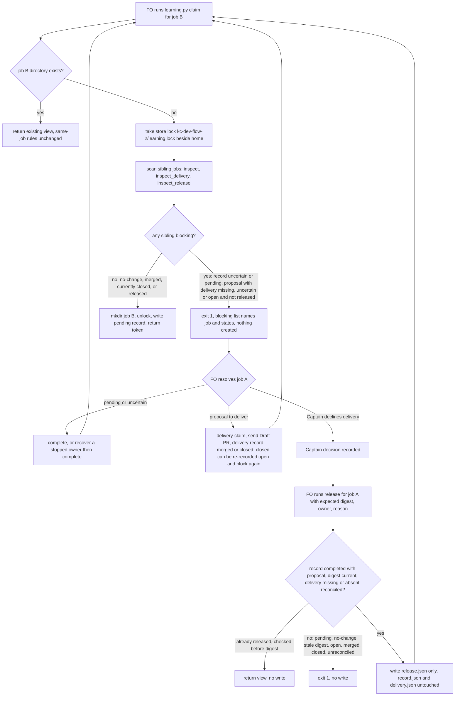

---
id:
title: serialize learning evaluation while another learning job is in flight
status: implementation
variant: kc-dev-flow-2
profile: pilot
merge: pr
worktree: .worktrees/spacedock-ensign-learning-serialize-evaluation
pr:
gates:
    version: 1
    records:
        - id: gate:learning-serialize-evaluation:backlog
          stage: backlog
          attempts:
            - id: gate-attempt:learning-serialize-evaluation-backlog-1
              briefing:
                id: briefing:learning-serialize-evaluation:backlog:attempt-1:revision-1
                digest: sha256:aaa127818701563086ee037152e348e01ea2fd87b8527128c67be950df131025
                room-ref: ./learning-serialize-evaluation/review/backlog/briefing-1
              resolution:
                type: Resolution
                id: resolution:spacedock:learning-serialize-evaluation:backlog:1
                briefing: briefing:learning-serialize-evaluation:backlog:attempt-1:revision-1
                by: person:captain
                at: "2026-09-17T03:23:25.509686Z"
                decision: approve
                reason: Captain approved profile pilot and the admission record's outcome, scope, non-goals and stop condition.
              application:
                target-stage: ideation
                state: consumed
        - id: gate:learning-serialize-evaluation:ideation
          stage: ideation
          attempts:
            - id: gate-attempt:learning-serialize-evaluation-ideation-1
              briefing:
                id: briefing:learning-serialize-evaluation:ideation:attempt-1:revision-1
                digest: sha256:fe077286c1fdf80c18ef3ae3fa25218b5b68e93a9ffd3292ceb2de1e76aeaf6c
                room-ref: ./learning-serialize-evaluation/review/ideation/briefing-1
              resolution:
                type: Resolution
                id: resolution:spacedock:learning-serialize-evaluation:ideation:1
                briefing: briefing:learning-serialize-evaluation:ideation:attempt-1:revision-1
                by: person:captain
                at: "2026-09-17T03:50:39.896371Z"
                decision: approve
                reason: Captain approved the design at 7ea6a081 with AC-4 amended and D1, D2, D3 as recommended.
              application:
                target-stage: implementation
                state: consumed
started: 2026-09-17T03:23:59Z
---

Two closed tasks were evaluated for learning while neither learning PR had merged.
Both evaluations pinned the same root `learning.md` basis. The first PR (#469)
landed and moved that basis; the second proposal (#470) was then an add/add conflict
judged against a file that no longer existed. `kc-dev-flow-2/skills/learn/SKILL.md`
already says "Drift, conflicting concurrent proposals or an already-applied change
requires review", but `kc-dev-flow-2/scripts/learning.py` offers that review no
operation: `claim` refuses changed evidence ("existing task evidence differs; no
automatic re-evaluation") and `recover` refuses completed jobs ("completed results
are immutable"). The re-evaluation ran outside the recorder and its delivery record
still names candidate `638b82a2` while the merged head was `112f66ed`.

Source: Captain ruling 2026-09-17 in the FO session — option 1, serialize learning
evaluation, chosen over adding a re-evaluation operation.

## Scope

In scope: `kc-dev-flow-2/scripts/learning.py`, `kc-dev-flow-2/scripts/test_learning.py`,
and the learn skill / README wording that describes when a claim holds.

`claim` for a new job holds while another job in the same local learning store is
still in flight: its evaluation is pending, or it completed with a proposal whose
delivery is not settled. A job the Captain declines to deliver needs an explicit,
recorded release so it cannot block later jobs indefinitely.

Non-goals: no re-evaluation or supersede operation; no change to `job_key`, to
completed-record immutability, or to delivery identity rules; no coordination across
clones or machines (the README already lists cross-clone deduplication as future
work); no handling of `learning.md` drift that does not come from another learning
job.

Stop condition: if the hold cannot be expressed without changing completed-record
immutability or delivery identity rules, stop and return the design to the Captain.

## Acceptance criteria

**AC-1**: A new job's `claim` is refused, with no directory or record created for it,
while another job is in flight; the refusal names the blocking job and its state.
Verified by: `python3 kc-dev-flow-2/scripts/test_learning.py` cases for each in-flight
state (pending; completed with proposal and delivery missing, uncertain or open),
each shown to fail when the hold is removed.

**AC-2**: A job stops blocking once its evaluation completed with no proposal, its
delivery is merged or closed, or it carries the explicit release record.
Verified by: `test_learning.py` cases for each releasing state, each followed by a
successful claim of another job.

**AC-3**: The release is explicit and recorded: it requires a reason, refuses a job
whose delivery is open or merged, and cannot be undone through the CLI.
Verified by: `test_learning.py` cases for each refusal.

**AC-4**: Re-claiming the same job with identical evidence still returns its existing
view, and every existing `test_learning.py` case still passes.
Verified by: the full `test_learning.py` run on the candidate revision.

Amended 2026-09-17 on the Captain's ruling: an existing test whose setup depends on
claiming a second job while an earlier one is unsettled may have that setup changed
so each earlier job is settled or isolated first; its assertions stay unchanged.
Validation compares each such test's assertions against `32cd8890`.

## Design (ideation, pilot)

Design read at code revision `32cd8890` (`origin/main`, checked out detached in the
dev2-adoption worktree). The Captain's option 1 ruling is settled: serialize,
add no re-evaluation or supersede operation.

### Existing-code capability check

- Journey: `learn` skill -> `learning.py claim` for job B while job A is unsettled.
- Completeness: no hold exists. `operate` (claim branch) creates `home/<job_key>`
  and a pending record after looking only at its own directory; `locked` is a
  per-job flock, so nothing spans jobs.
- Observation (2026-09-17, disposable repo under `/tmp`, CLI at `32cd8890`):
  claim job t1, `complete` it with an `add` decision, then claim job t2 ->
  exit 0, `claimed: true`, while t1 has a proposal and delivery `missing`.
  This is the #469/#470 shape reproduced locally.
- Need: the conflict already happened once (#470 judged against a moved
  `learning.md` basis). Nothing to reuse: `recover` refuses completed results and
  `delivery-recover` binds one job's own PR; neither looks across jobs.
- Live store (read-only `notices --all`, 2026-09-17): both jobs `a22107a3…`
  (#470) and `efee0619…` (#469) are completed with proposal and delivery `merged`,
  so under the hold below neither blocks a new claim; adoption strands nothing.

### PRFAQ

**Press release.** When a learning job's proposal is still unsettled, `learning.py
claim` for any other job in the same clone's learning store now refuses, names the
blocking job and why, and creates nothing. The FO then finishes that job — completes
its evaluation, delivers and records the PR as merged or closed (a closed PR recorded
open again blocks again) — or, when the Captain
declines to deliver a proposal that was never sent, records an explicit `release`
with a reason. The next job therefore always evaluates against a `learning.md` basis
that no other local proposal is about to move.

**FAQ**

- *Why not re-evaluate the second job?* Settled by the Captain (option 1). Completed
  results stay immutable; the hold prevents the second evaluation instead.
- *Does the same job re-claim still work?* Yes. A claim whose job directory already
  exists never runs the hold and returns the existing view as today.
- *Why a new `release.json` rather than a field?* `record.json` of a completed job is
  immutable (`recover` refuses completed), and `observation` requires a PR identity for
  `closed`, so a never-sent proposal cannot be recorded as a closed delivery. A separate
  sidecar leaves both files and all their rules unchanged.
- *Can a release be undone?* Not through the CLI: no command removes or rewrites
  `release.json`; a repeated `release` returns the current view and writes nothing.
- *Other clones or machines?* Not covered; README keeps cross-clone deduplication as
  future work. Linked worktrees share the Git common dir, so they are covered.

### Hold predicate (exact recorder states)

Evaluated for every sibling directory `home/<64-hex>` other than the claimed job's own
key, using the existing readers `inspect` (record), `inspect_delivery` (delivery,
bound to the record digest) and a new `inspect_release` (sidecar, same strict style).

| Sibling record (`inspect`) | Delivery (`inspect_delivery`) | Release | Blocks? |
| --- | --- | --- | --- |
| directory exists, record missing/torn/invalid (`uncertain`) | any | any | **blocks** (decision D1) |
| `pending` | any | any | **blocks** |
| `completed`, `proposal` null | any | any | releases |
| `completed` with proposal | `merged` | any | releases (sticky: regression refused) |
| `completed` with proposal | `closed` | any | releases while closed (not sticky, see below) |
| `completed` with proposal | `missing` (no `delivery.json`) | none/invalid | **blocks** |
| `completed` with proposal | `missing` | valid | releases |
| `completed` with proposal | `uncertain`, observation `absent` | valid | releases (decision D2) |
| `completed` with proposal | `uncertain`, observation null/`unknown`, or torn | any | **blocks** |
| `completed` with proposal | `open` | any | **blocks** (a provider fact outranks a release) |

Correctness without locking siblings. Three releasing states cannot be undone: a
completed no-change record (`recover` refuses completed), delivery `merged` (the only
state `delivery-record`/`delivery-recover` guard against regression) and a release (no
command removes it). **`closed` is not sticky:** `delivery-record` only refuses leaving
`merged`, so it can move a delivery from `closed` back to `open` with the same PR
(the engineering reviewer reproduced this with exit 0 in a `/tmp` repo). That path is
pre-existing and this design leaves it unchanged. Under the hold it fails closed: a
scan that saw `closed` let one new claim through, and the next scan after the PR is
recorded `open` blocks again. The residual — a claim admitted in the window before a
re-open is recorded — is the same as a PR re-opened on GitHub and not yet observed,
which no local lock can see. A sibling seen mid-transition (`pending`, or a directory
created but not yet written) reads as blocking. `atomic_write` means no half-written
file is read as valid.

Where it runs: in `operate`'s claim branch, only when the job directory does not
already exist, and after the pack, eligibility and `--owner` checks (so invalid or
ineligible input still creates nothing). New order: `home.mkdir` -> take a store lock
at `<git-common-dir>/kc-dev-flow-2/learning.lock`, a sibling of `home`, not inside it
(blocking `flock`, held only for scan + `directory.mkdir()`) -> re-check existence ->
scan siblings -> refuse or `mkdir` -> release store lock -> existing per-job `locked`
+ pending write. Outside `home` the lock file does not change listings of `home`
(`test_linked_worktree_multiprocess_claim_race` counts `home.iterdir()`; with the lock
inside `home` that assertion failed `2 != 1` in the prototype below), and `notices`
already filters `home` to 64-hex directories either way. The store lock closes the race
where two *different* new jobs scan at the same time. Per-job operations never take the
store lock, so there is no lock-order inversion.

**Dependency on D1.** The lock may stop before the pending record write only because a
directory without a readable record counts as `uncertain` and blocks (D1 = block). If
the Captain rules D1 the other way, a racing claim could see job B's directory before
its record exists and pass; the store lock must then also cover the pending record
write.

Refusal: exit 1, existing error shape plus a structured field:
`{"state": "error", "error": "learning job in flight; …", "blocking": [{"job": JOB, "record": STATE, "delivery": STATE, "released": BOOL}]}`
listing every blocking sibling. No job directory or record is created.

### Explicit release

`learning.py --repo R release --job JOB --expected NOTICE_DIGEST --owner SESSION --reason REASON`

Check order, under the job's `locked`:
1. refuse: job id invalid or directory missing; `--reason` or `--owner` blank;
2. refuse: record is not `completed` with a proposal (pending, uncertain and no-change
   are refused — no-change never blocks);
3. **already released:** a valid `release.json` exists -> return the current notice view
   and write nothing. This runs **before** the staleness check, because the release
   itself changes `notice_digest`, so a retry carrying the pre-release digest must see
   the existing release rather than a stale-digest error;
4. refuse: `--expected` differs from the current `notice_digest`;
5. refuse: delivery is `open`, `merged` or `closed`; delivery is torn or `uncertain`
   without an `absent` observation (reconcile via `delivery-recover` first).

Writes only `release.json` via `atomic_write`:
`{"schema_version": 1, "owner", "reason", "result_digest", "delivery_digest", "authority": "caller attestation"}`,
binding the record and delivery bytes it saw. It never touches `record.json`,
`delivery.json`, `job_key`, the plan/observation validators, PR non-replacement or the
merged non-regression rules. The CLI cannot verify that the Captain declined; the learn
skill states the release is run only after the Captain's recorded decision.

A released job gains no send authority: `delivery-claim` refuses a released job, and
`delivery-recover` refuses an `absent` observation on a released job (an `open`,
`merged` or `closed` observation is still recorded, because it is a provider fact; an
`open` one makes the job block again).

**Stop-condition check:** the hold and release need no change to completed-record
immutability, `job_key` or delivery identity rules. The two new delivery refusals on
a released job restrict send authority only; they change no binding. Stop condition
not triggered.

### Interaction with existing behaviour

- **Same-job re-claim:** directory exists -> hold skipped -> existing view (identical
  evidence) or the existing "evidence differs" refusal. Unchanged.
- **`recover`:** requires the directory to exist, so it is never held and cannot bypass
  the hold for a new job; it remains the route that turns a sibling's `uncertain` or
  stale `pending` record back into a completable claim (which then releases on
  no-change or proceeds to delivery).
- **`complete`, `delivery-claim`, `delivery-record`:** unchanged except the released-job
  refusal on `delivery-claim` above.
- **`delivery-recover`:** unchanged except refusing `absent` on a released job.
- **`notices` / `ack`:** `notice` adds a `release` field when present, and
  `notice_digest` becomes `sha256(encoded([record, delivery, release]))` only when a
  release exists; without one it stays `sha256(encoded([record, delivery]))`, so already
  acknowledged jobs are not re-notified. A release therefore marks the job unread and a
  pre-release `ack` digest is rejected as stale.
- **Docs:** learn SKILL.md "Existing claims/results are read, not automatically
  retried" gains the hold and its three exits; README "duplicate triggers observe it
  rather than launch another job" gains store serialization and `release`. README's
  cross-clone future-work sentence is unchanged.

### Sequence

### Acceptance evidence

All in `python3 kc-dev-flow-2/scripts/test_learning.py`; each test is paired with the
mutation that must make it fail.

- **AC-1** `test_new_claim_held_by_in_flight_sibling` — subtests: sibling `pending`;
  sibling record torn (if D1 holds); proposal + delivery missing; proposal + delivery
  `uncertain` (claimed, no observation); proposal + delivery `open`; released job whose
  delivery is then recorded `open`. Each asserts exit 1, `blocking` names the sibling
  job and its record/delivery state, and job B's directory does not exist.
  Mutations: remove the hold call from `operate` (all fail); drop each blocking row
  from the predicate (its subtest fails); let a release outrank `open` (last fails).
- **AC-1 race** `test_distinct_jobs_cannot_both_claim` — two processes claim different
  jobs while a harness (the `os.replace`-patch style of
  `test_process_crash_during_publication_preserves_uncertainty_or_prior_record`) sleeps
  between scan and `mkdir`; asserts exactly one job directory. Mutation: remove the
  store lock (deterministically two directories, because of the injected sleep).
- **AC-2** `test_settled_sibling_releases_hold` — subtests: no-change completion;
  delivery `merged`; delivery `closed`; release with delivery missing; release after
  `delivery-recover` to `absent` (if D2 holds). Each is followed by a successful claim
  of another job (`claimed: true`). Mutations: treat every existing sibling as
  blocking; remove `merged`/`closed` from the settled set; ignore `release.json`.
- **AC-3** `test_release_refusals_and_irreversibility` — refuses blank reason, pending
  record, no-change record, stale `--expected`, delivery `open`, `merged`, `closed`,
  delivery uncertain without absent observation; a second `release` carrying the
  **pre-release** `--expected` digest returns the view and writes nothing
  (`release.json` bytes equal, exit 0 — proves the already-released check precedes the
  staleness check); `record.json` and `delivery.json` bytes unchanged by
  release; `delivery-claim` and `absent` `delivery-recover` refused on a released job;
  `release` then `notices` shows it unread and a pre-release `ack` digest is rejected.
  Mutations: delete each refusal check (its assertion fails); move the staleness check
  before the already-released check (the second release exits 1); write the release into
  `record.json` (byte check fails); omit release from `notice_digest` (stale-ack
  check fails).
- **AC-4** `test_same_job_reclaim_ignores_hold` — with a blocking sibling present,
  re-claiming job A's identical evidence returns its view without `token`. Mutation:
  run the hold before the existence check (refused). Plus the full existing suite on
  the candidate revision, and a no-release notice asserting
  `notice_digest == sha256(encoded([record_digest, delivery_digest]))`. Mutation:
  always fold a release digest in (fails).
- **AC-4 existing suite under the hold.** Prototype run 2026-09-17 in a `/tmp` copy of
  `learning.py`/`test_learning.py` at `32cd8890` (minimal hold: pending/uncertain block,
  proposal blocks unless delivery merged/closed; lock beside `home`), whole suite, 14
  tests: 12 pass unchanged, 2 fail. With the two fixture edits below, 14/14 pass. Lock
  inside `home` additionally failed `test_linked_worktree_multiprocess_claim_race`
  (`2 != 1`).
  - `test_three_outcomes_and_mixed_preserve_project_files` — iterations 2-4 were refused
    (iteration 1 left a completed proposal with no delivery, which blocks every later
    new claim). Minimal change: isolate each iteration by removing the disposable
    repo's `.git/kc-dev-flow-2` store after its assertions. All original assertions,
    including root `learning.md`/`AGENTS.md` bytes, are unchanged.
  - `test_torn_and_missing_record_are_uncertain_not_automatic_retries` — the second
    iteration's new claim was refused by the first iteration's recovered `pending` job.
    Minimal change: at the end of each iteration, `complete` the renewed claim with a
    no-change decision (settling it). The existing assertion that the old token is
    refused runs before that and is unchanged.
  - No other existing test creates two distinct jobs whose earlier one is unsettled:
    `test_no_change_and_mismatched_plan_cannot_claim_delivery` claims a second job after
    a no-change sibling, which releases.

**AC-4 amendment needed:** the FO is asking the Captain whether these fixture edits,
which keep each test's original assertions, satisfy AC-4's "every existing
`test_learning.py` case still passes".

Not yet verified: all of the above are future implementation checks.

### Unresolved decisions for the Captain

- **D1 — a sibling whose record is `uncertain` (directory exists, record torn or
  missing).** Scope names only pending and unsettled deliveries. Recommendation: block,
  because a claim that crashed mid-write looks exactly like this and the store lock
  relies on it; the exit is the existing `recover` then `complete`. What gets worse: a
  crash leaves every other job held until someone recovers it.
- **D2 — release when delivery was claimed but reconciled to a confirmed absent PR.**
  AC-3 names only open/merged refusals. Recommendation: allow release only for delivery
  missing or `uncertain` with an `absent` observation; refuse unreconciled `uncertain`
  (a PR may exist) and `closed` (already releases). What gets worse: a job with a torn
  delivery must go through `delivery-recover` before it can be released.
- **D3 — send authority after release.** Recommendation: `delivery-claim` refuses a
  released job and `delivery-recover` refuses `absent` on it, so a released proposal
  cannot quietly become a PR. What gets worse: a released proposal can never be
  delivered through the recorder, since the same task maps to the same `job_key`.

### Profile reminder

Pilot: one local-store hold plus one recorded release, tested on real files and
processes; no cross-clone lock, no re-evaluation, no new obligation that changes the
profile.

## Stage Report: ideation

- DONE: The hold is defined over exact recorder states: which record and delivery states block a new claim, which release it, and where each is read in learning.py
  Hold predicate table over `inspect` / `inspect_delivery` / new `inspect_release`, run in `operate` claim branch under `home/.store.lock` before `mkdir`.
- DONE: The explicit release is specified: its CLI shape, what it writes, its refusals, and why it leaves completed evaluation records and delivery identity rules unchanged
  `release --job --expected --owner --reason`; writes only `release.json`; refusal list; sidecar rationale in Explicit release.
- DONE: The Captain's option 1 ruling (serialize, no re-evaluation operation) is treated as settled, not re-argued
  Stated as settled at the top of Design and in the FAQ.
- DONE: PRFAQ and Mermaid present with matching actors, states, refusals and release
  PRFAQ and flowchart share FO, Captain, claim/scan/refuse, resolve routes and release refusals; Mermaid rendered with @mermaid-js/mermaid-cli (exit 0).
- DONE: Acceptance evidence named per AC, each test paired with the mutation that must make it fail
  AC-1 (plus race), AC-2, AC-3, AC-4 each name a test and mutations; none run yet (future implementation checks).
- DONE: Interaction with existing behaviours named: same-job re-claim, recover, delivery-recover, notices and ack
  Interaction section covers each, incl. notice_digest compatibility for acknowledged jobs.
- DONE: The stop condition is checked: if the hold needs changes to completed-record immutability or delivery identity, say so and stop
  Not triggered: record.json, job_key and delivery bindings untouched; new refusals restrict send authority only.
- DONE: Unresolved decisions identified for the Captain rather than decided by the worker
  D1 uncertain sibling record, D2 release after absent reconciliation, D3 send authority after release, each with recommendation and cost.

### Summary

Designed a local-store hold in `claim` (sibling scan under a store lock, before any directory is created) and an explicit, non-reversible `release` sidecar for proposals the Captain declines to deliver, with no change to completed records or delivery identity. A disposable-repo run at `32cd8890` reproduced the gap (second job claimed while the first had an undelivered proposal); both live jobs are merged, so adoption strands nothing. Three decisions (D1-D3) are left for the Captain.

### Correction round 1

- DONE: AC-4 conflict with existing tests — whole suite checked by prototype in `/tmp`: exactly two tests break; fixture changes named per test; "AC-4 amendment needed" line added. Landed in Acceptance evidence, "AC-4 existing suite under the hold".
- DONE: Store lock moved out of `home` to `kc-dev-flow-2/learning.lock`; prototype showed lock-in-home fails the race test's `iterdir` count. Landed in Hold predicate, "Where it runs", and Sequence.
- DONE: Monotonicity corrected — only `merged` is regression-guarded; `closed` not sticky, pre-existing, fails closed on the next scan. Landed in the table (split `merged`/`closed` rows), the correctness paragraph, PRFAQ and Sequence.
- DONE: Lock not covering the record write now stated as dependent on D1 = block, with the alternative. Landed in "Dependency on D1".
- DONE: `release` check order pinned (already-released before staleness) and added to the AC-3 test and its mutation. Landed in Explicit release and AC-3.
- DONE: Header corrected: `32cd8890` is `origin/main`.
- D1-D3 left open; Scope, AC, profile and option 1 unchanged. Mermaid re-rendered with @mermaid-js/mermaid-cli (exit 0).
