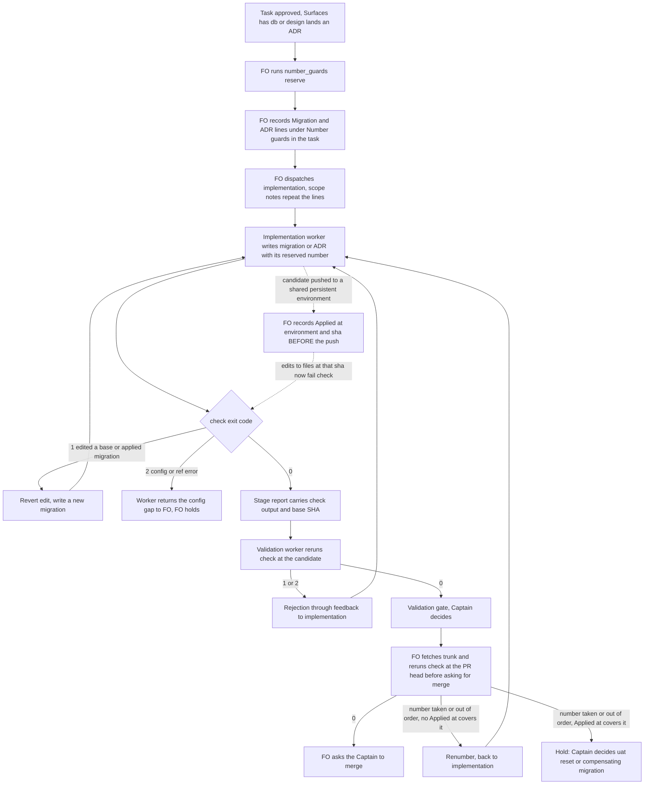

Two adopter defects from qnow dogfooding (2026-09-29) that dev2 never checked: an unmerged migration edited in place after it reached a persistent database, and parallel tasks choosing the same migration and ADR numbers.

## Scope

Captain 2026-09-30, approving the FO's batching of the dev2 fixes: 「可以」 — batch A (guardrails) first. This task covers issues #524 and #523.
Evidence (qnow, 2026-09-21..29): qnow migration 0005 was edited by PR #1207 after production applied it (PR #1204), and every production deploy failed with "migration has been modified after being applied" for about a week unnoticed; the uat branch database stuck the same way when an unmerged 0012 was edited after a uat deploy; two unmerged tasks both created migration 0012; ADR numbers 0021–0028 were reassigned several times. Netlify's documentation: never edit an applied migration; revert and add a new one; the production branch cannot be reset, non-production branches can.
Non-goals (ideation, 2026-09-30): a documented reset procedure for the uat database (open question 1 in Design); issue #529 (an ideation worktree for ADR drafts); checking `meta/` snapshot or journal files; linting migration SQL content; timestamp-numbered adopters (carlove); detecting a deploy nobody recorded; a script that writes task files; automatic renumbering; edits to any adopter repository.

Captain 2026-09-30, approving the design: 「准」 — the exit for a migration already applied at a non-production shared environment (qnow's uat) that must be renumbered is to reset that database branch through Netlify's database-branch reset API (non-production branches re-fork from production; the production branch cannot be reset), not a compensating migration; document the step, do not build a wrapper.

## Acceptance criteria

**AC-1**: A candidate that modifies or deletes a migration file present at its merge-base with the base branch is refused, including a comment-only edit; adding a new migration and the journal entry is accepted.
Verified by: `scripts/test_number_guards.py` builds a fixture repository shaped like qnow PR #1207 (base has 0005 and the journal; candidate deletes three `--` lines of 0005, adds 0006, appends a journal entry) and asserts exit 1 naming 0005; the same fixture with 0005 untouched asserts exit 0. Falsifier: change R1 to inspect only added files, and the first assertion flips. Real-history run at validation: `check` on qnow `8f624f6a6^..8f624f6a6` exits 1, on `7c8e288ac^..7c8e288ac` exits 0 (the ideation prototype already produced both). Limit: the qnow run needs a local qnow clone and is not in CI.

**AC-2**: A migration recorded as `Applied at: <environment> <sha>` is frozen for the task: editing it, or renumbering it, is refused even though it is not on the base branch.
Verified by: test fixture with an unmerged 0012 present at sha S and the task line recorded: editing 0012 exits 1 naming S; renumbering 0012 to 0014 exits 1; the same edit with no record exits 0 (so the record is what triggers it); a recorded sha absent from the clone exits 2. Limit: an unrecorded deploy is not detected.

**AC-3**: `reserve` gives each task a migration and an ADR number no other live task and no base file holds, never filling a gap.
Verified by: test with base migrations up to 0012 and two task files in a state directory: task a gets `Migration: 0013`; after that line is written, task b gets 0014; asking again for a returns 0013. ADR base with 0001 and 0003 present gives next 0004. Falsifier: make `reserve` read only the base tip, and b gets 0013.

**AC-4**: `check` re-verifies numbers against the current base tip before merge: an added migration number not above the base maximum, an added migration or ADR number not in the task's reserved lines, and an added ADR number that exists on the base tip are each refused.
Verified by: test where the base gains 0013 after the candidate reserved and added 0013: exit 1 naming the colliding base file; the candidate renumbered to 0014 exits 0; an added ADR 0002 while the base has 0002 exits 1; an unreserved number exits 1. Limit: the FO's `git fetch` before the run is an instruction, not something the script does; the script prints the base SHA so the report shows how fresh it was.

**AC-5**: The rules reach both workers and the dispatch: `references/sd/workflow.md` has a `## Number guards` section listed in `context-sections` of implementation and validation, and the stage principles carry the run-and-report obligation and the comment-trim exemption for frozen migrations.
Verified by: `spacedock dispatch show-stage-def --workflow-dir <scratch workflow copy> --stage implementation` and `--stage validation` each print the section; `spacedock dispatch build ... --scope-notes-file <file with the Migration/ADR lines>` writes a dispatch file containing those lines (the ideation probe showed this on a scratch workflow); `test_sd_dispatch.py --sd-plugin-root <active Spacedock root>` and `lint-skills.py` still pass; the new test is a named step in `.github/workflows/kc-dev-flow-2-tests.yml`. Limit: whether an FO actually runs `reserve` at dispatch is an instruction, checked by validation reading the task's `## Number guards` lines.

**AC-6**: Misconfiguration fails loudly instead of skipping: `Surfaces: db` with no `migrations-path`, a declared path absent at the base or holding no `^\d+_.+\.sql$` file, and an unresolvable ref each exit 2 with a message naming the cause; with no `db` surface and no key the script prints `migration guard skipped: no migrations-path declared`.
Verified by: one test per case asserting exit code and the message substring.

## FO alignment

Needed at ideation: how a stage detects that a candidate changes a migration file that already exists on the base branch (an adopter-configured migrations path, checked in implementation and validation), what counts as "reached a shared environment" for an unmerged migration, and how the FO reserves the next migration and ADR number per task at dispatch and delivery re-checks it against the base branch.
Result: the FO delegates these questions to ideation, which decides each with its source and returns any ruling that needs the Captain.
Surfaces: none
Visible change: none

## Design

**Ruling.** Add one standard-library script, `kc-dev-flow-2/scripts/number_guards.py` (subcommands `reserve` and `check`), and one workflow section, `## Number guards`, so that (1) a candidate that changes or deletes a migration file already on the base branch, or already applied at a shared persistent environment, fails at implementation exit, at validation and again before the merge request, and (2) each task holds its own next migration number and ADR number from its implementation dispatch. No Captain ruling blocks this design; one policy question stays open (see Unresolved decisions).

### What this changes, in plain words

Today nothing compares a candidate's migration files with what the base branch already has, and nothing stops two tasks from picking the same next number. After this change a worker who edits an applied migration gets a failing command that names the file and says to write a new migration; and the First Officer (FO, the workflow orchestrator) hands each task a number nobody else holds.

### Root cause of the qnow 0005 case (read 2026-09-30, qnow commit 8f624f6a6, PR #1207)

The whole edit to `0005_slots_by_capacity.sql` was three deleted `--` comment lines, made while carrying "the merged capacity PR's comment trim" (its commit message). Netlify checksums the file bytes (Netlify Database troubleshooting page, "Migration modified after being applied": never edit an applied migration; revert and add a new one), so a comment trim breaks every deploy. Two consequences. The guard fires on any modified or deleted file, not on a "meaningful" change. And the implementation stage's comment-trim pressure (`comment_ratio.py`, "cut unmapped surfaces") is a cause, so a frozen migration is exempt from both by an explicit sentence in the stage principles.

### Chain check (what already exists)

| Layer | Found | Consequence |
| --- | --- | --- |
| Spacedock 0.27.2 | No migration, ADR or number-reservation concept (grep of the installed plugin for "migration number", "adr number", "next migration", "reserved number": no hit; `status --next-id` previews entity ids only). Transport exists: `dispatch build --scope-notes-file` put my test line verbatim into the dispatch file (scratch workflow probe, 2026-09-30); a workflow README accepts extra top-level frontmatter keys (`status --validate` printed `VALID` with `migrations-path` and `adr-path` added); `context-sections` inlines named sections into `dispatch show-stage-def` output. | Nothing to build in Spacedock; use these three. |
| kc-dev-flow-2 0.9.0 (main `b753d344`) | `adr_lint.py` reports duplicate ADR numbers inside one tree and `--require`. `design_surfaces.py` demands a `Migration source:` line for `Surfaces: db` but checks no bytes. No script or rule on migration immutability or number reservation. | `adr_lint.py` cannot see the base branch tip or reservations, so it stays as is; the new script covers what it cannot. |
| qnow (`origin/next`) | No guard. `apps/qnow-api/netlify/database/migrations/CLAUDE.md` only imports `src/db/AGENTS.md`, whose rules never mention immutability. `docs/dev2/README.md` is a copy of the workflow with local values (`trunk: next`, `concurrency: 3`). `docs/adr` has 0001-0027 with 0024 and 0026 absent. `\buat\b` has no hit on `origin/next`, so how a candidate reaches uat is not written in the repository. | Local values in the README are the existing pattern for adopter config. Gaps are normal in ADR numbers. |
| carlove | `docs/ship-flow/_mods/file-overlap-check.md` ("Hook: pre-dispatch (migration immutability check)") and `carlove-impl-order.md` ("Migration immutability rule"): prose for the old ship-flow FO, blocks dispatch when a migration in the plan already exists on `origin/main`, exception `migration_amendment: true` plus captain approval. Migrations are timestamp-named. | Different on purpose: diff-based instead of plan-based (an unplanned edit like 0005 passes a plan check), a script instead of FO prose, run at implementation exit, validation and pre-merge, and no amendment exception. |
| subspace-relay | No migrations or ADR directory (`git ls-files`). | Nothing to reuse. |

### PRFAQ

**Press release.** dev2 now refuses to deliver a change that edits an applied database migration, and gives every task its own migration and ADR number. A worker who edits `0005_...sql` after production applied it sees `FAIL` naming the file and the rule "the fix is a new migration". Two tasks in flight can no longer both write migration 0012.

**FAQ.**
- *What counts as "applied"?* Two things. A file present on the base branch (the trunk named in the workflow README), which production deploys from. And a file present in a commit the task records as `Applied at: <environment> <sha>`, written by the FO before any push of the candidate to a persistent shared environment such as qnow's uat branch database.
- *Why record instead of detect?* Git cannot see what a database applied; uat is force-pushed, so its history does not hold the old bytes. The record is the smallest fact that lets the same check treat that commit like the base. Bounded claim: an unrecorded deploy is not detected.
- *What is the fix when the check fails?* Revert the edit and add a new migration. A renumber of an unmerged file is allowed only when no `Applied at:` commit contains it.
- *How is a number reserved?* Before an implementation dispatch the FO runs `reserve`. It prints `Migration: NNNN` or `ADR: NNNN`, one greater than the highest number on the base tip and in every other live task file of the state checkout; it never fills a gap. The FO records the line under `## Number guards` in the task and repeats it as scope notes in the dispatch.
- *What if base moves after reservation?* `check` at the PR head, after `git fetch`, fails when an added migration number is not above the highest on the base tip, or an added ADR number exists there. Reservation makes the merge-order constraint visible; it does not remove it (Netlify refuses out-of-order migrations: "added out of order" in its troubleshooting page).
- *What does an adopter configure?* Two optional frontmatter keys in its workflow README beside `trunk:`: `migrations-path:` (qnow: `apps/qnow-api/netlify/database/migrations`) and `adr-path:` (default `docs/adr`).
- *Migration files are which files?* Basenames matching `^\d+_.+\.sql$`. `meta/_journal.json` changes on every new migration and snapshot JSON does not affect the checksum, so neither is checked (a limit, stated in the script's help).

### Flow

### Where each rule lives

| Rule | Home | Enforcement point |
| --- | --- | --- |
| Reserve numbers, record them, carry them in the dispatch, record `Applied at:` before a shared push, rerun `check` before asking for merge | `references/sd/workflow.md` new `## Number guards` section, named in `context-sections` of implementation and validation so both workers receive it; adopters receive it by refit | FO instruction; the script fails on the recorded facts, not on the FO's diligence |
| Run `check` at implementation exit and report its output and base SHA; frozen migrations are exempt from comment trimming and cut passes | `skills/implementation/principles.md`, one paragraph beside the `comment_ratio.py` sentence | Validation reruns `check`; exit 1 blocks recommendation |
| Rerun `check` at the candidate; a failure returns through feedback | `skills/validation/principles.md`, one sentence | Same exit code |
| Detection and reservation logic, exit codes, messages | `scripts/number_guards.py` and `scripts/test_number_guards.py` | Exit 1 findings, exit 2 usage or config error |
| `migrations-path:` and `adr-path:` values | Adopter workflow README frontmatter | `check` exits 2 when the task has `Surfaces: db`, the key is absent and the guard would be skipped; when the path is absent at the base or holds no file matching the migration pattern; or when a ref does not resolve. With no `db` surface and no key it prints `migration guard skipped: no migrations-path declared` |
| The ruling itself | ADR in this repository's `docs/adr` (see ADR) | Read by later work |

`check` findings, each on one line as `FAIL <rule>: <file>: <reason>`, then a final line naming the base and head SHAs compared: R1 a migration file present at the merge-base is modified or deleted (`git diff --name-status --no-renames`, so a rename is a delete plus an add); R2 the same test against every `Applied at:` sha (the task's lines, or `--applied-ref`), exit 2 when the sha is not in the clone; R3 an added migration number is not above the highest on the base tip, or a base file already has it; R4 an added migration number is not in the task's `Migration:` lines, or an added ADR number is not in its `ADR:` lines (skipped, and printed as skipped, when no task is given); R5 an added ADR number exists on the base tip.

### Failure modes

| Event | Result | Where it shows |
| --- | --- | --- |
| Worker edits or deletes an applied migration, even a comment | Exit 1, R1 names the file | Implementation exit, validation, pre-merge |
| Worker edits an unmerged migration after an `Applied at:` record | Exit 1, R2 names the sha | Same |
| Two tasks reserve in sequence | Different numbers | `reserve` output |
| Another PR takes the reserved number first | Exit 1, R3 or R5 | Pre-merge recheck |
| Worker writes an unreserved number | Exit 1, R4 | Implementation exit |
| Reserved number is out of order and already applied at uat | Hold to the Captain | Pre-merge recheck plus FO rule |
| Deploy to uat that nobody recorded | Not detected | Known limit; reopen if it bites |
| Migration outside `migrations-path`, or an adopter with a non-`NNN_name.sql` migration format | Exit 2 when the path holds no matching file; otherwise not detected | Known limit |
| Worker skips `check` | Validation reruns it; a skipped validation rerun is a validation defect | Validation report |

"An applied migration is never edited" holds only as far as this table: the enforcement point is `number_guards.py check` exit 1 at the three call sites above.

### Evidence plan

Prototype at ideation (`/tmp/guards_proto.py`, 12 lines, run read-only on the qnow clone): `8f624f6a6^..8f624f6a6` prints `FAIL M .../0005_slots_by_capacity.sql`, exit 1; `4eebf5407^..4eebf5407` (adds 0005) and `7c8e288ac^..7c8e288ac` (adds 0012) exit 0; the same #1207 diff also modifies `meta/_journal.json`, which the migration pattern correctly ignores. This proves the detection idea on the real case, not the shipped script.

### ADR

Needed: yes. The rules are a constraint later work must respect and were settled by this task's design, so `references/sd/workflow.md` § Decision records requires an ADR before the terminal approval, written by the implementation worker in `docs/adr/` of this repository. Its number is reserved by the FO at the implementation dispatch, not chosen here. The sibling task `dispatch-and-report-hygiene`, also in ideation in this workflow, may need an ADR in the same directory: that is issue #523 happening live, so the FO should decide who reserves first. The decider's words come from the Captain's ideation-gate reply.

### Unresolved decisions

1. **Captain, not blocking.** After a candidate has been applied at uat, a forced renumber (another task merged first) has no clean exit: the file was applied under its old name. Options: (a) a new compensating migration, nothing to build, the default this design ships; (b) a documented reset step for non-production branch databases (issue #524's second direction; the Netlify CLI shows none for remote branches per that issue). Recommendation (a); the pre-merge recheck already returns the case to the Captain loudly. Reopen if the case bites.
2. **FO.** ADR number order between this task and `dispatch-and-report-hygiene`.
3. **Note, no decision.** Reservation at implementation dispatch means an ADR drafted during ideation carries no number, consistent with issue #529's second direction; this design does not close #529.

### Captain acceptance script (after delivery; needs a checkout of the merged package, `PKG` its path)

1. `python3 $PKG/kc-dev-flow-2/scripts/number_guards.py check --repo ~/conductor/repos/qnow --migrations-path apps/qnow-api/netlify/database/migrations --base 8f624f6a6^ --head 8f624f6a6; echo exit=$?` expect a `FAIL` line naming `0005_slots_by_capacity.sql` and `exit=1`.
2. Same command with `--base 7c8e288ac^ --head 7c8e288ac`: expect `exit=0`.
3. `mkdir -p /tmp/ng-demo && : > /tmp/ng-demo/a.md && python3 $PKG/kc-dev-flow-2/scripts/number_guards.py reserve --kind migration --repo ~/conductor/repos/qnow --migrations-path apps/qnow-api/netlify/database/migrations --base 7c8e288ac --state-dir /tmp/ng-demo --task /tmp/ng-demo/a.md` expect `Migration: 0013`.
4. `printf '## Number guards\nMigration: 0013\n' > /tmp/ng-demo/a.md; : > /tmp/ng-demo/b.md`, then step 3 with `--task /tmp/ng-demo/b.md`: expect `Migration: 0014`.
5. Step 1 with `--base no-such-ref`: expect a message naming the ref and `exit=2`.

Does not cover: a real Netlify deploy, the uat database, an actual FO dispatch, timestamp-numbered adopters, snapshot JSON, an unrecorded deploy. Exact `FAIL` wording is fixed at implementation; validation rewrites this script against the shipped text.

### Cost

One stdlib test file adds one step to `.github/workflows/kc-dev-flow-2-tests.yml` (the file lists each test by name; a test not listed there runs nowhere). CI minutes per PR: not measured.

## Number guards

ADR: 0002

## Stage Report: ideation

- DONE: Design, in the task file, the kc-dev-flow-2 package change for issues #524 and #523 — (1) an applied migration is never edited: detection at implementation and validation, the unmerged-but-applied case, the fix always a new migration
  `## Design` rules R1-R2 (`number_guards.py check`, merge-base diff of `^\d+_.+\.sql$` files; `Applied at: <env> <sha>` freezes an unmerged file); prototype run on real qnow history: `8f624f6a6^..8f624f6a6` exit 1 naming 0005, `4eebf5407` and `7c8e288ac` exit 0.
- DONE: (2) Number reservation: FO reserves migration and ADR number per task at dispatch, records it in the task, delivery re-checks against the base; where each rule lives, adopter config, how it fails loudly
  `## Design` "Where each rule lives" and "Failure modes" tables; `reserve` reads base tip plus sibling task files; R3-R5 recheck at the PR head; `migrations-path:`/`adr-path:` frontmatter keys (Spacedock `status --validate` printed VALID with them); exit 1 findings, exit 2 config errors.
- DONE: Check the chain first: spacedock, kc-dev-flow-2 and its adopters (qnow, subspace-relay, carlove) for an existing mechanism; report what you found
  Chain-check table: Spacedock has none (transport exists: `--scope-notes-file` probe, `context-sections`); `adr_lint.py` sees duplicates in one tree only; qnow none; carlove has a prose plan-based FO mod in old ship-flow; subspace-relay none.
- DONE: ACs with evidence plans (a script with tests that fail on the qnow 0005 case and pass on a new-migration fix; a dispatch that carries a reserved number)
  AC-1..AC-6 each carry a `Verified by:` clause; not yet verified at ideation except the prototype on real qnow history and the scope-notes dispatch probe.
- DONE: AC-1 edit of a base migration refused, journal change accepted
  Not yet verified for the shipped script; prototype output on qnow #1207 recorded in Design "Evidence plan".
- DONE: AC-2 `Applied at:` freeze
  Not yet verified; fixture cases defined (edit, renumber, no record, missing sha).
- DONE: AC-3 `reserve` without collisions, no gap filling
  Not yet verified; two-task state-directory fixture defined.
- DONE: AC-4 pre-merge recheck against base tip
  Not yet verified; fixture where the base gains 0013 after reservation.
- DONE: AC-5 rules reach workers and the dispatch
  Scope-notes transport verified on a scratch workflow; `show-stage-def` inlining of `context-sections` observed for existing sections; the new section is not yet written.
- DONE: AC-6 misconfiguration exits 2 loudly
  Not yet verified; one test per case defined.
- DONE: Whether an ADR is needed in this repo's docs/adr
  Yes (workflow.md § Decision records); number reserved by FO at implementation dispatch; sibling task `dispatch-and-report-hygiene` may contend for the same next number.
- DONE: The Captain-run minimal acceptance script
  Five commands against `~/conductor/repos/qnow` with expected exit codes, plus stated non-coverage, in Design.
- DONE: `design_surfaces.py check` passes and the Mermaid flow renders
  Output: `migration-and-number-guards.md: design surfaces presentable`; the flow was rendered with mermaid-cli and compared to the prose (rendering proves syntax only).

### Summary

The design is one stdlib script (`reserve`, `check`) plus a `## Number guards` workflow section, with two optional adopter frontmatter keys. Findings that shaped it: the qnow 0005 break was a three-line comment trim, so the guard fires on any modification and the comment-trim pass exempts frozen migrations; uat state cannot be read from git, so the FO records `Applied at:` before a shared push. One non-blocking Captain question remains (uat reset versus compensating migration); the FO should also settle the ADR-number order with `dispatch-and-report-hygiene`. Followed the dispatch's explicit signal target `main` (the completion block said `team-lead`).

## Stage Report: implementation

- DONE: Implement the approved design: `number_guards.py` (`check`, `reserve`), its test wired into `kc-dev-flow-2-tests.yml`, `## Number guards` in `references/sd/workflow.md`, the implementation and validation principles paragraphs with the frozen-migration exemption, the two optional adopter keys, ADR 0002
  Candidate `aff49ab3c6c66140f896f7feb4ec7e9743896deb` on `spacedock-ensign/migration-and-number-guards`, base `b753d344` (commits a8883a5c, aff49ab3); the section is in `context-sections` of both stages; `migrations-path:`/`adr-path:` are documented in the section and read from the workflow README, not added to the template frontmatter; `adr_lint.py docs/adr --require 2` passes.
- DONE: AC-1 a candidate that edits or deletes a base migration is refused, a new migration with its journal entry is accepted
  `test_a_comment_trim_of_a_base_migration_is_refused_and_...` (qnow #1207 shape) and `test_deleting_a_base_migration_is_refused`; mutation "touched files ignored" fails 5 tests; real qnow `8f624f6a6^..8f624f6a6` prints `FAIL R1: .../0005_slots_by_capacity.sql: M since the merge-base; ...` exit 1, `7c8e288ac` exit 0.
- DONE: AC-2 `Applied at:` freezes an unmerged migration
  `AppliedFreezeTests` (edit exits 1 naming the sha, renumber 0006 to 0008 exits 1, no record exits 0, absent sha exits 2 "cannot resolve applied commit (uat)"); removing R2 fails 2 tests.
- DONE: AC-3 `reserve` never collides and never fills a gap
  `ReserveTests`: a gets 0013, b 0014, a again 0013, ADR base 0001+0003 gives 0004; "ignore sibling task files" and "fill the gap" mutations each fail it.
- DONE: AC-4 pre-merge recheck against the base tip
  `RecheckTests`: base gains 0013 exits 1 naming `0013_other.sql`, renumber to 0014 exits 0; out-of-order 0006 under base max 0007, unreserved number (R4) and ADR 0002 already on base (R5) each exit 1; R3, R4, R5 each removed fails its test.
- DONE: AC-5 the rules reach both workers and the dispatch
  `spacedock dispatch show-stage-def` on a scratch copy prints `## Number guards` for implementation and validation; `dispatch build --scope-notes-file` wrote `Migration: 0013` into the dispatch file; `test_sd_dispatch.py` PASS (spacedock 0.27.2), `lint-skills.py` and `test_lint_skills.py` PASS; `test_poc_readme.py` PASS.
- DONE: AC-6 misconfiguration exits 2 loudly
  `MisconfigurationTests`: `Surfaces: db` without a path, path absent at base, directory with no `.sql`, `no-such-ref` (real qnow run: `cannot resolve base 'no-such-ref'` exit 2) each exit 2 with the cause; no key prints `migration guard skipped: no migrations-path declared`, removing the print fails a test.
- DONE: Follow CLAUDE.md: Conventional Commits `feat(kc-dev-flow-2): ...`, no version edits, files staged explicitly, comments carry only facts the code cannot state
  `git status` clean after both commits; `comment_ratio.py b753d344 HEAD`: `code lines 402, comment lines 1, 0.2%` (the one line is the shebang); `doc_impact.py`: one document, `kc-dev-flow-2/README.md`: updated (test command list).
- DONE: The Captain-run minimal acceptance script
  The design's five steps were run against `~/conductor/repos/qnow` with the shipped script: FAIL R1 line and exit=1, exit=0, `Migration: 0013`, `Migration: 0014`, and exit=2 with `cannot resolve base 'no-such-ref'`; each `check` also prints `base <sha> head <sha> merge-base <sha>` and `PASS: no findings` when clean.

### Summary

The stdlib script, 16 tests (CI step added, README command list updated), workflow section, principles paragraphs and ADR 0002 are committed; the uat exit (Netlify database-branch reset) is documented in the section's Renumber bullet, no wrapper built. FO action before validation: `check --task` on this candidate exits 1 (R4) on `docs/adr/0002-...` until the task file carries a `## Number guards` section with `ADR: 0002`, verified by running it; I did not write that FO-owned section. Signalled `main` as the dispatch text says (the boilerplate block said `team-lead`).

## Stage Report: validation

- DONE: Independent verdict on candidate aff49ab3c6c66140f896f7feb4ec7e9743896deb (base b753d344) against the approved design and AC-1..AC-6
  Verdict PASSED; every AC reproduced below from an `git archive` copy of the candidate in /tmp (worktree `git status --short` empty, HEAD still aff49ab3); one Polish finding (R4 ADR half untested) and three limits, none blocking.
- DONE: Captain's uat ruling honoured: documented reset of the non-production database branch through Netlify's reset API, no wrapper
  `## Number guards` "Renumber." bullet in `references/sd/workflow.md` and ADR 0002 Decision carry it; no wrapper script exists in the diff (8 files). Limit: Netlify's public docs (Troubleshooting page, fetched 2026-09-30) say only "Reset is only available for non-production branches" and name no endpoint, so the documented step is a pointer, not a runnable command; unverified.
- DONE: Ran the new test file and the CI workflow's list of suites
  `lint-skills`, `test_lint_skills`, `test_design_surfaces`, `test_adr_doc_checks`, `test_poc_readme`, `test_comment_ratio`, `test_number_guards` (16 tests), `test_learning` (33) all exit 0; `test_sd_dispatch.py` PASS on spacedock 0.27.2 binary, but with the local 0.27.0 plugin root because no 0.27.2 root is on this machine (CI pins 0.27.2).
- DONE: Real qnow history, read-only (qnow-adopt-dev2 at ddc58ea90, `git status` clean before and after): `8f624f6a6^..8f624f6a6` fails R1 naming 0005, `7c8e288ac^..7c8e288ac` passes
  Output `FAIL R1: apps/qnow-api/netlify/database/migrations/0005_slots_by_capacity.sql: M since the merge-base; ...` exit=1; the other run `PASS: no findings` exit=0.
- DONE: An `Applied at:` line freezes an unmerged migration
  Throwaway repo /tmp/vg-repo: edit of unmerged 0003 with the record exits 1 (`FAIL R2 ... applied at uat`), same edit unrecorded exits 0, renumber 0003 to 0004 with the record exits 1 (R2 `D`), unresolvable sha exits 2.
- DONE: `reserve --kind migration` twice with two task files never collides and never fills a gap
  On qnow base 7c8e288ac: task a 0013; with a's line written, b 0014; a again 0013; sibling holding 0020 gives 0021 not 0014; ADR reserve gives 0028 (base max 0027).
- DONE: A missing or wrong base exits 2 loudly
  No `--base` and no workflow dir: `no base: pass --base, or --workflow-dir ...` exit 2; `no-such-ref` as base or head: `cannot resolve base|head 'no-such-ref'` exit 2; path `apps/nope`: `no migration file matching NNNN_name.sql ...` exit 2; `reserve` without a path exits 2.
- DONE: `check --task` on this task and on the candidate
  With the FO's `## Number guards` / `ADR: 0002`: `migration guard skipped: no migrations-path declared`, `PASS: no findings`, exit 0 (base b753d344c7c6, head aff49ab3c6c6); a copy of the task without the section: `FAIL R4 ... docs/adr/0002-...: number 0002 is not in the task's ADR: lines`, exit 1; `reserve --kind adr` on this task returns `ADR: 0002`.
- DONE: Remove each guard in a throwaway copy and show a test fails
  15 mutations run in /tmp/vg-mut (layout `scripts/` so the test finds the script): R1, R2, R3 (both halves), R4 migration, R5, sibling scan, gap fill, base-tip read, skip message, db-surface-without-path, empty-dir, unresolvable applied sha, task lines read outside the section each fail 1-3 tests; R4 ADR half (`number not in facts["adr"]`) removed fails none.
- DONE: ADR 0002 with adr_lint, the workflow.md section, both principles paragraphs
  `adr_lint.py docs/adr --require 2`: `2 ADR file(s) checked, 0 legacy` exit 0; ADR Decision quotes the Captain's 「准」 and the reset ruling; `show-stage-def` on a scratch workflow prints `## Number guards` for implementation and validation; `dispatch build --scope-notes-file` put `Migration: 0013` / `ADR: 0002` in the dispatch file; principles paragraphs read, consistent with the script (frozen migrations exempt from comment trims; validation reruns `check`).
- DONE: CI workflow lists the new test; `comment_ratio.py` and `doc_impact.py` reported; every added comment line read
  `kc-dev-flow-2-tests.yml` has step `test_number_guards.py`; `comment_ratio.py b753d344 aff49ab3`: `code lines 402, comment lines 1, 0.2%` (repo baseline 3.0%); `doc_impact.py`: one document, `kc-dev-flow-2/README.md`, updated (command list, one line); the tool does not count docstrings: the module docstring (R1-R5 legend, exit codes, limits; it is the `--help` text) and one function docstring are the only added comment text, test file has none; no narration or line-number citations found.
- DONE: Never wrote to the qnow checkout
  qnow `git status --short` empty before and after every run; all fixtures and copies are under /tmp.

### Finding for FO disposition

- **Polish (advisory):** the ADR half of R4 (an added ADR number not in the task's `ADR:` lines) has no test that fails when it is removed, although AC-4 says "an added migration or ADR number not in the task's reserved lines" is refused. Behaviour is correct: the real candidate with its `ADR: 0002` line passes, without it exits 1 (see `check --task` item). Not material: no observed harm, the behaviour holds; a one-test addition would close the gap if the Captain wants AC-4's ADR clause falsified.

### Summary

PASSED. The candidate reproduces every AC: real qnow history gives R1 on 0005 (exit 1) and a clean pass on the 0012 add; `Applied at:` freezing, non-colliding reserve, and loud exit-2 misconfiguration all reproduce; 14 of 15 guard mutations fail a test. Unverified or limited: the ADR-R4 mutation survives (Polish), the reset step names Netlify's API without an endpoint Netlify documents, `test_sd_dispatch` ran on a 0.27.0 plugin root instead of CI's pinned 0.27.2, no Netlify deploy or real FO dispatch was exercised, and an unrecorded uat deploy is not detected (design limit).

### Minimal acceptance script (Captain; `PKG` is a checkout of the merged package, `Q` is ~/conductor/repos/qnow-adopt-dev2, `MP=apps/qnow-api/netlify/database/migrations`)

1. `python3 $PKG/kc-dev-flow-2/scripts/number_guards.py check --repo $Q --migrations-path $MP --base 8f624f6a6^ --head 8f624f6a6; echo exit=$?` expect a `FAIL R1:` line naming `0005_slots_by_capacity.sql` and `exit=1`.
2. Same command with `--base 7c8e288ac^ --head 7c8e288ac`: expect `PASS: no findings` and `exit=0`.
3. `mkdir -p /tmp/ng-demo && : > /tmp/ng-demo/a.md && python3 $PKG/kc-dev-flow-2/scripts/number_guards.py reserve --kind migration --repo $Q --migrations-path $MP --base 7c8e288ac --state-dir /tmp/ng-demo --task /tmp/ng-demo/a.md` expect `Migration: 0013`.
4. `printf '## Number guards\nMigration: 0013\n' > /tmp/ng-demo/a.md; : > /tmp/ng-demo/b.md`, then step 3 with `--task /tmp/ng-demo/b.md`: expect `Migration: 0014`.
5. Step 1 with `--base no-such-ref`: expect `number_guards: cannot resolve base 'no-such-ref' ...` and `exit=2`.

Does not cover: a real Netlify deploy or the reset step, the uat database, an actual FO dispatch, timestamp-numbered adopters, snapshot JSON, an unrecorded deploy.

- DONE: Validation follow-ups on aff49ab3c: an ADR-half R4 test, and a runnable uat reset step
  New commit `83cad4f70a3654c5eed465f1a0530fd8230aac22` on top (no amend, no push): `test_an_added_adr_number_the_task_did_not_reserve_is_refused` fails when the ADR half of R4 is removed (17 tests pass unmutated); the Renumber bullet in `references/sd/workflow.md` now carries the `netlify api` reset command, non-production only, output to /dev/null, not run.
