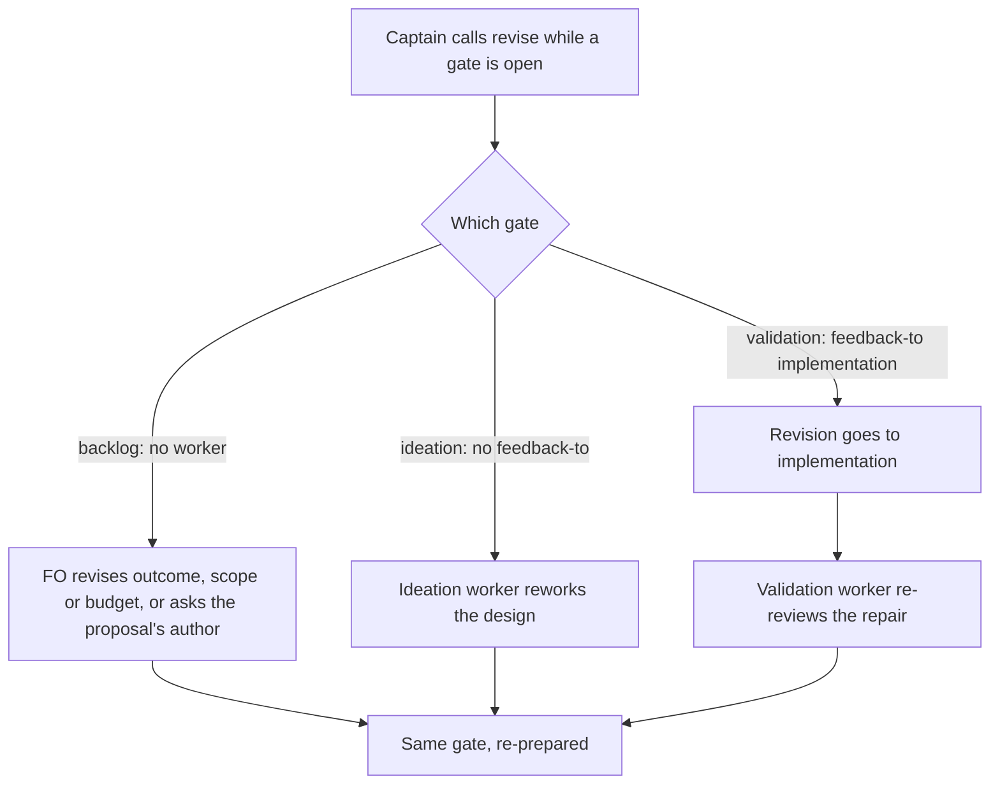

One wording defect in kc-dev-flow-2 0.10.2 `references/sd/workflow.md` `## Captain amendments`, found as a P1 in round 3 of an external review of an adopter's workflow sync (qnow PR #1248, commit 39bf550, 2026-10-01); patch release 0.10.3.

## Scope

Captain 2026-10-01: 「修完再合併」 — fix the round-3 P1 before #1248 merges; under the review-round rule the round-3 P2s become follow-ups (task `review-followups-0102`).
Finding: the paragraph says that when the Captain calls `revise` while a gate is open, "at a stage that dispatches a worker, that stage's worker reworks it". At the validation gate that names the validation worker, but the validation contract forbids that worker from taking over implementation and routes changes through feedback; the revise must go to the `feedback-to` target (implementation), the validation worker then re-reviews.
Non-goals: the round-3 P2s; any Spacedock change; other sections.

## Design

### PRFAQ

**Press release.** kc-dev-flow-2 0.10.3 fixes one sentence in the adopted workflow README's `## Captain amendments`. When the Captain calls `revise` at the validation gate, the revision now goes to implementation (the gate's `feedback-to`) and the validation worker re-reviews the repair. Before, the sentence named the validation worker as the reworker, which its own contract forbids.

**FAQ.**
- *What is the fix?* One sentence in `kc-dev-flow-2/references/sd/workflow.md`, replacing the 0.10.2 clause "at a stage that dispatches a worker, that stage's worker reworks it" with the rule per stage.
- *Is a new mechanism needed?* No. Spacedock already routes `revise` outside the gate's application as `feedback-pending` and the `validation` stage already declares `feedback-to: implementation` (existing-code check below). The wording only stops contradicting that.
- *Why not "the stage's worker reworks it" for every worker stage?* `validation` assesses; its contract says it "does not silently take over implementation". `ideation` has no `feedback-to`, so its own worker is the author and keeps the rework. `implementation` has no gate, so no `revise` is possible there.
- *Does ADR 0005 need an amendment line?* No. `grep -i revise` over `docs/adr` on origin/main (a120eb75) finds nothing; ADR 0005 rules the amendment record, the move duty, the seed check and unnumbered drafts, and never says who reworks a `revise`. An amendment line would add a claim the ADR does not make.

**Existing-code capability check (conclusion).** Observed need: the P1 in qnow #1248 round 3 (commit 39bf550). Existing capability: `internal/gates/operation.go` `applicationForDecision` comment "keeping the feedback-to route outside the durable application object", and `internal/gates/application.go` mapping a `revise` Resolution to condition `feedback-pending` (Spacedock 0.27.0 source in the plugin cache, read 2026-10-01); `workflow.md` stage `validation` has `feedback-to: implementation` and the `### validation` text sends rejection through the feedback path. Conclusion: use what exists; repair the wording, add nothing.

### Exact replacement wording

In `## Captain amendments`, the first paragraph, 0.10.2 text:

> he calls `revise`; at a stage that dispatches a worker, that stage's worker reworks it, and at `backlog`, which dispatches no worker, FO revises the recorded outcome, scope or budget, or asks the proposal's author to.

becomes:

> he calls `revise`; at `ideation`, its worker reworks it; at a stage whose gate has a `feedback-to`, the revision goes to that target and the stage's worker re-reviews it; and at `backlog`, which dispatches no worker, FO revises the recorded outcome, scope or budget, or asks the proposal's author to.

Nothing else in `workflow.md` changes (the other mention of the validation gate in that paragraph's first sentence is about amendments, not `revise`).

### Asserted phrases and falsifier (`kc-dev-flow-2/scripts/test_sd_dispatch.py`)

Spiked in a throwaway worktree of origin/main a120eb75 at /tmp/p0103 (removed after). The existing `FIXES` table already asserts each 0.10.2 wording fix and proves each independently by reverting it alone; this adds one entry and re-aims the existing `backlog-revise` entry, whose swap pattern began "at a stage that dispatches a worker" and no longer matches.
- New entry `feedback-revise`: `need` = "at a stage whose gate has a `feedback-to`, the revision goes to that target and the stage's worker re-reviews it" and "at `ideation`, its worker reworks it"; `old` = the 0.10.2 clause "at a stage that dispatches a worker, that stage's worker reworks it"; the swap puts the 0.10.2 clause back in place of the two new clauses.
- `backlog-revise`: `need` unchanged; its swap now deletes only the "; and at `backlog` ... author to" clause (so reverting it alone leaves the new clauses intact), `old` becomes empty.
- Spike result: with the candidate text and test, `test_sd_dispatch.py --sd-plugin-root <spacedock 0.27.0 cache>` exits 0 and its sixth PASS line names seven fixes; with the candidate test and origin/main's 0.10.2 `workflow.md` it exits 1 with `feedback-revise` missing both phrases and keeping the 0.10.2 clause, every other entry `([], [])`.
- Limit: the test reads the template text; it does not run a Captain `revise` through a live Spacedock (see AC-3 not-yet-verified).

## Acceptance criteria

**AC-6** Amended by Captain, amendment 1. The `## Captain amendments` first paragraph of `kc-dev-flow-2/references/sd/workflow.md` carries the structural replacement sentence, and no other line of that file changes: "he calls `revise`; at a stage with no `feedback-to` that dispatches a worker, that stage's worker reworks it; at a stage whose gate has a `feedback-to`, the revision goes to that target and the stage's worker re-reviews it; and at `backlog`, which dispatches no worker, FO revises the recorded outcome, scope or budget, or asks the proposal's author to." Evidence plan: `git diff origin/main -- kc-dev-flow-2/references/sd/workflow.md` shows one hunk of that paragraph; `test_poc_readme.py` exits 0.

**AC-2** `test_sd_dispatch.py` fails on the 0.10.2 text and passes on the new text. Evidence plan: run it twice (candidate `workflow.md`, then origin/main `workflow.md` with the candidate test) with `SPACEDOCK_BIN` and `--sd-plugin-root` as in the Captain script; the second run must exit 1 and name `feedback-revise`. Current: both runs done in the spike, exit 0 and exit 1 as stated.

**AC-3** Reverting only the `backlog` clause reports only `backlog-revise`, and reverting only the new clauses reports only `feedback-revise`, so the two assertions stay independent. Evidence plan: the existing matrix loop in the test asserts this for every pair. Current: passes in the spike run (exit 0). Not yet verified: a live Captain `revise` at a validation gate in Spacedock; Spacedock's routing is read from source only.

**AC-4** The change is one fix commit scoped to `kc-dev-flow-2/`, titled `fix(kc-dev-flow-2): ...`, with no version, CHANGELOG, marketplace or ADR edit, and `python3 <package>/scripts/comment_ratio.py` reports no added comment line. Evidence plan: `git diff --stat origin/main` lists only `workflow.md` and `test_sd_dispatch.py`; `comment_ratio.py` output; the PR title. Current: not yet verified (no branch).

**AC-5** `python3 <package>/scripts/design_surfaces.py check <task>` exits 0 on this task. Evidence plan: the output cited in the Stage Report. Current: see the report.

## Needs the Captain

- No decision on the wording. One consequence for his 「修完再合併」: qnow #1248 carries a synced copy of `workflow.md`; that copy changes only by re-sync from a published `kc-dev-flow-2-v0.10.3` tag (this repository's rule: no pin on a predicted version), so #1248 merges after the fix PR, the Release PR and the re-sync, or he rules a hand edit of qnow's copy instead.

## Captain amendments

### Amendment 1 — 2026-10-01, chat
Captain: 「可以」 (at the ideation gate, approving the three-case revise sentence naming `ideation`), then 「Ａ」 (in chat, option A: reword without the stage name, same three cases by structure, after `test_poc_readme.py` failed on the named-stage sentence because the POC derivation removes ideation)
Supersedes: AC-1
Design: `### Exact replacement wording` and the `feedback-revise` phrase naming `ideation` under `### Asserted phrases and falsifier`
Superseded text: **AC-1** The `## Captain amendments` first paragraph of `kc-dev-flow-2/references/sd/workflow.md` carries exactly the replacement sentence above, and no other line of that file changes. Evidence plan: `git diff origin/main -- kc-dev-flow-2/references/sd/workflow.md` shows one hunk of the paragraph. Current: spiked diff of 3 insertions and 2 deletions in that one hunk; not yet on a branch.

## Captain-run minimal acceptance script

Run in a clone of the candidate branch, with `SD=~/.claude/plugins/cache/spacedock/spacedock/0.27.0`.
1. `tr -s '[:space:]' ' ' < kc-dev-flow-2/references/sd/workflow.md | grep -o "he calls .revise.; at a stage with no .*asks the proposal's author to\."` prints the structural replacement sentence (AC-6).
2. `SPACEDOCK_BIN=$(which spacedock) python3 kc-dev-flow-2/scripts/test_sd_dispatch.py --sd-plugin-root $SD` exits 0 and its fifth PASS line names `feedback-revise`.
3. `git worktree add --detach /tmp/p0103-chk origin/main`, copy the candidate `test_sd_dispatch.py` over its copy, run the same command there: exit 1, with `feedback-revise` missing both phrases. Remove the worktree.

## FO alignment

Needed at ideation: replacement wording that sends a revise at a feedback stage's gate to its `feedback-to` stage and keeps a revise at ideation with the ideation worker and at backlog with FO or the author; the asserted phrase and a falsifier holding the 0.10.2 text in `test_sd_dispatch.py`; whether ADR 0005 needs an amendment line.
Result: the FO delegates these questions to ideation, which decides each with its source and returns any ruling that needs the Captain.
Surfaces: none
Visible change: none

## Stage Report: ideation

- DONE: Design the one-sentence fix in the task's Scope: exact replacement wording (revise at a feedback-to gate goes to that target and the stage's worker re-reviews; ideation keeps its worker; backlog stays with FO or the author)
  `## Design` "Exact replacement wording" gives the 0.10.2 and 0.10.3 sentences; routing confirmed against Spacedock 0.27.0 source (`applicationForDecision`, `feedback-pending`) and `workflow.md` `validation` `feedback-to: implementation`.
- DONE: The asserted phrase and a falsifier fixture holding the 0.10.2 text in test_sd_dispatch.py
  New `feedback-revise` entry in `FIXES` (swap restores the 0.10.2 clause) plus a re-aimed `backlog-revise` swap; spike on origin/main a120eb75: candidate exits 0, candidate test on 0.10.2 text exits 1 naming only `feedback-revise`.
- DONE: Whether ADR 0005 needs an amendment line
  No: `git grep -i revise origin/main -- docs/adr` is empty; the ADR never states who reworks a `revise`.
- DONE: ACs with evidence plans
  AC-1 wording diff; AC-2 pass on new text and fail on 0.10.2 text (both run in the spike); AC-3 pairwise independence (passes in the spike; live Spacedock `revise` not verified); AC-4 one scoped fix commit, no version/ADR edit, comment_ratio.py (no branch yet, not verified); AC-5 design_surfaces check.
- DONE: What needs the Captain
  No wording decision; one consequence recorded: qnow #1248 gets the fix by re-sync from a published 0.10.3 tag, or a hand edit he rules.
- DONE: The Captain-run minimal acceptance script
  Three steps in `## Design`'s final section: grep the sentence, run the test (exit 0), run it against 0.10.2 text (exit 1 naming `feedback-revise`).
- DONE: AC-5 design_surfaces.py check passes on the task
  `python3 ~/.claude/plugins/local/kc-dev-flow-2/scripts/design_surfaces.py check patch-0103.md` printed "design surfaces presentable", exit 0.

### Summary

The fix is a rewording of one sentence in `workflow.md`, with no new mechanism: the existing `feedback-to` route already carries a validation-gate `revise` to implementation. Tests are one new `FIXES` entry plus a re-aimed `backlog-revise` swap, spiked in a throwaway worktree (removed) with the falsifier proven. ADR 0005 needs no amendment. During the spike I ran a bare `git stash` in that worktree (shared stash stack); I restored it by SHA and dropped only my own entry, other stash entries untouched.

## Stage Report: implementation

- DONE: Implement patch-0103's approved design (Captain 2026-10-01 「可以」: the three-case revise sentence) exactly as the design's spike describes, touching only kc-dev-flow-2/references/sd/workflow.md and kc-dev-flow-2/scripts/test_sd_dispatch.py.
  Candidate d511cecfec4069ca8cea57a091d1b5a98f1c9f86 on spacedock-ensign/patch-0103 (base a120eb75); `git diff --stat origin/main` lists only those two files (13 insertions, 7 deletions). Deviation, Captain-ruled: the named-stage sentence failed test_poc_readme.py, so 「Ａ」 reworded it by structure; both quotes are in Amendment 1 (`## Captain amendments`).
- DONE: Every AC with the evidence its "Verified by" names, including the falsifier run with the new test on the 0.10.2 workflow.md.
  AC-6 (replaces AC-1): `git diff origin/main -- kc-dev-flow-2/references/sd/workflow.md` is one hunk in that paragraph. AC-2: test_sd_dispatch.py exits 0 on the candidate; on origin/main workflow.md with the candidate test it exits 1 and `fix_gaps` shows `feedback-revise` missing both phrases and keeping the 0.10.2 clause, every other entry `([], [])`. AC-3: that test's per-fix matrix loop passes, so reverting `backlog-revise` or `feedback-revise` alone reports only its own gaps; not run: a live Captain `revise` through Spacedock. AC-4: one `fix(kc-dev-flow-2):` commit, no version/CHANGELOG/marketplace/ADR edit, comment_ratio 0 comment lines. AC-5: design_surfaces.py check on this task printed "design surfaces presentable", exit 0.
- DONE: Follow this repo's CLAUDE.md: `fix(kc-dev-flow-2): …`, no version edits, stage files explicitly; the CI suite list green; the candidate's own `kc-dev-flow-2/scripts/comment_ratio.py` from the base exits 0; exact candidate SHA; the Captain-run minimal acceptance script rewritten against the shipped text.
  Both files staged by name; all nine `kc-dev-flow-2-tests.yml` commands exit 0 locally (lint-skills, test_lint_skills, test_design_surfaces, test_adr_doc_checks, test_poc_readme, test_comment_ratio, test_number_guards, test_learning, test_sd_dispatch with Spacedock 0.27.0 root and 0.27.2 binary). The candidate's comment_ratio.py `origin/main HEAD` printed "code lines 9, comment lines 0, 0.0%", exit 0. Step 1 of `## Captain-run minimal acceptance script` now greps the shipped sentence and printed it (run), and the fifth PASS line names `feedback-revise`.
- DONE: Affected documents (`doc_impact.py origin/main HEAD`)
  kc-dev-flow-2/README.md: unaffected, it only gives the test_sd_dispatch.py command line. kc-dev-flow-2/references/sd/adoption.md: unaffected, same reason.

### Summary

The `## Captain amendments` paragraph now sends a `revise` at a gate with a `feedback-to` to that target with the stage's worker re-reviewing, keeps a worker stage without `feedback-to` with its own worker, and leaves `backlog` with FO or the author. The Captain's 「Ａ」 replaced the named-`ideation` wording after the POC derivation test failed; the structural wording keeps the derived POC README correct. The test's `backlog-revise` swap was re-aimed and `feedback-revise` added, and the seven-fix PASS line was updated.

## Stage Report: validation
- DONE: Reproduce the full kc-dev-flow-2 CI suite list on a `git archive` copy of d511cecf (test_sd_dispatch.py with the Spacedock v0.27.2 plugin root, including test_poc_readme.py)
  All nine `kc-dev-flow-2-tests.yml` commands exit 0 (lint-skills, test_lint_skills, test_design_surfaces, test_adr_doc_checks, test_poc_readme, test_comment_ratio, test_number_guards, test_learning, test_sd_dispatch with a clone of spacedock-dev/spacedock at 4d158a48 = v0.27.2 and the 0.27.2 binary); the fifth PASS line names `feedback-revise`.
- DONE: Falsifier: the new test on the 0.10.2 workflow.md exits 1 naming feedback-revise
  A120eb75 tree plus the candidate test.py exits 1 with both the 0.27.0 and 0.27.2 roots; `fix_gaps` shows only `feedback-revise` with both `need` phrases missing and the 0.10.2 clause kept, every other entry `([], [])`. Three more mutations of the candidate workflow.md (target replaced by "the stage", the no-`feedback-to` clause deleted, "re-reviews" changed to "reworks") each make the test exit 1.
- DONE: Two-file scope and no AC-1 in force
  `git diff --stat a120eb75 d511cecf` lists only `workflow.md` (+4 -3) and `test_sd_dispatch.py` (+9 -4); `spacedock status --read --ac-scan --stage implementation` lists AC-6, AC-2, AC-3, AC-4, AC-5 and no AC-1; `design_surfaces.py check` exits 0.
- DONE: Read the shipped sentence against the round-3 Codex P1 on qnow #1248 commit 39bf550 and say whether it is closed
  The P1 (comment 4151250815, "Route validation-gate revisions back to implementation") is closed: `workflow.md` gives `validation` `feedback-to: implementation` and `gate: true`, and the shipped sentence sends a revise at such a gate to the target with the validation worker re-reviewing; `ideation` (gate, no `feedback-to`) keeps its worker and `backlog` stays with FO, so no gated stage is left without an owner.
- DONE: Read the derived POC README sentence (`poc_readme.py derive`) and say whether it reads correctly without ideation
  Derived README (4 stages) carries the identical sentence; it reads correctly, validation to implementation and backlog to FO, and its first clause has no stage to apply to (implementation has no gate), which is vacuous but not wrong; test_poc_readme.py exits 0.
- DONE: Every added comment line, and the candidate's own comment_ratio.py from a120eb75
  No added line of `test_sd_dispatch.py` contains `#`; `comment_ratio.py a120eb75 HEAD` prints "code lines 9, comment lines 0, 0.0%", exit 0 (floor of 20 code lines not reached, so not enforced).
- DONE: Run the Captain acceptance script as written
  Steps 1 and 2 run in a clone of the candidate branch: step 1 prints the structural sentence, step 2 exits 0 with `feedback-revise` on the fifth PASS line. Step 3 run with a `git archive` of a120eb75 in place of `git worktree add`, to leave the code worktree's metadata untouched: exit 1, `feedback-revise` missing both phrases; copies removed.
- DONE: Confirm the code worktree is clean
  `git status --short` empty and HEAD still d511cecf after all runs; every spike and mutation copy was under /tmp.

### Summary

Recommend PASSED for d511cecf: the shipped sentence closes the qnow #1248 round-3 P1, the falsifier fails on the 0.10.2 text and passes on the new text, scope is two files, and the derived POC README reads correctly. Not verified: a live Captain `revise` through Spacedock at a validation gate (routing is read from the existing `feedback-to` declaration and the test reads template text only). Polish, not blocking: the design text says `feedback-revise` is on the "sixth" PASS line, it is the fifth, which the Captain script already says.
