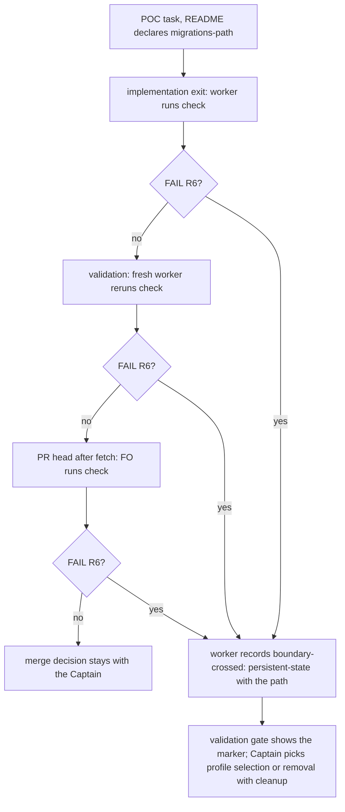

The POC route never activates number guards (it records no `Surfaces:`), so a POC migration would get no reserved number and no freeze; the Captain ruled that a POC does not touch migrations at all.

## Scope

Captain 2026-10-01: 「ok」 to the FO's proposal: a POC task adds and edits no migration file; a task that needs a database change is promoted to pilot; POC delivery runs the existing number-guards check plus a check that the migrations directory is unchanged. Same ruling waives the external reviewer's round-4 P1 on qnow PR #1248 ("Activate number guards for POC database work", on the derived `docs/dev2-poc/README.md`) for that sync PR, reason recorded: the gap predates the sync (the POC README had no number guards before it either), so merging does not widen it; this task closes it in the package.
Evidence: kc-dev-flow-2 0.10.3 `references/sd/workflow.md` `## Number guards` applies "when the task's `Surfaces:` includes `db`, or its design lands an ADR"; `Surfaces:` is recorded only on the five-stage route; the POC route derived by `poc_readme.py` has no ideation stage.
Non-goals: full number guards on the POC route; any Spacedock change.

## Design

PRFAQ. A POC adopter that declares `migrations-path:` gets, from the same template text its README is derived from, a rule its two POC workers read: a `poc` task changes nothing under that directory, `check` proves it, and a failure is a boundary crossing, not a quiet repair. Press line: "A POC can no longer ship a migration that no number guard saw." FAQ. (1) Why not record `Surfaces: db` on POC? POC has no stage that records it, and activation by profile needs no new field (the Codex P1 offers either). (2) Why not reserve a number? A POC adds none. (3) What if `migrations-path:` is absent? The migration rules are skipped, as today; the rule says so.

Existing-code check: 0.10.3 `check --task` already refuses an added `NNNN_name.sql` on a task that holds no `Migration:` line (R4) and an edit or delete (R1); measured in a throwaway worktree of origin/main. Gaps measured there: nothing tells a POC to run `check`, so none does (the Codex P1), and a change to `meta/_journal.json` or any file not named `NNNN_name.sql` passes (exit 0). The Captain's wording is the directory, so one rule closes both.

Rule location. `references/sd/workflow.md` `## Number guards`, one new bullet (below). That section is the only one both POC worker stages receive that also survives `poc_readme.py derive`: `derive` removes only the `ideation` state and its `### ` section, and `implementation` and `validation` list `Number guards` in `context-sections`. The bullet must not contain the word "ideation" (test_poc_readme's stray-line test) and has no relative link. Exact text:

    - **POC.** A task whose recorded `profile` is `poc` adds, edits and deletes no migration
      file and reserves no number. When the README declares `migrations-path:`, `check` runs
      for it at the same three points; it reads `profile: poc` from the task's frontmatter,
      and exit 1 `FAIL R6` lists each path under that directory that differs from the
      merge-base, `meta/` and files not named `NNNN_name.sql` included. A `FAIL R6` crosses the
      POC boundary (a schema change persists across sessions): the worker records
      `boundary-crossed: persistent-state` naming the path, and the task is not repaired in
      place; FO presents the marker at the validation gate. Without `migrations-path:` the
      migration rules are skipped, so a POC is not guarded until the README declares it.

plus the opening line "Applies when the task's `Surfaces:` includes `db`, or its design lands an ADR; the POC bullet below applies to every `poc` task."

Check mechanism. No new flag. `number_guards.py` `task_facts` gains `"poc": frontmatter(task).get("profile") == "poc"` (`frontmatter` already parses `key: value` lines above the closing `---`), and `check`, inside the existing `if directory:` block after R2, runs `git diff --name-status --no-renames <merge-base> <head> -- <directory>/` and emits `FAIL R6: <path>: <status> under the migrations directory; a POC task changes none of it` per line. R1..R4 still run, so an added `.sql` also prints R4; the diff is merge-base to head, so a migration that landed on the base later is not the POC's change. `require_migrations` still runs first, so a mistyped `migrations-path:` exits 2 rather than passing. Docstring gains R6 and "(R6 does check them)" on the journal limit. Measured size in the spike (`git diff --numstat`): `number_guards.py` +9/-2, `workflow.md` +11/-1, tests +62/-2, no added `#` comment line.

Failure. `FAIL R6` is the existing ADR 0001 crossing (`persistent-state`), so no new marker or gate text is added. The validation gate already presents the marker with the choice between profile selection (the Captain's pilot promotion) and removing the crossing work with recorded cleanup through the feedback route, and does not recommend delivering as POC.

Tests (spike, added to existing files; falsifier = the 0.10.3 text). `test_number_guards.py` `PocFreezeTests`: add, edit, delete, journal-only and snapshot changes under the directory each exit 1 with `FAIL R6` naming the path; a non-poc task with the same journal change exits 0, a poc task with no change there exits 0, a migration landed on the base after the branch point is not flagged, and a poc task with no `migrations-path:` exits 0 with "migration guard skipped". `test_poc_readme.py`: the derived POC README contains the bullet with `migrations-path:`, `FAIL R6`, `boundary-crossed: persistent-state`, and `Number guards` is in the `context-sections` of its `implementation` and `validation` states. Copied onto an origin/main (0.10.3) worktree: 6 failures in `test_number_guards.py` (the five `PocFreezeTests` subtests and the scoping test) and 1 error in `test_poc_readme.py`; on the spike all 9 CI commands exit 0.

ADR. One amendment line on ADR 0002, no new ADR: the decision area is the same (what the guard freezes), and 0002 already carries dated Captain amendments. Draft, no number: "Amended 2026-10-01 (Captain: 「ok」 on this task's backlog gate): a `poc` task adds, edits and deletes no migration file; `check` fails (R6) any file under `migrations-path:` that differs from the merge-base for a task whose frontmatter says `profile: poc`, and the failure is a `boundary-crossed: persistent-state` crossing, not repaired in place (`workflow.md` Number guards)."

Release. `fix(kc-dev-flow-2): ...` PR title, no version edit. The qnow sync PR #1248 is waived by the ruling; qnow picks the rule up by refreshing `docs/dev2-poc/README.md` through `poc_readme.py derive` after the release is tagged (adopter step, outside this task).

Limits that stay: an unrecorded deploy is not seen (ADR 0002); a POC with no `migrations-path:` is unguarded; the rule is an FO and worker instruction read back by `check`, which exists only where someone runs it.

Needs the Captain. (a) Approve this design at the ideation gate. (b) Confirm one mapping that goes beyond the Scope wording: the Scope says a task needing a migration "is promoted to pilot"; `FAIL R6` routes through the existing ADR 0001 `boundary-crossed` gate, where the Captain chooses profile selection (the promotion) or removing the migration work with cleanup. Recommendation: keep both options, because forcing promotion would need new gate text and would punish a migration committed by accident. Nothing else needs the Captain. The ADR 0002 amendment cites the word the Captain gives at the ideation gate, as 0002's earlier amendments cite the gate that approved them.

## Acceptance criteria

**AC-1** The POC README derived from the template carries the rule. Evidence: `python3 <package>/scripts/test_poc_readme.py` passes with the new test, and the same test fails on the 0.10.3 `workflow.md`.

**AC-2** For a task with `profile: poc`, `check` exits 1 with `FAIL R6` naming the path for any add, edit, delete, journal or snapshot change under `migrations-path:`; exit 0 when nothing there changed, for the same change on a non-poc task, and for a migration that landed on the base after the branch point. Evidence: `PocFreezeTests` in `test_number_guards.py`; the add, edit, delete and journal subtests and the scoping test fail on the 0.10.3 script.

**AC-3** A POC with no `migrations-path:` prints "migration guard skipped" and exits 0, and the bullet says the POC is then not guarded. Evidence: the no-path test in `PocFreezeTests` and the bullet's last sentence.

**AC-4** The bullet names `boundary-crossed: persistent-state` and "not repaired in place" as the result of `FAIL R6`. Evidence: the derived-README test asserts the marker phrase; the validation-gate behavior it relies on is the existing ADR 0001 text, not retested.

**AC-5** The whole `kc-dev-flow-2-tests.yml` unit list passes on the candidate: `lint-skills.py`, `test_lint_skills.py`, `test_design_surfaces.py`, `test_adr_doc_checks.py`, `test_poc_readme.py`, `test_comment_ratio.py`, `test_number_guards.py`, `test_learning.py`, `test_sd_dispatch.py --sd-plugin-root <v0.27.2 checkout>`. Evidence: each command's exit 0 on the PR head, and the PR's CI jobs finished green.

**AC-6** ADR 0002 carries the one amendment line and `adr_lint.py` and `test_adr_doc_checks.py` pass. Evidence: the diff of `docs/adr/0002-*.md` and those exit codes on the PR head.

**AC-7** The Captain-run script below prints `exit=1` with `FAIL R6` for an added migration, `exit=0` after its removal, and `exit=1` with `FAIL R6` for a journal-only change. Evidence: the Captain's run on the candidate.

## Captain-run minimal acceptance script

With `<package>` the candidate's `kc-dev-flow-2` directory (the PR head checkout):

    sh <<'SH'
    PKG=<package>
    T=$(mktemp -d); trap 'rm -rf "$T"' EXIT
    git init -q --initial-branch=main "$T/repo"; cd "$T/repo"
    git config user.email t@e.x; git config user.name t; git config commit.gpgsign false
    mkdir -p db/migrations; echo 'SELECT 1;' > db/migrations/0001_init.sql
    git add -A; git commit -qm base; git checkout -qb poc
    mkdir wf; printf -- '---\ntrunk: main\nmigrations-path: db/migrations\n---\n# wf\n' > wf/README.md
    printf -- '---\nprofile: poc\n---\nbody\n' > "$T/task.md"
    echo 'SELECT 2;' > db/migrations/0002_poc.sql; git add -A; git commit -qm "poc adds a migration"
    python3 "$PKG/scripts/number_guards.py" check --repo . --workflow-dir wf --task "$T/task.md"; echo "exit=$? (expect 1, FAIL R6)"
    git rm -q db/migrations/0002_poc.sql; git commit -qm "remove it"
    python3 "$PKG/scripts/number_guards.py" check --repo . --workflow-dir wf --task "$T/task.md"; echo "exit=$? (expect 0)"
    mkdir -p db/migrations/meta; echo '{"entries":[1]}' > db/migrations/meta/_journal.json; git add -A; git commit -qm "poc edits only the journal"
    python3 "$PKG/scripts/number_guards.py" check --repo . --workflow-dir wf --task "$T/task.md"; echo "exit=$? (journal-only: expect 1, FAIL R6)"
    SH

Run on the spike, the three exits are 1, 0, 1; on the 0.10.3 package the third is 0.

## FO alignment

Needed at ideation: where the POC rule lives (the template text that `poc_readme.py derive` keeps for the POC route, and the stage that delivers a POC); how the "migrations directory unchanged" check runs (an existing `number_guards.py` mode, a flag, or a few lines) with `migrations-path:` from the README; what happens when it fails (the task is promoted to pilot, not repaired in place); tests with a falsifier.
Result: the FO delegates these questions to ideation, which decides each with its source and returns any ruling that needs the Captain.
Surfaces: none
Visible change: none

## Stage Report: ideation

- DONE: Design, in the task file, the POC rule in the task's Scope (read the Codex P1: `gh api repos/iamcxa/qnow/pulls/1248/comments`, the comment on docs/dev2-poc/README.md): the exact template wording that survives `poc_readme.py derive` onto the POC route and run the full kc-dev-flow-2 CI suite list (including test_poc_readme.py) on the spike; how POC delivery checks the migrations directory is unchanged (prefer an existing number_guards.py path; a new flag only if needed) using `migrations-path:`; what a failure does (promote to pilot); tests with a falsifier holding the 0.10.3 text. Keep it small.
  `## Design` holds the exact bullet for `workflow.md` Number guards, rule R6 in `check` with no new flag, and the failure path; on a throwaway origin/main worktree all 9 CI commands exit 0 (derive keeps the bullet, 1 allowed "ideation" line); the added tests give 6 failures plus 1 error on the 0.10.3 text.
- DONE: ACs with evidence plans; ADR need (one amendment line on ADR 0002 or none; decide and say why); what needs the Captain; the Captain-run minimal acceptance script.
  `## Acceptance criteria` AC-1..AC-7, ADR 0002 amendment draft (one line, no new ADR, same decision area), "Needs the Captain" paragraph in `## Design`, script in `## Captain-run minimal acceptance script` (run from the entity text: exits 1, 0, 1; 0.10.3 gives 1, 0, 0).
- DONE: AC-1 derived POC README carries the rule
  spike `test_poc_readme.py` new test passes; errors on the 0.10.3 `workflow.md` (ValueError, bullet absent).
- DONE: AC-2 R6 for a poc task, scoped to the task's own changes
  spike `PocFreezeTests`: add/edit/delete/journal/snapshot each exit 1 with R6, non-poc and no-change and base-landed migration exit 0; on 0.10.3 the 5 subtests and the scoping test fail.
- DONE: AC-3 no `migrations-path:` is skipped and said so
  spike no-path test: exit 0 with "migration guard skipped"; the bullet's last sentence states the limit.
- DONE: AC-4 failure is a `boundary-crossed: persistent-state` crossing, not repaired in place
  the derived-README test asserts the marker phrase; the gate behavior is the existing ADR 0001 text and is not retested.
- SKIPPED: AC-5 whole CI unit list green on the PR head
  not yet verified on a PR; the spike ran all 9 commands with exit 0 (test_sd_dispatch against a v0.27.2 checkout).
- SKIPPED: AC-6 ADR 0002 amendment line and ADR checks
  not yet verified; the line is drafted in the task and is written at implementation.
- SKIPPED: AC-7 Captain-run script on the candidate
  not yet verified; needs the Captain's run on the PR head (spike result exits 1, 0, 1).
- DONE: `design_surfaces.py check` passes
  output: `poc-no-migrations.md: design surfaces presentable` (exit 0).

### Summary

The POC rule is one bullet in `workflow.md` Number guards, the section both POC workers already receive and that `poc_readme.py derive` keeps, plus rule R6 in `check` (a task with `profile: poc` may not change anything under `migrations-path:`). Finding: 0.10.3 `check --task` already refuses an added or edited `.sql` through R1/R4; the real gaps were that nothing tells a POC to run it and that journal and snapshot files pass, which R6 and the bullet close. One Captain confirmation is needed: the failure goes through the existing `boundary-crossed` gate (promote or remove with cleanup), a superset of "promoted to pilot".
