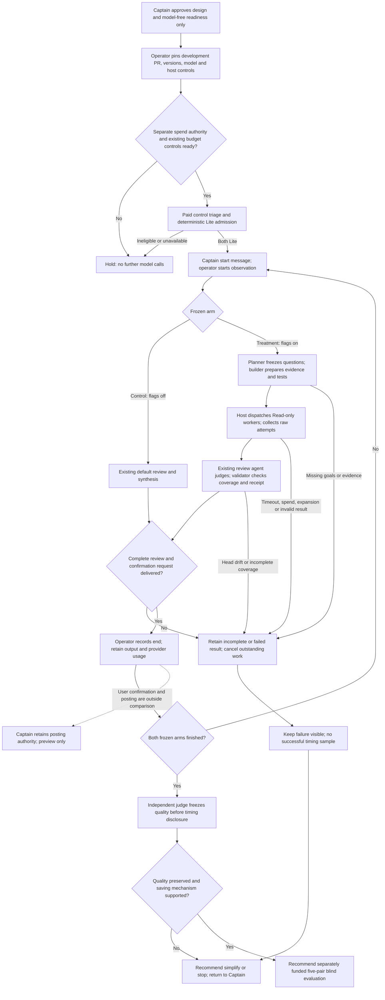

# Lite review value Pilot — PRFAQ and decision evidence

Date: 2026-09-20. Status: proposed design; no experiment executed or approved by this document.

## Proposed announcement

Kent, an engineer reviewing ordinary pull requests, can explicitly try Lite and receive a complete, evidence-backed review plus the existing confirmation request. Lite prepares selected evidence once and lets the existing review agent combine typed answers, while preserving every required question and human posting authority. We will first compare one complete development review against the current default; we will simplify or stop if the extra preparation, dispatch, validation and synthesis erase the benefit.

The useful unit is one attended review, from Kent's start message to delivery of the full review and confirmation request. A schema-valid worker answer, local fixture pass or faster model lane is not that outcome. A review may correctly recommend changes; finding a blocker does not make an otherwise complete review a failed sample.

## FAQ

**What is the smallest change?** No new product mechanism is proposed before the development comparison. Reuse the existing default-off candidate, selected evidence files, one native worker per required capability, serial result collection, and synthesis by the existing outer review agent. The first comparison tests this arrangement only; it does not claim optimal batching or authorize building a batching platform.

**What does Lite preserve?** The catalog owns required questions. At the pinned candidate it always requires goal alignment, code correctness, security risk, silent failure and documentation accuracy; code, contract, dependency, workflow and stacked-shape signals add their existing questions. No question is removed to achieve a time target. Frozen code, substantive goal material, tests and exact-head bindings support conclusions. Confirmed Critical/High findings and incomplete coverage retain their existing event ceilings.

**Who owns the decisions?** Kent owns design, spend, promotion and posting authority. The external operator owns frozen inputs, run order, observed timing, usage reconciliation and retained failures. The deterministic planner owns required questions; the evidence builder owns frozen material and mechanical observations. The managed host owns actual worker scheduling, timeout, cancellation and spend controls. The existing review agent owns evidence-bound synthesis; deterministic validators own accepted contracts and coverage. A separate, calibrated adjudicator owns blinded quality scoring. The existing confirmation and posting adapter remain the only publication boundary; this experiment stops at preview.

**What happens when something goes wrong?** Missing intent, unsupported expansion, unavailable host controls, stale identity, malformed results, incomplete required coverage, exhausted budget, timeout or interrupted collection stays visible and prevents a successful comparison. Cancel outstanding work. Preserve raw attempts and any partial cost. No silent fallback becomes a successful Lite sample. Turning either feature flag off applies only to a fresh, separately authorized invocation; do not relabel that fresh default review as the failed treatment.

**What is outside this Pilot?** Executable Standard/Full/Custom paths, unattended service operation, automatic admission infrastructure, a new evaluator/ledger/security system, remote posting, old-stack PR changes, new CI workflows, default enablement and release. New long-term support, broad exposure or production-data obligations return to profile selection.

## Flow and visual check

[Rendered journey](journey.png) · [Mermaid source](journey.mmd).

Mermaid CLI 11.17.0 from the already-installed local cache rendered the image to `.context/pr-review-lite-value-pilot/journey.png`; the same image is retained here. The image was visually inspected after correcting the missing second-arm loop and the post-admission hold label. Actors, model-free readiness before separate spend approval, paid-admission boundary, separate starts for both arms, failure stop, quality-before-time order and excluded human posting wait match the prose. A complete output includes the confirmation request; confirmation itself is outside timing. The failure path intentionally stops this one development pair rather than purchasing a replacement. Rendering establishes diagram agreement, not runtime behavior. Reproduction needs Mermaid CLI and its browser; no product dependency was installed.

## Current evidence and scope accounting

[Sanitized source audit](source-audit.json) is the numeric record. All source paths in this section are relative to the read-only candidate `/Users/kent/conductor/workspaces/kc-claude-plugins/kc-pr-review-capability-pilot` unless stated otherwise.

| Identity or constraint | Observation on 2026-09-20 |
| --- | --- |
| Candidate, local and remote | `0d2e3164ccd2d60006688c5443717b818825a305`; clean branch `feature/kc-pr-review-capability-protocol-pilot`; all-state PR lookup returned none |
| Current integration, local and remote main | `6bf62d1d7d3c343a97c973a7abd7424d03676437` |
| Original cumulative denominator | `3b37000a16ca2eadad0cb5dfd8e43a5f1d06f0f8` to candidate; additions plus deletions |
| Changed files / limit | 18 / 20 |
| Total changed lines / limit | 5,884 / 6,600 |
| Focused changed lines / limit | 1,903 / 1,903; zero focused-line headroom |
| Focused denominator | Catalog 97 + schema 447 + ablation tests 7 + corpus 8 + protocol tests 1,214 + runtime tests 130 = 1,903 |
| Current corpus | Zero data rows; eight comment lines. No frozen real evaluation corpus |

The first 201 lines of `docs/superpowers/specs/2026-09-05-kc-pr-review-capability-protocol-v1.md` were read before interpreting old blockers. September 7–9 approvals supersede the automated-runner prerequisite; withdrawal commit `b7a21def78c63cacef07f76b7d11ced574de0dea` leaves its integrity defect unresolved and outside this supervised path. The old task's September 6 disposition raised the focused limit from 1,800 to 1,903; it did not retroactively pass earlier rejected reports. Both facts are preserved here without changing old state or pins.

Bounded compatibility check: `git diff --name-only` from the original denominator to current main, intersected with the 18 candidate paths, finds only `ARCHITECTURE.md`. Current main changes its development-flow description near lines 23–40; the candidate adds the Lite section near line 202, so the inspected hunks do not overlap. The entire current-main `kc-pr-flow` tree and both affected review CI files have no changes from that denominator. This supports a low source-conflict expectation, not tested merge/runtime compatibility. No rebase, cherry-pick, merge, test or product edit was performed. Future integration must preserve current-main documentation and recheck the exact proposed revision; do not replace the cumulative denominator. No limit increase is proposed.

## Keep, change, defer

Two bounded source inspections were used: trace the entry/adapter/worker/runtime interfaces, then inspect the matching capability test cases and schema/catalog. This covers shipped static callers, the optional CLI path and declared manual fallback. Dynamic host behavior, installed-cache parity, external consumers and live reliability remain unverified; no absence-of-consumer argument authorizes deletion.

| Disposition | Existing seam and reason | Evidence boundary / falsifier |
| --- | --- | --- |
| Keep | `skills/kc-pr-review/SKILL.md:100–220`: two opt-in flags, prepare, native workers, collect, outer reviewer, finalize and confirmation | Removing a required dispatch or confirmation step must fail completion; live host flow unproven |
| Keep | `review-capability.py`: goal/evidence binding, `validate_result`, `checked_judgments`, `finish`; schema/catalog are authorities | Existing tests cover missing goal, missing status, changed files, unassigned answers, gaps and dropped severity; tests were inspected, not rerun |
| Keep | Read-only worker and frozen file handoff; test observations can support answers while findings retain code pointers | Historical local repair evidence is not new model reliability evidence; supplied logs alone cannot prove a code regression |
| Keep | Existing runtime receipt, exact-head checks, blocker/gap ceilings and posting owner | Existing integration fixtures reach confirmation without models; live timing, cancellation and review quality remain unproven |
| Change in experiment practice | Observe full start-to-delivery time, phase milestones and actual host usage externally; use one manually checked comparison table | A native collector timestamp is collection time, not worker duration; missing host data stays unknown |
| Change only if authorized after evidence | Simplify the largest demonstrated preparation/dispatch/synthesis cost at the same seam | Require a named preserved obligation and its falsifier; no automatic repair or additional experiment wave |
| Defer | Alternative grouping/batching, automated admission/comparator, isolation redesign, other profiles, CI or default changes | No evidence yet that the existing arrangement delivers value; these are not prerequisites |

The older speed work's 444,159 ms control versus 335,487 ms treatment excluded 438,850 ms collector setup and had quality misses. Those are warnings to charge overhead, not comparable data for this new ordinary-Lite population. The four old Draft PRs remain reference material only.

## One development PR: preregistration to be filled before spend

Purpose: falsify end-to-end completion and the proposed saving mechanism, with quality considered first. This one PR is permanently excluded from all later held-out slots, including close variants sharing its patch/known defects. No review target or model was selected through inference calls in ideation.

1. Operator selects exactly one ordinary fix, feature or refactor with accessible immutable repository/base/head, substantive objective and available toolchain/history. Record exact PR identity and patch hash before either arm; do not select from observed outcomes. One budgeted control-triage call plus deterministic treatment planning must both yield Lite and all four booleans false. Freeze each arm's six-key modes including actual archetype. If admission fails, stop; this proposal buys no candidate search loop.
2. Freeze whole-plugin control at current main `6bf62d1d7d3c343a97c973a7abd7424d03676437`, with both `KC_PR_FLOW_REVIEW_TYPED` and `KC_PR_FLOW_PROFILED_REVIEW` off. Treatment uses `0d2e3164ccd2d60006688c5443717b818825a305`, both on. Preserve default control triage; do not force Full. A changed revision invalidates this registration and requires a revised plan before results. Exact whole-plugin versions differ intentionally; source comparison above bounds the candidate delta, and the claimed effect is the combined typed-plus-profiled route.
3. Freeze identical PR wording/material, model identifier and reasoning, host/version, project rules, tool availability, mechanical command policy, total deadline and environment/cache policy. Pin actual versions, not a floating alias. Fresh independent contexts and equivalent disposable checkouts; no sharing answers or precomputed review evidence. Randomize arm order once before outcomes and retain it. Pinned metadata/admission is experiment setup; review material acquisition and every preparation step happen inside each timed arm, even if admission previously read metadata.
4. Proposed total timeout is 20 minutes per arm, with candidate workers at 120 seconds and mechanical commands explicitly bounded at at most 240 seconds. Keep the candidate's maximum one authorized transient retry inside its original arm interval/budget; never rerun an entire arm or repair a result by hand. Missing actual host timeout/cancellation/spend controls means no dispatch. The common total timeout is a proposal, not a historical observed duration.
5. Register the attempt before Kent's designated start message. Operator uses an external stopwatch observing that start and actual complete-output delivery for both arms, resolution 0.1 seconds or better, retaining contemporaneous observations and full platform messages. Do not substitute message-creation time for delivered completion. End only at complete review plus confirmation request and explicit end message. Charge acquisition, checkout, preparation, tests, queueing, scheduling, model/tool work, retries, validation, synthesis and delivery. No idle subtraction. Human confirmation and posting remain outside both intervals.
6. Retain raw worker outputs, attempts, failure/interruption terminals, exact configuration, all tool/test outputs, complete review and actual provider usage for every call including outer synthesis. Record human intervention; intervention beyond passive observation fails the sample. A failure cancels outstanding work and ends this development pair; record any not-run arm rather than purchase a replacement. Missing elapsed evidence means timing unavailable. Missing usage means unknown, never zero.
7. An independent judge, separate from both workers and treatment synthesis, sees normalized arm-hidden review summaries/findings/recommendations plus frozen source quotes, goals and test observations. Preserve substantive claims while removing route/capability labels. Keep pair mapping and timing sealed. Calibrate first on human-checked known-defect, false-alarm and insufficient-evidence examples. Freeze accepted findings, same-defect grouping, maximum severity, false positives and required coverage before disclosing time. Calibration failure or insufficient evidence stops comparison; it cannot count as a quality pass.
8. Quality first: both reviews must finish, treatment coverage must be complete, no accepted Critical/High control defect may be missed, and treatment false positives must not exceed control. Then compute `1 - treatment_seconds / control_seconds`, plus total tokens and monetary cost. A development reduction of at least 0.333 with quality preserved and known treatment cost no greater than control supports proposing the later evaluation only. It does not pass promotion. Higher cost, unknown cost, quality loss or missing evidence prevents claiming the joint time-and-cost goal.
9. Explain the mechanism with operator-observed phase milestones: acquisition/preparation/tests; dispatch/worker critical path; collection; outer synthesis; projection/delivery. Record logical capabilities, physical provider calls, grouping and evidence bytes. Use critical-path intervals for parallel workers, not summed lane durations. If the quality gate fails or total saving is below 0.333, recommend one concrete simplification only when a measured redundant cost could plausibly close the gap without weakening a question; otherwise recommend stop. Unknown phase data permits no causal claim. A simplification and another run require new scope/spend authority.

## Instruments actually available

| Claim | Available evidence | Missing live input / limitation |
| --- | --- | --- |
| Whole journey elapsed | Accepted supervised start/end definition; operator stopwatch and retained messages | No new run timestamps exist; operator must observe actual delivery |
| Input, coverage, attempts | Native `host-progress.json`, raw provider files, `dispatched.json`, final result/receipt and audit | Fake-response fixtures exercise wiring; no current live reliability proof |
| Mechanical projection cost | `finish()` returns `mechanical_timing_ns.projection` and `.rehydrate` | Does not include review acquisition, model synthesis or delivery |
| Native lane duration | Host dispatch/completion observation can provide it | `collect_host()` calls `audit()` without start/finish arguments; sidecar fields are null. Collector time cannot supply lane critical path |
| Tokens and dollars | Actual host/provider receipt; existing daemon ledger for historical planning | Worker counts deliberately become null; host must reconcile parent plus all child calls, retries and judge/admission costs without double counting |
| Dollar enforcement | Candidate CLI backend has a separate adapter budget interface; native host is the declared owner | Native Python collection enforces neither deadlines nor budget; actual native hard ceiling/cancellation capability is unverified and must be resolved before paid launch |
| Quality | Independent arm-hidden adjudication with human-checked calibration material | No calibrated new adjudication or complete development outputs exist |

No new instrument service is needed. A plain operator record is adequate if its original observations are retained. Existing local fixture evidence cannot fill the missing runtime inputs.

## Spend proposal: development only

The existing `~/.claude/audit/pr-daemon-usage.jsonl` has 90 valid JSON rows, six numeric review-bearing rows whose action begins `Action taken: REVIEW`; maximum recorded cost is **USD 4.9612**. They date to March 15, 2026 and record neither model nor version. The six costs are 0.6997, 4.9612, 0.9620, 2.6592, 1.4105 and 0.6864 dollars. The sanitized audit retains timestamps, token counts and ledger hash. These are historical daemon-iteration costs, potentially composite work; they do not establish current isolated review prices or that either new arm fits.

Propose a **USD 19.8448 total ceiling** for exactly one development pair: four non-transferable envelopes of **USD 4.9612** each for (1) the single admission pass, (2) complete control review, (3) complete treatment review including all native workers, retries and outer synthesis, and (4) one independent judge's calibration plus pair adjudication. Human operator time and ordinary local compute are recorded separately; they are not priced as zero. No second candidate, whole-arm retry, repair review, paid independent product review or five-pair batch is funded. Stop when any envelope cannot finish within its ceiling; unspent money does not authorize extra work.

This is a requested ceiling, not spend authority or a guarantee of enforcement. Before launch the operator must name the actual host budget/cancellation mechanism and how it bounds the aggregate in-flight parent/child cost. If it cannot enforce the proposed ceiling, hold and return the exact missing capability to Kent; do not substitute a timer for a hard-dollar claim or invent a new enforcement system. Actual rates/model may require a revised proposal. Formal five-pair admission, calibration, adjudication and run costs need a separate measured budget after development evidence.

## Later five-pair blind acceptance — separate and unfunded

Only after the development decision, freeze the final measured arrangement and exact control/treatment versions. Any approved integration onto later main is a new candidate requiring relevant verification; it does not erase the original cumulative limits. Freeze ordinary PR input identities before any held-out review, five primary slots plus exactly one predesignated backup. The current corpus is empty, so none is claimed admitted. Budget and complete both independent admissions before freezing: legacy control triage and deterministic candidate planner, both Lite; `full_pass`, `probe_required`, `cross_model`, `noise_filter` all false, with each arm's actual archetype and entire modes frozen.

The designated backup may replace exactly one primary only if its exact input becomes unavailable to both arms. Retain the original row, reason and both unavailable terminals; assign the backup to that ordinal without editing the frozen corpus. No replacement for quality loss, treatment-only invalidity, non-Lite drift, timeout or an excluded control time. Five effective slots, not five survivors, are the denominator. Any incomplete effective slot fails promotion; failed attempts remain visible. No result-driven retuning, cherry-picking or pool expansion.

Use the same complete-observation, environment, raw-output and usage policy as development, with frozen order and one authorized arm attempt per slot. Independent calibrated adjudication remains blinded to arm mapping and timing, with substantive code/goal/test evidence preserved. Freeze quality first; insufficient evidence cannot pass. Promotion requires all of:

- Every effective control reaches legacy confirmation; every treatment has validated complete coverage, no invalid/incomplete terminal and typed confirmation.
- No accepted Critical/High control finding is absent from treatment in any pair.
- Aggregate treatment false positives do not exceed aggregate control false positives.
- `1 - median(treatment_seconds) / median(control_seconds) >= 0.333` across exactly five effective pairs.
- At least three of those five individual pairs have `1 - treatment_seconds / control_seconds >= 0.333`; no rounding a miss into a pass.

Report costs separately with honest unknowns; these quality/time gates are unchanged. Five pairs support only guarded Lite use, not a population-wide reliability guarantee. Passing them does not post, enable, merge or release. The final exact candidate still requires independent product validation/review and explicit delivery authority. Formal dev2 learning requires verified task closure and the original PR merge, neither established here.

## Recommended next decision

Approve this design **with the next implementation stage limited to model-free readiness preparation**. That single decision would authorize the assigned worker to select and freeze one exact development PR from read-only metadata, name the installed host/model/tool policy, retain calibration examples, and document how the existing supervised operator and host controls bound and reconcile the proposed spend. It would authorize no product edit, corpus-admission call, model experiment, paid judge or new budget-enforcement system.

The readiness output is a concrete launch package for a later explicit spend decision, including the proposed USD 19.8448 ceiling and any actual enforcement/attribution limitation. If existing controls cannot support that ceiling, report the limitation and stop; do not build a platform or silently redefine a hard cap as a timer. The Captain owns that later spend authority. The first officer must carry this narrow scope into the next dispatch if design approval advances the workflow to implementation; normal stage advancement alone cannot fund or execute the experiment. Wider evaluation, product repairs and delivery remain outside that scope.

Profile reminder: Pilot, attended limited real use, one integrated journey; stage work ends here. No gate was prepared, recorded or consumed by this worker.
